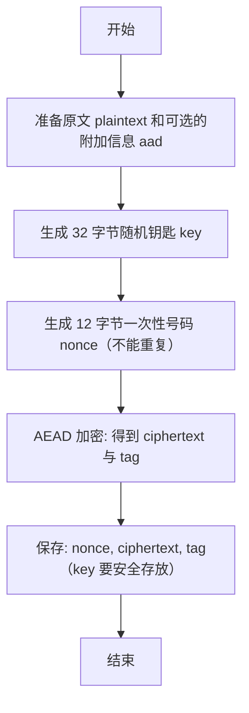

# 加密技术全景指南

> 在信息爆炸的时代，数据就是新的石油，而加密技术则是守护石油的钢铁长城。  
> —— 某位安全工程师的深夜感慨

---

## 一、为什么要学加密？

| 场景 | 风险 | 加密的价值 |
|------|------|------------|
| 手机丢失 | 相册、聊天记录裸奔 | AES-256 让小偷只能对着“乱码”发呆 |
| 公司内网 | 内鬼截获薪资 Excel | RSA 非对称加密，私钥只握在 HR 手里 |
| 在线支付 | 中间人篡改金额 | TLS 1.3 握手+证书链，让劫持者无缝可钻 |
| 医疗上云 | 患者隐私泄露 | 国密 SM4 + 区块链存证，卫健委都点赞 |

---

## 二、加密有哪些种类（一看就懂）
### 核心分支
- 对称加密：用同一把“钥匙”加密和解密，速度快。常见：AES、ChaCha20、SM4。
- 非对称加密：用两把“钥匙”，一把公开（公钥），一把保密（私钥）。常见：RSA、ECC（椭圆曲线）、SM2。
- 哈希（指纹）：像信息的“指纹”，只能比对是否一样，不能反推原文。常见：SHA-256、SHA-3、SM3。
- 签名与认证：证明“这条消息是我发的，而且没被改”。常见：ECDSA、Ed25519、HMAC。
- 隐私增强：更高级的数学工具（零知识、同态加密等），平时用不到，知道有就好。

### 典型应用映射
- 上网、聊天、支付：HTTPS（地址栏的小锁），里面会用到“密钥交换 + 加密”。
- 文件加密：AES-256-GCM 或 ChaCha20-Poly1305，既快又能检查是否被改。
- 密码保存：不是“加密”，而是“哈希 + 盐”。推荐 Argon2id 或 bcrypt。
- 数据库字段加密：把重要字段单独加密，并带上“附加信息”保证没有被改。
- 电子签名：用私钥“签名”，别人用公钥“验证”，防抵赖。

---

## 三、核心概念速通（用生活比喻）
- 密钥（钥匙）：开锁和解锁的信息。钥匙越长越安全；对称加密建议用 256 位。
- 随机数（点名时随机抽人）：要用“安全的随机数”，不要用 `Math.random()` 这种普通随机。
- IV/Nonce（一次性号码）：每次加密用的“临时号码”，不能重复；重复会造成大问题。
- 盐（Salt，调味的盐）：给哈希加点“随机盐”，让别人更难撞出同样结果。
- 认证加密（AEAD）：既加密，又能检查有没有被改，比较放心。
- KDF（把口令变成钥匙）：比如 Argon2、scrypt，把人记得住的密码变成安全的密钥。
- 密钥分级：用“大钥匙”（KEK）保护“数据钥匙”（DEK），这样换钥匙更方便。

---

## 四、常用算法怎么选（简单建议）
- 对称加密：AES-256-GCM（电脑常见、快）或 ChaCha20-Poly1305（手机上更稳定）。
- 非对称加密：X25519（换钥匙用）、Ed25519（签名用）、RSA-2048+（兼容性好）。
- 哈希：SHA-256、SHA-3-256、BLAKE2b；国密用 SM3。
- KDF：Argon2id（优先推荐），其余 scrypt，兼容时用 PBKDF2。
- 国密套件：SM2（非对称）、SM3（哈希）、SM4（对称）。

---

## 五、加密方式怎么挑（避坑版）
- 优先选“带认证”的方式：比如 GCM（能检查是否被改）。
- 不要用 ECB（会泄露结构，很容易被看出规律）。
- 用 CTR/GCM 这类方式时，“一次性号码”必须不重复。
- 磁盘加密常用 XTS；不要拿它加密普通数据。

---

## 六、动手示例（流程图 + 伪代码）

### 示例 1：AES-256-GCM 加密与解密



```mermaid
flowchart TD
    A[开始] --> B[取出 key, nonce, ciphertext, tag 和 aad]
    B --> C[AEAD 解密: plaintext = Decrypt(key, nonce, ciphertext, tag, aad)]
    C --> D{校验是否通过}
    D -->|否| E[报错/拒绝]
    D -->|是| F[得到原文 plaintext]
    E --> G[结束]
    F --> G[结束]
```

```plaintext
# 加密
INPUT: plaintext, aad
key   <- SecureRandom(32 bytes)         # 生成 256 位钥匙
nonce <- UniqueRandom(12 bytes)         # GCM 一次性号码，不得重复
ciphertext, tag <- AEAD_Encrypt(key, nonce, plaintext, aad)
STORE: nonce, ciphertext, tag           # key 放安全位置（如 KMS）

# 解密
INPUT: key, nonce, ciphertext, tag, aad
plaintext <- AEAD_Decrypt(key, nonce, ciphertext, tag, aad)
IF verify_failed THEN error ELSE RETURN plaintext
```

---

### 示例 2：密码存储（Argon2id）（不是加密，是哈希）

```mermaid
flowchart TD
    A[用户设置密码] --> B[生成随机盐 salt]
    B --> C[hash = Argon2id(password, salt, 安全参数)]
    C --> D[保存 salt 与 hash（不保存明文密码）]
    D --> E[结束]
```

```mermaid
flowchart TD
    A[用户输入密码] --> B[取出该用户的 salt 与 hash]
    B --> C[verify = Argon2id_Verify(input_password, salt, stored_hash)]
    C --> D{verify 是否为真}
    D -->|是| E[登录成功]
    D -->|否| F[拒绝登录]
```

```plaintext
# 生成与保存
INPUT: password
salt <- SecureRandom(16+ bytes)
hash <- Argon2id(password, salt, memory=64MB, time=3, parallel=1)
STORE: salt, hash

# 校验登录
INPUT: input_password, stored_salt, stored_hash
ok <- Argon2id_Verify(input_password, stored_salt, stored_hash)
IF ok THEN allow ELSE deny
```

---

### 示例 3：数字签名（Ed25519）（证明“我发的”）

```mermaid
flowchart TD
    A[生成密钥对: private_key + public_key] --> B[准备消息 message]
    B --> C[signature = Sign(private_key, message)]
    C --> D[发送: message + signature + public_key（或证书）]
```

```mermaid
flowchart TD
    A[收到: message, signature, public_key] --> B[Verify(public_key, message, signature)]
    B --> C{验证结果}
    C -->|成功| D[接受]
    C -->|失败| E[拒绝]
```

```plaintext
# 签名
private_key, public_key <- Ed25519_GenerateKeyPair()
signature <- Ed25519_Sign(private_key, message)
SEND: message, signature, public_key

# 验证
ok <- Ed25519_Verify(public_key, message, signature)
IF ok THEN accept ELSE reject
```

---

### 示例 4：字段级加密（数据库里只加关键字段）

```mermaid
flowchart TD
    A[读取记录 record] --> B[选中敏感字段，如 phone 或 id_number]
    B --> C[生成或获取字段专用钥匙 field_key]
    C --> D[field_nonce <- UniqueRandom(12 bytes)]
    D --> E[field_cipher, tag <- AEAD_Encrypt(field_key, field_nonce, field_value, aad=record_id)]
    E --> F[写回: 保存 field_nonce, field_cipher, tag；不保存明文]
```

```plaintext
INPUT: record_id, field_value
field_key <- LoadOrGenerateFieldKey()
field_nonce <- UniqueRandom(12 bytes)
cipher, tag <- AEAD_Encrypt(field_key, field_nonce, field_value, aad=record_id)
STORE: field_nonce, cipher, tag
```

---

小提示
- 一次性号码（nonce）必须唯一；可用“计数器 + 随机前缀”或数据库确保不重复。
- 钥匙不要硬编码在代码里；优先用“钥匙保险柜”（KMS/HSM）或环境安全存储。
- 传输或存储时总是携带 `nonce + ciphertext + tag`，必要时加上 `aad`。

---

## 七、钥匙怎么管（很关键）
- 分层管理：用“大钥匙”（KEK）保护“数据钥匙”（DEK），方便经常更换。
- 定期更换：给钥匙设“有效期”，用到一定次数就换。
- 放在哪里：最好用专业的“钥匙保险柜”（比如云厂商 KMS）。
- 备份恢复：把钥匙做分片备份，备份要离线保存。
- 审计与权限：记录谁动过钥匙；只给必须的人权限。

---

## 八、HTTPS（TLS 1.3）大概怎么工作
- 先用数学方法安全地“换好钥匙”（比如 ECDHE），别人偷听也拿不到。
- 再用“带认证的加密”保护数据（比如 AES-GCM）。
- 网站用证书证明“我真的是这个网站”，浏览器会检查证书链。
- 会话可以恢复（不必每次都重新换钥匙），但要安全地保存票据。

---

## 九、密码与账号安全（日常必备）
- 原则：绝不明文存储；必须用 Argon2id 或 bcrypt 进行哈希。
- 每人一个“随机盐”，和哈希一起存。
- 开启二次验证（验证码、TOTP、或安全钥），防止别人撞库。
- 做好登录限速和异常提醒，防止暴力破解。

---

## 十、常见坑（尽量别踩）
- 用 ECB 模式（会暴露规律）。
- 一次性号码（Nonce/IV）重复使用。
- 只加密不做认证（容易被悄悄改内容）。
- 直接拿用户密码当钥匙（没做 KDF）。
- 用不安全的随机数（比如 `Math.random()`）。
- 自己发明加密算法（风险非常高）。

---

## 十一、国密（中国的密码标准）
- 通信：SM2（握手）+ SM4（加密）+ SM3（完整性）。
- 文件和字段：SM4 加密，最好带认证或做校验。
- 证书：用国密证书链和支持国密的中间件。
- 合规：按行业规范（比如 GM/T 系列）设置参数和流程。

---

## 十二、想继续学，可以看这些
- 官方材料：NIST 文档、RFC（HTTPS、加密方式等）。
- 常用库：libsodium、BoringSSL、OpenSSL、cryptography（Python）。
- 书课：Serious Cryptography、Coursera 的 Cryptography I。
- 清单：OWASP 密码学最佳实践。

---

## 速查清单（动手前看看）
- 是否用“带认证的加密”（比如 GCM）？
- 一次性号码会不会重复？怎么生成和保存？
- 钥匙怎么产生、保存、多久换？有审计吗？
- 老数据要不要重新加密？怎么迁移？
- 登录有没有限速和异常提醒？
