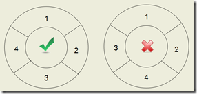

搜索与回溯是计算机解题中常用的算法技术，特别适用于那些没有固定计算法则的问题。回溯是一种搜索算法中的控制策略，其核心思想是：尝试通过不断选择和探索不同的路径解决问题，如果当前路径行不通，就回退一步重新选择，直到找到解决方案或证明无解为止。  
比如在迷宫问题中，探险者需要找到从入口到出口的路径。初始时，可以随意选择一个方向前进，一步步尝试前进。如果碰到死胡同，说明当前路径行不通，需要回退一步重新选择方向。这种不断前进、回退的过程，正是回溯算法的体现。

## 回溯算法的基本框架

回溯算法通常通过递归实现。下面提供两个常见的回溯算法框架  

### 框架一：先遍历
- 整体结构差异：首先进行循环（遍历所有可能的选择），然后在循环内部判断是否满足条件，如果满足条件，则保存结果并判断是否到达目的地。若到达目的地，则输出解；否则，递归调用 search(k + 1) 继续搜索。在递归调用返回后，进行回溯操作
- 递归终止条件：递归终止条件嵌套在循环内，当遍历所有可能选择时，每一次选择后都检查是否到达目的地
- 执行顺序：循环中进行条件判断、保存结果、递归调用和回溯
- 代码执行逻辑：更加适用于没有明显递归终止条件的情境，或者递归终止条件与循环紧密相关的情境
- 使用场景：当你需要在遍历的过程中进行较多的中间判断，并且这些判断与遍历操作本身紧密相关时，框架一更加适用。例如，迷宫问题中的每一步前进都需要判断当前路径是否可行，若可行再进行下一步的递归

```cpp
int search(int k) {
    for (int i = 1; i <= 算符种数; i++) {
        if (满足条件) {
            保存结果;
            if (到目的地) {
                输出解;
            } else {
                search(k + 1);
            }
            恢复: 保存结果之前的状态 {回溯一步};
        }
    }
}
```

### 框架二：先判断
- 整体结构差异：首先判断是否到达目的地，如果到达，则直接输出解；否则，进行循环（遍历所有可能的选择）。在循环内部，判断是否满足条件，如果满足条件，则保存结果并递归调用 search(k + 1) 继续搜索。在递归调用返回后，进行回溯操作
- 递归终止条件：递归终止条件在函数的开头，优先判断是否到达目的地，如果到达，则直接输出结果并返回；如果未到达，才进入循环进行选择和递归
- 执行顺序：先进行终止条件判断，再进入循环执行条件判断、保存结果、递归调用和回溯
- 代码执行逻辑：适用于明确的递归终止条件场景，递归终止条件优先判断，逻辑更加清晰
- 使用场景：当问题有明确的递归终止条件，并且这个条件可以在每次递归调用前单独判断时，框架二更加适用。例如，八皇后问题中，每放置一个皇后后可以直接判断是否放置了所有皇后，再进行下一步的递归操作

```cpp
int search(int k) {
    if (到目的地) {
        输出解;
    } else {
        for (int i = 1; i <= 算符种数; i++) {
            if (满足条件) {
                保存结果;
                search(k + 1);
                恢复: 保存结果之前的状态 {回溯一步};
            }
        }
    }
}
```

## 回溯算法示例

### 素数环问题介绍

素数环问题是一个经典的回溯算法问题，要求将一组连续的正整数排列成一个环形，使得环中每对相邻数之和为素数  

<div class="my-img text-center">
    
</div>

具体来说，如果有`n`个数（`1`到`n`），我们需要找到所有输入`n`后满足以下条件的排列(环)：  
1. 每个数都出现且仅出现一次。
2. 每对相邻数之和为素数。
3. 环的首尾两数之和也必须为素数。

### 问题解决思路

1. **初始化**：
   - 创建一个用于存储环的数组
   - 创建一个布尔数组来跟踪哪些数字已经被使用

2. **判断素数**：
   - 实现一个判断素数的函数

3. **回溯生成素数环**：
   - 从第一个位置开始，依次尝试放置数字
   - 每次放置一个数字后，检查当前数字和前一个数字之和是否为素数
   - 如果放置到了最后一个位置，还需检查最后一个数字和第一个数字之和是否为素数
   - 使用递归回溯来尝试所有可能的排列

4. **输出结果**：
   - 每当找到一个合法的素数环，就输出它

### 参考代码

```cpp
#include <iostream>
#include <vector>

using namespace std;

// 判断一个数是否为素数的函数
bool isPrime(int num) {
    if (num <= 1) return false;
    for (int i = 2; i * i <= num; i++) {
        if (num % i == 0) return false;
    }
    return true;
}

// 回溯生成素数环的核心函数
void generatePrimeRing(vector<int>& ring, vector<bool>& used, int n, int pos) {
    // 如果已经填满环，并且最后一个数和第一个数之和为素数
    if (pos == n && isPrime(ring[pos - 1] + ring[0])) {
        // 输出找到的一个合法的素数环
        for (int i = 0; i < n; i++) {
            if (i != 0) cout << " ";
            cout << ring[i];
        }
        cout << endl;
        return;
    }

    // 尝试放置数字2到n
    for (int i = 2; i <= n; i++) {
        // 如果当前数字未被使用，且当前数字与前一个数字之和为素数
        if (!used[i] && isPrime(ring[pos - 1] + i)) {
            ring[pos] = i;  // 放置数字
            used[i] = true;  // 标记当前数字已使用
            generatePrimeRing(ring, used, n, pos + 1);  // 递归放置下一个数字
            used[i] = false;  // 回溯，撤销当前数字的使用
        }
    }
}

// 主函数，初始化并调用回溯函数
void primeRing(int n) {
    if (n < 2) {
        cout << "n 必须至少为 2。" << endl;
        return;
    }

    vector<int> ring(n);  // 用于存储环的数组
    vector<bool> used(n + 1, false);  // 用于跟踪哪些数字已被使用的布尔数组

    ring[0] = 1;  // 首位固定为1
    used[1] = true;  // 标记1已被使用

    generatePrimeRing(ring, used, n, 1);  // 开始回溯生成素数环
}

// 主程序入口
int main() {
    int n;
    cout << "请输入 n 的值: ";
    cin >> n;

    primeRing(n);  // 调用主函数生成并输出素数环

    return 0;
}
```

### 代码解释
1. **判断是否为素数**: `isPrime` 函数使用简单的试除法来判断一个数是否为素数。
2. **回溯算法核心函数**: `generatePrimeRing` 是回溯算法的核心，它递归地尝试将未使用的数字添加到环中，并检查当前数字与上一个数字之和是否为素数。
3. **主函数**: `primeRing` 初始化数组并调用回溯函数，开始生成素数环。
4. **主程序入口**: `main` 函数读取用户输入并调用 `primeRing` 函数。

### 使用示例
编译并运行程序，输入 `n` 的值，比如 `6`，程序将输出所有满足条件的素数环排列：

```plaintext
请输入 n 的值: 6
1 4 3 2 5 6
1 6 5 2 3 4
```

## 练习题

1. 设有`n`个整数的集合`[1,2,3,4,5,6,...,n]`,从中任意取出`r`个数进行排列`(r<n)`,试列出所有的排列

```cpp
// 示例输入：
请输入 n 和 r 的值（空格分隔）: 4 2
// 示例输出：
1 2
1 3
1 4
2 1
2 3
2 4
3 1
3 2
3 4
4 1
4 2
4 3
```

- 参考代码

```cpp
#include <iostream>
#include <vector>

using namespace std;

// 回溯生成排列的核心函数
void generatePermutations(vector<int>& nums, vector<int>& permutation, vector<bool>& used, int r, int pos) {
    // 如果已经选取了r个数字，输出当前排列
    if (pos == r) {
        for (int i = 0; i < r; i++) {
            if (i != 0) cout << " ";
            cout << permutation[i];
        }
        cout << endl;
        return;
    }

    // 尝试从未被使用的数字中选择下一个数字
    for (int i = 0; i < nums.size(); i++) {
        if (!used[i]) {
            permutation[pos] = nums[i];
            used[i] = true;
            generatePermutations(nums, permutation, used, r, pos + 1);
            used[i] = false;
        }
    }
}

// 主函数，初始化并调用回溯函数
void permutations(vector<int>& nums, int r) {
    if (r <= 0 || r > nums.size()) {
        cout << "r 必须大于 0 且小于等于 n。" << endl;
        return;
    }

    vector<int> permutation(r);  // 用于存储当前排列的数组
    vector<bool> used(nums.size(), false);  // 用于跟踪哪些数字已被使用的布尔数组

    generatePermutations(nums, permutation, used, r, 0);  // 开始回溯生成排列
}

// 主程序入口
int main() {
    int n, r;
    cout << "请输入 n 和 r 的值（空格分隔）: ";
    cin >> n >> r;

    vector<int> nums(n);
    for (int i = 0; i < n; i++) {
        nums[i] = i + 1;
    }

    permutations(nums, r);  // 调用主函数生成并输出排列

    return 0;
}
```
