>递推算法是一种重要的数学方法，在数学的各个领域中都有广泛的运用，也是在计算机数值计算中一个重要的算法。这种算法的特点是：一个问题的求解需要经过一系列的计算，在已知条件和所求问题之间存在某种相互联系的关系。在计算时，如果可以找到前后过程之间的数量关系（即递推式），那么，从问题出发逐步推到已知条件，这种方法叫逆推。无论顺推还是逆推，其关键是要找到递推式。这种处理问题的方法能使复杂运算化为若干步重复的简单运算，充分发挥出计算机擅长于重复处理的特点。

>递推算法的首要问题是得到相邻的数据项间的关系（即递推关系）。递推算法避开了求通项公式的麻烦，把一个复杂的问题的求解，分解成了连续的若干步简单运算。一般来说，可以将递推算法看成是一种特殊的迭代算法。

**递推关系**描述了一个问题的较大实例与其较小实例之间的关系。递推算法广泛应用于各种数学和计算问题，尤其是在处理涉及序列、数组和其他递归结构的问题时。

**递推算法的实现通常有两种方式：迭代和递归**

## 基本概念

1. **递推关系（Recurrence Relation）**:
    递推关系是一种公式，用于表示较大问题实例与较小问题实例之间的关系。常见的递推关系形式如：

<div class="my-img text-center">
    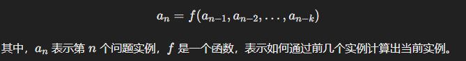
</div>

2. **初始条件（Initial Conditions）**:
    初始条件是递推关系的基础，它定义了一些已知的较小实例的值，这些值用于启动递推过程。例如，斐波那契数列的初始条件为：

<div class="my-img text-center">
    
</div>

## 递推算法的实现步骤

1. **确定递推关系**:
    确定问题的递推关系，即定义如何通过较小的实例来计算当前实例。

2. **设定初始条件**:
    设定递推过程的初始条件，确保递推过程有一个启动点。

3. **编写递推算法**:
    使用迭代或递归的方法实现递推关系。

## 递推算法的C++实现

以下通过几个具体例子来展示如何在C++中实现递推算法。

### 1. 斐波那契数列

斐波那契数列是最经典的递推关系之一，其定义如下：

<div class="my-img text-center">
    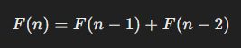
</div>

初始条件：

<div class="my-img text-center">
    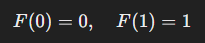
</div>

#### 迭代实现

```cpp
#include <iostream> // 包含输入输出流库

using namespace std; // 使用标准命名空间

// 定义一个函数来计算斐波那契数列的第 n 项
int fibonacci(int n) {
    if (n <= 1) return n; // 如果 n 小于等于 1，直接返回 n
    int a = 0, b = 1, c; // 初始化三个变量 a, b 和 c，a 和 b 分别表示斐波那契数列的前两项
    for (int i = 2; i <= n; ++i) { // 从 2 开始循环到 n
        c = a + b; // 计算当前项 c 为前两项之和
        a = b; // 更新 a 为 b 的值
        b = c; // 更新 b 为 c 的值
    }
    return c; // 返回第 n 项的值
}

int main() {
    int n = 10; // 定义一个整数 n 并赋值为 10
    cout << "Fibonacci(" << n << ") = " << fibonacci(n) << endl; // 输出斐波那契数列的第 n 项
    return 0; // 返回 0，表示程序正常结束
}
```

#### 递归实现

```cpp
#include <iostream> // 引入输入输出流库，用于输出数据到控制台
using namespace std; // 使用标准命名空间，简化代码书写

// 定义一个递归函数，用于计算第n个斐波那契数
int fibonacci(int n) {
    if (n <= 1) return n; // 如果n是0或1，直接返回n（即斐波那契数的前两个数）
    return fibonacci(n - 1) + fibonacci(n - 2); // 否则，返回前两个斐波那契数之和
}

int main() {
    int n = 10; // 定义一个整数n，并赋值为10
    // 输出第n个斐波那契数
    cout << "Fibonacci(" << n << ") = " << fibonacci(n) << endl;
    return 0; // 返回0，表示程序正常结束
}
```

### 2. 阶乘

阶乘的递推关系定义为：

<div class="my-img text-center">
    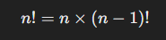
</div>

初始条件：

<div class="my-img text-center">
    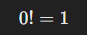
</div>

#### 迭代实现

```cpp
#include <iostream> // 包含输入输出流库

using namespace std; // 使用标准命名空间

int factorial(int n) { // 定义计算阶乘的函数，参数为整数n
    int result = 1; // 初始化结果为1
    for (int i = 2; i <= n; ++i) { // 循环计算从2到n的乘积
        result *= i; // 将i乘到结果中
    }
    return result; // 返回计算结果
}

int main() { // 主函数
    int n = 5; // 初始化一个整数n为5
    cout << n << "! = " << factorial(n) << endl; // 输出n的阶乘
    return 0; // 返回0表示成功结束
}
```

#### 递归实现

```cpp
#include <iostream>  // 包含输入输出流库
using namespace std;  // 使用标准命名空间

int factorial(int n) {  // 定义一个递归函数，计算阶乘
    if (n <= 1) return 1;  // 如果 n 小于等于 1，返回 1，防止无限递归
    return n * factorial(n - 1);  // 递归调用函数，计算 n 的阶乘
}

int main() {  // 主函数
    int n = 5;  // 声明并初始化变量 n
    cout << n << "! = " << factorial(n) << endl;  // 输出 n 的阶乘
    return 0;  // 返回主函数的结束状态
}
```

### 3. 二项式系数（Pascal's Triangle）

:::details 基本概念

二项式系数，也称为组合数，表示从 `n` 个元素中选择 `k` 个元素的不同组合的数量。它通常表示为 

<div class="my-img text-center">
    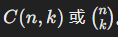
</div>

二项式系数在许多数学领域和应用中都有重要作用，包括概率论、统计学、代数等。

- #### 二项式系数的定义

二项式系数可以用以下公式计算：

<div class="my-img text-center">
    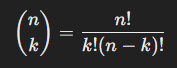
</div>

其中， `n!` 表示 `n` 的阶乘，定义为 `n` 乘以所有小于 `n` 的正整数，即：

<div class="my-img text-center">
    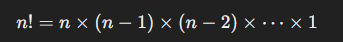
</div>

#### Pascal's Triangle（帕斯卡三角形）

Pascal's Triangle 是一种几何排列，它的每一行对应于二项式系数。帕斯卡三角形的特点是，每个数字等于其上方两个数字之和。帕斯卡三角形的前几行如下所示：

```cpp
          1
         1 1
        1 2 1
       1 3 3 1
      1 4 6 4 1
     1 5 10 10 5 1
    1 6 15 20 15 6 1
```

每行的第 `n` 行表示

<div class="my-img text-center">
    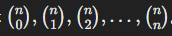
</div>
:::

二项式系数的递推关系为：

<div class="my-img text-center">
    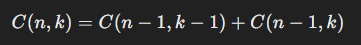
</div>

初始条件：

<div class="my-img text-center">
    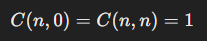
</div>


#### 迭代实现

```cpp
#include <iostream> // 包含输入输出流库
#include <vector>   // 包含向量容器库
using namespace std; // 使用标准命名空间

int binomialCoefficient(int n, int k) { // 计算二项式系数的函数定义，接受两个整数参数 n 和 k
    vector<vector<int>> C(n + 1, vector<int>(k + 1, 0)); // 创建一个二维向量 C，大小为 (n+1) x (k+1)，并初始化为全0
    for (int i = 0; i <= n; ++i) { // 外层循环遍历 0 到 n
        for (int j = 0; j <= min(i, k); ++j) { // 内层循环遍历 0 到 min(i, k)
            if (j == 0 || j == i) // 如果 j 等于 0 或者 j 等于 i，即在边界上
                C[i][j] = 1; // 则二项式系数为 1
            else
                C[i][j] = C[i - 1][j - 1] + C[i - 1][j]; // 否则根据组合公式计算二项式系数
        }
    }
    return C[n][k]; // 返回计算得到的二项式系数
}

int main() { // 主函数
    int n = 5, k = 2; // 设置 n 和 k 的值
    cout << "C(" << n << ", " << k << ") = " << binomialCoefficient(n, k) << endl; // 输出二项式系数的计算结果
    return 0; // 返回 0，表示程序正常退出
}
```

#### 递归实现

```cpp
#include <iostream>  // 包含输入输出流库

using namespace std;  // 使用标准命名空间

int binomialCoefficient(int n, int k) {  // 定义计算二项式系数的函数，参数为 n 和 k
    if (k == 0 || k == n) return 1;  // 如果 k 等于 0 或者等于 n，返回 1
    return binomialCoefficient(n - 1, k - 1) + binomialCoefficient(n - 1, k);  // 递归计算二项式系数
}

int main() {  // 主函数
    int n = 5, k = 2;  // 定义并初始化 n 和 k 的值
    cout << "C(" << n << ", " << k << ") = " << binomialCoefficient(n, k) << endl;  // 输出组合数 C(n, k) 的值
    return 0;  // 返回 0，表示程序正常结束
}
```

## 五种典型的递推关系

- 斐波那契数列（Fibonacci Sequence）
- 汉诺塔问题（Tower of Hanoi）
- 平面分割问题（Plane Division Problem）
- Catalan 数（Catalan Numbers）
- 第二类 Stirling 数（Stirling Numbers of the Second Kind）

### 1. Fibonacci 数列

**问题提出：**  
由意大利著名数学家Fibonacci于1202年提出的“兔子繁殖问题”（又称"Fibonacci问题"）。假定一对雌雄兔子在两个月后可以繁殖出一对小兔子，问经过n个月后共有多少对兔子。

**递推关系：**
<div class="my-img text-center">
    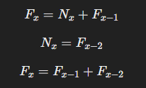
</div>

边界条件：

<div class="my-img text-center">
    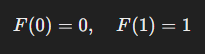
</div>

**示例计算：**

<div class="my-img text-center">
    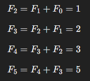
</div>

Fibonacci数列在组合计数和优选法中有广泛的应用，例如“骨牌覆盖”问题。

:::details 递推关系推导过程

斐波那契数列是一个以递推方式定义的数列，其递推关系式为：

` F(n) = F(n-1) + F(n-2) `

其中初始条件为：

` F(0) = 0 `
` F(1) = 1 `

这个递推关系的意思是，从第三项开始，斐波那契数列中的每一个数都是前两个数的和。下面是斐波那契数列的前几项，通过递推关系推导的过程：

1. 初始条件：
   ` F(0) = 0 `
   ` F(1) = 1 `

2. 计算 ` F(2) `：
   ` F(2) = F(1) + F(0) = 1 + 0 = 1 `

3. 计算 ` F(3) `：
   ` F(3) = F(2) + F(1) = 1 + 1 = 2 `

4. 计算 ` F(4) `：
   ` F(4) = F(3) + F(2) = 2 + 1 = 3 `

5. 计算 ` F(5) `：
   ` F(5) = F(4) + F(3) = 3 + 2 = 5 `

6. 计算 ` F(6) `：
   ` F(6) = F(5) + F(4) = 5 + 3 = 8 `

7. 计算 ` F(7) `：
   ` F(7) = F(6) + F(5) = 8 + 5 = 13 `

8. 计算 ` F(8) `：
   ` F(8) = F(7) + F(6) = 13 + 8 = 21 `

如此继续下去，你可以用这个递推关系推导出斐波那契数列的任意一项
:::

:::details 小练习

**问题：**  
编写一个C++程序，计算并输出第n个月后兔子的总对数（Fibonacci数列）。

**代码：**
```cpp
#include <iostream> // 包含标准输入输出流库

using namespace std; // 使用标准命名空间

int fibonacci(int n) { // 定义一个计算斐波那契数列的函数，参数为 n
    if (n <= 1) return n; // 如果 n 小于等于 1，返回 n
    int a = 0, b = 1, c; // 初始化斐波那契数列的前两项
    for (int i = 2; i <= n; ++i) { // 循环计算直到第 n 项
        c = a + b; // 计算第 n 项的值
        a = b; // 更新前两项的值
        b = c; // 更新前两项的值
    }
    return c; // 返回第 n 项的值
}

int main() { // 主函数
    int n; // 声明一个变量 n
    cout << "Enter the number of months: "; // 提示用户输入月份数量
    cin >> n; // 从标准输入读取用户输入的月份数量
    cout << "Number of rabbit pairs after " << n << " months: " << fibonacci(n) << endl; // 输出经过 n 个月后的兔子对数
    return 0; // 返回程序执行成功
}
```

**Fibonacci 数列：** 使用迭代方法计算Fibonacci数列，避免了递归的高时间复杂度。
:::

### 2. 汉诺塔问题

:::details 基本概念

汉诺塔问题是一个经典的数学问题，它涉及到一个传说中的印度寺庙的神龛，称为汉诺塔。问题的描述如下：

在神龛上有三根柱子，分别标记为A、B、C，初始时，所有的盘子都放在柱子A上，从上到下依次按大小顺序排列。问题的目标是将所有的盘子从柱子A移动到柱子C，并且遵循以下规则：
1. 每次只能移动一个盘子。
2. 盘子可以放在任意一个柱子上，但是不能放在比它小的盘子上面。
3. 每次移动都必须遵守盘子的大小顺序。

这个问题的关键是找到一个有效的移动方案，使得所有的盘子最终都从柱子A移动到柱子C，而且在整个过程中都满足上述规则。

汉诺塔问题的解决方案通常使用递归算法，基本思路是将n个盘子的移动分解为三个步骤：
1. 将除了最底下的一个盘子以外的所有盘子都从柱子A移动到柱子B。
2. 将最底下的盘子从柱子A移动到柱子C。
3. 将除了最底下的一个盘子以外的所有盘子都从柱子B移动到柱子C。

这种递归思想可以直观地理解为，将移动n个盘子的问题分解为移动n-1个盘子的子问题。递归的终止条件是当只有一个盘子时，直接将它从柱子A移动到柱子C即可。

整体推导过程：

涉及将一堆盘子从一个柱子移动到另一个柱子，同时遵循以下规则：

1. 只能一次移动一个盘子。
2. 永远不能将较大的盘子放在较小的盘子上面。

这个问题可以用递归方法来解决，其中递推关系起着关键作用。

假设我们有一个汉诺塔问题，其中有n个盘子。我们用H(n)表示将这些盘子从一根柱子移动到另一根柱子所需的步骤数。

首先，我们将问题分解为以下步骤：

1. 将前n-1个盘子从起始柱子移动到中间柱子（利用空闲的柱子作为辅助）。
2. 将第n个盘子从起始柱子移动到目标柱子。
3. 将前n-1个盘子从中间柱子移动到目标柱子（利用空闲的柱子作为辅助）。

现在，让我们用递推关系来表示这个过程：

1. 将前n-1个盘子从起始柱子移动到中间柱子的步骤数为H(n-1)。
2. 将第n个盘子从起始柱子移动到目标柱子的步骤数为1。
3. 将前n-1个盘子从中间柱子移动到目标柱子的步骤数为H(n-1)。

因此，总步骤数H(n)可以表示为：` H(n) = 2H(n-1) + 1 `
:::

**问题提出：**  
汉诺塔由n个大小不同的圆盘和三根木柱组成，要求将n个盘子从一根柱子移动到另一根柱子上，遵循以下规则：
1. 一次只能移动一个圆盘。
2. 圆盘只能存放在三根柱子上。
3. 任何时候大盘不能压在小盘上。

<div class="my-img text-center">
    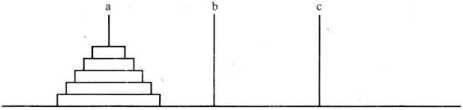
</div>

推演过程：

<div class="my-img text-center">
    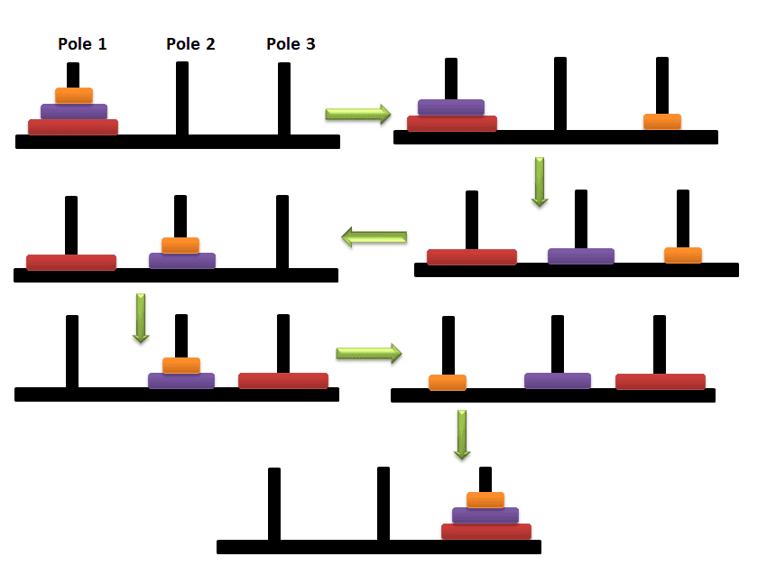
</div>

<div class="my-img text-center">
    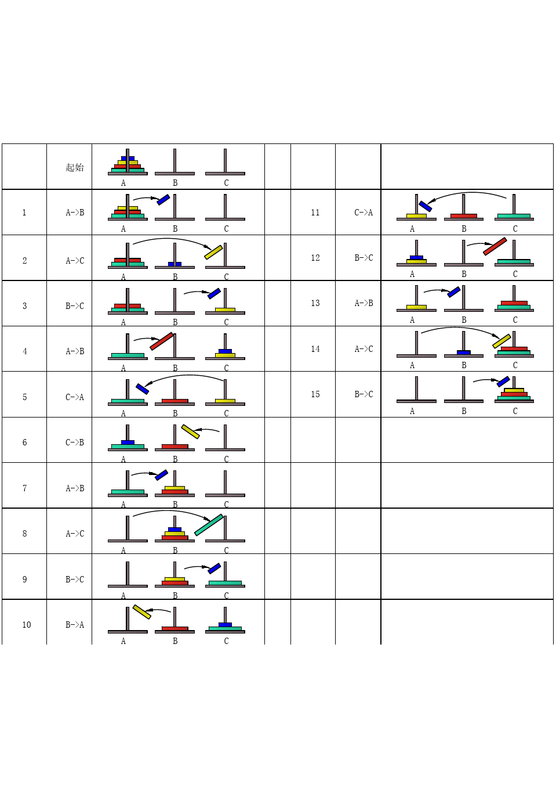
</div>


**递推关系：**

<div class="my-img text-center">
    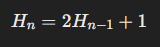
</div>

边界条件：

<div class="my-img text-center">
    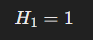
</div>

**示例计算：**

<div class="my-img text-center">
    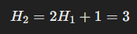
</div>

汉诺塔问题是经典的递归问题，广泛用于计算思维训练和算法设计课程中。

:::details 递推关系推导过程

汉诺塔问题的目标是将 `n` 个盘子从一个柱子移动到另一个柱子，遵守以下规则：
1. 每次只能移动一个盘子。
2. 任何时刻都不能将一个大盘子放在小盘子上面。

为了推导递推关系，我们定义 `T(n)` 为将 `n` 个盘子从一个柱子移动到另一个柱子所需的最少移动次数。解决这个问题的步骤如下：

1. 将前 `n-1` 个盘子从源柱子移动到辅助柱子。
2. 将第 `n` 个盘子从源柱子移动到目标柱子。
3. 将前 `n-1` 个盘子从辅助柱子移动到目标柱子。

我们可以分解这个问题：
- 将前 `n-1` 个盘子从源柱子移动到辅助柱子需要 `T(n-1)` 次移动。
- 将第 `n` 个盘子从源柱子移动到目标柱子需要 1 次移动。
- 将前 `n-1` 个盘子从辅助柱子移动到目标柱子需要 `T(n-1)` 次移动。

所以，总的移动次数 `T(n)` 可以表示为：
` T(n) = T(n-1) + 1 + T(n-1) `

这可以简化为：
` T(n) = 2T(n-1) + 1 `

为了完全理解这个递推关系，让我们从 `n=1` 开始计算：

- 对于 `n=1`，只需要一次移动，所以 `T(1) = 1`。
- 对于 `n=2`，需要将第一个盘子移动到辅助柱子，然后将第二个盘子移动到目标柱子，最后将第一个盘子从辅助柱子移动到目标柱子，所以 `T(2) = 2T(1) + 1 = 2 * 1 + 1 = 3`。
- 对于 `n=3`，我们按照同样的逻辑得到 `T(3) = 2T(2) + 1 = 2 * 3 + 1 = 7`。

我们可以看出，这个关系递归计算每一个 `n` 都是前一步的两倍加一。

为了更清楚地理解，我们可以展开这个递推公式：
` T(n) = 2T(n-1) + 1 `
` T(n-1) = 2T(n-2) + 1 `
` T(n-2) = 2T(n-3) + 1 `

把这些方程代入，我们得到：
` T(n) = 2(2T(n-2) + 1) + 1 = 4T(n-2) + 2 + 1 = 4T(n-2) + 3 `
` T(n) = 4(2T(n-3) + 1) + 3 = 8T(n-3) + 4 + 3 = 8T(n-3) + 7 `

可以观察到，随着递推次数增加，幂次也在增加。实际上，我们可以归纳出：
` T(n) = 2^k T(n-k) + (2^k - 1) `

特别地，当 `k=n` 时，`T(n-n) = T(0)`。在汉诺塔问题中，0 个盘子需要 0 次移动，所以 `T(0) = 0`。于是：
` T(n) = 2^n T(0) + (2^n - 1) = 0 + 2^n - 1 `

因此，我们得到汉诺塔问题的最少移动次数为：
` T(n) = 2^n - 1 `

这就是汉诺塔问题的递推关系推导过程及其最终的闭式解。
:::

:::details 小练习

**问题：**  
编写一个C++程序，计算并输出将n个盘子从柱子A移动到柱子C所需的最少移动次数。

**代码：**
```cpp
#include <iostream> // 包含标准输入输出流的头文件

using namespace std; // 使用标准命名空间

int hanoi(int n) { // 定义递归函数hanoi，用于计算汉诺塔问题的移动次数
    if (n == 1) return 1; // 当只有一个盘子时，移动次数为1
    return 2 * hanoi(n - 1) + 1; // 汉诺塔移动次数公式：2 * f(n - 1) + 1
}

int main() { // 主函数
    int n; // 用于存储用户输入的盘子数量
    cout << "Enter the number of disks: "; // 提示用户输入盘子数量
    cin >> n; // 从标准输入流中获取用户输入的盘子数量
    cout << "Minimum number of moves required: " << hanoi(n) << endl; // 输出移动盘子的最小次数
    return 0; // 返回程序执行成功
}
```

**汉诺塔问题：** 使用递归方法计算将n个盘子从柱子A移动到柱子C所需的最少移动次数。
:::

### 3. 平面分割问题

:::details 基本概念
平面分割问题是一个经典的几何学问题，它涉及在平面上画出一定数量的直线或曲线，使得平面被这些线段分割成了多少个区域的问题。在这个问题中，通常规定这些线段不会相交于三个或更多的点，而且任意两条线段之间只会相交于两个点。

具体来说，平面分割问题通常描述为：给定n条直线（或曲线），求这些线段将平面分割成的区域个数。这里的线段是封闭的，也就是说它们构成了凸多边形，且相交于不同的点。

例如，当有一条直线时，平面被分割成了两个区域；当有两条相交的直线时，平面被分割成了四个区域；当有三条相交的直线时，平面被分割成了七个区域，依次类推。

解决平面分割问题的关键在于找到计算区域个数的递推关系式。通常，可以通过观察规律找到这个递推关系式，然后利用递归或迭代的方式计算区域个数。
:::

**问题提出：**  
有n条封闭曲线画在平面上，任何两条曲线恰好相交于两点，任何三条曲线不相交于同一点，问这些曲线将平面分割成的区域个数。

<div class="my-img text-center">
    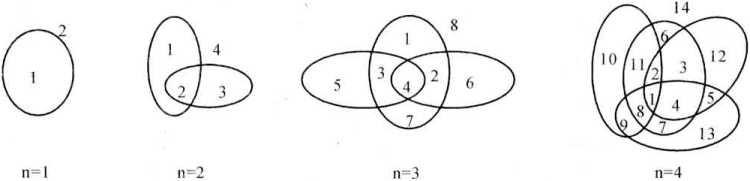
</div>


**递推关系：**

<div class="my-img text-center">
    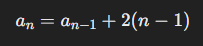
</div>

边界条件：

<div class="my-img text-center">
    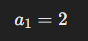
</div>

**示例计算：**

<div class="my-img text-center">
    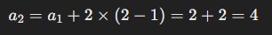
</div>

这种问题在竞赛中经常出现，考察理解几何图形的分割特性。

:::details 递推关系推导过程

平面分割问题涉及通过n条曲线将平面分割成若干区域。我们可以使用递推关系来解决这个问题。假设我们已经知道n-1条曲线将平面分割成的区域数，那么我们可以通过引入第n条曲线来推导出n条曲线分割平面的区域数。

1. **基本情况（n=1）**：
    - 一条曲线将平面分割成的区域数显然是2。

2. **递推关系**：
    - 设 ` R(n) ` 为 n 条曲线将平面分割成的区域数。
    - 当有 ` n-1 ` 条曲线时，分割成的区域数为 ` R(n-1) `。
    - 第 n 条曲线每与前面的每一条曲线恰好相交于2点，形成新的区域。

    第 n 条曲线与每条已有曲线相交的两点将前面形成的区域再分成两部分。由于第 n 条曲线与之前的每条曲线相交两次，所以会产生新的区域。

3. **推导递推公式**：
    - 引入第 n 条曲线，和之前的 ` n-1 ` 条曲线每条相交两次，总共产生 ` 2(n-1) ` 个新的区域。
    - 因此，新增的区域数是 ` 2(n-1) `。
    - 所以， ` R(n) = R(n-1) + 2(n-1) `。

4. **初始条件**：
    - 当 n = 1 时， ` R(1) = 2 `。

综合起来，递推关系为：
` R(n) = R(n-1) + 2(n-1) `
:::

:::details 小练习

**问题：**  
编写一个C++程序，计算并输出n条封闭曲线将平面分割成的区域个数。

**代码：**
```cpp
#include <iostream>  // 包含输入输出流库

using namespace std;  // 使用标准命名空间

int planeDivision(int n) {  // 定义函数planeDivision，参数为n，用于计算平面划分的区域数
    if (n == 1) return 2;  // 如果输入为1，直接返回2
    return planeDivision(n - 1) + 2 * (n - 1);  // 递归调用planeDivision函数，计算n-1时的结果并加上当前层的区域数
}

int main() {  // 主函数
    int n;  // 定义整型变量n，用于存储用户输入的闭合曲线数量
    cout << "Enter the number of closed curves: ";  // 输出提示信息，要求用户输入闭合曲线的数量
    cin >> n;  // 从标准输入流中读取用户输入的闭合曲线数量，并存储到变量n中
    cout << "Number of regions: " << planeDivision(n) << endl;  // 输出计算得到的平面划分区域数
    return 0;  // 返回0，表示程序执行成功
}
```

**平面分割问题：** 使用递归方法计算n条封闭曲线将平面分割成的区域个数。
:::

### 4. Catalan 数

:::details 基本概念
Catalan数是一类在组合数学中出现的整数数列，以法国数学家Eugène Charles Catalan的名字命名。Catalan数通常用 C<sub>n</sub> 表示，其定义如下：

在一个凸 `n` 边形中，通过不相交的对角线将其拆分成若干三角形，不同的拆分方案数目称为 `n` 的Catalan数，即 C<sub>n</sub>。

Catalan数的前几个值是：

<div class="my-img text-center">
    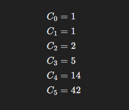
</div>

Catalan数在组合计数问题中具有广泛的应用，如：

1. 括号匹配问题：用 `n`  对括号能够组成多少种合法的括号序列。
2. 凸多边形三角剖分问题：在一个 `n`  边形中，通过不相交的对角线将其分割成多少个三角形。
3. 凸多边形的顶点连线问题：在一个 `n`  边形的顶点上连接线段，使得线段两两不相交，问有多少种方案。

Catalan数的计算可以通过递推关系或直接计算公式进行。
:::

**问题提出：**  
在一个凸n边形中，通过不相交的对角线将其拆分成若干三角形，不同的拆分方案数用 C<sub>n</sub> 表示。

<div class="my-img text-center">
    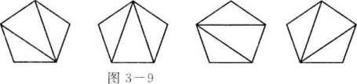
</div>

<div class="my-img text-center">
    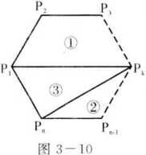
</div>


**递推关系：**

<div class="my-img text-center">
    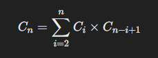
</div>

这个递推关系表示，第 `n` 个Catalan数等于前 `n-1` 个Catalan数的乘积之和。

边界条件为 C<sub>0</sub>=1，即空序列也算作一种括号匹配方案。

边界条件：

<div class="my-img text-center">
    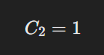
</div>

**示例计算：**
对于五边形：

<div class="my-img text-center">
    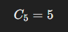
</div>

Catalan数常用于组合计数问题，如计算不同的括号匹配方式。

:::details 小练习

**问题：**  
编写一个C++程序，计算并输出一个凸n边形的三角拆分方案数。

**代码：**
```cpp
#include <iostream> // 包含输入输出流头文件

using namespace std; // 使用标准命名空间

int catalan(int n) { // 定义函数 catalan，计算卡特兰数
    if (n <= 1) return 1; // 若 n 小于等于 1，则返回 1，卡特兰数的基本情况
    int res = 0; // 初始化结果为 0
    for (int i = 1; i < n; ++i) // 循环遍历计算 catalan(n) 的递归公式
        res += catalan(i) * catalan(n - i); // 使用卡特兰数的递归公式计算结果
    return res; // 返回计算得到的结果
}

int main() { // 主函数
    int n; // 定义整数变量 n，表示多边形的边数
    cout << "Enter the number of sides in the polygon: "; // 提示用户输入多边形的边数
    cin >> n; // 读取用户输入的边数
    cout << "Number of triangulation schemes: " << catalan(n - 1) << endl; // 输出多边形的三角剖分方案数
    return 0; // 返回执行成功的状态码
}
```


**Catalan 数：** 使用递归方法计算一个凸n边形的三角拆分方案数。
:::

### 5. 第二类 Stirling 数

:::details 基本概念
第二类 Stirling 数是组合数学中的一类重要数列，通常用 `S(n, m)` 表示。它描述的是将n个有区别的物体分成m个非空的不可区分的集合（盒子）的不同方案数。

具体地，第二类 Stirling 数 `S(n, m)` 表示将n个有区别的物体分成m个非空的不可区分的集合的方案数。换句话说，它表示的是将n个物体放入m个盒子中，且每个盒子至少有一个物体的方案数。

第二类 Stirling 数的递推关系如下：

<div class="my-img text-center">
    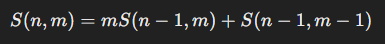
</div>

其中边界条件为：

<div class="my-img text-center">
    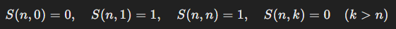
</div>

第二类 Stirling 数在组合计数问题中有广泛的应用，例如将物体划分成不同的集合，或者将物体放入盒子中等问题。
:::

**定义：**  
n个有区别的球放入m个相同的盒子中，要求无一空盒，其不同的方案数用 `S(n, m)` 表示。

**递推关系：**

<div class="my-img text-center">
    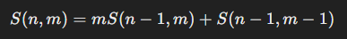
</div>

边界条件：

<div class="my-img text-center">
    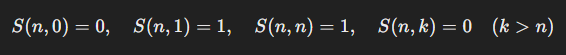
</div>

也就是，对于`S(n, m)`来说 
- 当`m = 0`时，`S(n, m) = 0` 或
- 当`m = 1`时，`S(n, m) = 1` 或
- 当`m = n`时，`S(n, m) = 1` 或
- 当`n < m`时，`S(n, m) = 0`

**示例计算：**

<div class="my-img text-center">
    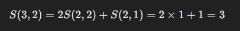
</div>

第二类Stirling数用于解决组合分割问题。

:::details 递推关系推导过程
第二类 Stirling 数 ` S(n, m) ` 表示将 ` n ` 个不同的元素分配到 ` m ` 个非空集合的方式数。它的递推关系是：

` S(n, m) = m * S(n-1, m) + S(n-1, m-1) `

以下是这个递推关系的推导过程：

1. **递推关系的基本思想**：

    将 ` n ` 个不同的元素分配到 ` m ` 个非空集合，我们可以考虑第 ` n ` 个元素的情况：
    
    - **情况 1**：第 ` n ` 个元素独自成一个新集合，那么剩下的 ` n-1 ` 个元素需要分配到剩下的 ` m-1 ` 个非空集合中。此时的方案数是 ` S(n-1, m-1) `。
    
    - **情况 2**：第 ` n ` 个元素不独自成一个新集合，而是加入到现有的 ` m ` 个集合中的一个。此时我们有 ` m ` 个选择让第 ` n ` 个元素加入。因此，剩下的 ` n-1 ` 个元素分配到 ` m ` 个非空集合的方案数是 ` S(n-1, m) `，且我们有 ` m ` 个集合可以选择加入第 ` n ` 个元素。

2. **将这两种情况综合**：

    将上述两种情况的方案数相加：
    
    `S(n, m) = S(n-1, m-1) + m * S(n-1, m)`

3. **边界条件**：

    边界条件主要有以下几个：
    
    - ` S(0, 0) = 1 `，表示将 0 个元素分配到 0 个集合的方式只有一种，即什么都不做。
    - ` S(n, 0) = 0 ` 对于 ` n > 0 `，表示不能将 ` n ` 个元素分配到 0 个集合中。
    - ` S(0, m) = 0 ` 对于 ` m > 0 `，表示不能将 0 个元素分配到非 0 个集合中。
    - ` S(n, m) = 0 ` 对于 ` n < m `，表示不能将 ` n ` 个元素分配到比 ` n ` 更多的非空集合中。
    - ` S(n, n) = 1 `，表示将 ` n ` 个元素分配到 ` n ` 个集合的方式只有一种，即每个集合中正好一个元素。

综上所述，第二类 Stirling 数 ` S(n, m) ` 的递推关系为：

` S(n, m) = m * S(n-1, m) + S(n-1, m-1) `

并且具有以下边界条件：

`S(0, 0) = 1,  S(n, 0) = 0  对于 n > 0,  S(0, m) = 0 对于  m > 0,  S(n, m) = 0 对于  n < m,  S(n, n) = 1`
:::

:::details 小练习

**问题：**  
编写一个C++程序，计算并输出将n个不同的球放入m个相同的盒子中且无空盒的不同方案数。

**代码：**
```cpp
#include <iostream> // 包含输入输出流库

using namespace std; // 使用标准命名空间

int stirling(int n, int m) { // 定义斯特林数函数，参数为n和m
    if (n == 0 || m == 0 || m > n) return 0; // 如果n为0或者m为0或者m大于n，则返回0
    if (m == 1 || m == n) return 1; // 如果m为1或者m等于n，则返回1
    return m * stirling(n - 1, m) + stirling(n - 1, m - 1); // 递归计算斯特林数
}

int main() { // 主函数
    int n, m; // 声明整型变量n和m
    cout << "Enter the number of balls: "; // 输出提示信息，要求输入球的数量
    cin >> n; // 从标准输入获取球的数量
    cout << "Enter the number of boxes: "; // 输出提示信息，要求输入箱子的数量
    cin >> m; // 从标准输入获取箱子的数量
    cout << "Number of ways to distribute the balls: " << stirling(n, m) << endl; // 输出分配球的方法数
    return 0; // 返回0表示程序正常结束
}
```

**第二类 Stirling 数：** 使用递归方法计算将n个不同的球放入m个相同的盒子中且无空盒的不同方案数。
:::