## 排序算法

在 C++ 中，排序算法是用来对数据进行排序的一种重要算法。排序算法根据其实现原理和时间复杂度的不同，可以分为多种不同类型。以下是一些常见的排序算法及其概念：

:::details 常见排序概览

1. **冒泡排序（Bubble Sort）**：
   冒泡排序是一种简单的排序算法，它重复地走访要排序的元素序列，依次比较相邻的两个元素，如果它们的顺序错误就把它们交换过来。直到没有任何一对元素需要交换为止。

2. **选择排序（Selection Sort）**：
   选择排序每次从待排序的数据元素中选出最小（或最大）的元素，放在已排序的序列末尾，直到全部元素排序完成。

3. **插入排序（Insertion Sort）**：
   插入排序每次从未排序的部分中取出一个元素，将其插入到已排序部分的适当位置，使得已排序部分仍然有序。

4. **快速排序（Quick Sort）**：
   快速排序是一种分治法的排序算法，通过一趟排序将待排序的数据分割成独立的两部分，其中一部分的所有元素都比另一部分的所有元素小，然后再分别对这两部分继续进行快速排序，直到整个序列有序。

5. **归并排序（Merge Sort）**：
   归并排序是一种分治法的排序算法，它将待排序的序列递归地分成两个子序列，然后对这两个子序列分别进行归并排序，最后将排好序的子序列合并成一个有序的序列。

6. **堆排序（Heap Sort）**：
   堆排序利用了堆这种数据结构的性质，将待排序的数据构建成一个最大堆或最小堆，然后利用堆的性质将堆顶元素与堆的最后一个元素交换，并重新调整堆，重复这个过程直到堆中的所有元素都有序。

7. **计数排序（Counting Sort）**：
   计数排序是一种非基于比较的排序算法，它的核心思想是统计待排序序列中每个元素的个数，然后根据统计信息将元素放回到正确的位置上。

8. **桶排序（Bucket Sort）**：
   桶排序将待排序的数据分到有限数量的桶中，然后分别对每个桶中的数据进行排序，最后按照桶的顺序依次将各个桶中的数据合并起来。

:::

那么，如何选择合适的排序算法呢？在实际应用中，我们需要根据数据规模、数据分布、排序稳定性等因素来选择合适的排序算法。

在介绍排序算法的实现原理之前，我们首先要先了解一些排序概念：

- **稳定性**：排序算法的稳定性是指对于相同的元素，排序前后它们的相对位置是否发生变化。如果排序算法能够保证相同元素的相对位置不变，那么它就是稳定的排序算法；否则，它就是不稳定的排序算法。

- **原地排序**：原地排序是指排序算法在排序过程中只需要使用常数级别的额外空间，即不需要额外的辅助空间。

- **时间复杂度**：时间复杂度是衡量算法执行效率的重要指标，它表示算法执行所需的时间与输入规模之间的关系。常见的时间复杂度有 O(n)、O(nlogn)、O(n^2) 等。

- **空间复杂度**：空间复杂度是指算法执行过程中所需的额外空间，通常是指算法在运行过程中临时占用的空间大小。

接下来，我们将分别介绍这些排序算法的实现原理和代码实现。

### 冒泡排序（Bubble Sort）

冒泡排序（Bubble Sort）是一种简单直观的排序算法，它重复地走访要排序的元素序列，依次比较相邻的两个元素，如果它们的顺序错误就把它们交换过来，直到没有任何一对元素需要交换为止。冒泡排序的基本思想类似于水泡在水中上浮的过程，较小的元素会逐渐“浮”到序列的顶部。

以下是冒泡排序的基本实现原理：

1. 从序列的起始位置开始，依次比较相邻的两个元素，将较大的元素向右移动，直到最大的元素到达序列的末尾位置。

2. 继续进行相同的比较和交换操作，直到所有的元素都被排序完成。

3. 在每一轮的比较过程中，相邻元素之间的比较会导致较大的元素“浮”到序列的顶部，因此每轮结束后，序列中最大的元素都会被确定在正确的位置上。

以下是C++中冒泡排序的基本实现：

```cpp
#include <iostream>

using namespace std;

// 交换数组中两个元素的位置
void swap(int &a, int &b) {
    int temp = a;
    a = b;
    b = temp;
}

// 冒泡排序函数
void bubbleSort(int arr[], int n) {
    for (int i = 0; i < n - 1; ++i) {
        // 每轮冒泡操作将当前最大的元素交换到末尾
        for (int j = 0; j < n - i - 1; ++j) {
            if (arr[j] > arr[j + 1]) {
                swap(arr[j], arr[j + 1]);
            }
        }
    }
}

int main() {
    int arr[] = {64, 25, 12, 22, 11};
    int n = sizeof(arr) / sizeof(arr[0]);
    cout << "原始数组: ";
    for (int i = 0; i < n; ++i) {
        cout << arr[i] << " ";
    }
    cout << endl;
    
    bubbleSort(arr, n);
    
    cout << "排序后的数组: ";
    for (int i = 0; i < n; ++i) {
        cout << arr[i] << " ";
    }
    cout << endl;
    
    return 0;
}
```

优化实现：

```cpp
#include <iostream>

using namespace std;

void bubbleSortOptimized(int arr[], int n) {
    bool swapped; // 标志位，记录每一轮是否发生了交换
    for (int i = 0; i < n - 1; ++i) {
        swapped = false;
        for (int j = 0; j < n - i - 1; ++j) {
            if (arr[j] > arr[j + 1]) {
                // 交换 arr[j] 和 arr[j+1]
                int temp = arr[j];
                arr[j] = arr[j + 1];
                arr[j + 1] = temp;
                swapped = true;
            }
        }
        // 如果没有发生交换，意味着数组已经有序，提前退出
        if (!swapped)
            break;
    }
}

int main() {
    int arr[] = {64, 34, 25, 12, 22, 11, 90};
    int n = sizeof(arr) / sizeof(arr[0]);
    
    cout << "未排序数组：";
    for (int i = 0; i < n; ++i)
        cout << arr[i] << " ";
    cout << endl;

    bubbleSortOptimized(arr, n);

    cout << "排序后数组：";
    for (int i = 0; i < n; ++i)
        cout << arr[i] << " ";
    cout << endl;

    return 0;
}
```

在冒泡排序中，外层循环控制需要进行多少轮比较，内层循环则在每一轮比较中依次比较相邻的两个元素并进行交换。通过不断重复这个过程，最终实现整个序列的排序。

冒泡排序的时间复杂度为 O(n^2)，其中 n 是待排序数组的长度。因为每一轮比较都需要遍历整个未排序部分，所以时间复杂度较高。注意冒泡排序是一种简单但效率较低的排序算法。

<div class="my-img text-center">
    
</div>

:::details 冒泡排序练习

<br />

- 练习题 1：洗碗筷

在家里，你可能经常需要清洗一堆碗筷。编写一个程序来模拟这个过程，其中每个碗筷代表一个数字。利用冒泡排序算法，按照它们的大小（或者说脏的程度）进行排序，让你的程序模拟整理碗筷的过程。

```cpp
// 初始碗筷的状态
int dishes[] = {5, 3, 8, 1, 9, 4};
// 运行输出结果
未排序的碗筷：5 3 8 1 9 4
开始整理碗筷...
洗完一个碗筷，当前状态：3 5 8 1 9 4
洗完一个碗筷，当前状态：3 5 1 8 9 4
洗完一个碗筷，当前状态：3 5 1 8 4 9
洗完一个碗筷，当前状态：3 1 5 8 4 9
洗完一个碗筷，当前状态：3 1 5 4 8 9
洗完一个碗筷，当前状态：1 3 5 4 8 9
洗完一个碗筷，当前状态：1 3 4 5 8 9
碗筷整理完成！
排序后的碗筷：1 3 4 5 8 9
```

```cpp
#include <iostream>

using namespace std;

void washDishes(int dishes[], int n) {
    cout << "开始整理碗筷..." << endl;
    for (int i = 0; i < n - 1; ++i) {
        for (int j = 0; j < n - i - 1; ++j) {
            if (dishes[j] > dishes[j + 1]) {
                // 交换 dishes[j] 和 dishes[j+1]
                int temp = dishes[j];
                dishes[j] = dishes[j + 1];
                dishes[j + 1] = temp;
                // 输出当前排序情况
                cout << "洗完一个碗筷，当前状态：";
                for (int k = 0; k < n; ++k)
                    cout << dishes[k] << " ";
                cout << endl;
            }
        }
    }
    cout << "碗筷整理完成！" << endl;
}

int main() {
    int dishes[] = {5, 3, 8, 1, 9, 4};
    int n = sizeof(dishes) / sizeof(dishes[0]);
    
    cout << "未排序的碗筷：";
    for (int i = 0; i < n; ++i)
        cout << dishes[i] << " ";
    cout << endl;

    washDishes(dishes, n);

    cout << "排序后的碗筷：";
    for (int i = 0; i < n; ++i)
        cout << dishes[i] << " ";
    cout << endl;

    return 0;
}
```

- 练习题 2：整理书籍

想象一下你的书架上堆满了各种各样的书籍，它们需要按照字母顺序排列。编写一个程序，模拟整理书籍的过程，使用冒泡排序算法按照书名的字母顺序进行排序。
```cpp
// 初始书籍的状态
string books[] = {"Python编程入门", "C++从入门到精通", "算法导论", "机器学习实战"};
// 运行输出结果
未排序的书籍：Python编程入门 C++从入门到精通 算法导论 机器学习实战 
开始整理书籍...
整理完一本书，当前书架状态：C++从入门到精通 Python编程入门 算法导论 机器学习实战 
整理完一本书，当前书架状态：C++从入门到精通 Python编程入门 机器学习实战 算法导论 
书籍整理完成！
排序后的书籍：C++从入门到精通 Python编程入门 机器学习实战 算法导论
```

```cpp
#include <iostream>
#include <string>

using namespace std;

void organizeBooks(string books[], int n) {
    cout << "开始整理书籍..." << endl;
    for (int i = 0; i < n - 1; ++i) {
        for (int j = 0; j < n - i - 1; ++j) {
            if (books[j] > books[j + 1]) {
                // 交换 books[j] 和 books[j+1]
                string temp = books[j];
                books[j] = books[j + 1];
                books[j + 1] = temp;
                // 输出当前排序情况
                cout << "整理完一本书，当前书架状态：";
                for (int k = 0; k < n; ++k)
                    cout << books[k] << " ";
                cout << endl;
            }
        }
    }
    cout << "书籍整理完成！" << endl;
}

int main() {
    string books[] = {"Python编程入门", "C++从入门到精通", "算法导论", "机器学习实战"};
    int n = sizeof(books) / sizeof(books[0]);

    cout << "未排序的书籍：";
    for (int i = 0; i < n; ++i)
        cout << books[i] << " ";
    cout << endl;

    organizeBooks(books, n);

    cout << "排序后的书籍：";
    for (int i = 0; i < n; ++i)
        cout << books[i] << " ";
    cout << endl;

    return 0;
}
```
:::


### 选择排序（Selection Sort）

选择排序（Selection Sort）是一种简单直观的排序算法，其基本思想是：每次从待排序的元素中选择最小（或最大）的元素，放到已排序序列的末尾，直到全部待排序的元素排完为止。选择排序的过程类似于人们在打牌时，每次从手中选出最小的牌放到手牌的最前面。

以下是选择排序的基本步骤：

1. **初始状态**：将待排序序列分为已排序部分和未排序部分，初始时已排序部分为空，未排序部分包含所有待排序的元素。

2. **选择最小元素**：从未排序部分中选择最小的元素，并将其与未排序部分的第一个元素进行交换，这样就将最小的元素放到了已排序部分的末尾。

3. **递增排序范围**：将已排序部分的长度增加1，将未排序部分的长度减少1。

4. **重复步骤2和步骤3**：重复执行步骤2和步骤3，直到未排序部分为空，即所有元素都已经排好序。

以下是C++中选择排序的基本实现：

```cpp
#include <iostream>

using namespace std;

// 交换数组中两个元素的位置
void swap(int &a, int &b) {
    int temp = a;
    a = b;
    b = temp;
}

// 选择排序函数
void selectionSort(int arr[], int n) {
    for (int i = 0; i < n - 1; ++i) {
        int min_index = i; // 假设当前索引的元素是最小的
        // 在未排序部分中找到最小元素的索引
        for (int j = i + 1; j < n; ++j) {
            if (arr[j] < arr[min_index]) {
                min_index = j;
            }
        }
        // 将最小元素与当前索引的元素交换位置
        swap(arr[i], arr[min_index]);
    }
}

int main() {
    int arr[] = {64, 25, 12, 22, 11};
    int n = sizeof(arr) / sizeof(arr[0]);
    cout << "原始数组: ";
    for (int i = 0; i < n; ++i) {
        cout << arr[i] << " ";
    }
    cout << endl;
    
    selectionSort(arr, n);
    
    cout << "排序后的数组: ";
    for (int i = 0; i < n; ++i) {
        cout << arr[i] << " ";
    }
    cout << endl;
    
    return 0;
}
```

选择排序的时间复杂度是 O(n^2)，其中 n 是待排序数组的长度。虽然选择排序的时间复杂度较高，但它的实现简单。

<div class="my-img text-center">
    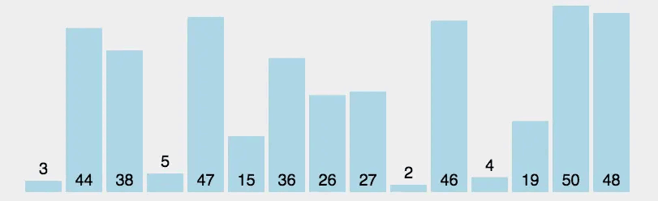
</div>

:::details 选择排序练习
<br />

- 练习题 1：选择购物清单

假设你要去超市购物，购物清单上列有各种商品及其对应的价格。编写一个程序，使用选择排序算法按照商品价格从低到高对购物清单进行排序。

```cpp
// 商品结构体，包含名称和价格
struct Item {
    string name;
    double price;
};
// 购物清单
Item shoppingList[] = {{"苹果", 3.5}, {"牛奶", 2.0}, {"面包", 1.5}, {"鸡蛋", 4.0}};
// 运行输出结果
购物清单未排序：
苹果 - ￥3.5
牛奶 - ￥2
面包 - ￥1.5
鸡蛋 - ￥4
购物清单按价格排序：
面包 - ￥1.5
牛奶 - ￥2
苹果 - ￥3.5
鸡蛋 - ￥4
```

```cpp
#include <iostream>
#include <string>

using namespace std;

// 商品结构体，包含名称和价格
struct Item {
    string name;
    double price;
};

// 选择排序函数
void selectionSort(Item items[], int n) {
    for (int i = 0; i < n - 1; ++i) {
        int minIndex = i;
        for (int j = i + 1; j < n; ++j) {
            if (items[j].price < items[minIndex].price) {
                minIndex = j;
            }
        }
        // 将最小值交换到当前位置
        swap(items[i], items[minIndex]);
    }
}

int main() {
    Item shoppingList[] = {{"苹果", 3.5}, {"牛奶", 2.0}, {"面包", 1.5}, {"鸡蛋", 4.0}};
    int n = sizeof(shoppingList) / sizeof(shoppingList[0]);

    cout << "购物清单未排序：" << endl;
    for (int i = 0; i < n; ++i)
        cout << shoppingList[i].name << " - ￥" << shoppingList[i].price << endl;

    selectionSort(shoppingList, n);

    cout << "购物清单按价格排序：" << endl;
    for (int i = 0; i < n; ++i)
        cout << shoppingList[i].name << " - ￥" << shoppingList[i].price << endl;

    return 0;
}
``` 

- 练习题 2：选课系统

假设你是一位学生，要进行选课。每门课程有一个唯一的课程编号和对应的学分。编写一个程序，使用选择排序算法按照课程编号从小到大对可选课程进行排序。

```cpp
// 课程结构体，包含课程编号和学分
struct Course {
    string id;
    int credits;
};
// 可选课程列表
Course courseList[] = {{"CS101", 3}, {"MATH201", 4}, {"PHYS101", 4}, {"CHEM101", 3}};
// 运行输出结果
可选课程未排序：
CS101 - 3 credits
MATH201 - 4 credits
PHYS101 - 4 credits
CHEM101 - 3 credits
可选课程按编号排序：
CHEM101 - 3 credits
CS101 - 3 credits
MATH201 - 4 credits
PHYS101 - 4 credits
```

```cpp
#include <iostream>
#include <string>

using namespace std;

// 课程结构体，包含课程编号和学分
struct Course {
    string id;
    int credits;
};

// 选择排序函数
void selectionSort(Course courses[], int n) {
    for (int i = 0; i < n - 1; ++i) {
        int minIndex = i;
        for (int j = i + 1; j < n; ++j) {
            if (courses[j].id < courses[minIndex].id) {
                minIndex = j;
            }
        }
        // 将最小值交换到当前位置
        swap(courses[i], courses[minIndex]);
    }
}

int main() {
    Course courseList[] = {{"CS101", 3}, {"MATH201", 4}, {"PHYS101", 4}, {"CHEM101", 3}};
    int n = sizeof(courseList) / sizeof(courseList[0]);

    cout << "可选课程未排序：" << endl;
    for (int i = 0; i < n; ++i)
        cout << courseList[i].id << " - " << courseList[i].credits << " credits" << endl;

    selectionSort(courseList, n);

    cout << "可选课程按编号排序：" << endl;
    for (int i = 0; i < n; ++i)
        cout << courseList[i].id << " - " << courseList[i].credits << " credits" << endl;

    return 0;
}
```

:::


### 插入排序（Insertion Sort）

插入排序（Insertion Sort）是一种简单直观的排序算法，其基本思想是：将待排序序列分为已排序部分和未排序部分，初始时已排序部分只包含第一个元素，然后依次将未排序部分的元素插入到已排序部分的适当位置，直到所有元素都被排序完成。

以下是插入排序的基本步骤：

1. **初始状态**：将待排序序列分为已排序部分和未排序部分，初始时已排序部分只包含第一个元素，未排序部分包含剩余的所有元素。

2. **依次插入元素**：从未排序部分取出第一个元素，将它插入到已排序部分的适当位置，使得已排序部分仍然保持有序。

3. **递增排序范围**：将已排序部分的长度增加1，将未排序部分的长度减少1。

4. **重复步骤2和步骤3**：重复执行步骤2和步骤3，直到未排序部分为空，即所有元素都已经排好序。

以下是C++中插入排序的基本实现：

```cpp
#include <iostream>

using namespace std;

// 插入排序函数
void insertionSort(int arr[], int n) {
    for (int i = 1; i < n; ++i) {
        int key = arr[i];
        int j = i - 1;
        // 将当前元素插入到已排序部分的适当位置
        while (j >= 0 && arr[j] > key) {
            arr[j + 1] = arr[j];
            j = j - 1;
        }
        arr[j + 1] = key;
    }
}

int main() {
    int arr[] = {64, 25, 12, 22, 11};
    int n = sizeof(arr) / sizeof(arr[0]);
    cout << "原始数组: ";
    for (int i = 0; i < n; ++i) {
        cout << arr[i] << " ";
    }
    cout << endl;
    
    insertionSort(arr, n);
    
    cout << "排序后的数组: ";
    for (int i = 0; i < n; ++i) {
        cout << arr[i] << " ";
    }
    cout << endl;
    
    return 0;
}
```

在插入排序的实现中，内层循环用来找到当前元素在已排序部分中的插入位置，而外层循环用来依次将未排序部分的元素插入到已排序部分中。通过不断重复这个过程，最终实现整个序列的排序。

插入排序的时间复杂度为 O(n^2)，其中 n 是待排序数组的长度。虽然插入排序的时间复杂度较高，但它在实际应用中表现良好，特别是对于部分有序的数组或者小规模的数据。插入排序也是许多其他高级排序算法的一部分。

<div class="my-img text-center">
    
</div>

:::details 插入排序练习

<br />

- 练习题 1：插入音乐列表

假设你有一个音乐播放列表，里面包含了你喜欢的音乐及其时长（以秒为单位）。编写一个程序，使用插入排序算法按照音乐时长从短到长对音乐列表进行排序。

```cpp
// 音乐结构体，包含音乐名称和时长
struct Music {
    string title;
    int duration; // 单位：秒
};
// 音乐列表
Music playlist[] = {{"Song 1", 180}, {"Song 2", 240}, {"Song 3", 150}, {"Song 4", 210}};
// 运行输出结果
音乐列表未排序：
Song 1 - 180 seconds
Song 2 - 240 seconds
Song 3 - 150 seconds
Song 4 - 210 seconds
音乐列表按时长排序：
Song 3 - 150 seconds
Song 1 - 180 seconds
Song 4 - 210 seconds
Song 2 - 240 seconds
```

```cpp
#include <iostream>
#include <string>

using namespace std;

// 音乐结构体，包含音乐名称和时长
struct Music {
    string title;
    int duration; // 单位：秒
};

// 插入排序函数
void insertionSort(Music playlist[], int n) {
    for (int i = 1; i < n; ++i) {
        Music key = playlist[i];
        int j = i - 1;
        while (j >= 0 && playlist[j].duration > key.duration) {
            playlist[j + 1] = playlist[j];
            j--;
        }
        playlist[j + 1] = key;
    }
}

int main() {
    Music playlist[] = {{"Song 1", 180}, {"Song 2", 240}, {"Song 3", 150}, {"Song 4", 210}};
    int n = sizeof(playlist) / sizeof(playlist[0]);

    cout << "音乐列表未排序：" << endl;
    for (int i = 0; i < n; ++i)
        cout << playlist[i].title << " - " << playlist[i].duration << " seconds" << endl;

    insertionSort(playlist, n);

    cout << "音乐列表按时长排序：" << endl;
    for (int i = 0; i < n; ++i)
        cout << playlist[i].title << " - " << playlist[i].duration << " seconds" << endl;

    return 0;
}
```

- 练习题 2：插入成绩单

假设你是一位老师，要给学生们录入期末成绩。编写一个程序，使用插入排序算法按照学生的成绩从低到高对成绩单进行排序。

```cpp
// 学生结构体，包含姓名和成绩
struct Student {
    string name;
    double score;
};
// 成绩单
Student grades[] = {{"Alice", 88.5}, {"Bob", 76.0}, {"Charlie", 92.3}, {"David", 81.7}};
// 运行输出结果
成绩单未排序：
Alice - 88.5
Bob - 76
Charlie - 92.3
David - 81.7
成绩单按成绩排序：
Bob - 76
David - 81.7
Alice - 88.5
Charlie - 92.3
```

```cpp
#include <iostream>
#include <string>

using namespace std;

// 学生结构体，包含姓名和成绩
struct Student {
    string name;
    double score;
};

// 插入排序函数
void insertionSort(Student grades[], int n) {
    for (int i = 1; i < n; ++i) {
        Student key = grades[i];
        int j = i - 1;
        while (j >= 0 && grades[j].score > key.score) {
            grades[j + 1] = grades[j];
            j--;
        }
        grades[j + 1] = key;
    }
}

int main() {
    Student grades[] = {{"Alice", 88.5}, {"Bob", 76.0}, {"Charlie", 92.3}, {"David", 81.7}};
    int n = sizeof(grades) / sizeof(grades[0]);

    cout << "成绩单未排序：" << endl;
    for (int i = 0; i < n; ++i)
        cout << grades[i].name << " - " << grades[i].score << endl;

    insertionSort(grades, n);

    cout << "成绩单按成绩排序：" << endl;
    for (int i = 0; i < n; ++i)
        cout << grades[i].name << " - " << grades[i].score << endl;

    return 0;
}
```

:::

### 快速排序（Quick Sort）
快速排序（Quick Sort）是一种高效的分治法排序算法。它的基本思想是选择一个基准元素，然后将待排序序列分割成两个子序列，一个子序列中的元素都小于等于基准元素，另一个子序列中的元素都大于基准元素。然后对这两个子序列分别递归地进行快速排序，直到序列为空或者只有一个元素为止。

以下是快速排序的基本步骤：

1. **选择基准元素**：从待排序序列中选择一个基准元素，通常选择序列的第一个元素、最后一个元素或者中间元素。

2. **分割序列**：将待排序序列分割成两个子序列，一个子序列中的元素都小于等于基准元素，另一个子序列中的元素都大于基准元素。在分割过程中，可以使用两个指针来实现，一个从序列的左侧向右移动，一个从序列的右侧向左移动，直到两个指针相遇。

3. **递归排序**：对两个子序列分别递归地进行快速排序，直到子序列为空或者只有一个元素为止。

4. **合并结果**：将两个子序列合并起来，得到最终的排序结果。

以下是C++中快速排序的基本实现：

```cpp
#include <iostream>

using namespace std;

// 交换数组中两个元素的位置
void swap(int &a, int &b) {
    int temp = a;
    a = b;
    b = temp;
}

// 分割函数，将数组分割成两个子数组
int partition(int arr[], int low, int high) {
    int pivot = arr[high]; // 选择最后一个元素作为基准元素
    int i = low - 1; // 初始化分割点的位置
    for (int j = low; j <= high - 1; ++j) {
        if (arr[j] <= pivot) {
            ++i;
            swap(arr[i], arr[j]);
        }
    }
    swap(arr[i + 1], arr[high]);
    return i + 1;
}

// 快速排序函数
void quickSort(int arr[], int low, int high) {
    if (low < high) {
        // 对数组进行分割
        int pi = partition(arr, low, high);
        // 对左侧子数组进行快速排序
        quickSort(arr, low, pi - 1);
        // 对右侧子数组进行快速排序
        quickSort(arr, pi + 1, high);
    }
}

int main() {
    int arr[] = {64, 25, 12, 22, 11};
    int n = sizeof(arr) / sizeof(arr[0]);
    cout << "原始数组: ";
    for (int i = 0; i < n; ++i) {
        cout << arr[i] << " ";
    }
    cout << endl;
    
    quickSort(arr, 0, n - 1);
    
    cout << "排序后的数组: ";
    for (int i = 0; i < n; ++i) {
        cout << arr[i] << " ";
    }
    cout << endl;
    
    return 0;
}
```

在快速排序的实现中，`partition` 函数用来分割数组，它将数组中小于等于基准元素的元素放在基准元素的左侧，大于基准元素的元素放在基准元素的右侧，并返回基准元素的位置。然后，递归地对左右两个子数组进行快速排序。

快速排序的时间复杂度取决于基准元素的选择和待排序序列的划分方式。在最好情况下，快速排序的时间复杂度为 O(nlogn)，在平均情况下也是 O(nlogn)。然而，在最坏情况下，快速排序的时间复杂度为 O(n^2)。

- **最好情况时间复杂度**：在最好情况下，每次划分的基准元素都恰好将待排序序列平分成两个大小相等的子序列。这样，在每一层递归中，都会有一半的元素被排好序。因此，快速排序的时间复杂度为 O(nlogn)。

- **平均情况时间复杂度**：在平均情况下，快速排序的时间复杂度也是 O(nlogn)。这是因为快速排序是一个平衡的排序算法，在每次划分中，基准元素将待排序序列划分成两个大小相近的子序列，因此递归树的深度为 O(logn)，每层递归的时间复杂度为 O(n)。

- **最坏情况时间复杂度**：在最坏情况下，每次划分的基准元素都是待排序序列中的最小或最大元素，导致一个子序列为空，另一个子序列包含除基准元素外的所有元素。这样，在每一层递归中，只有一个元素被排好序。因此，递归树的深度为 O(n)，每层递归的时间复杂度为 O(n)，总的时间复杂度为 O(n^2)。

尽管快速排序在最坏情况下的时间复杂度较高，但在实际应用中，快速排序通常比其他排序算法更快，特别是对于大规模数据的排序。这是因为快速排序是一种原址排序算法，它的空间复杂度较低，并且具有较好的平均时间复杂度。

<div class="my-img text-center">
    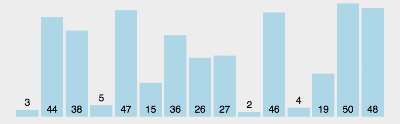
</div>

:::details 快速排序练习

<br />

- 练习题 1：快速整理文件

假设你有一个文件夹，里面包含了各种各样的文件，文件名是以字符串形式给出的。编写一个程序，使用快速排序算法按照文件名的字母顺序对文件进行排序。

```cpp
// 文件名列表
vector<string> files = {"document.txt", "image.png", "presentation.pptx", "video.mp4", "code.cpp"};
// 运行输出结果
文件未排序：
document.txt
image.png
presentation.pptx
video.mp4
code.cpp
文件按字母顺序排序：
code.cpp
document.txt
image.png
presentation.pptx
video.mp4
```

```cpp
#include <iostream>
#include <vector>
#include <string>

using namespace std;

// 快速排序函数
void quickSort(vector<string> &files, int low, int high) {
    if (low < high) {
        int pivot = low;
        string pivotValue = files[pivot];
        int i = low + 1;
        int j = high;
        while (true) {
            while (i <= j && files[i] <= pivotValue)
                i++;
            while (i <= j && files[j] > pivotValue)
                j--;
            if (i > j)
                break;
            swap(files[i], files[j]);
        }
        swap(files[pivot], files[j]);
        quickSort(files, low, j - 1);
        quickSort(files, j + 1, high);
    }
}

int main() {
    vector<string> files = {"document.txt", "image.png", "presentation.pptx", "video.mp4", "code.cpp"};
    int n = files.size();

    cout << "文件未排序：" << endl;
    for (const string &file : files)
        cout << file << endl;

    quickSort(files, 0, n - 1);

    cout << "文件按字母顺序排序：" << endl;
    for (const string &file : files)
        cout << file << endl;

    return 0;
}
```

- 练习题 2：快速整理学生名单

假设你有一个班级，里面有多位学生，每位学生有一个唯一的学号和姓名。编写一个程序，使用快速排序算法按照学号的大小对学生名单进行排序。

```cpp
// 学生结构体，包含学号和姓名
struct Student {
    int id;
    string name;
};
// 学生名单
vector<Student> students = {{1021, "Alice"}, {1003, "Bob"}, {1010, "Charlie"}, {1005, "David"}};
// 运行输出结果
学生名单未排序：
1021 - Alice
1003 - Bob
1010 - Charlie
1005 - David
学生名单按学号排序：
1003 - Bob
1005 - David
1010 - Charlie
1021 - Alice
```
```cpp
#include <iostream>
#include <vector>
#include <string>

using namespace std;

// 学生结构体，包含学号和姓名
struct Student {
    int id;
    string name;
};

// 快速排序函数
void quickSort(vector<Student> &students, int low, int high) {
    if (low < high) {
        int pivot = low;
        int pivotValue = students[pivot].id;
        int i = low + 1;
        int j = high;
        while (true) {
            while (i <= j && students[i].id <= pivotValue)
                i++;
            while (i <= j && students[j].id > pivotValue)
                j--;
            if (i > j)
                break;
            swap(students[i], students[j]);
        }
        swap(students[pivot], students[j]);
        quickSort(students, low, j - 1);
        quickSort(students, j + 1, high);
    }
}

int main() {
    vector<Student> students = {{1021, "Alice"}, {1003, "Bob"}, {1010, "Charlie"}, {1005, "David"}};
    int n = students.size();

    cout << "学生名单未排序：" << endl;
    for (const Student &student : students)
        cout << student.id << " - " << student.name << endl;

    quickSort(students, 0, n - 1);

    cout << "学生名单按学号排序：" << endl;
    for (const Student &student : students)
        cout << student.id << " - " << student.name << endl;

    return 0;
}
```
:::

### 归并排序（Merge Sort）
归并排序（Merge Sort）是一种基于分治思想的经典排序算法。它将待排序序列分成两个子序列，分别对这两个子序列进行归并排序，然后将排好序的两个子序列合并成一个有序序列。归并排序的核心思想是分而治之，即将问题分解成若干个小问题，解决每个小问题，最后将这些小问题的解合并成原问题的解。

以下是归并排序的基本步骤：

1. **分解序列**：将待排序序列分成两个子序列，直到每个子序列只包含一个元素。

2. **归并排序**：对每个子序列分别进行归并排序，直到所有的子序列都排好序。

3. **合并结果**：将排好序的两个子序列合并成一个有序序列。

以下是归并排序的基本实现：

```cpp
#include <iostream>

using namespace std;

// 合并两个子数组
void merge(int arr[], int left, int middle, int right) {
    int n1 = middle - left + 1;
    int n2 = right - middle;

    // 创建临时数组存放两个子数组
    int L[n1], R[n2];
    for (int i = 0; i < n1; ++i) {
        L[i] = arr[left + i];
    }
    for (int j = 0; j < n2; ++j) {
        R[j] = arr[middle + 1 + j];
    }

    // 合并两个子数组
    int i = 0, j = 0, k = left;
    while (i < n1 && j < n2) {
        if (L[i] <= R[j]) {
            arr[k] = L[i];
            ++i;
        } else {
            arr[k] = R[j];
            ++j;
        }
        ++k;
    }

    // 将剩余的元素复制到数组中
    while (i < n1) {
        arr[k] = L[i];
        ++i;
        ++k;
    }
    while (j < n2) {
        arr[k] = R[j];
        ++j;
        ++k;
    }
}

// 归并排序函数
void mergeSort(int arr[], int left, int right) {
    if (left < right) {
        int middle = left + (right - left) / 2;
        // 对左侧子数组进行归并排序
        mergeSort(arr, left, middle);
        // 对右侧子数组进行归并排序
        mergeSort(arr, middle + 1, right);
        // 合并两个子数组
        merge(arr, left, middle, right);
    }
}

int main() {
    int arr[] = {64, 25, 12, 22, 11};
    int n = sizeof(arr) / sizeof(arr[0]);
    cout << "原始数组: ";
    for (int i = 0; i < n; ++i) {
        cout << arr[i] << " ";
    }
    cout << endl;
    
    mergeSort(arr, 0, n - 1);
    
    cout << "排序后的数组: ";
    for (int i = 0; i < n; ++i) {
        cout << arr[i] << " ";
    }
    cout << endl;
    
    return 0;
}
```

在归并排序的实现中，`merge` 函数用来合并两个有序子数组，`mergeSort` 函数用来递归地对子数组进行归并排序。归并排序的时间复杂度是 O(nlogn)，其中 n 是待排序数组的长度。因为归并排序是一种稳定的排序算法，并且具有良好的平均性能，所以在实际应用中被广泛使用。

<div class="my-img text-center">
    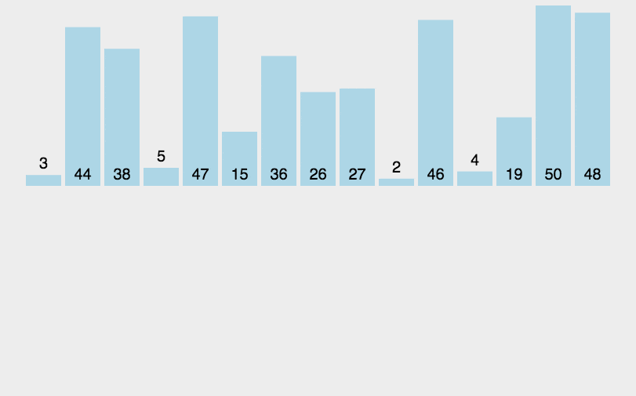
</div>

:::details 归并排序练习

<br />

- 练习题 1：归并学生成绩单

假设你是一位老师，要给学生们录入期末成绩。编写一个程序，使用归并排序算法按照学生的成绩从高到低对成绩单进行排序。

```cpp
// 学生结构体，包含姓名和成绩
struct Student {
    string name;
    double score;
};
// 学生成绩单
vector<Student> students = {{"Alice", 88.5}, {"Bob", 76.0}, {"Charlie", 92.3}, {"David", 81.7}};
// 运行输出结果
成绩单未排序：
Alice - 88.5
Bob - 76
Charlie - 92.3
David - 81.7
成绩单按成绩排序：
Charlie - 92.3
Alice - 88.5
David - 81.7
Bob - 76
```

```cpp
#include <iostream>
#include <vector>
#include <string>

using namespace std;

// 学生结构体，包含姓名和成绩
struct Student {
    string name;
    double score;
};

// 归并排序函数
void merge(vector<Student> &students, int left, int mid, int right) {
    int n1 = mid - left + 1;
    int n2 = right - mid;

    vector<Student> L(n1), R(n2);

    for (int i = 0; i < n1; ++i)
        L[i] = students[left + i];
    for (int j = 0; j < n2; ++j)
        R[j] = students[mid + 1 + j];

    int i = 0, j = 0, k = left;
    while (i < n1 && j < n2) {
        if (L[i].score >= R[j].score) {
            students[k] = L[i];
            ++i;
        } else {
            students[k] = R[j];
            ++j;
        }
        ++k;
    }

    while (i < n1) {
        students[k] = L[i];
        ++i;
        ++k;
    }

    while (j < n2) {
        students[k] = R[j];
        ++j;
        ++k;
    }
}

void mergeSort(vector<Student> &students, int left, int right) {
    if (left < right) {
        int mid = left + (right - left) / 2;
        mergeSort(students, left, mid);
        mergeSort(students, mid + 1, right);
        merge(students, left, mid, right);
    }
}

int main() {
    vector<Student> students = {{"Alice", 88.5}, {"Bob", 76.0}, {"Charlie", 92.3}, {"David", 81.7}};
    int n = students.size();

    cout << "成绩单未排序：" << endl;
    for (const Student &student : students)
        cout << student.name << " - " << student.score << endl;

    mergeSort(students, 0, n - 1);

    cout << "成绩单按成绩排序：" << endl;
    for (const Student &student : students)
        cout << student.name << " - " << student.score << endl;

    return 0;
}
```

- 练习题 2：归并整理文件

假设你有一个文件夹，里面包含了各种各样的文件，文件名是以字符串形式给出的。编写一个程序，使用归并排序算法按照文件名的字母顺序对文件进行排序。

```cpp
// 文件名列表
vector<string> files = {"document.txt", "image.png", "presentation.pptx", "video.mp4", "code.cpp"};
// 运行输出结果
文件未排序：
document.txt
image.png
presentation.pptx
video.mp4
code.cpp
文件按字母顺序排序：
code.cpp
document.txt
image.png
presentation.pptx
video.mp4
```

```cpp
#include <iostream>
#include <vector>
#include <string>

using namespace std;

// 归并排序函数
void merge(vector<string> &files, int left, int mid, int right) {
    int n1 = mid - left + 1;
    int n2 = right - mid;

    vector<string> L(n1), R(n2);

    for (int i = 0; i < n1; ++i)
        L[i] = files[left + i];
    for (int j = 0; j < n2; ++j)
        R[j] = files[mid + 1 + j];

    int i = 0, j = 0, k = left;
    while (i < n1 && j < n2) {
        if (L[i] <= R[j]) {
            files[k] = L[i];
            ++i;
        } else {
            files[k] = R[j];
            ++j;
        }
        ++k;
    }

    while (i < n1) {
        files[k] = L[i];
        ++i;
        ++k;
    }

    while (j < n2) {
        files[k] = R[j];
        ++j;
        ++k;
    }
}

void mergeSort(vector<string> &files, int left, int right) {
    if (left < right) {
        int mid = left + (right - left) / 2;
        mergeSort(files, left, mid);
        mergeSort(files, mid + 1, right);
        merge(files, left, mid, right);
    }
}

int main() {
    vector<string> files = {"document.txt", "image.png", "presentation.pptx", "video.mp4", "code.cpp"};
    int n = files.size();

    cout << "文件未排序：" << endl;
    for (const string &file : files)
        cout << file << endl;

    mergeSort(files, 0, n - 1);

    cout << "文件按字母顺序排序：" << endl;
    for (const string &file : files)
        cout << file << endl;

    return 0;
}
```
:::

### 计数排序（Counting Sort）
计数排序（Counting Sort）是一种线性时间复杂度的非比较排序算法，适用于对整数进行排序。它的基本思想是通过计算每个元素在序列中出现的次数，然后根据这些计数来直接确定每个元素在排序后序列中的位置。计数排序适合于范围较小的整数排序，尤其在数据范围不大且重复元素较多的情况下，效率非常高。

以下是计数排序的基本步骤：

1. **找出最大值和最小值**：遍历待排序序列，找到其中的最大值和最小值，确定计数数组的大小。

2. **计数元素出现次数**：遍历待排序序列，对于每个元素，计算其在序列中出现的次数，并记录在计数数组的对应位置上。

3. **累加计数数组**：将计数数组中的值累加，得到每个元素的最终位置。

4. **填充排序后的数组**：根据计数数组的值，将原序列中的元素按顺序放入排序后的数组中。

5. **复制回原数组**：将排序后的数组复制回原数组。

以下是C++中计数排序的基本实现：

```cpp
#include <iostream>
#include <vector>
#include <algorithm>

using namespace std;

// 计数排序函数
void countingSort(int arr[], int n) {
    if (n <= 0) return;

    // 找到数组中的最大值和最小值
    int max_val = *max_element(arr, arr + n);
    int min_val = *min_element(arr, arr + n);
    int range = max_val - min_val + 1;

    // 创建计数数组并初始化为0
    vector<int> count(range, 0);

    // 记录每个元素的出现次数
    for (int i = 0; i < n; ++i) {
        count[arr[i] - min_val]++;
    }

    // 累加计数数组
    for (int i = 1; i < range; ++i) {
        count[i] += count[i - 1];
    }

    // 创建输出数组
    vector<int> output(n);

    // 将元素按顺序放入输出数组中
    for (int i = n - 1; i >= 0; --i) {
        output[count[arr[i] - min_val] - 1] = arr[i];
        count[arr[i] - min_val]--;
    }

    // 将排序后的数组复制回原数组
    for (int i = 0; i < n; ++i) {
        arr[i] = output[i];
    }
}

int main() {
    int arr[] = {64, 25, 12, 22, 11};
    int n = sizeof(arr) / sizeof(arr[0]);
    cout << "原始数组: ";
    for (int i = 0; i < n; ++i) {
        cout << arr[i] << " ";
    }
    cout << endl;
    
    countingSort(arr, n);
    
    cout << "排序后的数组: ";
    for (int i = 0; i < n; ++i) {
        cout << arr[i] << " ";
    }
    cout << endl;
    
    return 0;
}
```

在这个实现中：

1. **找到最大值和最小值**：使用 `max_element` 和 `min_element` 函数找到数组中的最大值和最小值，以确定计数数组的范围。

2. **计数元素出现次数**：创建一个计数数组 `count`，并初始化为0，然后遍历原数组，记录每个元素出现的次数。

3. **累加计数数组**：将计数数组进行累加处理，以确定每个元素的最终位置。

4. **填充排序后的数组**：根据累加后的计数数组，将元素放入输出数组 `output` 中。

5. **复制回原数组**：最后将排序后的数组复制回原数组。

- 计数排序的特点：
    - **时间复杂度**：计数排序的时间复杂度是 O(n + k)，其中 n 是数组的长度，k 是数组中元素的范围（最大值减最小值加1）。
    - **空间复杂度**：需要额外的 O(n + k) 的空间用于计数数组和输出数组。
    - **稳定性**：计数排序是一种稳定的排序算法，即相同值的元素在排序前后的相对位置不变。
    - **适用场景**：适用于整数排序，特别是当元素的范围较小时效果最好。

计数排序通过利用元素的值直接进行排序，避免了比较操作，因此在某些特定场景下具有很高的效率。

<div class="my-img text-center">
    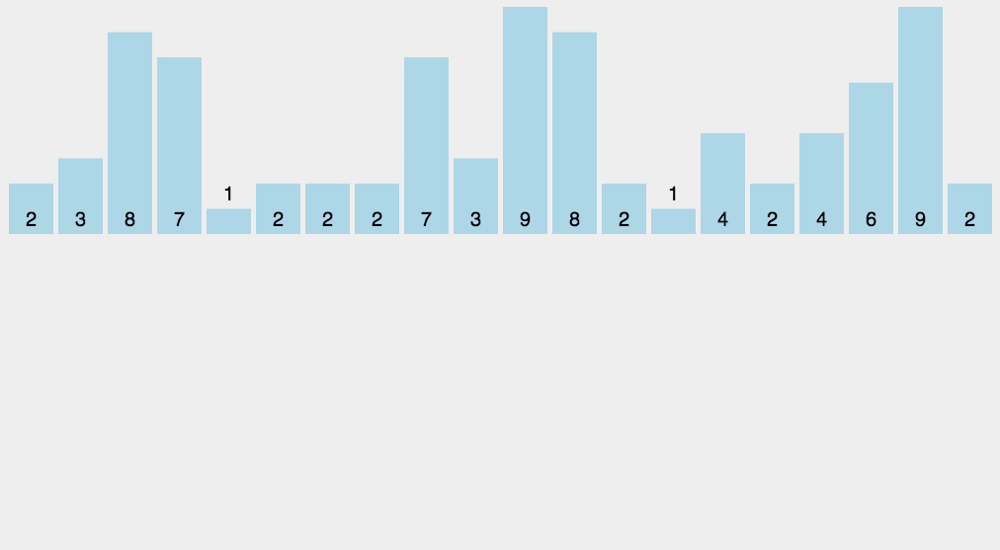
</div>

:::details 计数排序练习

- 练习题 1：整理考试成绩

假设你是一位老师，需要对班级的考试成绩进行统计和排序。每个学生的成绩都是0到100的整数。编写一个程序，使用计数排序算法对成绩从低到高进行排序。

```cpp
// 学生成绩列表
vector<int> scores = {88, 76, 92, 81, 65, 89, 70, 95, 90, 76};
// 运行输出结果
成绩未排序：
88 76 92 81 65 89 70 95 90 76
成绩按从低到高排序：
65 70 76 76 81 88 89 90 92 95
```

```cpp
#include <iostream>
#include <vector>

using namespace std;

void countingSort(vector<int> &scores) {
    int maxScore = 100;
    vector<int> count(maxScore + 1, 0);

    // 统计每个成绩出现的次数
    for (int score : scores) {
        count[score]++;
    }

    int index = 0;
    for (int i = 0; i <= maxScore; ++i) {
        while (count[i] > 0) {
            scores[index++] = i;
            count[i]--;
        }
    }
}

int main() {
    vector<int> scores = {88, 76, 92, 81, 65, 89, 70, 95, 90, 76};

    cout << "成绩未排序：" << endl;
    for (int score : scores)
        cout << score << " ";
    cout << endl;

    countingSort(scores);

    cout << "成绩按从低到高排序：" << endl;
    for (int score : scores)
        cout << score << " ";
    cout << endl;

    return 0;
}
```

- 练习题 2：整理投票结果

假设你负责统计某个竞赛的投票结果，每位选手的得票数是0到100的整数。编写一个程序，使用计数排序算法对选手的得票数从高到低进行排序。

```cpp
// 投票结果列表
vector<int> votes = {45, 78, 92, 81, 56, 89, 70, 95, 90, 76};
// 运行输出结果
投票结果未排序：
45 78 92 81 56 89 70 95 90 76
投票结果按从高到低排序：
95 92 90 89 81 78 76 70 56 45
```

```cpp
#include <iostream>
#include <vector>

using namespace std;

void countingSort(vector<int> &votes) {
    int maxVotes = 100;
    vector<int> count(maxVotes + 1, 0);

    // 统计每个得票数出现的次数
    for (int vote : votes) {
        count[vote]++;
    }

    int index = 0;
    for (int i = maxVotes; i >= 0; --i) {
        while (count[i] > 0) {
            votes[index++] = i;
            count[i]--;
        }
    }
}

int main() {
    vector<int> votes = {45, 78, 92, 81, 56, 89, 70, 95, 90, 76};

    cout << "投票结果未排序：" << endl;
    for (int vote : votes)
        cout << vote << " ";
    cout << endl;

    countingSort(votes);

    cout << "投票结果按从高到低排序：" << endl;
    for (int vote : votes)
        cout << vote << " ";
    cout << endl;

    return 0;
}
```
:::

### 堆排序（Heap Sort）
堆排序（Heap Sort）是一种基于堆数据结构的比较排序算法。堆是一个完全二叉树，其中每个节点的值都大于或等于（最大堆）或小于或等于（最小堆）其子节点的值。堆排序利用堆这种数据结构的特性，首先将待排序数组构建成一个堆，然后通过调整堆结构，逐步将最大（或最小）元素移到数组的末尾，最终完成排序。

:::details 堆的概念
<br />
堆一般指的是二叉堆，顾名思义，二叉堆是完全二叉树或者近似完全二叉树  

1. 堆的性质
> ① 是一棵完全二叉树
> ② 每个节点的值都大于或等于其子节点的值，为最大堆；反之为最小堆。

<div class="my-img text-center">
    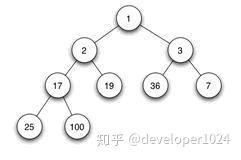
</div>

2. 堆的存储

一般用数组来表示堆，下标为 i 的结点的父结点下标为(i-1)/2；其左右子结点分别为 (2i + 1)、(2i + 2)

<div class="my-img text-center">
    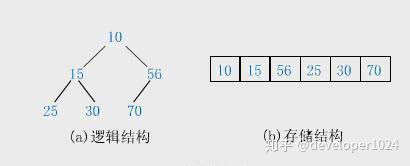
</div>

3. 堆的操作

在堆的数据结构中，堆中的最大值总是位于根节点(在优先队列中使用堆的话堆中的最小值位于根节点)。堆中定义以下几种操作：

> ① 最大堆调整（Max_Heapify）：将堆的末端子节点作调整，使得子节点永远小于父节点
> ② 创建最大堆（Build_Max_Heap）：将堆所有数据重新排序
> ③ 堆排序（HeapSort）：移除位在第一个数据的根节点，并做最大堆调整的递归运算

4. 堆的排序  
堆排序（Heapsort）是指利用堆这种数据结构所设计的一种排序算法。堆积是一个近似完全二叉树的结构，并同时满足堆积的性质：即子结点的键值或索引总是小于（或者大于）它的父节点。

4.1. 基本思想

利用大顶堆(小顶堆)堆顶记录的是最大关键字(最小关键字)这一特性，使得每次从无序中选择最大记录(最小记录)变得简单。

> ① 将待排序的序列构造成一个最大堆，此时序列的最大值为根节点
> ② 依次将根节点与待排序序列的最后一个元素交换
> ③ 再维护从根节点到该元素的前一个节点为最大堆，如此往复，最终得到一个递增序列

4.2. 实现逻辑
> ① 先将初始的R[0…n-1]建立成最大堆，此时是无序堆，而堆顶是最大元素。
> ② 再将堆顶R[0]和无序区的最后一个记录R[n-1]交换，由此得到新的无序区R[0…n-2]和有序区R[n-1]，且满足R[0…n-2].keys ≤ R[n-1].key
> ③ 由于交换后新的根R[1]可能违反堆性质，故应将当前无序区R[1..n-1]调整为堆。然后再次将R[1..n-1]中关键字最大的记录R[1]和该区间的最后一个记录R[n-1]交换，由此得到新的无序区R[1..n-2]和有序区R[n-1..n]，且仍满足关系R[1..n-2].keys≤R[n-1..n].keys，同样要将R[1..n-2]调整为堆。
> ④ 直到无序区只有一个元素为止。

4.3. 动图演示

<div class="my-img text-center">
    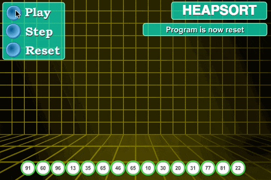
</div>
堆排序算法的演示。首先，将元素进行重排，以匹配堆的条件。图中排序过程之前简单的绘出了堆树的结构。
<div class="my-img text-center">
    
</div>
分步解析说明：

实现堆排序需要解决两个问题：

> 1、如何由一个无序序列建成一个堆？
> 2、如何在输出堆顶元素之后，调整剩余元素成为一个新的堆？

假设给定一个组无序数列{100,5,3,11,6,8,7}，带着问题，我们对其进行堆排序操作进行分步操作说明。

<div class="my-img text-center">
    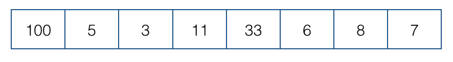
</div>

- 创建最大堆  
①首先我们将数组我们将数组从上至下按顺序排列，转换成二叉树：一个无序堆。每一个三角关系都是一个堆，上面是父节点，下面两个分叉是子节点，两个子节点俗称左孩子、右孩子；
<div class="my-img text-center">
    
</div>
②转换成无序堆之后，我们要努力让这个无序堆变成最大堆(或是最小堆)，即每个堆里都实现父节点的值都大于任何一个子节点的值。
<div class="my-img text-center">
    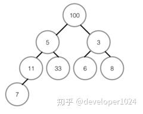
</div>
③从最后一个堆开始，即左下角那个没有右孩子的那个堆开始；首先对比左右孩子，由于这个堆没有右孩子，所以只能用左孩子，左孩子的值比父节点的值小所以不需要交换。如果发生交换，要检测子节点是否为其他堆的父节点，如果是，递归进行同样的操作。
④第二次对比红色三角形内的堆，取较大的子节点，右孩子8胜出，和父节点比较，右孩子8大于父节点3，升级做父节点，与3交换位置，3的位置没有子节点，这个堆建成最大堆。
<div class="my-img text-center">
    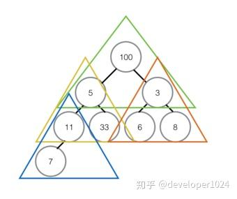
</div>
⑤对黄色三角形内堆进行排序，过程和上面一样，最终是右孩子33升为父节点，被交换的右孩子下面也没有子节点，所以直接结束对比。

⑥最顶部绿色的堆，堆顶100比左右孩子都大，所以不用交换，至此最大堆创建完成。

<div class="my-img text-center">
    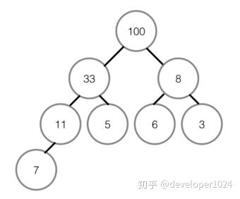
</div>

- 堆排序（最大堆调整）  
①首先将堆顶元素100交换至最底部7的位置，7升至堆顶，100所在的底部位置即为有序区，有序区不参与之后的任何对比。
<div class="my-img text-center">
    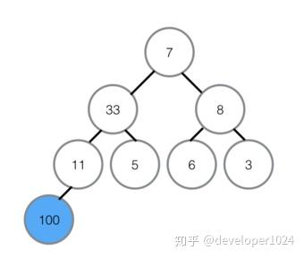
</div>
②在7升至顶部之后，对顶部重新做最大堆调整，左孩子33代替7的位置。
<div class="my-img text-center">
    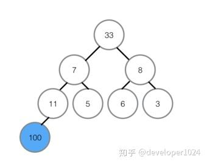
</div>
③在7被交换下来后，下面还有子节点，所以需要继续与子节点对比，左孩子11比7大，所以11与7交换位置，交换位置后7下面为有序区，不参与对比，所以本轮结束，无序区再次形成一个最大堆。
<div class="my-img text-center">
    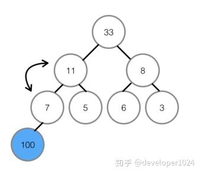
</div>
④将最大堆堆顶33交换至堆末尾，扩大有序区；
<div class="my-img text-center">
    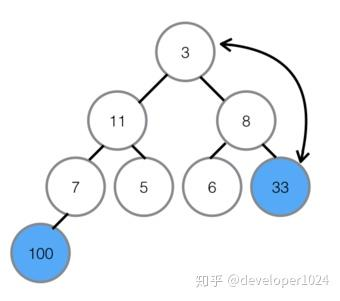
</div>
⑤不断建立最大堆，并且扩大有序区，最终全部有序。
<div class="my-img text-center">
    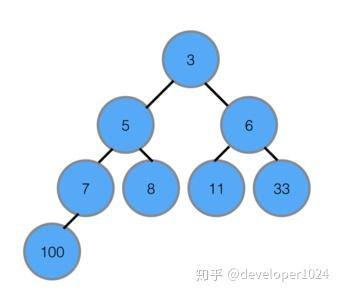
</div>

5. 复杂度分析
- 平均时间复杂度：O(nlogn)
- 最佳时间复杂度：O(nlogn)
- 最差时间复杂度：O(nlogn)
- 稳定性：不稳定

堆排序其实也是一种选择排序，是一种树形选择排序。只不过直接选择排序中，为了从R[1…n]中选择最大记录，需比较n-1次，然后从R[1…n-2]中选择最大记录需比较n-2次。事实上这n-2次比较中有很多已经在前面的n-1次比较中已经做过，而树形选择排序恰好利用树形的特点保存了部分前面的比较结果，因此可以减少比较次数。对于n个关键字序列，最坏情况下每个节点需比较log2(n)次，因此其最坏情况下时间复杂度为nlogn。堆排序为不稳定排序，不适合记录较少的排序。
:::

以下是堆排序的基本步骤：

1. **构建最大堆**：将初始数组转换为最大堆。
2. **交换堆顶元素和末尾元素**：将堆顶元素（最大值）与数组末尾元素交换位置，并将堆的大小减1。
3. **调整堆结构**：将新的堆顶元素下沉，以维持堆的性质。
4. **重复步骤2和步骤3**：直到堆的大小为1。

以下是C++中堆排序的基本实现：

```cpp
#include <iostream>

using namespace std;

// 交换数组中两个元素的位置
void swap(int &a, int &b) {
    int temp = a;
    a = b;
    b = temp;
}

// 堆调整函数
void heapify(int arr[], int n, int i) {
    int largest = i; // 初始化最大元素为根节点
    int left = 2 * i + 1; // 左子节点
    int right = 2 * i + 2; // 右子节点

    // 如果左子节点存在且大于根节点
    if (left < n && arr[left] > arr[largest]) {
        largest = left;
    }

    // 如果右子节点存在且大于当前最大值
    if (right < n && arr[right] > arr[largest]) {
        largest = right;
    }

    // 如果最大值不是根节点
    if (largest != i) {
        swap(arr[i], arr[largest]);
        // 递归地调整受影响的子树
        heapify(arr, n, largest);
    }
}

// 堆排序函数
void heapSort(int arr[], int n) {
    // 构建最大堆
    for (int i = n / 2 - 1; i >= 0; --i) {
        heapify(arr, n, i);
    }

    // 一个个地将最大元素移到数组末尾，然后调整堆
    for (int i = n - 1; i > 0; --i) {
        swap(arr[0], arr[i]);
        heapify(arr, i, 0);
    }
}

int main() {
    int arr[] = {64, 25, 12, 22, 11};
    int n = sizeof(arr) / sizeof(arr[0]);
    cout << "原始数组: ";
    for (int i = 0; i < n; ++i) {
        cout << arr[i] << " ";
    }
    cout << endl;
    
    heapSort(arr, n);
    
    cout << "排序后的数组: ";
    for (int i = 0; i < n; ++i) {
        cout << arr[i] << " ";
    }
    cout << endl;
    
    return 0;
}
```

在这个实现中：

1. **构建最大堆**：
   - 从最后一个非叶子节点开始，向上遍历整个树，调用 `heapify` 函数将每个节点的子树调整为最大堆。
   - `heapify` 函数通过比较当前节点与其左右子节点的大小，找到最大值，然后将最大值与当前节点交换位置，递归地调整被交换节点的子树，确保整个子树满足最大堆的性质。

2. **排序过程**：
   - 交换堆顶元素（当前最大值）与数组末尾元素，然后将堆的大小减1。
   - 调整堆顶元素，使其满足最大堆的性质。调用 `heapify` 函数从堆顶开始调整，确保剩余的部分仍然是最大堆。
   - 重复上述过程，直到整个数组有序。

- 堆排序的特点：

    - **时间复杂度**：
      - 最好情况、最坏情况和平均情况的时间复杂度均为 O(nlogn)。
      - 构建最大堆的时间复杂度为 O(n)。
      - 每次删除堆顶元素并调整堆的时间复杂度为 O(logn)，需要进行 n 次这样的操作，因此整体时间复杂度为 O(nlogn)。

    - **空间复杂度**：
      - 堆排序是一种原地排序算法，空间复杂度为 O(1)。

    - **稳定性**：
      - 堆排序是一种不稳定的排序算法，即相同值的元素在排序前后的相对位置可能会改变。

堆排序通过构建堆结构，利用堆的性质实现高效排序，适用于大规模数据的排序任务。

<div class="my-img text-center">
    
</div>
<div class="my-img text-center">
    
</div>

:::details 堆排序练习

- 练习题 1：堆排序进行工资排序

假设你在管理一个公司的员工工资列表。编写一个程序，使用堆排序算法按照工资从高到低对员工的工资进行排序。

```cpp
// 员工工资列表
vector<int> salaries = {45000, 52000, 61000, 47500, 39000, 70000, 56000};
// 运行输出结果
未排序的工资：
45000 52000 61000 47500 39000 70000 56000 
排序后的工资：
39000 45000 47500 52000 56000 61000 70000
``` 

```cpp
#include <iostream>
#include <vector>

using namespace std;

// 堆排序的辅助函数
void heapify(vector<int> &salaries, int n, int i) {
    int largest = i;
    int left = 2 * i + 1;
    int right = 2 * i + 2;

    if (left < n && salaries[left] > salaries[largest]) {
        largest = left;
    }

    if (right < n && salaries[right] > salaries[largest]) {
        largest = right;
    }

    if (largest != i) {
        swap(salaries[i], salaries[largest]);
        heapify(salaries, n, largest);
    }
}

// 堆排序函数
void heapSort(vector<int> &salaries) {
    int n = salaries.size();

    // 建堆
    for (int i = n / 2 - 1; i >= 0; --i) {
        heapify(salaries, n, i);
    }

    // 一个个取出元素从堆末尾
    for (int i = n - 1; i >= 0; --i) {
        swap(salaries[0], salaries[i]);
        heapify(salaries, i, 0);
    }
}

int main() {
    vector<int> salaries = {45000, 52000, 61000, 47500, 39000, 70000, 56000};
    
    cout << "未排序的工资：" << endl;
    for (int salary : salaries) {
        cout << salary << " ";
    }
    cout << endl;

    heapSort(salaries);

    cout << "排序后的工资：" << endl;
    for (int salary : salaries) {
        cout << salary << " ";
    }
    cout << endl;

    return 0;
}
``` 

- 练习题 2：堆排序进行班级成绩排序

假设你是一位老师，要对班级学生的考试成绩进行排序。编写一个程序，使用堆排序算法按照成绩从高到低对学生的成绩进行排序。

```cpp
// 学生成绩列表
vector<int> scores = {88, 76, 92, 85, 76, 65, 92, 58, 76, 85, 100, 92};
// 运行输出结果
未排序的成绩：
88 76 92 85 76 65 92 58 76 85 100 92 
排序后的成绩：
58 65 76 76 76 85 85 88 92 92 92 100
```

```cpp
#include <iostream>
#include <vector>

using namespace std;

// 堆排序的辅助函数
void heapify(vector<int> &scores, int n, int i) {
    int largest = i;
    int left = 2 * i + 1;
    int right = 2 * i + 2;

    if (left < n && scores[left] > scores[largest]) {
        largest = left;
    }

    if (right < n && scores[right] > scores[largest]) {
        largest = right;
    }

    if (largest != i) {
        swap(scores[i], scores[largest]);
        heapify(scores, n, largest);
    }
}

// 堆排序函数
void heapSort(vector<int> &scores) {
    int n = scores.size();

    // 建堆
    for (int i = n / 2 - 1; i >= 0; --i) {
        heapify(scores, n, i);
    }

    // 一个个取出元素从堆末尾
    for (int i = n - 1; i >= 0; --i) {
        swap(scores[0], scores[i]);
        heapify(scores, i, 0);
    }
}

int main() {
    vector<int> scores = {88, 76, 92, 85, 76, 65, 92, 58, 76, 85, 100, 92};
    
    cout << "未排序的成绩：" << endl;
    for (int score : scores) {
        cout << score << " ";
    }
    cout << endl;

    heapSort(scores);

    cout << "排序后的成绩：" << endl;
    for (int score : scores) {
        cout << score << " ";
    }
    cout << endl;

    return 0;
}
``` 
:::


### 桶排序（Bucket Sort）

桶排序（Bucket Sort）是一种基于分布的排序算法，它将元素分布到多个桶中，每个桶单独进行排序，最后将所有桶中的元素合并得到最终的有序序列。桶排序特别适用于均匀分布的输入数据，可以在某些情况下实现线性时间复杂度。

:::details 桶排序的概念
1. 桶排序思想

其实桶排序重要的是它的思想，而不是具体实现，桶排序从字面的意思上看：  
桶：若干个桶，说明此类排序将数据放入若干个桶中。  
桶：每个桶有容量，桶是有一定容积的容器，所以每个桶中可能有多个元素。  
桶：从整体来看，整个排序更希望桶能够更匀称，即既不溢出(太多)又不太少。  

<div class="my-img text-center">
    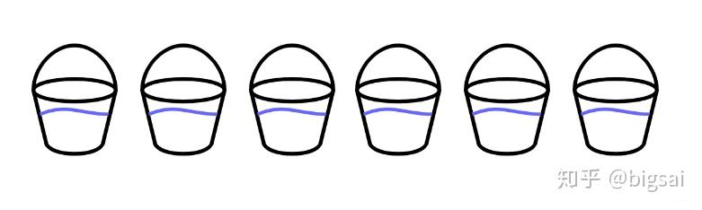
</div>

但是这些桶跟排序又有什么关系呢？  
首先先说下桶排序的思想

> 工作的原理是将数组分到有限数量的桶子里。每个桶子再个别排序（有可能再使用别的排序算法或是以递归方式继续使用桶排序进行排序）。桶排序是鸽巢排序的一种归纳结果。当要被排序的数组内的数值是均匀分配的时候，桶排序使用线性时间（Θ（n））。但桶排序并不是 比较排序，他不受到 O(n log n) 下限的影响。

用通俗易懂的话来理解：

> 将待排序的序列分到若干个桶中，每个桶内的元素再进行个别排序。
> 时间复杂度最好可能是线性O(n)，桶排序不是基于比较的排序

当然，桶排序是一种用空间换取时间的排序。

既然是排序，那么最终的结果肯定是从小到大的，桶排序借助桶的位置完成一次初步的排序——将待排序元素分别放至各个桶内。

而我们通常根据待排序元素整除的方法将其较为均匀的放至桶中，如`8 5 22 15 28 9 45 42 39 19 27 47 12`这个待排序序列，假设放入桶编号的规则为：n/10。这样首先各个元素就可以直接通过整除的方法放至对应桶中。而右侧所有桶内数据都比左侧的要大！

<div class="my-img text-center">
    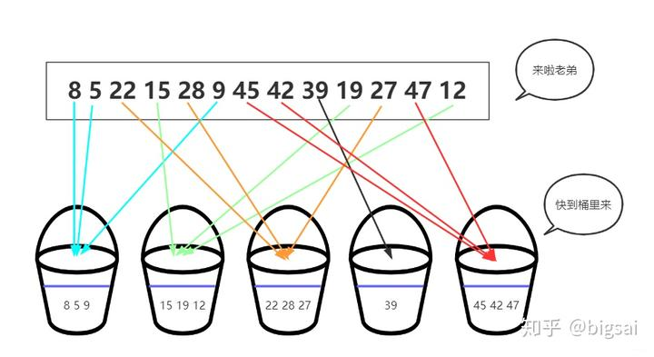
</div>

在刚刚放入桶中的时候，各个桶的大小相对可以确定，右侧都比左侧大，但桶内还是无序的，对各个桶内分别进行排序，再依次按照桶的顺序、桶内序列顺序得到一个最终排序的序列。

<div class="my-img text-center">
    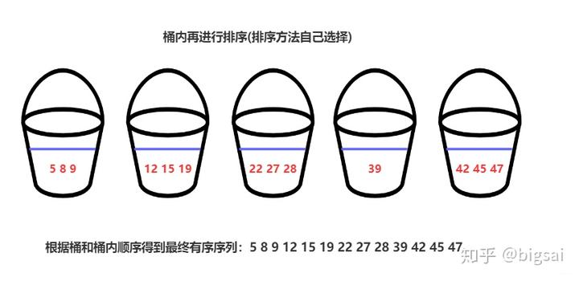
</div>

以上就是桶排序在算法上的思想了。如果使用c++ 具体实现的话思路也很简单：用List[]类型的集合数组表示桶，每个List代表一个桶，将数据根据整除得到的值直接放到对应编号的集合里面去，再依次进行排序就可以了。
:::

桶排序的基本步骤如下：

1. **分配桶**：创建若干个桶，将输入数据分配到这些桶中。每个桶负责存放一个特定范围内的元素。

2. **对每个桶进行排序**：对每个桶中的元素进行排序。可以使用其他排序算法，如插入排序或快速排序。

3. **合并桶**：将所有桶中的元素按顺序合并，得到最终的排序结果。

以下是C++中桶排序的基本实现：

```cpp
#include <iostream>
#include <vector>
#include <algorithm>

using namespace std;

// 插入排序函数（用于对每个桶中的元素进行排序）
void insertionSort(vector<float>& bucket) {
    for (size_t i = 1; i < bucket.size(); ++i) {
        float key = bucket[i];
        int j = i - 1;
        while (j >= 0 && bucket[j] > key) {
            bucket[j + 1] = bucket[j];
            j = j - 1;
        }
        bucket[j + 1] = key;
    }
}

// 桶排序函数
void bucketSort(float arr[], int n) {
    // 创建 n 个桶
    vector<vector<float>> buckets(n);

    // 将元素分配到不同的桶中
    for (int i = 0; i < n; ++i) {
        int bucketIndex = n * arr[i]; // 假设元素范围为[0, 1)
        buckets[bucketIndex].push_back(arr[i]);
    }

    // 对每个桶进行排序
    for (int i = 0; i < n; ++i) {
        insertionSort(buckets[i]);
    }

    // 合并所有桶中的元素
    int index = 0;
    for (int i = 0; i < n; ++i) {
        for (size_t j = 0; j < buckets[i].size(); ++j) {
            arr[index++] = buckets[i][j];
        }
    }
}

int main() {
    float arr[] = {0.64, 0.25, 0.12, 0.22, 0.11};
    int n = sizeof(arr) / sizeof(arr[0]);
    cout << "原始数组: ";
    for (int i = 0; i < n; ++i) {
        cout << arr[i] << " ";
    }
    cout << endl;
    
    bucketSort(arr, n);
    
    cout << "排序后的数组: ";
    for (int i = 0; i < n; ++i) {
        cout << arr[i] << " ";
    }
    cout << endl;
    
    return 0;
}
```

在这个实现中：

1. **创建桶**：根据输入数据的范围和数量，确定需要创建多少个桶。假设数据范围在 [0, 1) 之间，创建 n 个桶。

2. **分配桶**：将每个元素分配到相应的桶中。例如，对于一个元素 `arr[i]`，可以通过 `bucketIndex = n * arr[i]` 来确定其应该放入的桶。

3. **桶内排序**：对每个桶中的元素单独进行排序。由于每个桶内的元素数量相对较少，可以使用插入排序等简单排序算法。

4. **合并桶**：将所有桶中的元素按顺序合并回原数组，得到排序后的结果。


- 桶排序的特点：
    - **时间复杂度**：
      - **最好情况**：O(n) - 当元素均匀分布在各个桶中，且每个桶内使用的排序算法效率高时。
      - **最坏情况**：O(n^2) - 当所有元素都落在同一个桶中，此时相当于直接对整个数组进行排序。
      - **平均情况**：O(n + k) - n 是元素数量，k 是桶的数量。

    - **空间复杂度**：O(n + k) - 需要额外的空间来存放桶。

    - **稳定性**：桶排序是一种稳定的排序算法，桶内的排序可以保持稳定性。

    - **适用场景**：适用于数据均匀分布的情况，特别是当元素范围已知且范围较小时，桶排序效率非常高。

    - **优点**：
      - 适用于大规模数据排序，尤其是数据均匀分布的情况。
      - 可以实现线性时间复杂度的排序。

    - **缺点**：
      - 当数据分布不均匀时，性能可能会退化到 O(n^2)。
      - 需要额外的空间来存放桶。

桶排序通过利用元素的分布特性，将排序问题分解成若干个小的排序问题，从而提高排序效率。在某些特定场景下，桶排序可以提供非常高效的排序解决方案。

<div class="my-img text-center">
    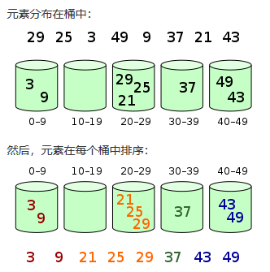
</div>

:::details 桶排序练习

- 练习题 1：桶排序进行降雨量排序

假设你在记录一个月内每天的降雨量，单位是毫米，降雨量在0到100毫米之间。编写一个程序，使用桶排序算法按照降雨量从小到大对每天的降雨量进行排序。

```cpp
// 降雨量列表
vector<int> rainfall = {56, 45, 78, 65, 23, 45, 89, 23, 56, 12, 34, 56};
// 运行输出结果
未排序的降雨量：
56 45 78 65 23 45 89 23 56 12 34 56 
排序后的降雨量：
12 23 23 34 45 45 56 56 56 65 78 89
```

```cpp
#include <iostream>
#include <vector>

using namespace std;

// 桶排序函数
void bucketSort(vector<int> &rainfall, int max_value) {
    int n = rainfall.size();
    vector<int> buckets[max_value + 1];

    // 将每个降雨量值放入对应的桶中
    for (int i = 0; i < n; ++i) {
        buckets[rainfall[i]].push_back(rainfall[i]);
    }

    // 合并所有桶中的元素到原数组
    int index = 0;
    for (int i = 0; i <= max_value; ++i) {
        for (int j = 0; j < buckets[i].size(); ++j) {
            rainfall[index++] = buckets[i][j];
        }
    }
}

int main() {
    vector<int> rainfall = {56, 45, 78, 65, 23, 45, 89, 23, 56, 12, 34, 56};
    int max_value = 100;

    cout << "未排序的降雨量：" << endl;
    for (int amount : rainfall) {
        cout << amount << " ";
    }
    cout << endl;

    bucketSort(rainfall, max_value);

    cout << "排序后的降雨量：" << endl;
    for (int amount : rainfall) {
        cout << amount << " ";
    }
    cout << endl;

    return 0;
}
```

- 练习题 2：桶排序进行商品价格排序

假设你在管理一个商店的商品价格列表，价格范围在0到500元之间。编写一个程序，使用桶排序算法按照价格从低到高对商品价格进行排序。

```cpp
// 商品价格列表
vector<int> prices = {250, 100, 450, 200, 350, 150, 500, 300, 50, 400};
// 运行输出结果
未排序的商品价格：
250 100 450 200 350 150 500 300 50 400 
排序后的商品价格：
50 100 150 200 250 300 350 400 450 500
```

```cpp
#include <iostream>
#include <vector>

using namespace std;

// 桶排序函数
void bucketSort(vector<int> &prices, int max_value) {
    int n = prices.size();
    vector<int> buckets[max_value + 1];

    // 将每个价格值放入对应的桶中
    for (int i = 0; i < n; ++i) {
        buckets[prices[i]].push_back(prices[i]);
    }

    // 合并所有桶中的元素到原数组
    int index = 0;
    for (int i = 0; i <= max_value; ++i) {
        for (int j = 0; j < buckets[i].size(); ++j) {
            prices[index++] = buckets[i][j];
        }
    }
}

int main() {
    vector<int> prices = {250, 100, 450, 200, 350, 150, 500, 300, 50, 400};
    int max_value = 500;

    cout << "未排序的商品价格：" << endl;
    for (int price : prices) {
        cout << price << " ";
    }
    cout << endl;

    bucketSort(prices, max_value);

    cout << "排序后的商品价格：" << endl;
    for (int price : prices) {
        cout << price << " ";
    }
    cout << endl;

    return 0;
}
```
:::

