## 图的基本概念

**图（Graph）**是一种非线性数据结构，由**顶点（vertex）**和**边（edge）**组成。图 $G$ 可以抽象地表示为顶点集合 $V$ 和边集合 $E$ 的组合。通常情况下，图的数据结构会表示为 $G = \{ V, E \}$。

示例：一个包含 5 个顶点和 7 条边的图。

<div class="my-img text-center">
    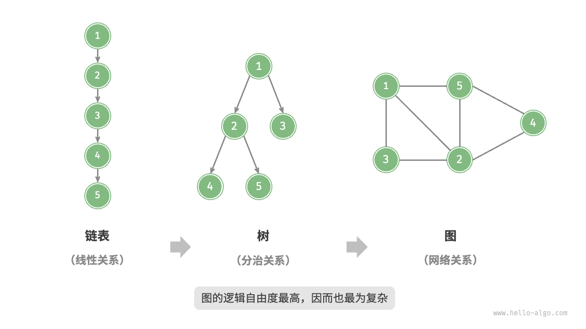
</div>

$$ 
\begin{aligned} 
V & = \{ 1, 2, 3, 4, 5 \} \\
E & = \{ (1,2), (1,3), (1,5), (2,3), (2,4), (2,5), (4,5) \} \\
G & = \{ V, E \} \\
\end{aligned} 
$$

在图数据结构中，**顶点**可以看作节点，**边**则是连接这些节点的引用（指针）。图是一种从链表和树数据结构扩展而来的更复杂的结构。

**图、链表、树之间的关系**如图 1 所示：

- **链表**：线性结构。
- **树**：分层结构。
- **图**：网络结构，拥有更高的自由度和复杂性。

## 图的类型与术语

### 1. 按边的方向性分类

- **无向图（Undirected Graph）**：边表示顶点之间的“双向”连接。比如社交媒体中的好友关系。
- **有向图（Directed Graph）**：边具有方向性，$A \rightarrow B$ 和 $A \leftarrow B$ 表示两个独立的方向。比如社交媒体中的关注与被关注关系。

**有向图与无向图**如图 2 所示。

<div class="my-img text-center">
    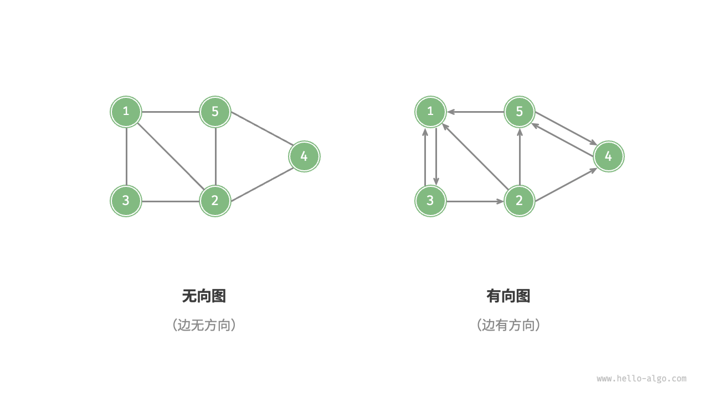
</div>


### 2. 按顶点的连通性分类

- **连通图（Connected Graph）**：从某个顶点出发可以到达其他所有顶点。
- **非连通图（Disconnected Graph）**：存在至少一个顶点无法从其他顶点到达。

**连通图与非连通图**如图 3 所示。

<div class="my-img text-center">
    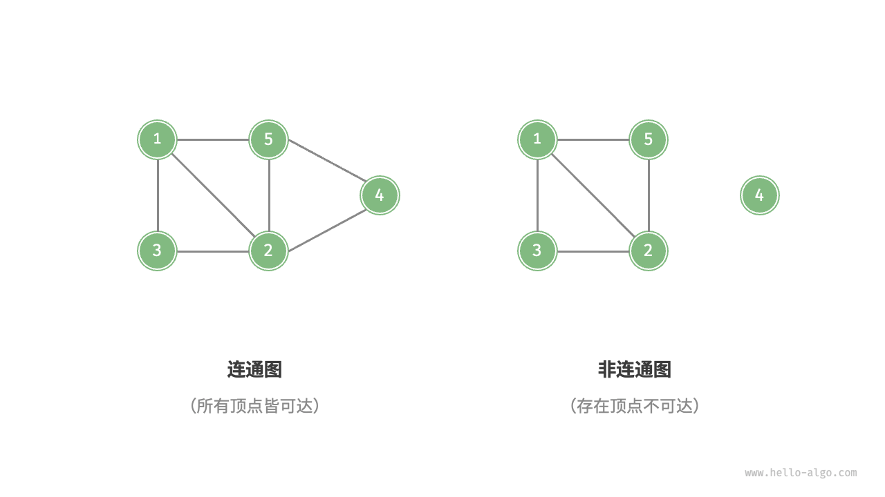
</div>


### 3. 按边的权重分类

- **有权图（Weighted Graph）**：边带有权重，表示不同的关系强度或距离。比如在游戏中的玩家亲密度。
- **无权图（Unweighted Graph）**：边不带权重。

**有权图与无权图**如图 4 所示。

<div class="my-img text-center">
    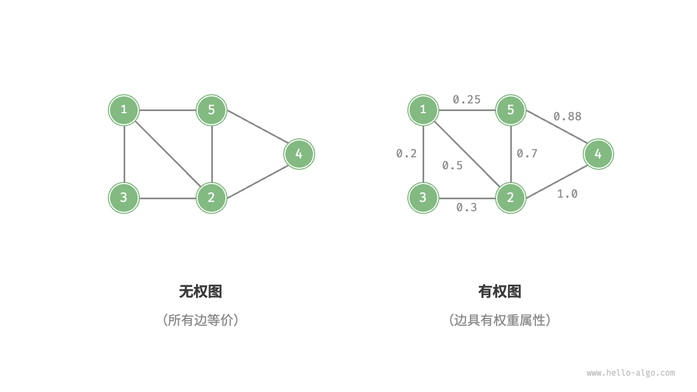
</div>

## 常用术语

- **邻接（Adjacency）**：两个顶点之间有边相连时，称这两个顶点为邻接。在图 4 中，顶点 1 的邻接顶点为 2、3、5。
- **路径（Path）**：从顶点 A 到顶点 B 经过的边序列。例如在图 4 中，边序列 1-5-2-4 是从顶点 1 到顶点 4 的一条路径。
- **度（Degree）**：顶点拥有的边数。在有向图中，**入度（In-Degree）**表示指向该顶点的边数，**出度（Out-Degree）**表示从该顶点出发的边数。

## 图的表示方法

### 1. 邻接矩阵（Adjacency Matrix）

邻接矩阵使用一个 $n \times n$ 的矩阵表示图，其中 $n$ 是顶点数量。矩阵的行和列对应于顶点，矩阵元素表示顶点之间的边，用 1 表示有边，0 表示无边。

<div class="my-img text-center">
    
</div>


**邻接矩阵的特性：**

- 顶点不能与自身相连，因此主对角线元素没有意义。
- 对于无向图，矩阵关于主对角线对称。
- 可以通过将矩阵元素替换为权重表示有权图。

邻接矩阵适合快速访问边（时间复杂度 $O(1)$），但空间复杂度为 $O(n^2)$，内存占用较多。


### 2. 邻接表（Adjacency List）

邻接表使用多个链表表示图，每个链表对应一个顶点，链表中的节点表示与该顶点相连的其他顶点。

<div class="my-img text-center">
    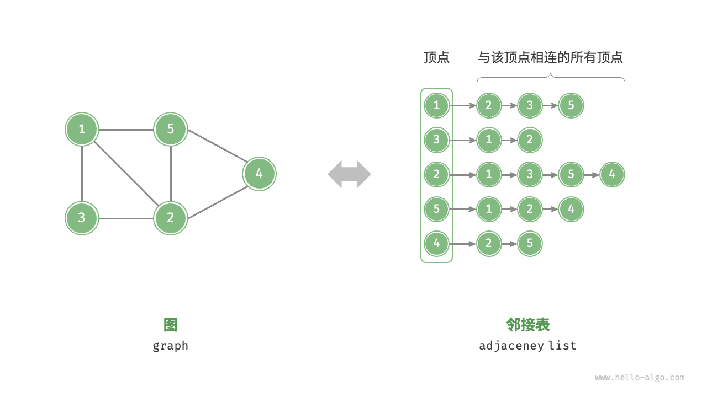
</div>

**邻接表的特点：**

- 只存储实际存在的边，适合稀疏图（边的数量远小于 $n^2$ ）。
- 查找边的时间复杂度为 $O(n)$，可以通过数据结构优化提高效率（如 AVL 树、红黑树、哈希表等）。

## 图的常见应用

图广泛应用于建模各种现实系统，以下是常见的图应用及对应的计算问题：

| 现实系统    | 顶点      | 边              | 图计算问题         |
| ----------- | --------- | --------------- | ------------------ |
| 社交网络    | 用户      | 好友关系        | 潜在好友推荐       |
| 地铁线路    | 站点      | 站点间的连通性  | 最短路线推荐       |
| 太阳系      | 星体      | 星体间的万有引力 | 行星轨道计算       |

## 图的基础操作

图的基础操作可分为对“边”的操作和对“顶点”的操作。在“邻接矩阵”和“邻接表”两种表示方法下，实现方式有所不同。

### 基于邻接矩阵的实现

给定一个顶点数量为 $n$ 的无向图，则各种操作的实现方式如下图所示。

- **添加或删除边**：直接在邻接矩阵中修改指定的边即可，使用 $O(1)$ 时间。而由于是无向图，因此需要同时更新两个方向的边。
- **添加顶点**：在邻接矩阵的尾部添加一行一列，并全部填 $0$ 即可，使用 $O(n)$ 时间。
- **删除顶点**：在邻接矩阵中删除一行一列。当删除首行首列时达到最差情况，需要将 $(n-1)^2$ 个元素“向左上移动”，从而使用 $O(n^2)$ 时间。
- **初始化**：传入 $n$ 个顶点，初始化长度为 $n$ 的顶点列表 `vertices` ，使用 $O(n)$ 时间；初始化 $n \times n$ 大小的邻接矩阵 `adjMat` ，使用 $O(n^2)$ 时间。

1. "初始化邻接矩阵"  

	<div class="my-img text-center">
    	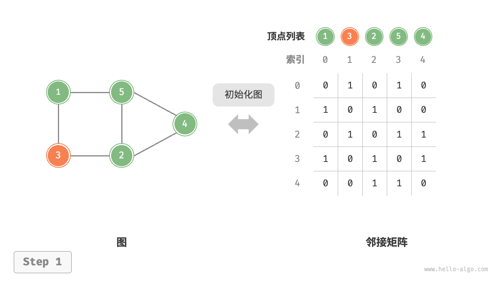
	</div>

2. "添加边"

	<div class="my-img text-center">
		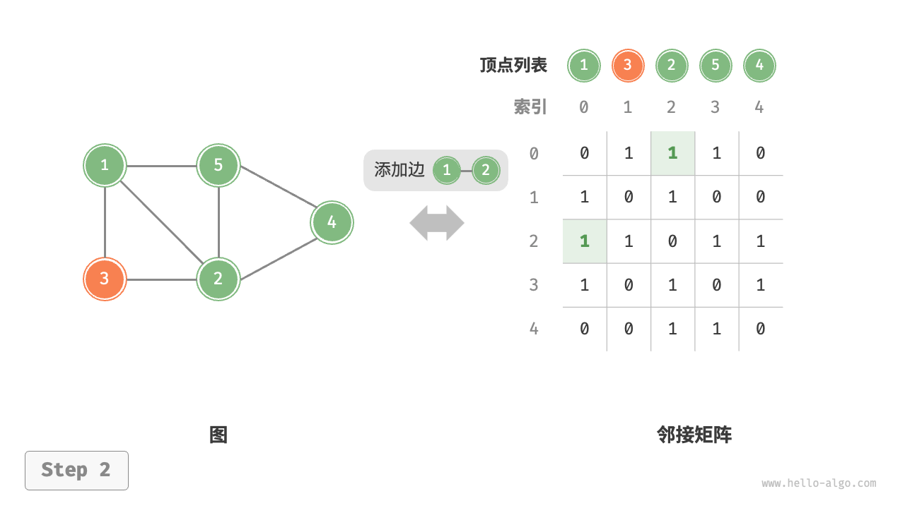
	</div>

3. "删除边"

	<div class="my-img text-center">
		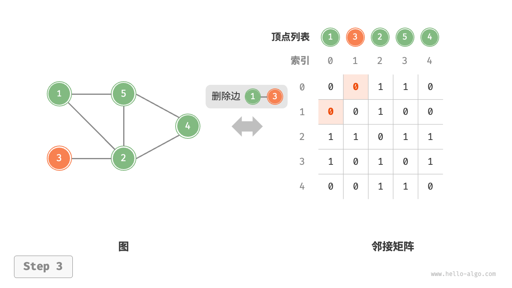
	</div>

4. "添加顶点"

	<div class="my-img text-center">
		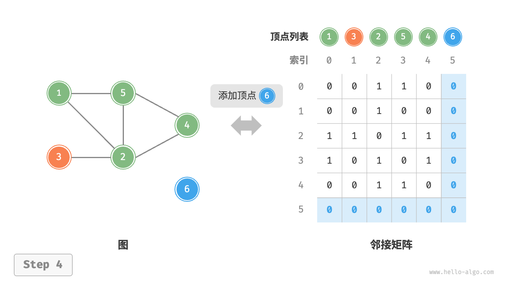
	</div>

5. "删除顶点"

	<div class="my-img text-center">
		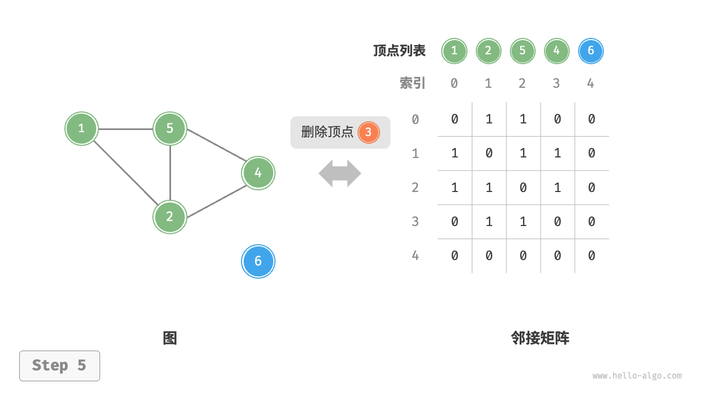
	</div>

### 基于邻接表的实现

设无向图的顶点总数为 $n$、边总数为 $m$ ，则可根据下图所示的方法实现各种操作。

- **添加边**：在顶点对应链表的末尾添加边即可，使用 $O(1)$ 时间。因为是无向图，所以需要同时添加两个方向的边。
- **删除边**：在顶点对应链表中查找并删除指定边，使用 $O(m)$ 时间。在无向图中，需要同时删除两个方向的边。
- **添加顶点**：在邻接表中添加一个链表，并将新增顶点作为链表头节点，使用 $O(1)$ 时间。
- **删除顶点**：需遍历整个邻接表，删除包含指定顶点的所有边，使用 $O(n + m)$ 时间。
- **初始化**：在邻接表中创建 $n$ 个顶点和 $2m$ 条边，使用 $O(n + m)$ 时间。

1. "初始化邻接表"

	<div class="my-img text-center">
		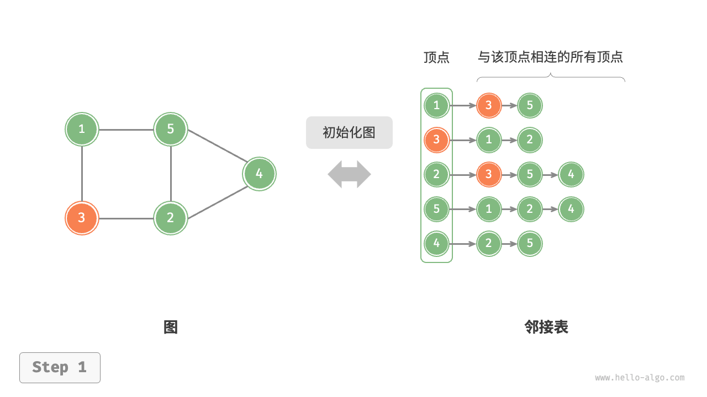
	</div>

2. "添加边"

	<div class="my-img text-center">
		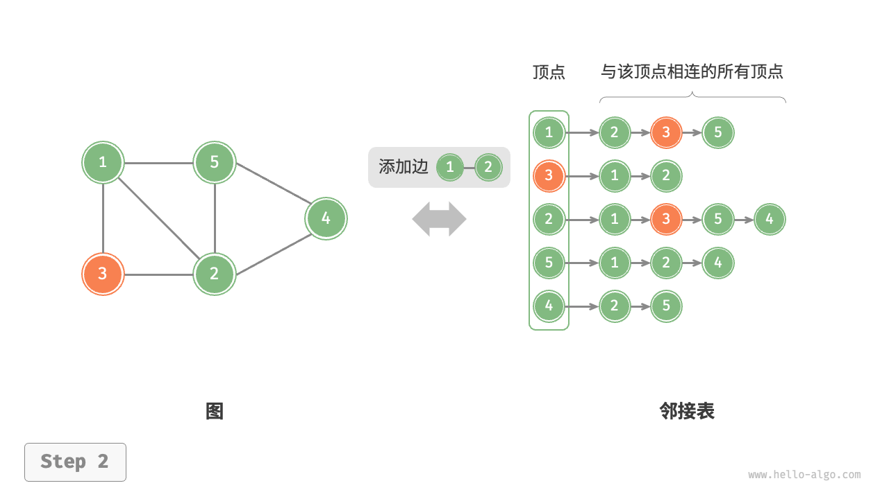
	</div>

3. "删除边"

	<div class="my-img text-center">
		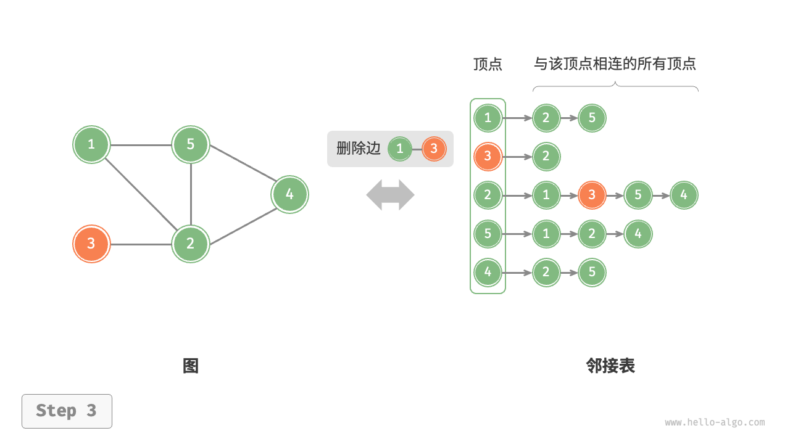
	</div>

4. "添加顶点"

	<div class="my-img text-center">
		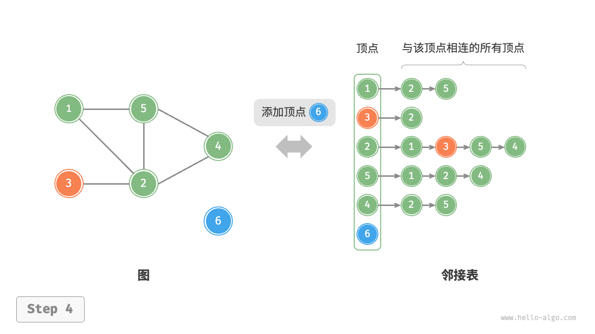
	</div>

5. "删除顶点"

	<div class="my-img text-center">
		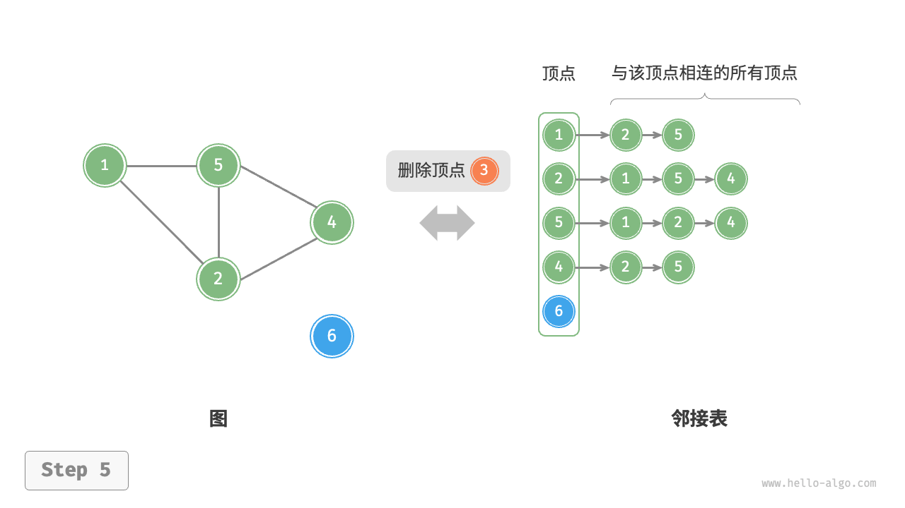
	</div>

### 效率对比

设图中共有 $n$ 个顶点和 $m$ 条边，下表对比了邻接矩阵和邻接表的时间效率和空间效率。

<p align="center"> 表 &nbsp; 邻接矩阵与邻接表对比 </p>

|              | 邻接矩阵 | 邻接表（链表） | 邻接表（哈希表） |
| ------------ | -------- | -------------- | ---------------- |
| 判断是否邻接 | $O(1)$   | $O(m)$         | $O(1)$           |
| 添加边       | $O(1)$   | $O(1)$         | $O(1)$           |
| 删除边       | $O(1)$   | $O(m)$         | $O(1)$           |
| 添加顶点     | $O(n)$   | $O(1)$         | $O(1)$           |
| 删除顶点     | $O(n^2)$ | $O(n + m)$     | $O(n)$           |
| 内存空间占用 | $O(n^2)$ | $O(n + m)$     | $O(n + m)$       |

观察上表，似乎邻接表（哈希表）的时间效率与空间效率最优。但实际上，在邻接矩阵中操作边的效率更高，只需一次数组访问或赋值操作即可。综合来看，邻接矩阵体现了“以空间换时间”的原则，而邻接表体现了“以时间换空间”的原则。

## 图的遍历

树代表的是“一对多”的关系，而图则具有更高的自由度，可以表示任意的“多对多”关系。因此，我们可以把树看作图的一种特例。显然，**树的遍历操作也是图的遍历操作的一种特例**。

图和树都需要应用搜索算法来实现遍历操作。图的遍历方式也可分为两种：<u>广度优先遍历</u>和<u>深度优先遍历</u>。

### 广度优先遍历

**广度优先遍历是一种由近及远的遍历方式，从某个节点出发，始终优先访问距离最近的顶点，并一层层向外扩张**。如下图所示，从左上角顶点出发，首先遍历该顶点的所有邻接顶点，然后遍历下一个顶点的所有邻接顶点，以此类推，直至所有顶点访问完毕。

<div class="my-img text-center">
	
</div>

#### 算法实现

BFS 通常借助队列来实现，代码如下所示。队列具有“先入先出”的性质，这与 BFS 的“由近及远”的思想异曲同工。

1. 将遍历起始顶点 `startVet` 加入队列，并开启循环。
2. 在循环的每轮迭代中，弹出队首顶点并记录访问，然后将该顶点的所有邻接顶点加入到队列尾部。
3. 循环步骤 `2.` ，直到所有顶点被访问完毕后结束。

为了防止重复遍历顶点，我们需要借助一个哈希集合 `visited` 来记录哪些节点已被访问。

>哈希集合可以看作一个只存储 `key` 而不存储 `value` 的哈希表，它可以在 $O(1)$ 时间复杂度下进行 `key` 的增删查改操作。根据 `key` 的唯一性，哈希集合通常用于数据去重等场景。

```cpp
#include <iostream>
#include <vector>
#include <queue>
#include <unordered_set> // 哈希集合

using namespace std;

// 结构体表示图的顶点
struct Vertex {
    vector<int> neighbors; // 邻接顶点
};

int main() {
    // 创建一个包含 6 个顶点的图
    int numVertices = 6;
    vector<Vertex> graph(numVertices);

    // 添加边 (无向图)
    graph[0].neighbors.push_back(1);
    graph[0].neighbors.push_back(2);
    graph[1].neighbors.push_back(0);
    graph[1].neighbors.push_back(3);
    graph[2].neighbors.push_back(0);
    graph[2].neighbors.push_back(3);
    graph[3].neighbors.push_back(1);
    graph[3].neighbors.push_back(2);
    graph[3].neighbors.push_back(4);
    graph[4].neighbors.push_back(3);
    graph[4].neighbors.push_back(5);
    graph[5].neighbors.push_back(4);

    // 广度优先遍历 (从顶点 0 开始)
    queue<int> q;
    unordered_set<int> visited;

    // 将起始顶点加入队列并标记为已访问
    q.push(0);
    visited.insert(0);

    cout << "广度优先遍历的顺序如下：" << endl;

    while (!q.empty()) {
        // 弹出队首顶点并访问
        int currentVertex = q.front();
        q.pop();
        cout << "访问顶点: " << currentVertex << endl;

        // 将所有未访问的邻接顶点加入队列
        for (int neighbor : graph[currentVertex].neighbors) {
            if (visited.find(neighbor) == visited.end()) {
                q.push(neighbor);
                visited.insert(neighbor);
            }
        }
    }

    return 0;
}
```

#### 代码解析：
1. **结构体 `Vertex`**：用于存储每个顶点的邻接顶点列表（使用 `vector<int>`）。
2. **邻接表**：使用 `vector<Vertex>` 存储图的所有顶点，其中每个 `Vertex` 的 `neighbors` 保存与该顶点直接相连的其他顶点。
3. **手动添加边**：直接操作 `graph` 数组来添加边。
4. **BFS 实现**：与之前的类版本类似，通过队列和哈希集合来实现广度优先搜索，遍历从顶点 `0` 开始。

在广度优先遍历 (BFS) 中，`unordered_set` 的作用是记录已经访问过的顶点，以避免重复访问同一个顶点。因为在图中，可能存在环或多个顶点指向同一个顶点。如果不进行标记，BFS 可能会陷入无限循环，或者多次访问同一个顶点，导致错误的遍历顺序。

- 举例说明：
假设有以下无向图：

```
  0
 / \
1---2
 \ /
  3
```

从顶点 `0` 开始遍历，若没有记录已访问的顶点，BFS 将会如下操作：

1. 从 `0` 开始访问，将 `0` 的邻接顶点 `1` 和 `2` 加入队列。
2. 访问 `1`，然后将 `1` 的邻接顶点 `0` 和 `3` 加入队列。注意，`0` 已经被访问过，但此时它会被再次加入队列。
3. 访问 `2`，将 `2` 的邻接顶点 `0` 和 `3` 加入队列。同样，`0` 和 `3` 可能会被重复访问。
4. 由于没有标记顶点已经访问过，遍历会继续处理这些重复的顶点，导致 BFS 不能正确结束或产生错误的遍历顺序。

因此，为了防止这种情况，需要一个数据结构来记录哪些顶点已经被访问过。`unordered_set` 由于其查找、插入的时间复杂度是 $O(1)$，是非常合适的选择。每次访问一个顶点后，将该顶点加入 `unordered_set`，之后如果遇到已经存在于 `unordered_set` 中的顶点，就不再进行访问和处理。

- 示例解释：
```cpp
unordered_set<int> visited;
```

- `visited` 是一个哈希集合，用来存储已经访问过的顶点。
- 在访问一个顶点后，将其加入 `visited`：
  ```cpp
  visited.insert(currentVertex);
  ```
- 在访问邻接顶点之前，检查它是否已经被访问过：
  ```cpp
  if (visited.find(neighbor) == visited.end()) {
      q.push(neighbor);
      visited.insert(neighbor);
  }
  ```
  这里 `visited.find(neighbor)` 的返回值表示是否找到该顶点，如果没有找到，就将其加入队列，并标记为已访问。

这样，就可以防止 BFS 重复访问已经访问过的顶点，保证算法的正确性和效率。

::: details 图的广度优先遍历步骤

<div class="my-img text-center">
	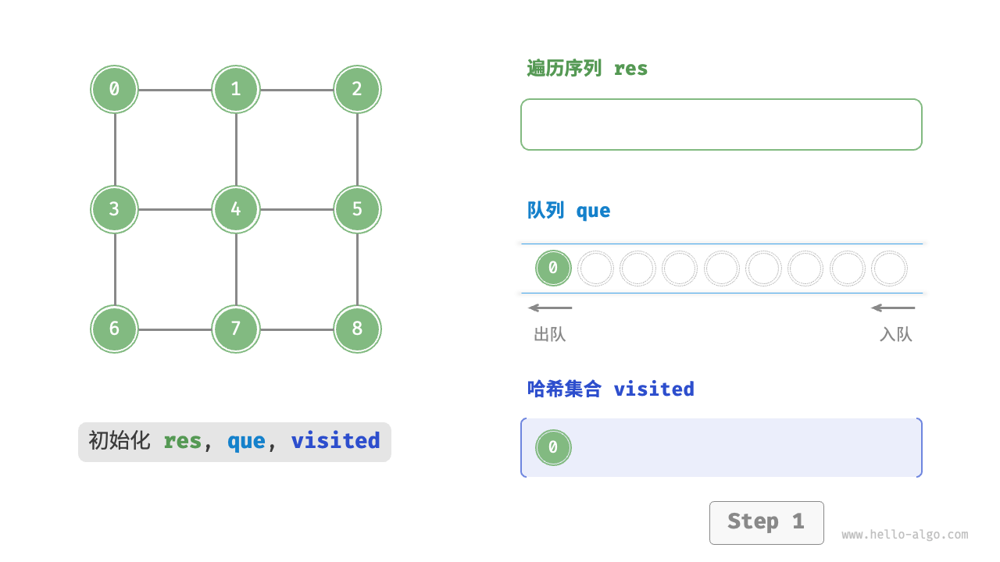
</div>

<div class="my-img text-center">
	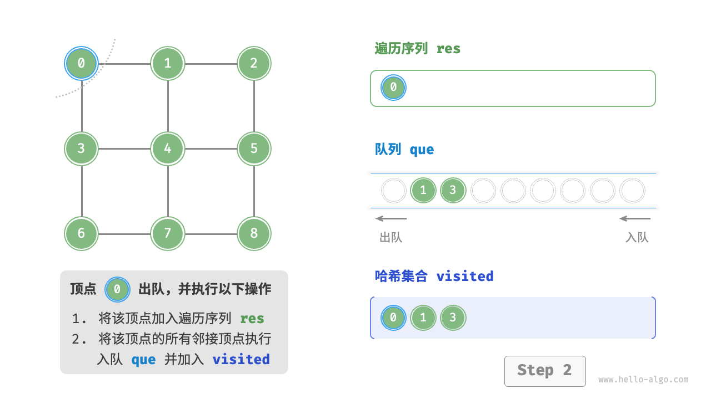
</div>

<div class="my-img text-center">
	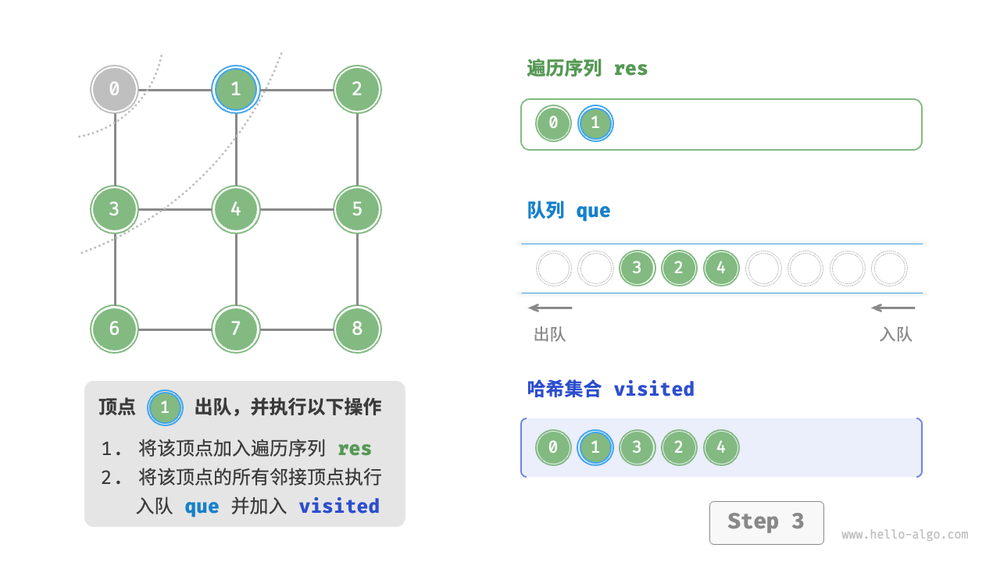
</div>

<div class="my-img text-center">
	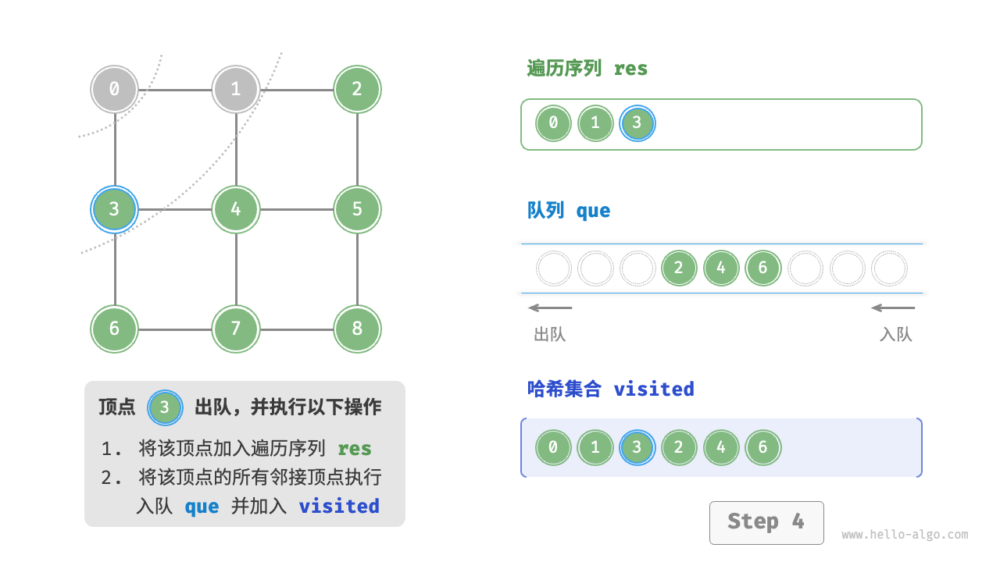
</div>

<div class="my-img text-center">
	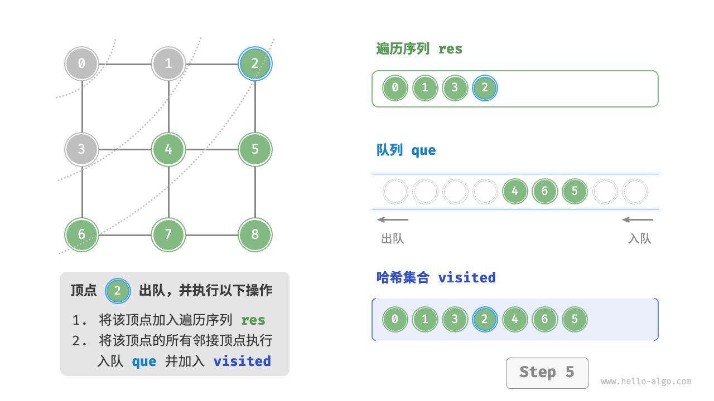
</div>

<div class="my-img text-center">
	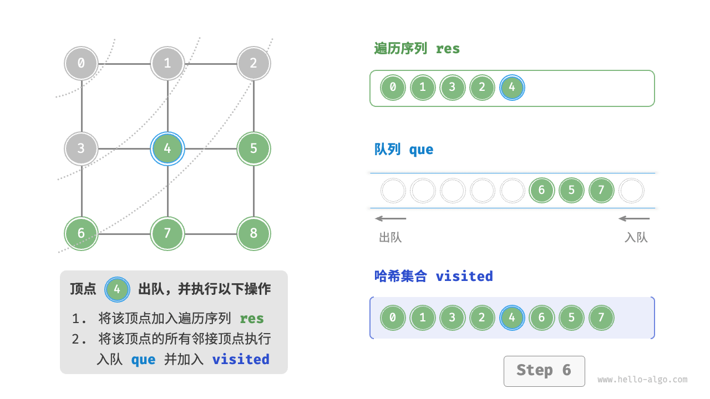
</div>

<div class="my-img text-center">
	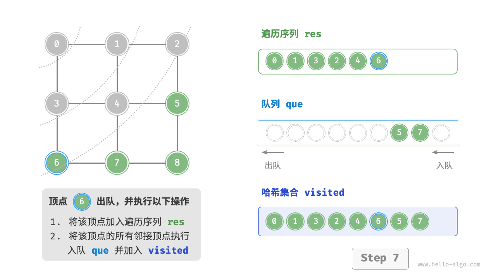
</div>

<div class="my-img text-center">
	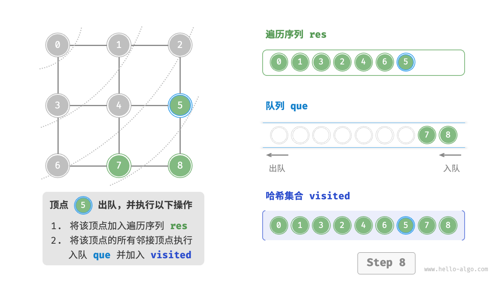
</div>

<div class="my-img text-center">
	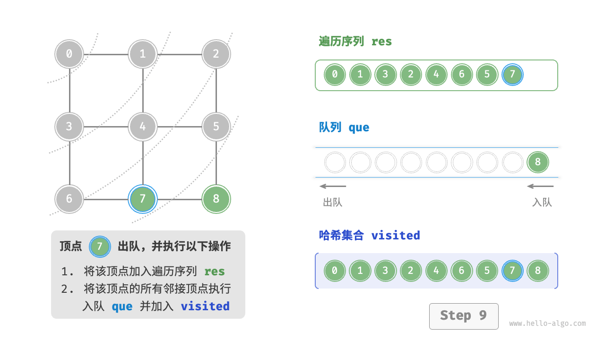
</div>

<div class="my-img text-center">
	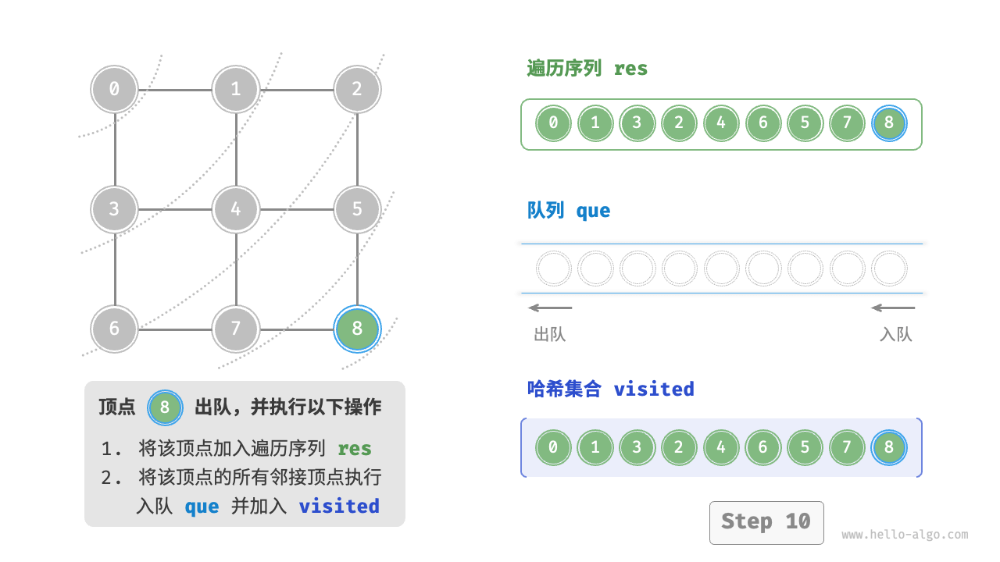
</div>

<div class="my-img text-center">
	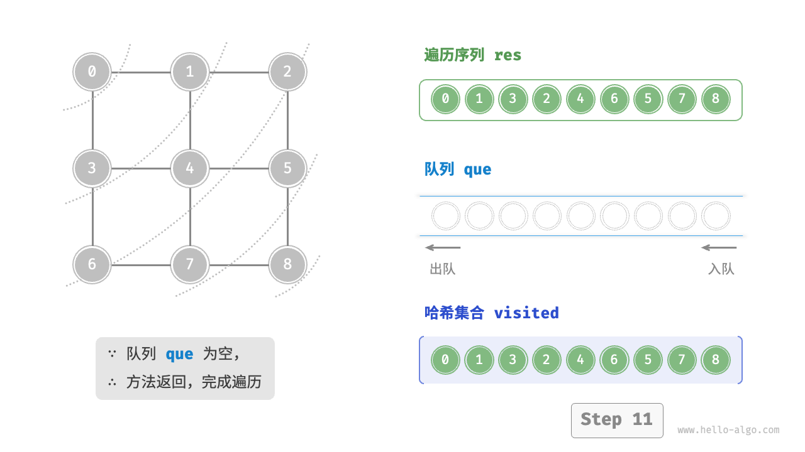
</div>

:::

> question "广度优先遍历的序列是否唯一？"

>    不唯一。广度优先遍历只要求按“由近及远”的顺序遍历，**而多个相同距离的顶点的遍历顺序允许被任意打乱**。以上图为例，顶点 $1$、$3$ 的访问顺序可以交换，顶点 $2$、$4$、$6$ 的访问顺序也可以任意交换。

#### 复杂度分析

**时间复杂度**：所有顶点都会入队并出队一次，使用 $O(|V|)$ 时间；在遍历邻接顶点的过程中，由于是无向图，因此所有边都会被访问 $2$ 次，使用 $O(2|E|)$ 时间；总体使用 $O(|V| + |E|)$ 时间。

**空间复杂度**：列表 `res` ，哈希集合 `visited` ，队列 `que` 中的顶点数量最多为 $|V|$ ，使用 $O(|V|)$ 空间。

### 深度优先遍历

**深度优先遍历是一种优先走到底、无路可走再回头的遍历方式**。如下图所示，从左上角顶点出发，访问当前顶点的某个邻接顶点，直到走到尽头时返回，再继续走到尽头并返回，以此类推，直至所有顶点遍历完成。

<div class="my-img text-center">
	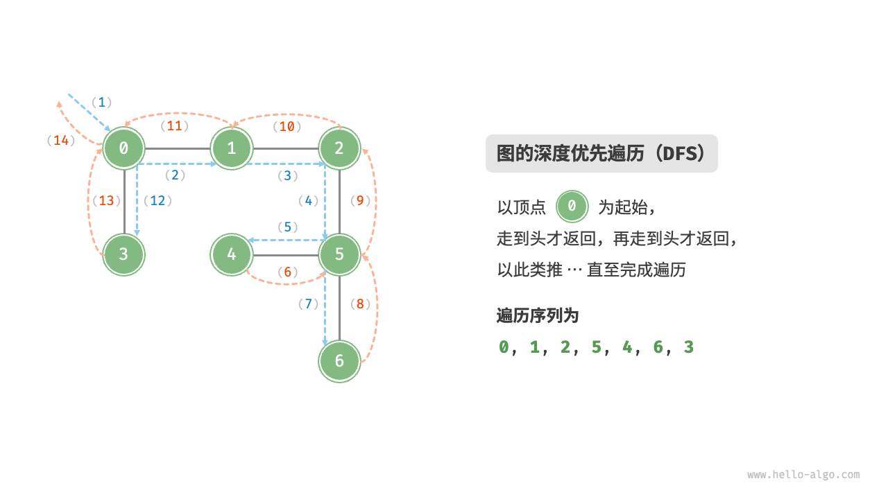
</div>

#### 算法实现

这种“走到尽头再返回”的算法范式通常基于递归来实现。与广度优先遍历类似，在深度优先遍历中，我们也需要借助一个哈希集合 `visited` 来记录已被访问的顶点，以避免重复访问顶点。

```cpp
#include <iostream>
#include <vector>
#include <unordered_set>

using namespace std;

// 结构体表示图的顶点
struct Vertex {
    vector<int> neighbors; // 邻接顶点
};

// 深度优先遍历的递归实现
void DFS(int currentVertex, const vector<Vertex>& graph, unordered_set<int>& visited) {
    // 标记当前顶点为已访问
    visited.insert(currentVertex);
    cout << "访问顶点: " << currentVertex << endl;

    // 递归访问所有未访问的邻接顶点
    for (int neighbor : graph[currentVertex].neighbors) {
        if (visited.find(neighbor) == visited.end()) {
            DFS(neighbor, graph, visited);
        }
    }
}

int main() {
    // 创建一个包含 6 个顶点的图
    int numVertices = 6;
    vector<Vertex> graph(numVertices);

    // 添加边 (无向图)
    graph[0].neighbors.push_back(1);
    graph[0].neighbors.push_back(2);
    graph[1].neighbors.push_back(0);
    graph[1].neighbors.push_back(3);
    graph[2].neighbors.push_back(0);
    graph[2].neighbors.push_back(3);
    graph[3].neighbors.push_back(1);
    graph[3].neighbors.push_back(2);
    graph[3].neighbors.push_back(4);
    graph[4].neighbors.push_back(3);
    graph[4].neighbors.push_back(5);
    graph[5].neighbors.push_back(4);

    // 深度优先遍历 (从顶点 0 开始)
    unordered_set<int> visited;
    cout << "深度优先遍历的顺序如下：" << endl;
    DFS(0, graph, visited);

    return 0;
}
```

#### 代码解析：
1. **DFS 函数**：递归地遍历图，从 `currentVertex` 顶点开始，首先标记该顶点为已访问，之后对其所有未访问的邻接顶点递归调用 `DFS`。
2. **visited 集合**：与 BFS 类似，`unordered_set` 用于记录已经访问的顶点，避免重复访问。
3. **邻接表**：使用 `vector<Vertex>` 存储图的所有顶点及其邻接顶点列表。
4. **主函数 `main`**：构建图并调用 `DFS` 函数，从顶点 `0` 开始进行深度优先遍历。

#### 递归实现：
在这个递归实现中，深度优先遍历会尽可能深入到图的某条路径的尽头，然后回溯到上一个节点，继续尝试其他路径，直到所有顶点都被访问过。这种“先深入，再回溯”的思想是 DFS 的核心。

深度优先遍历的算法流程如下图所示。

- **直虚线代表向下递推**，表示开启了一个新的递归方法来访问新顶点。
- **曲虚线代表向上回溯**，表示此递归方法已经返回，回溯到了开启此方法的位置。

为了加深理解，建议将下图与代码结合起来，在脑中模拟（或者用笔画下来）整个 DFS 过程，包括每个递归方法何时开启、何时返回。

::: details 图的深度优先遍历步骤

<div class="my-img text-center">
	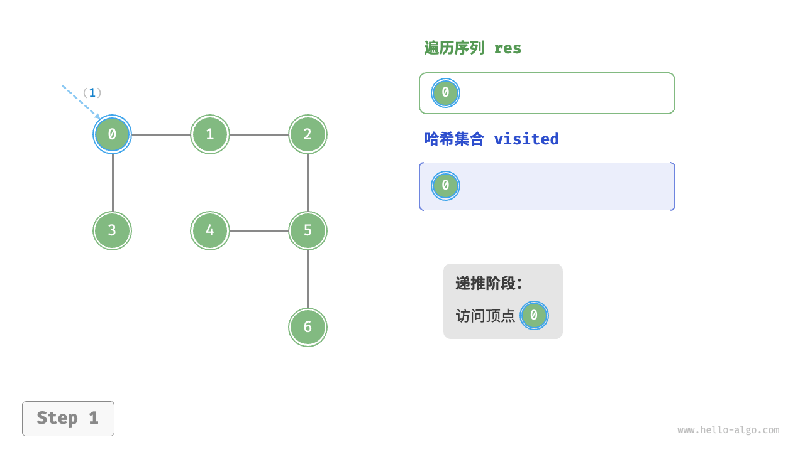
</div>

<div class="my-img text-center">
	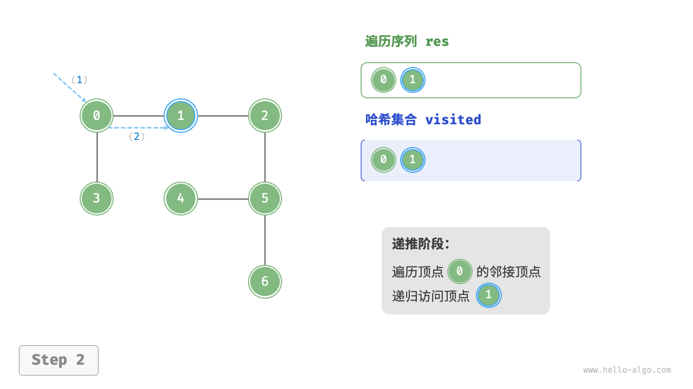
</div>

<div class="my-img text-center">
	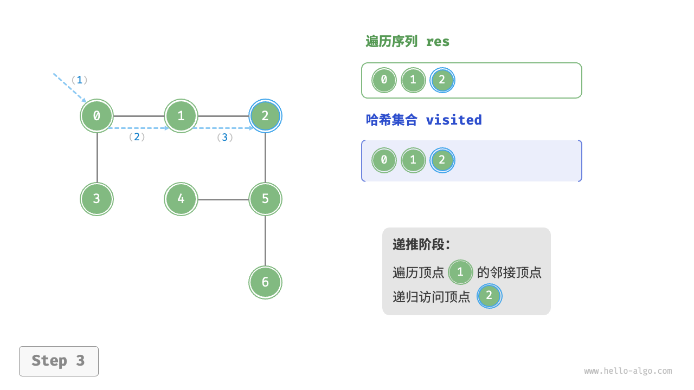
</div>

<div class="my-img text-center">
	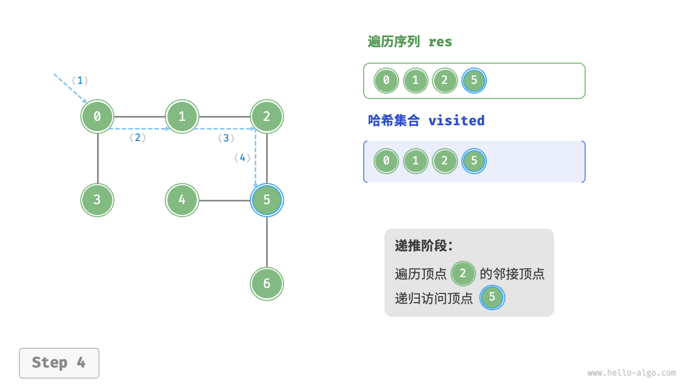
</div>

<div class="my-img text-center">
	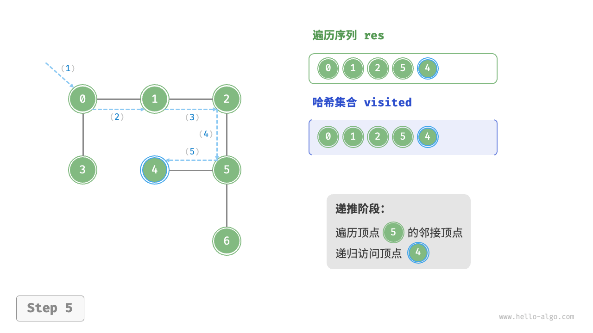
</div>

<div class="my-img text-center">
	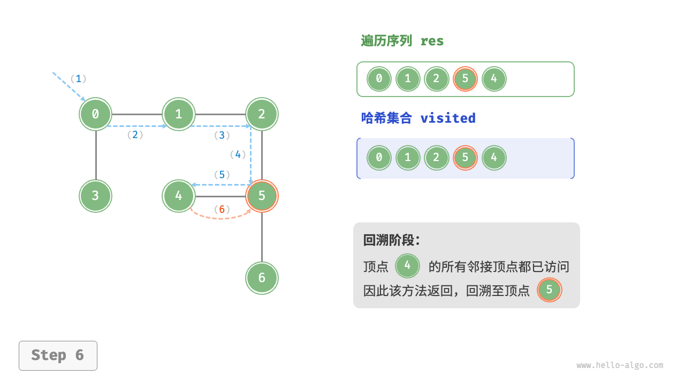
</div>

<div class="my-img text-center">
	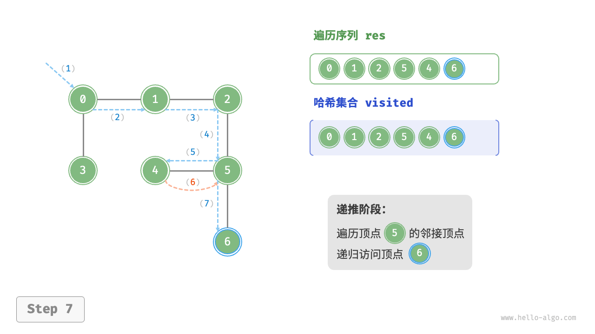
</div>

<div class="my-img text-center">
	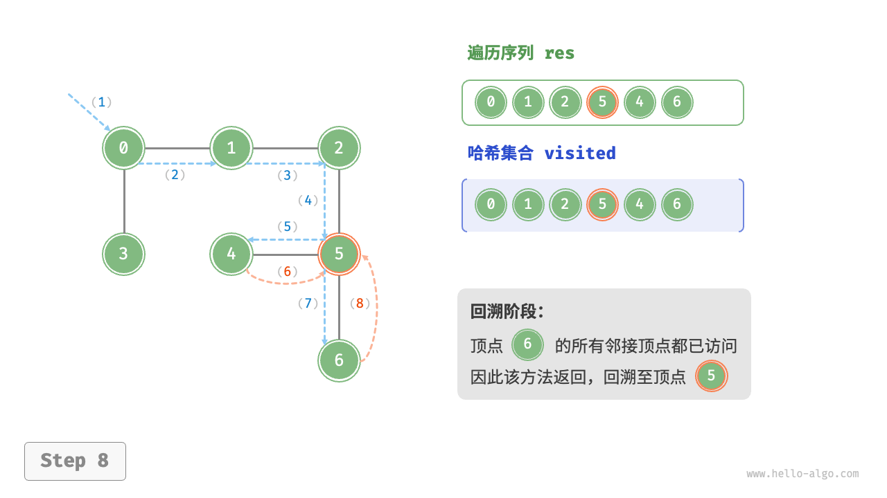
</div>

<div class="my-img text-center">
	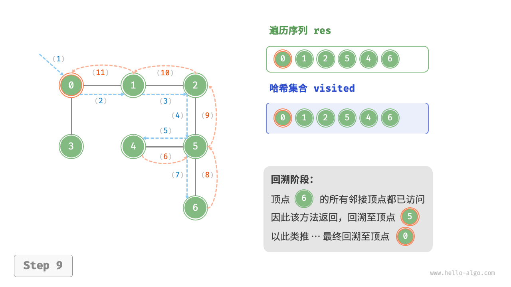
</div>

<div class="my-img text-center">
	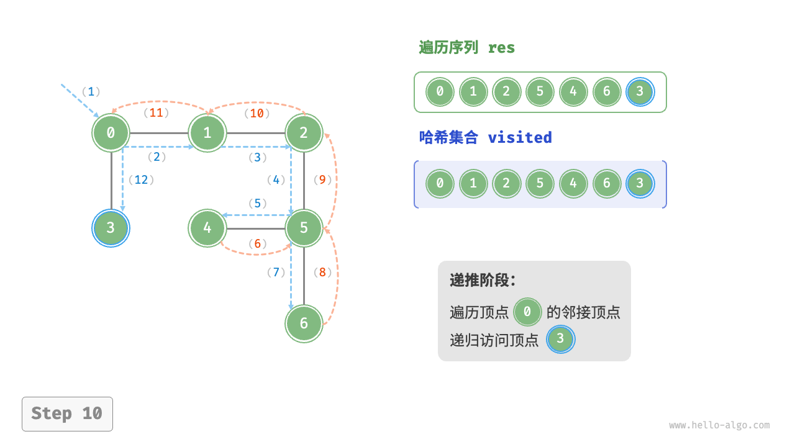
</div>

<div class="my-img text-center">
	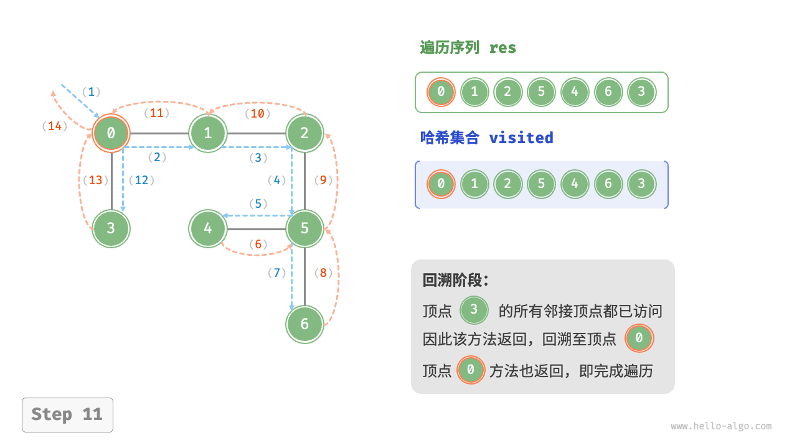
</div>

:::

> question "深度优先遍历的序列是否唯一？"

>    与广度优先遍历类似，深度优先遍历序列的顺序也不是唯一的。给定某顶点，先往哪个方向探索都可以，即邻接顶点的顺序可以任意打乱，都是深度优先遍历。

以树的遍历为例，“根 $\rightarrow$ 左 $\rightarrow$ 右”“左 $\rightarrow$ 根 $\rightarrow$ 右”“左 $\rightarrow$ 右 $\rightarrow$ 根”分别对应前序、中序、后序遍历，它们展示了三种遍历优先级，然而这三者都属于深度优先遍历。

#### 复杂度分析

**时间复杂度**：所有顶点都会被访问 $1$ 次，使用 $O(|V|)$ 时间；所有边都会被访问 $2$ 次，使用 $O(2|E|)$ 时间；总体使用 $O(|V| + |E|)$ 时间。

**空间复杂度**：列表 `res` ，哈希集合 `visited` 顶点数量最多为 $|V|$ ，递归深度最大为 $|V|$ ，因此使用 $O(|V|)$ 空间。

## 拓扑排序（Topological Sorting）

拓扑排序是一种针对**有向无环图（DAG）**的顶点排序方法。在这种排序中，如果图中存在一条从顶点 $u$ 到顶点 $v$ 的路径，那么在排序结果中顶点 $u$ 一定出现在顶点 $v$ 的前面。

### 1. 示例

<div class="my-img text-center">
    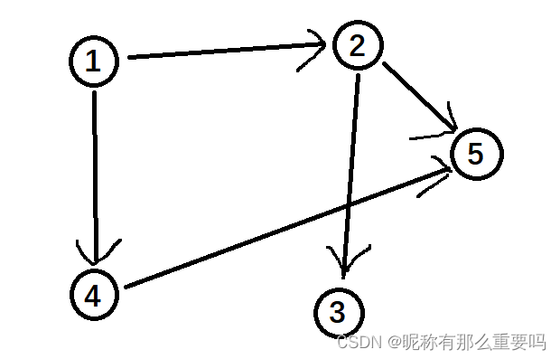
</div>

考虑一个简单的有向无环图，其中的边为 $1 \rightarrow 2$, $1 \rightarrow 4$, $2 \rightarrow 3$, $2 \rightarrow 5$ 和 $4 \rightarrow 5$。

在所有顶点的排序中，顶点 1 必须在顶点 2 和 4 的前面，顶点 2 必须在顶点 3 和 5 的前面，以此类推。

对于这个图的拓扑排序，可能的序列有：

- 1, 2, 3, 4, 5
- 1, 2, 4, 5, 3
- 1, 4, 2, 3, 5
- 1, 4, 5, 2, 3

只要满足上述条件，序列的具体顺序可以有所不同。在实际应用中，通常会按字典序从小到大输出拓扑排序结果。

### 2. 应用

拓扑排序在实际应用中非常重要，特别是在需要处理具有优先级关系或依赖关系的任务时。例如：

- **课程安排**：如果某门课程需要先修其他课程，那么这些课程和它们之间的先修关系可以用有向无环图表示。拓扑排序可以帮助我们找到一种合理的选课顺序，使得每门课程的先修要求都得到满足。
  
- **编译器设计**：在编译一个程序时，必须先编译其所依赖的模块。通过拓扑排序，可以确定一个合理的编译顺序，确保所有模块按依赖关系正确编译。

### 3. 实现方法

拓扑排序的实现主要基于图的**深度优先搜索（DFS）**或**广度优先搜索（BFS）**。这里介绍基于 BFS 实现的算法，这种方法也称为**Kahn 算法**。

- Kahn 算法步骤

1. 遍历图中的所有顶点，计算每个顶点的**入度**（即有多少条边指向该顶点）。
2. 将所有入度为 0 的顶点加入一个队列，这些顶点没有任何依赖，可以作为拓扑排序的起点。
3. 从队列中取出一个顶点，将其加入拓扑排序的结果中，然后遍历其所有邻接顶点，将这些邻接顶点的入度减 1。如果某个邻接顶点的入度变为 0，就将其加入队列。
4. 重复步骤 3，直到队列为空。如果图中还有顶点未被访问，说明图中存在环，无法进行拓扑排序。否则，拓扑排序成功。

- 示例步骤

考虑前述图的示例，蓝色数字表示每个顶点的入度。

<div class="my-img text-center">
    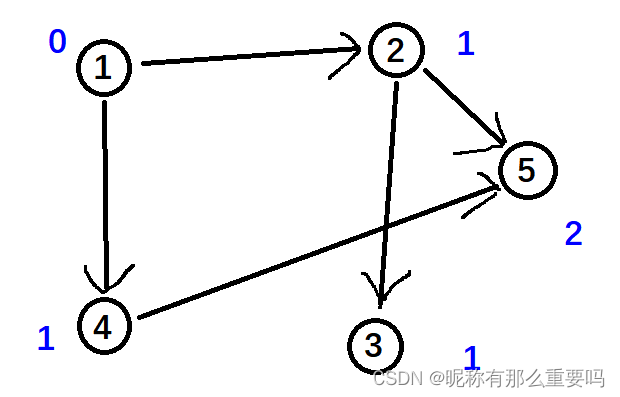
</div>

1. 将入度为 0 的 1 号顶点加入队列。
2. 取出队列中的 1 号顶点，将与其相连的 2、4 号顶点的入度减 1，并输出 1。此时，2、4 号顶点的入度变为 0，因此也加入队列。队列不为空，继续操作。
3. 取出队头的 2 号顶点，将与其相连的 3、5 号顶点的入度减 1，并输出 2。3 号顶点的入度变为 0，也加入队列。队列不为空，继续操作。
4. 取出队头的 4 号顶点，将与其相连的 5 号顶点的入度减 1，并输出 4。5 号顶点的入度变为 0，也加入队列。队列不为空，继续操作。
5. 队列中剩下 3、5 号顶点，依次输出。队列为空，程序结束。

最终输出为“1 2 3 4 5”（字典序最小）。

<div class="my-img text-center">
    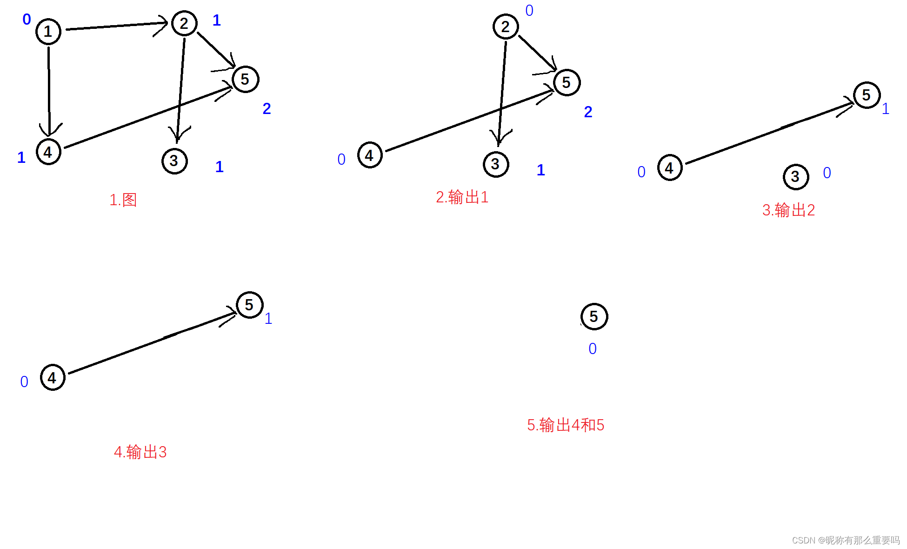
</div>

###  4. C++ 代码实现

以下是使用 BFS 实现的 C++ 代码：

```cpp
#include <iostream>
#include <queue>
#include <vector>
using namespace std;

int n; // 节点个数
int d[10005]; // 入度
vector<int> v[10005]; // vector 存图，方便找到相邻节点
int cur, ans[10005]; // 数组光标和答案数组

void topusort() // 拓扑排序函数
{
	queue<int> q; // 入度为 0 的队列
	for (int i = 1; i <= n; i++) // 将入度为 0 的节点加入队列
		if (d[i] == 0)
			q.push(i);
	while (!q.empty())
	{
		int f = q.front(); // 取队头结点
		ans[++cur] = f; // 将队头结点加入结果
		q.pop(); // 队头出队
		for (int i = 0; i < v[f].size(); i++) // 遍历与队头相邻的节点
		{
			int t = v[f][i]; // 相邻节点编号
			d[t]--; // 入度减 1
			if (d[t] == 0) // 入度为 0 加入队列
				q.push(t);
		}
	}
}

int main()
{
	// 读入图的节点和边
	scanf("%d", &n);
	for (int i = 1; i <= n; i++)
	{
		int x, y;
		cin >> x >> y; // 读入边 x -> y
		d[y]++; // 增加 y 的入度
		v[x].push_back(y); // 在 x 的邻接表中加入 y
	}
	topusort(); // 调用拓扑排序
	if (cur != n) // 如果结果中节点数不为 n，说明图中有环
		printf("图中有环，无法进行拓扑排序！！！\n");
	else
	{
		printf("拓扑排序后的序列：");
		for (int i = 1; i <= cur; i++)
			printf("%d ", ans[i]); // 输出拓扑排序结果
		puts(""); // 换行
	}
	return 0;
}
```