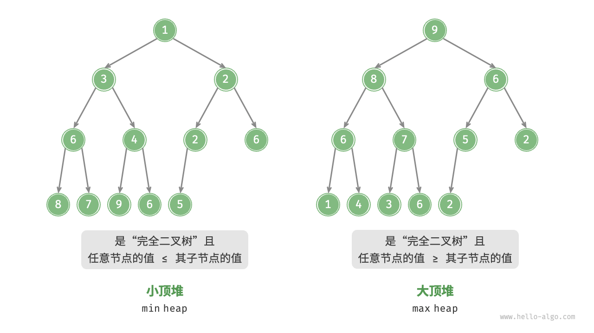
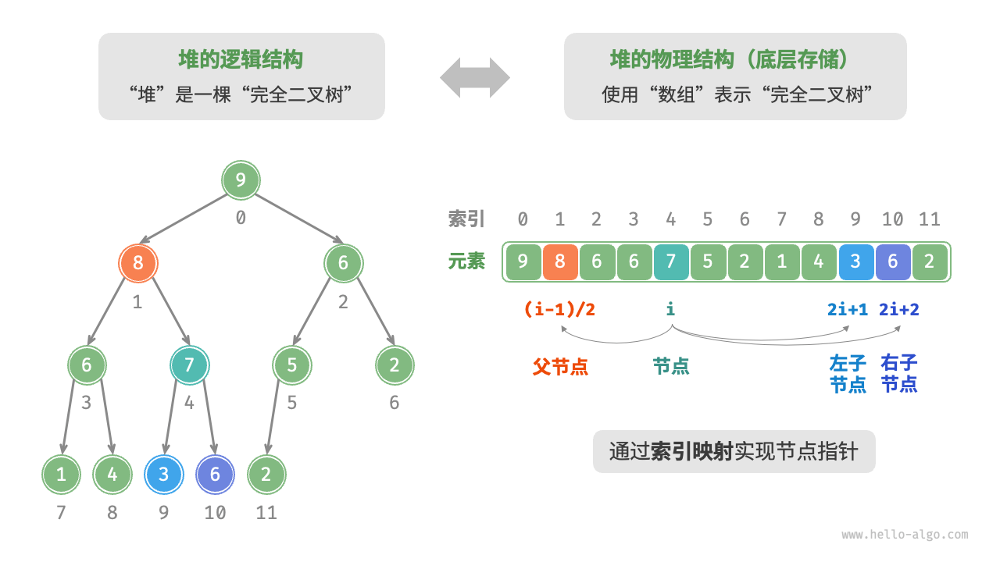

## 堆（Heap）

堆（heap）是一种满足特定条件的完全二叉树，主要分为两种类型：

- **小顶堆（min heap）**：任意节点的值 \(\leq\) 其子节点的值。
- **大顶堆（max heap）**：任意节点的值 \(\geq\) 其子节点的值。

## 小顶堆与大顶堆

<div class="my-img text-center">
    
</div>

堆作为完全二叉树的一个特例，具有以下特性：

1. 最底层节点靠左填充，其他层的节点都被填满。
2. 我们将二叉树的根节点称为“堆顶”，将底层最靠右的节点称为“堆底”。
3. 对于大顶堆（小顶堆），堆顶元素（根节点）的值是最大（最小）的。

## 1. 堆的常用操作

许多编程语言提供的是优先队列（priority queue），这是一种抽象的数据结构，定义为具有优先级排序的队列。堆通常用于实现优先队列，大顶堆相当于元素按从大到小的顺序出队的优先队列。从使用角度来看，我们可以将“优先队列”和“堆”看作等价的数据结构。因此，我们对两者不做特别区分，统一称作“堆”。

堆的常用操作见表，方法名需要根据编程语言来确定。

表 堆的操作效率

| 方法名    | 描述                        | 时间复杂度    |
| --------- | --------------------------- | ------------- |
| push()    | 元素入堆                    | \(O(\log n)\) |
| pop()     | 堆顶元素出堆                | \(O(\log n)\) |
| peek()    | 访问堆顶元素（最大/最小值） | \(O(1)\)      |
| size()    | 获取堆的元素数量            | \(O(1)\)      |
| isEmpty() | 判断堆是否为空              | \(O(1)\)      |

在实际应用中，我们可以直接使用编程语言提供的堆类（或优先队列类）。类似于排序算法中的“从小到大排列”和“从大到小排列”，我们可以通过设置一个 flag 或修改 Comparator 实现“小顶堆”与“大顶堆”之间的转换。代码如下所示：

```cpp
#include <iostream>
#include <vector>
#include <queue> // 引入优先队列库

using namespace std; // 使用全局命名空间 std

int main() {
    /* 初始化堆 */
    // 初始化小顶堆
    priority_queue<int, vector<int>, greater<int>> minHeap;
    // 初始化大顶堆
    priority_queue<int, vector<int>, less<int>> maxHeap;

    /* 元素入堆 */
    maxHeap.push(1); // 将1入堆
    maxHeap.push(3); // 将3入堆
    maxHeap.push(2); // 将2入堆
    maxHeap.push(5); // 将5入堆
    maxHeap.push(4); // 将4入堆

    /* 获取堆顶元素 */
    int peek = maxHeap.top(); // 获取堆顶元素，即5
    cout << "堆顶元素: " << peek << endl; // 输出堆顶元素

    /* 堆顶元素出堆 */
    // 出堆元素会形成一个从大到小的序列
    while (!maxHeap.empty()) {
        cout << "出堆元素: " << maxHeap.top() << endl; // 输出当前堆顶元素
        maxHeap.pop(); // 移除堆顶元素
    }

    /* 输入列表并建堆 */
    vector<int> input{1, 3, 2, 5, 4}; // 初始化输入列表
    priority_queue<int, vector<int>, greater<int>> minHeapFromList(input.begin(), input.end()); // 使用输入列表初始化小顶堆

    cout << "小顶堆堆顶元素: " << minHeapFromList.top() << endl; // 输出小顶堆堆顶元素

    return 0; // 程序正常结束
}
```

## 2. 堆的基本操作

下文实现的是大顶堆。若要将其转换为小顶堆，只需将所有大小逻辑判断进行逆转（例如，将 \(\geq\) 替换为 \(\leq\) ）。

完全二叉树非常适合用数组来表示。由于堆正是一种完全二叉树，因此我们将采用数组来存储堆。元素代表节点值，索引代表节点在二叉树中的位置。节点指针通过索引映射公式来实现。

如图所示，给定索引 \(i\) ，其左子节点的索引为 \(2i + 1\) ，右子节点的索引为 \(2i + 2\) ，父节点的索引为 \((i - 1) / 2\)（向下整除）。当索引越界时，表示空节点或节点不存在。

<div class="my-img text-center">
    
</div>

```cpp
#include <iostream>
#include <vector>
#include <stdexcept> // 引入异常库

using namespace std; // 使用全局命名空间 std

// 定义全局变量堆
vector<int> maxHeap;

// 获取左子节点的索引
int left(int i) {
    return 2 * i + 1; // 左子节点索引公式
}

// 获取右子节点的索引
int right(int i) {
    return 2 * i + 2; // 右子节点索引公式
}

// 获取父节点的索引
int parent(int i) {
    return (i - 1) / 2; // 父节点索引公式，向下整除
}

// 访问堆顶元素
int peek() {
    if (maxHeap.empty()) { // 判空处理
        throw out_of_range("堆为空"); // 抛出异常
    }
    return maxHeap[0]; // 返回堆顶元素
}

// 元素入堆
void push(int val) {
    maxHeap.push_back(val); // 添加节点到堆底
    int i = maxHeap.size() - 1; // 获取新节点的索引
    while (i > 0 && maxHeap[i] > maxHeap[parent(i)]) { // 从底至顶堆化
        swap(maxHeap[i], maxHeap[parent(i)]); // 交换当前节点与父节点
        i = parent(i); // 更新索引到父节点
    }
}

// 元素出堆
void pop() {
    if (maxHeap.empty()) { // 判空处理
        throw out_of_range("堆为空"); // 抛出异常
    }
    swap(maxHeap[0], maxHeap[maxHeap.size() - 1]); // 交换根节点与最右叶节点
    maxHeap.pop_back(); // 删除堆底元素
    int i = 0; // 从根节点开始
    while (true) { // 从顶至底堆化
        int l = left(i), r = right(i), largest = i; // 获取左右子节点索引
        if (l < maxHeap.size() && maxHeap[l] > maxHeap[largest]) { // 比较左子节点
            largest = l; // 更新最大值索引
        }
        if (r < maxHeap.size() && maxHeap[r] > maxHeap[largest]) { // 比较右子节点
            largest = r; // 更新最大值索引
        }
        if (largest == i) { // 若当前节点最大或越界
            break; // 结束堆化
        }
        swap(maxHeap[i], maxHeap[largest]); // 交换当前节点与最大值节点
        i = largest; // 更新索引到最大值节点
    }
}

// 获取堆大小
int size() {
    return maxHeap.size(); // 返回堆的大小
}

// 判断堆是否为空
bool isEmpty() {
    return maxHeap.empty(); // 判断堆是否为空
}

int main() {
    /* 元素入堆 */
    push(1); // 将1入堆
    push(3); // 将3入堆
    push(2); // 将2入堆
    push(5); // 将5入堆
    push(4); // 将4入堆

    /* 获取堆顶元素 */
    int peekVal = peek(); // 获取堆顶元素
    cout << "堆顶元素: " << peekVal << endl; // 输出堆顶元素

    /* 堆顶元素出堆 */
    // 出堆元素会形成一个从大到小的序列
    while (!isEmpty()) {
        cout << "出堆元素: " << peek() << endl; // 输出当前堆顶元素
        pop(); // 移除堆顶元素
    }

    return 0; // 程序正常结束
}
```

## 3. 堆的常见应用

1. **优先队列**：堆通常作为实现优先队列的首选数据结构，其入队和出队操作的时间复杂度均为 \(O(\log n)\) ，而建堆操作为 \(O(n)\) ，这些操作都非常高效。
2. **堆排序**：给定一组数据，我们可以用它们建立一个堆，然后不断地执行元素出堆操作，从而得到有序数据。然而，我们通常会使用一种更优雅的方式实现堆排序，详见“堆排序”章节。
3. **获取最大的 \(k\) 个元素**：这是一个经典的算法问题，同时也是一种典型应用，例如选择热度前 10 的新闻作为微博热搜，选取销量前 10 的商品等。
