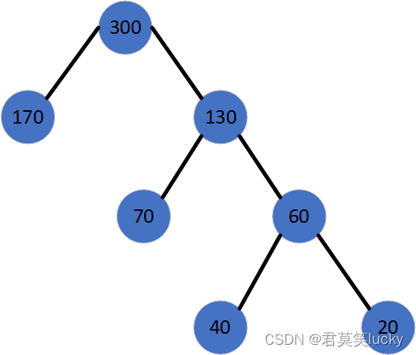
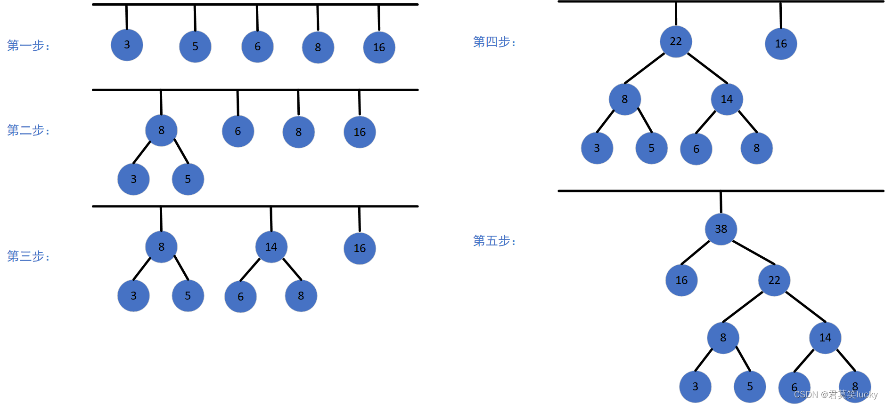

## 哈夫曼编码概述

哈夫曼编码是一种广泛使用的无损压缩算法，属于熵编码（Entropy Encoding）的一种。它通过使用频率较高的字符分配较短的编码，频率较低的字符分配较长的编码，来实现数据压缩。哈夫曼编码的核心思想是基于字符出现频率的二叉树（哈夫曼树）来构建编码方案。

**主要特点**

- **最优性**：在给定字符及其频率的情况下，哈夫曼编码能够生成最优的前缀码，即没有一个编码是另一个编码的前缀，从而保证了解码的唯一性。
- **动态性**：哈夫曼编码可以根据输入数据的不同动态生成不同的编码方案，适应性强。
- **无损压缩**：编码后数据可完全还原，无任何信息丢失。

## 哈夫曼编码的基本原理

哈夫曼编码基于**哈夫曼树**生成。其生成过程如下：

1. **统计字符频率**：计算待编码字符的频率。
2. **构建优先队列**：将每个字符及其频率看作一个节点，构建优先队列，频率越小优先级越高。
3. **构建哈夫曼树**：
   - 从队列中取出两个最小频率的节点，合并成一个新节点，新节点的频率为两个节点频率之和。
   - 将新节点重新插入优先队列。
   - 重复以上过程，直到队列中只剩下一个节点，最终构成哈夫曼树。
4. **生成编码**：根据哈夫曼树从根节点到每个叶子节点的路径生成编码，左子节点路径标记为 `0`，右子节点路径标记为 `1`。

## 哈夫曼树的定义

哈夫曼树（Huffman Tree）是一种最优二叉树。给定 `n` 个权值作为 `n` 个叶子节点，构造一棵二叉树，使得树的带权路径长度（WPL, Weighted Path Length）最小，这棵树即为哈夫曼树。哈夫曼树通常用于数据压缩和编码。

下图展示了一棵哈夫曼树：

<div class="my-img text-center">
    
</div>

## 哈夫曼树的基本概念

1. **路径和路径长度**
   - **定义**: 在一棵树中，从一个节点到其下级的孩子或孙子节点的通路称为路径。路径中边的数量称为路径长度。规定根节点的层数为 `1`，则从根节点到第 `L` 层节点的路径长度为 `L-1`。
   - **例子**: 在图1中，节点 `170` 和 `130` 的路径长度为 `1`，节点 `70` 和 `60` 的路径长度为 `2`，节点 `40` 和 `20` 的路径长度为 `3`。

2. **节点的权及带权路径长度**
   - **定义**: 若将树中节点赋予某种数值，这个数值称为节点的权。节点的带权路径长度是从根节点到该节点的路径长度与该节点权的乘积。
   - **例子**: 节点 `40` 的路径长度为 `3`，其带权路径长度为 `3 * 40 = 120`。

3. **树的带权路径长度 (WPL)**
   - **定义**: 树的带权路径长度为所有叶子节点的带权路径长度之和，记为 WPL。
   - **例子**: 图1中，树的 WPL = `1*170 + 2*70 + 3*40 + 3*20 = 490`。

## 哈夫曼树的特点

- **权值越大的叶子节点越靠近根节点**: 在哈夫曼树中，权值越大的节点越接近根节点。
- **权值越小的叶子节点越远离根节点**: 权值较小的节点通常离根节点较远。
- **哈夫曼树并不唯一**: 由于权值相同的节点可能有多种组合方式，因此哈夫曼树不一定唯一。
- **哈夫曼的子树也是哈夫曼树**: 在哈夫曼树中，任意一个子树也是一棵哈夫曼树。
- **无度为1的节点**: 哈夫曼树中不存在度为 `1` 的节点。
- **总结点数为 `2n-1`**: 有 `n` 个叶子节点的哈夫曼树，总的节点数为 `2n-1`。

## 哈夫曼树的构造规则

假设有 `n` 个权值，构造出的哈夫曼树有 `n` 个叶子节点。设这些权值为 `W1`、`W2`、...、`Wn`，哈夫曼树的构造规则如下：

1. **初始森林**: 将 `W1`、`W2`、...、`Wn` 视为 `n` 棵树的森林。
2. **选择并合并**: 在森林中选出权值最小的两棵树，合并为一棵新树，新树的根节点权值为两棵子树根节点权值之和。
3. **更新森林**: 从森林中删除这两棵树，并将新树加入森林。
4. **重复操作**: 重复步骤 `2` 和 `3` 直到森林中只剩下一棵树，这棵树就是所求的哈夫曼树。

<div class="my-img text-center">
    
</div>

## 哈夫曼编码的具体示例

**示例字符及其频率**

假设有如下字符及其对应频率：

| 字符 | 频率 |
| :--: | :--: |
|  A   |  5   |
|  B   |  9   |
|  C   |  12  |
|  D   |  13  |
|  E   |  16  |
|  F   |  45  |

**构建哈夫曼树的过程**

1. **初始优先队列**：每个字符为一个节点，按频率大小排列：
   - F(45), E(16), D(13), C(12), B(9), A(5)

2. **第一次合并**：取出 A(5) 和 B(9)，生成新节点 AB(14)，插入队列：
   - F(45), E(16), AB(14), D(13), C(12)

3. **第二次合并**：取出 C(12) 和 D(13)，生成新节点 CD(25)，插入队列：
   - F(45), E(16), AB(14), CD(25)

4. **第三次合并**：取出 AB(14) 和 E(16)，生成新节点 ABE(30)，插入队列：
   - F(45), ABE(30), CD(25)

5. **第四次合并**：取出 CD(25) 和 ABE(30)，生成新节点 ABCDE(55)，插入队列：
   - F(45), ABCDE(55)

6. **最终合并**：取出 F(45) 和 ABCDE(55)，生成根节点 ABCDEF(100)：
   - ABCDEF(100)

最终哈夫曼树的结构如下：

```
        (100)
       /    \
     F(45)  (55)
           /    \
       (25)    (30)
      /    \    /   \
   C(12) D(13) (14)  E(16)
               /   \
            A(5)  B(9)
```

**3.3 生成哈夫曼编码**

从根节点出发，左边标记为 `0`，右边标记为 `1`，生成每个字符的哈夫曼编码：

| 字符 | 频率 | 编码 |
| :--: | :--: | :--: |
|  A   |  5   | 1100 |
|  B   |  9   | 1101 |
|  C   |  12  | 100  |
|  D   |  13  | 101  |
|  E   |  16  | 111  |
|  F   |  45  |  0   |

## 哈夫曼编码的意义

1. **数据压缩**：通过使用变长编码，哈夫曼编码能有效压缩数据，减少存储和传输的成本。
2. **广泛应用**：哈夫曼编码广泛应用于文件压缩（如 ZIP 文件）、图像压缩（如 JPEG）、音频压缩（如 MP3）等领域。

## C++ 实现哈夫曼编码

```cpp
#include <iostream>
#include <queue>
#include <unordered_map>
#include <vector>
using namespace std;

// 定义哈夫曼树的节点结构
struct HuffmanNode {
    char ch;
    int freq;
    HuffmanNode *left, *right;

    HuffmanNode(char c, int f) : ch(c), freq(f), left(nullptr), right(nullptr) {}
};

// 比较函数，用于优先队列
struct compare {
    bool operator()(HuffmanNode* l, HuffmanNode* r) {
        return l->freq > r->freq;
    }
};

// 递归生成哈夫曼编码
void generateHuffmanCodes(HuffmanNode* root, string code, unordered_map<char, string> &huffmanCodes) {
    if (!root) return;

    if (root->ch != '#') {
        huffmanCodes[root->ch] = code;
    }

    generateHuffmanCodes(root->left, code + "0", huffmanCodes);
    generateHuffmanCodes(root->right, code + "1", huffmanCodes);
}

// 构建哈夫曼树并生成编码
unordered_map<char, string> buildHuffmanTree(vector<pair<char, int>> &charFreqs) {
    priority_queue<HuffmanNode*, vector<HuffmanNode*>, compare> minHeap;

    // 初始化优先队列
    for (auto &charFreq : charFreqs) {
        minHeap.push(new HuffmanNode(charFreq.first, charFreq.second));
    }

    while (minHeap.size() != 1) {
        // 取出频率最小的两个节点
        HuffmanNode* left = minHeap.top(); minHeap.pop();
        HuffmanNode* right = minHeap.top(); minHeap.pop();

        // 合并成新节点并插入队列
        HuffmanNode* newNode = new HuffmanNode('#', left->freq + right->freq);
        newNode->left = left;
        newNode->right = right;
        minHeap.push(newNode);
    }

    // 生成哈夫曼编码
    unordered_map<char, string> huffmanCodes;
    generateHuffmanCodes(minHeap.top(), "", huffmanCodes);

    return huffmanCodes;
}

int main() {
    vector<pair<char, int>> charFreqs = {
        {'A', 5}, {'B', 9}, {'C', 12}, {'D', 13}, {'E', 16}, {'F', 45}
    };

    unordered_map<char, string> huffmanCodes = buildHuffmanTree(charFreqs);

    cout << "字符的哈夫曼编码如下：" << endl;
    for (auto &code : huffmanCodes) {
        cout << code.first << ": " << code.second << endl;
    }

    return 0;
}
```

在 C++ 中，`std::unordered_map` 是一个哈希表实现的关联容器，提供了键值对的高效查找、插入和删除操作。`unordered_map` 及其相关功能依赖以下几个库：

1. **`<unordered_map>`**:
   - 这是 `std::unordered_map` 本身的头文件，定义了容器以及相关的函数。

2. **`<memory>`**:
   - `std::unordered_map` 使用动态内存分配来管理其元素的存储。`<memory>` 头文件定义了智能指针（如 `std::shared_ptr` 和 `std::unique_ptr`）和动态内存分配相关的工具函数。
   - 如果你在 `unordered_map` 中使用了指向动态分配内存的指针或使用智能指针作为值类型或键类型，则需要包含 `<memory>`。

3. **`<functional>`**:
   - 该库包含哈希函数的定义，如 `std::hash`。`std::unordered_map` 默认使用哈希函数来管理键值对的存储和查找。
   - 如果你需要自定义哈希函数或使用自定义对象作为键，你可能需要包含这个头文件。

4. **`<utility>`**:
   - `std::unordered_map` 使用了 `std::pair` 来存储键值对。`<utility>` 定义了 `std::pair` 以及一些其他的实用函数。

5. **`<algorithm>`**:
   - 包含一些常用的算法，如 `std::for_each`，这些算法可以用于操作 `unordered_map` 的元素。
   - 虽然 `unordered_map` 本身不需要这个库，但在实际使用中，用户可能会需要使用其中的一些算法。

通常你只需要包含 `<unordered_map>`，但如果你的程序使用到了智能指针、自定义哈希函数或是其他需要的工具函数，那么可能还会涉及到上面的其他库。例如：

```cpp
#include <unordered_map>  // 包含 unordered_map 的定义
#include <memory>         // 如果你使用了智能指针
#include <functional>     // 如果你使用了自定义哈希函数
#include <utility>        // 如果你使用了 std::pair
```

## 哈夫曼树（Huffman Tree）和完满二叉树（Full Binary Tree）的区别

### 哈夫曼树（Huffman Tree）

- **定义**: 哈夫曼树是一种用于数据压缩的二叉树，又称为最优二叉树。它通过贪心算法构建，目的是使得加权路径长度最短。
- **构造方法**: 哈夫曼树是根据一组符号及其频率或权重构建的。树的每个叶子节点对应一个符号，路径的长度乘以该符号的频率得到该符号的编码代价。哈夫曼树的构建过程通过不断合并权重最小的两个节点来生成新的节点，直到树根。
- **特点**:
  - 哈夫曼树不是满二叉树，也不是完全二叉树，它的形态依赖于符号的权重分布。
  - 节点的权重越小，它离根节点的距离就越远。

### 完满二叉树（Full Binary Tree）

- **定义**: 完满二叉树是指每个节点要么是叶子节点，要么有两个子节点的二叉树。也就是说，完满二叉树中不存在只有一个子节点的节点。
- **构造方法**: 完满二叉树通常根据节点数量或树的层数来构建，其形态非常规则。它的节点数通常是 \(2^k - 1\)（k 是层数）。
- **特点**:
  - 完满二叉树的所有叶子节点都在同一层。
  - 完满二叉树的形态是固定的，与节点的权重或其他属性无关。

### 二者区别

- **构造目的**: 哈夫曼树的目的是数据压缩，使得频率较高的符号有较短的编码，而完满二叉树的构造与编码无关，其目的是达到一种结构上的对称和完备。
- **形态**: 哈夫曼树的形态取决于节点的权重分布，因此一般是不规则的；而完满二叉树的形态是固定的，非常规则。
- **应用领域**: 哈夫曼树主要用于数据压缩和编码，比如文本压缩；而完满二叉树则通常用于需要特定结构的算法或树型数据结构的教学中。
