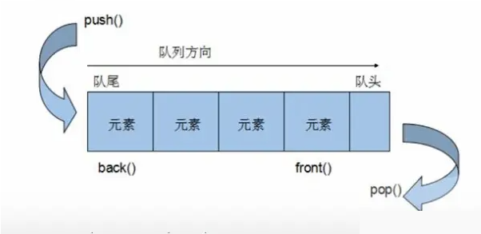
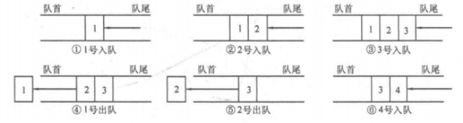
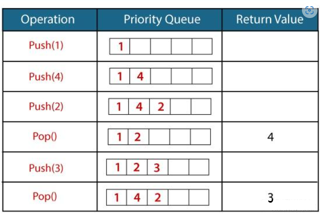

## 队列 (Queue) 基本概念

队列（Queue）是一种常见的线性数据结构，遵循先进先出（First-In-First-Out, FIFO）的原则。类似于我们在现实生活中排队等待的场景，先来的人先被服务。

在队列中，元素的插入操作（入队）是在队列尾部进行，而元素的删除操作（出队）是在队列头部进行。这使得队列成为一种适合于顺序处理任务的数据结构。

<div class="my-img text-center">
    
</div>

<!-- <div class="my-img text-center">
    
</div> -->

队列通常具有以下两个基本操作：
- **入队（Enqueue）：** 将元素添加到队列尾部。
- **出队（Dequeue）：** 从队列头部移除一个元素。

除了基本的入队和出队操作，队列还具有以下重要概念：
- **队列头部（Front）：** 指向队列中第一个元素的指针或引用。
- **队列尾部（Back）：** 指向队列中最后一个元素的指针或引用。
- **空队列（Empty Queue）：** 不包含任何元素的队列。
- **满队列（Full Queue）：** 当队列达到其最大容量时，无法再插入新的元素。

队列可以使用数组或链表等数据结构来实现。在 C++ 标准库中，我们可以使用 `std::queue` 模板类来实现队列，它默认使用 `std::deque` 作为底层容器。

需要注意的是，队列是一种单向的数据结构，只能从队列尾部插入元素，从队列头部删除元素。如果需要在队列中间位置进行操作，可能需要转换为其他数据结构或使用额外的辅助数据结构。

队列在算法、操作系统、网络通信等领域中都有广泛的应用。它有助于实现各种基于顺序处理的问题和任务。

> 队列中只有头部和尾部的元素才可以被外界使用，因此队列不允许有遍历行为。   
> 尽管技术上存在可以遍历队列中的元素的方法，但这种操作违背了队列的设计初衷。如果你频繁需要访问队列中的所有元素，建议重新考虑数据结构的选择，比如使用链表或其他容器。

## 队列 (Queue) 函数接口

当使用队列（`std::queue`）时，以下是一些重要的详细信息和注意事项：

### 包含头文件

要使用 `std::queue`，需要包含 `<queue>` 头文件。

```cpp
#include <queue>
```

### 队列的创建

可以通过下面的方式声明一个队列：

```cpp
std::queue<int> q;
```

在上述示例中，`int` 是队列中元素的类型，可以根据需要替换为其他类型。

### 元素插入

可以使用 `push` 方法将元素插入队列尾部。

```cpp
q.push(42);
```

上述示例将整数 42 插入了队列尾部。

### 元素访问

可以使用 `front` 方法访问队列头部元素的值。

```cpp
std::cout << q.front(); // 输出队列头部元素的值（不删除）
```

注意，`front` 方法不会从队列中删除头部元素，只是返回头部元素的值。

### 元素删除

可以使用 `pop` 方法从队列中删除队列头部元素。

```cpp
q.pop();
```

上述示例将队列头部元素从队列中删除。

### 队列的大小

可以使用 `size` 方法获取队列内元素的数量。

```cpp
std::cout << q.size(); // 输出队列中元素的个数
```

### 队列的判空

可以使用 `empty` 方法判断队列是否为空。

```cpp
if (q.empty()) {
    // 队列为空
} else {
    // 队列不为空
}
```

`empty` 方法在队列为空时返回 `true`，否则返回 `false`。

### 队列函数接口表格

- 构造函数和析构函数

| 函数                     | 描述                                    |
|--------------------------|-----------------------------------------|
| `queue()`                | 默认构造函数，创建一个空的队列             |
| `queue(const queue& other)` | 复制构造函数，创建一个新的队列并复制另一个队列的内容 |
| `~queue()`               | 析构函数，销毁队列                         |

- 运算符重载

| 运算符         | 描述                            |
|----------------|---------------------------------|
| `operator=`    | 赋值运算符，将一个队列的内容赋值给另一个队列 |
| `operator==`   | 比较运算符，判断两个队列是否相等    |
| `operator!=`   | 比较运算符，判断两个队列是否不相等  |

- 成员函数

| 成员函数                   | 描述                                 |
|--------------------------|--------------------------------------|
| `push(value_type& value)` | 将元素插入队列尾部                       |
| `pop()`                   | 删除队列头部元素                         |
| `front()`                 | 返回队列头部元素的引用（不删除）          |
| `back()`                  | 返回队列尾部元素的引用（不删除）          |
| `size()`                  | 返回队列中元素的数量                   |
| `empty()`                 | 判断队列是否为空                       |
| `swap(queue& other)`      | 交换两个队列的内容                     |

在上述表格中，`value_type` 是队列中元素的类型。请注意，队列类 `std::queue` 是基于其他容器实现的，默认情况下使用 `std::deque` 作为底层容器。可以使用其他容器，如 `std::list` 或 `std::vector`，作为底层容器来实现队列。

## 基本操作程序示例

```cpp
#include <iostream>
#include <queue>

// 使用全局命名空间 std
using namespace std;

int main() {
    // 创建一个队列，存储 int 类型的元素
    queue<int> q;

    // 检查队列是否为空
    if (q.empty()) {
        cout << "队列当前为空" << endl;
    }

    // 向队列中插入元素
    cout << "将 10, 20, 30 插入队列尾部" << endl;
    q.push(10);
    q.push(20);
    q.push(30);

    // 显示队列的大小
    cout << "队列中元素的个数: " << q.size() << endl;

    // 访问队列头部元素
    cout << "队列头部元素的值: " << q.front() << endl;

    // 删除队列头部元素
    cout << "删除队列头部元素" << endl;
    q.pop();

    // 再次访问队列头部元素
    cout << "现在队列头部元素的值: " << q.front() << endl;

    // 显示队列的大小
    cout << "队列中元素的个数: " << q.size() << endl;

    // 继续删除队列中的所有元素
    while (!q.empty()) {
        cout << "删除队列头部元素: " << q.front() << endl;
        q.pop();
    }

    // 最后再次检查队列是否为空
    if (q.empty()) {
        cout << "队列现在为空" << endl;
    }

    return 0;
}
```

### 解释：

1. **创建队列**：使用 `std::queue<int> q;` 创建一个存储 `int` 类型元素的队列。
2. **检查是否为空**：使用 `empty()` 函数判断队列是否为空，并输出相应的提示信息。
3. **插入元素**：使用 `push()` 函数将元素 10, 20 和 30 插入队列中。
4. **显示队列的大小**：使用 `size()` 函数获取队列中元素的个数并输出。
5. **访问队列头部元素**：使用 `front()` 函数获取队列头部元素的值并输出。
6. **删除队列头部元素**：使用 `pop()` 函数删除队列头部元素，并再次访问新的队列头部元素。
7. **清空队列**：使用 `while` 循环和 `pop()` 函数删除所有元素，直至队列为空。
8. **再次检查是否为空**：最后再次使用 `empty()` 函数判断队列是否为空，并输出相应的提示信息。


## 优先队列 (Priority Queue) 基本概念

优先队列（Priority Queue）是一种特殊的队列数据结构，每个元素都有一个优先级，元素根据优先级顺序出队。通常使用堆（Heap）来实现。

<div class="my-img text-center">
    
</div>

如图所示：我们通过使用`push()`函数插入了元素，并且插入操作与普通队列相同。但是，当我们使用`pop()`函数从队列中删除元素时，优先级最高的元素将首先被删除。

优先队列通常具有以下两个基本操作：
- **入队（Push/Enqueue）：** 将元素按优先级插入队列。
- **出队（Pop/Dequeue）：** 移除优先级最高的元素。

除了基本的入队和出队操作，优先队列还具有以下重要概念：
- **优先级（Priority）：** 元素的优先级决定了其在队列中的位置。
- **队列头部（Top）：** 指向优先级最高的元素的指针或引用。

优先队列在任务调度、路径规划等领域有广泛的应用。

## 优先队列 (Priority Queue) 函数接口

当使用优先队列（`std::priority_queue`）时，以下是一些重要的详细信息和注意事项：

### 包含头文件

要使用 `std::priority_queue`，需要包含 `<queue>` 头文件。

```cpp
#include <queue>
```

### 优先队列的创建

可以通过下面的方式声明一个优先队列：

```cpp
std::priority_queue<int> pq;
```

在上述示例中，`int` 是优先队列中元素的类型，可以根据需要替换为其他类型。

### 元素插入

可以使用 `push` 方法将元素按优先级插入优先队列。

```cpp
pq.push(42);
```

上述示例将整数 42 插入优先队列。

### 元素访问

可以使用 `top` 方法访问优先队列头部元素的值。

```cpp
std::cout << pq.top(); // 输出优先队列头部元素的值（不删除）
```

注意，`top` 方法不会从优先队列中删除头部元素，只是返回头部元素的值。

### 元素删除

可以使用 `pop` 方法从优先队列中删除优先队列头部元素。

```cpp
pq.pop();
```

上述示例将优先队列头部元素从优先队列中删除。

### 优先队列的大小

可以使用 `size` 方法获取优先队列内元素的数量。

```cpp
std::cout << pq.size(); // 输出优先队列中元素的个数
```

### 优先队列的判空

可以使用 `empty` 方法判断优先队列是否为空。

```cpp
if (pq.empty()) {
    // 优先队列为空
} else {
    // 优先队列不为空
}
```

`empty` 方法在优先队列为空时返回 `true`，否则返回 `false`。

### 优先队列函数接口表格

- 构造函数和析构函数

| 函数                     | 描述                                    |
|--------------------------|-----------------------------------------|
| `priority_queue()`                | 默认构造函数，创建一个空的优先队列             |
| `priority_queue(const priority_queue& other)` | 复制构造函数，创建一个新的优先队列并复制另一个优先队列的内容 |
| `~priority_queue()`               | 析构函数，销毁优先队列                         |

- 运算符重载

| 运算符         | 描述                            |
|----------------|---------------------------------|
| `operator=`    | 赋值运算符，将一个优先队列的内容赋值给另一个优先队列 |
| `operator==`   | 比较运算符，判断两个优先队列是否相等    |
| `operator!=`   | 比较运算符，判断两个优先队列是否不相等  |

- 成员函数

| 成员函数                   | 描述                                 |
|--------------------------|--------------------------------------|
| `push(value_type& value)` | 将元素按优先级插入优先队列                       |
| `pop()`                   | 删除优先队列头部元素                         |
| `top()`                   | 返回优先队列头部元素的引用（不删除）          |
| `size()`                  | 返回优先队列中元素的数量                   |
| `empty()`                 | 判断优先队列是否为空                       |
| `swap(priority_queue& other)`      | 交换两个优先队列的内容                     |

在上述表格中，`value_type` 是优先队列中元素的类型。优先队列类 `std::priority_queue` 使用最大堆作为底层实现，如果需要自定义优先级，可以使用自定义比较函数。

### 自定义比较函数

```cpp
struct Compare {
    bool operator()(const int& a, const int& b) {
        // 自定义比较规则
        return a > b; // 或其他规则
    }
};
std::priority_queue<int, std::vector<int>, Compare> pq;
```

## 基本操作程序示例

```cpp
#include <iostream>
#include <queue>
#include <vector>

// 自定义比较函数
struct Compare {
    bool operator()(const int& a, const int& b) {
        return a > b; // 这里是最小堆
    }
};

// 使用全局命名空间 std
using namespace std;

int main() {
    // 创建一个优先队列，存储 int 类型的元素，使用自定义比较函数
    priority_queue<int, vector<int>, Compare> pq;

    // 检查优先队列是否为空
    if (pq.empty()) {
        cout << "优先队列当前为空" << endl;
    }

    // 向优先队列中插入元素
    cout << "将 30, 10, 20 插入优先队列" << endl;
    pq.push(30);
    pq.push(10);
    pq.push(20);

    // 显示优先队列的大小
    cout << "优先队列中元素的个数: " << pq.size() << endl;

    // 访问优先队列头部元素
    cout << "优先队列头部元素的值: " << pq.top() << endl;

    // 删除优先队列头部元素
    cout << "删除优先队列头部元素" << endl;
    pq.pop();

    // 再次访问优先队列头部元素
    cout << "现在优先队列头部元素的值: " << pq.top() << endl;

    // 显示优先队列的大小
    cout << "优先队列中元素的个数: " << pq.size() << endl;

    // 继续删除优先队列中的所有元素
    while (!pq.empty()) {
        cout << "删除优先队列头部元素: " << pq.top() << endl;
        pq.pop();
    }

    // 最后再次检查优先队列是否为空
    if (pq.empty()) {
        cout << "优先队列现在为空" << endl;
    }

    return 0;
}
```

### 解释：

1. **创建优先队列**：使用 `std::priority_queue<int, std::vector<int>, Compare> pq;` 创建一个存储 `int` 类型元素并使用自定义比较函数的优先队列。
2. **检查是否为空**：使用 `empty()` 函数判断优先队列是否为空，并输出相应的提示信息。
3. **插入元素**：使用 `push()` 函数将元素 30, 10 和 20 插入优先队列中。
4. **显示优先队列的大小**：使用 `size()` 函数获取优先队列中元素的个数并输出。
5. **访问优先队列头部元素**：使用 `top()` 函数获取优先队列头部元素的值并输出。
6. **删除优先队列头部元素**：使用 `pop()` 函数删除优先队列头部元素，并再次访问新的优先队列头部元素。
7. **清空优先队列**：使用 `while` 循环和 `pop()` 函数删除所有元素，直至优先队列为空。
8. **再次检查是否为空**：最后再次使用 `empty()` 函数判断优先队列是否为空，并输出相应的提示信息。
