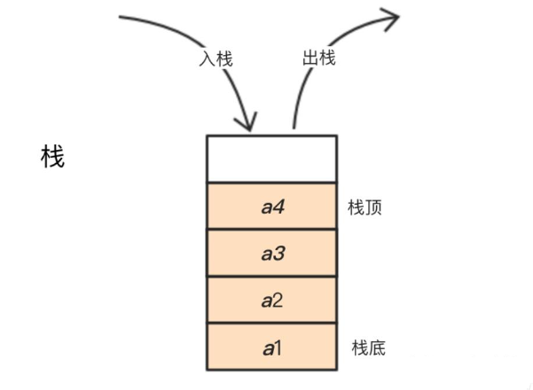

## 栈 (Stack) 基本概念

栈（Stack）是一种常见的线性数据结构，遵循后进先出（Last-In-First-Out, LIFO）的原则。类似于我们在现实生活中堆叠书本或盘子的方式，最后放入的元素最先被取出。

在栈中，元素的插入操作（入栈）是在栈顶进行，而元素的删除操作（出栈）也是在栈顶进行。这使得栈成为一种适合于后续操作依赖于最近插入的元素的数据结构。

<div class="my-img text-center">
    
</div>

栈通常具有以下两个基本操作：

- **入栈（Push）：** 将元素添加到栈顶。
- **出栈（Pop）：** 从栈顶移除一个元素。

除了基本的入栈和出栈操作，栈还具有以下重要概念：

- **栈顶（Top）：** 指向栈中最新插入的元素的指针或引用。
- **栈底（Bottom）：** 指向栈中最先插入的元素的指针或引用。
- **空栈（Empty Stack）：** 不包含任何元素的栈。
- **满栈（Full Stack）：** 当栈达到其最大容量时，无法再插入新的元素。

栈可以使用数组或链表等数据结构来实现。在 C++ 标准库中，我们可以使用 `std::stack` 模板类来实现栈，它默认使用 `std::deque` 作为底层容器。

需要注意的是，栈是一种单向的数据结构，只能从栈顶插入和删除元素。如果需要在栈中间位置进行操作，可能需要转换为其他数据结构或使用额外的辅助数据结构。

栈在算法、语法分析、递归调用等各种场景中都有广泛的应用。它有助于实现各种基于后进先出顺序的问题和任务。

> 栈中只有顶端的元素才可以被外界使用，因此栈不允许有遍历行为。  
> 尽管技术上存在可以遍历栈中的元素的方法，但这种操作违背了栈的设计初衷。如果你频繁需要访问栈中的所有元素，建议重新考虑数据结构的选择，比如使用链表或其他容器。

## 栈 (Stack) 函数接口

当使用栈（`std::stack`）时，以下是一些重要的详细信息和注意事项：

### 包含头文件

要使用 `std::stack`，需要包含 `<stack>` 头文件。

```cpp
#include <stack>
```

### 栈的创建

可以通过下面的方式声明一个栈：

```cpp
std::stack<int> st;
```

在上述示例中，`int` 是栈中元素的类型，可以根据需要替换为其他类型。

### 元素插入

可以使用 `push` 方法将元素压入栈顶。

```cpp
st.push(42);
```

上述示例将整数 42 压入了栈顶。

### 元素访问

可以使用 `top` 方法访问栈顶元素的值。

```cpp
std::cout << st.top(); // 输出栈顶元素的值（不删除）
```

注意，`top` 方法不会从栈中删除栈顶元素，只是返回栈顶元素的值。

### 元素删除

可以使用 `pop` 方法从栈中删除栈顶元素。

```cpp
st.pop();
```

上述示例将栈顶元素从栈中删除。

### 栈的大小

可以使用 `size` 方法获取栈内元素的数量。

```cpp
std::cout << st.size(); // 输出栈中元素的个数
```

### 栈的判空

可以使用 `empty` 方法判断栈是否为空。

```cpp
if (st.empty()) {
    // 栈为空
} else {
    // 栈不为空
}
```

`empty` 方法在栈为空时返回 `true`，否则返回 `false`。

### 栈函数接口表格

- 构造函数和析构函数

| 函数                        | 描述                                             |
| --------------------------- | ------------------------------------------------ |
| `stack()`                   | 默认构造函数，创建一个空的栈                     |
| `stack(const stack& other)` | 复制构造函数，创建一个新的栈并复制另一个栈的内容 |
| `~stack()`                  | 析构函数，销毁栈                                 |

- 运算符重载

| 运算符       | 描述                                     |
| ------------ | ---------------------------------------- |
| `operator=`  | 赋值运算符，将一个栈的内容赋值给另一个栈 |
| `operator==` | 比较运算符，判断两个栈是否相等           |
| `operator!=` | 比较运算符，判断两个栈是否不相等         |

- 成员函数

| 成员函数                  | 描述                         |
| ------------------------- | ---------------------------- |
| `push(value_type& value)` | 将元素压入栈顶               |
| `pop()`                   | 弹出栈顶元素                 |
| `top()`                   | 返回栈顶元素的引用（不删除） |
| `size()`                  | 返回栈中元素的数量           |
| `empty()`                 | 判断栈是否为空               |
| `swap(stack& other)`      | 交换两个栈的内容             |

在上述表格中，`value_type` 是栈中元素的类型。请注意，栈类 `std::stack` 是基于其他容器实现的，默认情况下使用 `std::deque` 作为底层容器。可以使用其他容器，如 `std::vector` 或 `std::list`，作为底层容器来实现栈。

## 基本操作程序示例

```cpp
#include <iostream>
#include <stack>

// 使用全局命名空间 std
using namespace std;

int main() {
    // 创建一个栈，存储 int 类型的元素
    stack<int> st;

    // 检查栈是否为空
    if (st.empty()) {
        cout << "栈当前为空" << endl;
    }

    // 向栈中插入元素
    cout << "将 10, 20, 30 压入栈顶" << endl;
    st.push(10);
    st.push(20);
    st.push(30);

    // 显示栈的大小
    cout << "栈中元素的个数: " << st.size() << endl;

    // 访问栈顶元素
    cout << "栈顶元素的值: " << st.top() << endl;

    // 删除栈顶元素
    cout << "弹出栈顶元素" << endl;
    st.pop();

    // 再次访问栈顶元素
    cout << "现在栈顶元素的值: " << st.top() << endl;

    // 显示栈的大小
    cout << "栈中元素的个数: " << st.size() << endl;

    // 继续弹出栈中的所有元素
    while (!st.empty()) {
        cout << "弹出栈顶元素: " << st.top() << endl;
        st.pop();
    }

    // 最后再次检查栈是否为空
    if (st.empty()) {
        cout << "栈现在为空" << endl;
    }

    return 0;
}
```

### 解释：

1. **创建栈**：使用 `std::stack<int> st;` 创建一个存储 `int` 类型元素的栈。
2. **检查是否为空**：使用 `empty()` 函数判断栈是否为空，并输出相应的提示信息。
3. **插入元素**：使用 `push()` 函数将元素 10, 20 和 30 压入栈中。
4. **显示栈的大小**：使用 `size()` 函数获取栈中元素的个数并输出。
5. **访问栈顶元素**：使用 `top()` 函数获取栈顶元素的值并输出。
6. **删除栈顶元素**：使用 `pop()` 函数删除栈顶元素，并再次访问新的栈顶元素。
7. **清空栈**：使用 `while` 循环和 `pop()` 函数弹出所有元素，直至栈为空。
8. **再次检查是否为空**：最后再次使用 `empty()` 函数判断栈是否为空，并输出相应的提示信息。
