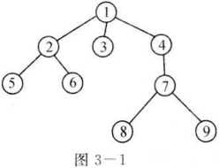
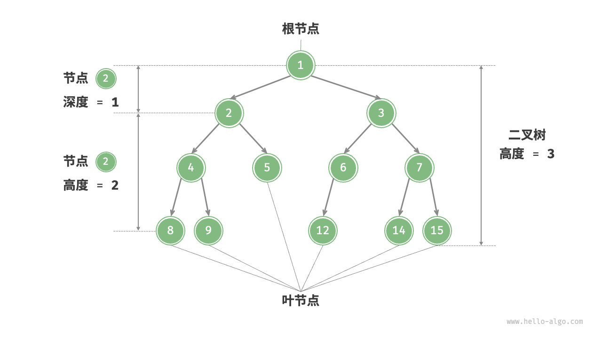
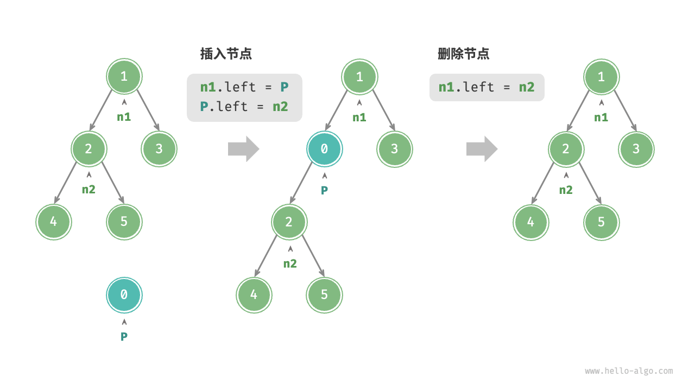
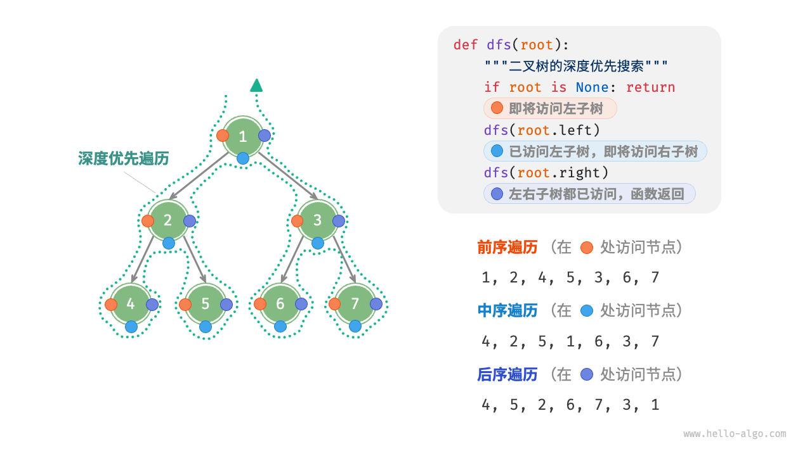
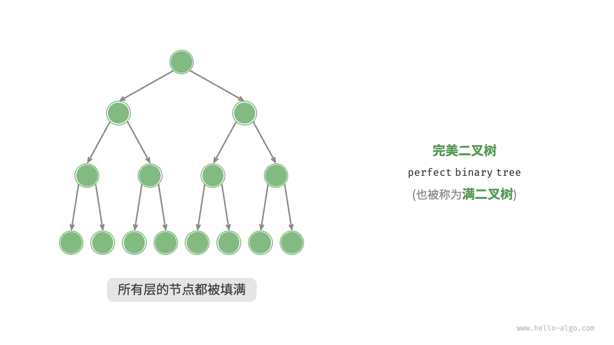
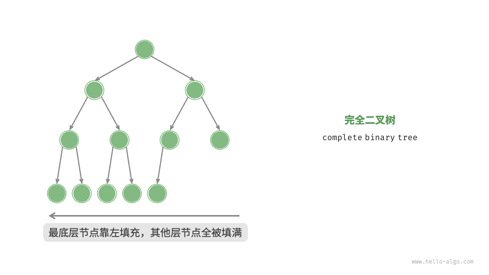
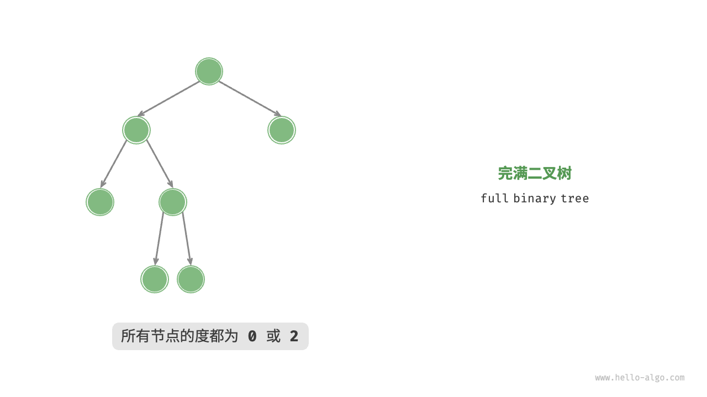
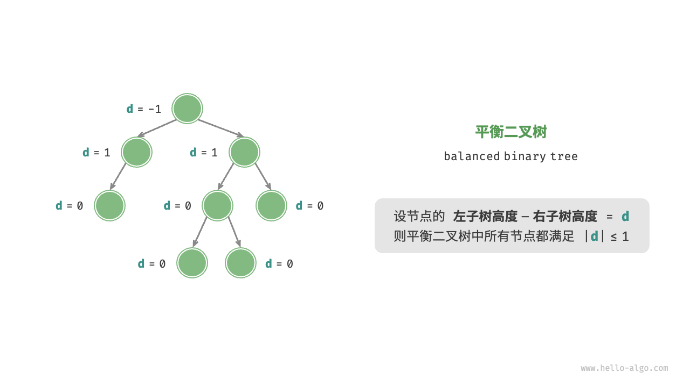
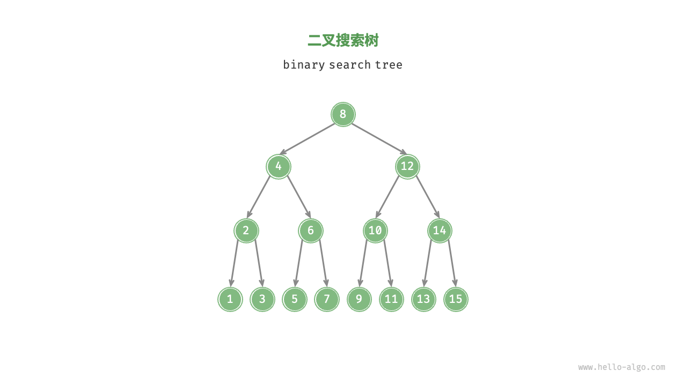
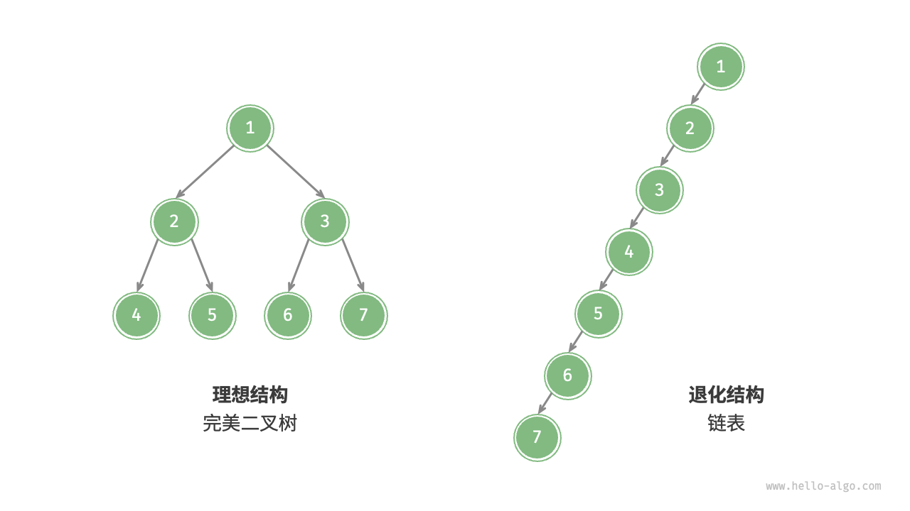

树是一种非线性的数据结构，用它能很好地描述有分支和层次特性的数据集合。树型结构在现实世界中广泛存在，如社会组织机构的组织关系图就可以用树型结构来表示。树在计算机领域中也有广泛应用，如在编译系统中，用树表示源程序的语法结构。在数据库系统中，树型结构是数据库层次模型的基础，也是各种索引和目录的主要组织形式。在许多算法中，常用树型结构描述问题的求解过程、所有解的状态和求解的对策等。这些年的国内、国际信息学奥赛、大学生程序设计比赛等竞赛中，树型结构成为参赛者必备的知识之一，尤其是建立在树型结构基础之上的搜索算法。

在树型结构中，二叉树是最常用的结构，它的分支个数确定，又可以为空，并有良好的递归特性，特别适宜于程序设计，因此也常常将一般树转换成二叉树进行处理。

## 第一节 树的概念

### 一、树的定义

一棵树是由n（n>0）个元素组成的有限集合，其中:

1. 每个元素称为结点（node）；
2. 有一个特定的结点，称为根结点或树根（root）；
3. 除根结点外，其余结点能分成m（m>=0）个互不相交的有限集合，其中的每个子集又都是一棵树，这些集合称为这棵树的子树。

如图是一棵典型的树：

<div class="my-img text-center">
    
</div>

### 二、树的基本概念

1. 树是递归定义的。
2. 一棵树中至少有1个结点。这个结点就是根结点，它没有前驱，其余每个结点都有唯一的一个前驱结点。每个结点可以有或多个后继结点。因此树虽然是非线性结构，但也是有序结构。至于前驱后继结点是哪个，还要看树的遍历方法，我们将在后面讨论。
3. 一个结点的子树个数，称为这个结点的度（degree, 结点1的度为3, 结点3的度为0）；度为0的结点称为叶结点（树叶leaf, 如结点3、5、6、8、9）；度不为0的结点称为分支结点（如结点1、2、4、7）；根以外的分支结点又称为内部结点（如结点2、4、7）；树中各结点的度的最大值称为这棵树的度（这棵树的度为3）。
4. 在用图形表示的树型结构中，对两个用线段（称为树枝）连接的相关联的结点，称上端结点为下端结点的父结点，称下端结点为上端结点的子结点。称同一个父结点的多个子结点为兄弟结点。如结点1是结点2、3、4的父结点，结点2、3、4是结点1的子结点，它们又是兄弟结点，同时结点2又是结点5、6的父结点。称从根结点到某个子结点所经过的所有结点为这个子结点的祖先。如结点1、4、7是结点8的祖先。称以某个结点为根的子树中的任一结点都是该结点的子孙。如结点7、8、9都是结点4的子孙。
5. 定义一棵树的根结点的层次（level）为0，其他结点的层次等于它的父结点层次加1。如结点2、3、4的层次为1，结点5、6、7的层次为2，结点8、9的层次为3。一棵树中所有的结点的层次的最大值称为树的深度（depth）。如这棵树的深度为3。
6. 对于树中任意两个不同的结点，如果从一个结点出发，自上而下沿着树中连着结点的线段能到达另一结点，称它们之间存在着一条路径。可用路径所经过的结点序列表示路径。路径的长度等于路径上的结点个数减1。如图3-1中，结点1和结点8之间存在着一条路径，并可用（1、4、7、8）表示这条路径。该条路径的长度为3。注意，不同子树上的结点之间不存在路径，从根结点出发，到树中的其余结点一定存在着一条路径。
7. 森林（forest）是m（m>=0）棵互不相交的树的集合。

### 三、树的存储结构

#### 方法1：数组，称为“父亲表示法”。

```cpp
const int m = 10; // 树的结点数
struct node {
    int data, parent; // 数据域，指针域
};
node tree[m];
```

优缺点：利用了树中除根结点外每个结点都有唯一的父结点这个性质。很容易找到树根，但找孩子时需要遍历整个线性表。

#### 方法2：树型单链表结构，称为“孩子表示法”。

每个结点包括一个数据域和一个指针域（指向若干子结点），称为“孩子表示法”。假设树的度为10，树的结点仅存放字符，则这棵树的数据结构定义如下：

```cpp
const int m= 10;
typedef struct node;
typedef node* tree;
struct node {
    char data; // 数据域
    tree child[m]; // 指针域，指向若干孩子结点
};
tree t;
```

缺陷：只能从根（父）结点遍历到子结点，不能从某个子结点返回到它的父结点。但程序中确实需要从某个结点返回到它的父结点时，就需要在结点中多定义一个指针变量存放其父结点的信息。这种结构又叫带逆序的树型结构。

#### 方法3：树型双链表结构，称为“父亲孩子表示法”。

每个结点包括一个数据域和两个指针域（一个指向若干子结点，一个指向父结点）。假设树的度为10，树的结点仅存放字符，则这棵树的数据结构定义如下：

```cpp
const int m= 10;
typedef struct node;
typedef node* tree;
struct node {
    char data; // 数据域
    tree child[m]; // 指针域，指向若干孩子结点
    tree parent; // 指针域，指向父亲结点
};
tree t;
```

#### 方法4：二叉树型表示法，称为“孩子兄弟表示法”。

它是一种双链表结构，但每个结点包括一个数据域和两个指针域（一个指向该结点的第一个孩子结点，一个指向该结点的下一个兄弟结点）。假设树的度为10，树的结点仅存放字符，则这棵树的数据结构定义如下：

```cpp
typedef struct node;
typedef node* tree;
struct node {
    char data; // 数据域
    tree firstchild, next; // 指针域，分别指向第一个孩子结点和下一个兄弟结点
};
tree t;
```

### 例题 找树根和孩子

#### 问题描述

给定一棵树，输出树的根root，孩子最多的结点max以及他的孩子。

#### 输入格式

第1行：n（结点个数 ≤ 100），m（边数 ≤ 200）。
以下m行：每行两个结点x和y，表示y是x的孩子（x,y ≤ 1000）。

#### 输出格式

第1行：树根：root。
第2行：孩子最多的结点。
第3行：max的孩子。

#### 输入样例

```
8 7
4 2
1 3
1 5
2 6
2 7
2 8
4 9
```

#### 输出样例

```
树根：1
孩子最多的结点：2
孩子：6 7 8
```

#### 参考程序

```cpp
#include <iostream>
using namespace std;

const int MAX_NODES = 101;  // 节点最大数量

int tree[MAX_NODES];  // 存储每个节点的父节点
int n, m;

int main() {
    int i, x, y, root, maxNode, childCount, maxChildren = 0;

    cin >> n >> m;

    // 初始化树数组
    for (i = 1; i <= n; ++i) {
        tree[i] = 0;  // 0 表示没有父节点
    }

    // 读取边并构建树
    for (i = 1; i <= m; ++i) {
        cin >> x >> y;
        tree[y] = x;  // y的父节点是x
    }

    // 找到根节点
    for (i = 1; i <= n; ++i) {
        if (tree[i] == 0) {
            root = i;
            break;
        }
    }

    cout << "树根：" << root << endl;

    // 找到孩子最多的节点
    for (i = 1; i <= n; ++i) {
        childCount = 0;
        for (int j = 1; j <= n; ++j) {
            if (tree[j] == i) {
                childCount++;
            }
        }
        if (childCount > maxChildren) {
            maxChildren = childCount;
            maxNode = i;
        }
    }

    cout << "孩子最多的节点：" << maxNode << endl;
    cout << "孩子：";

    // 输出孩子最多节点的孩子
    for (i = 1; i <= n; ++i) {
        if (tree[i] == maxNode) {
            cout << i << " ";
        }
    }

    cout << endl;

    return 0;
}
```

#### 根据提供的输入数据，树的结构

```
8 7
4 2
1 3
1 5
2 6
2 7
2 8
4 9
```

- `8` 表示节点总数。
- `7` 表示边的数量。
- 接下来的每一行表示一条边 `(x, y)`，其中 `y` 是 `x` 的孩子。

##### 解析树结构

我们可以从这些边信息构建树的结构：

1. **从边信息构建树**：

   - `4` 是 `2` 的父节点：`4 -> 2`
   - `1` 是 `3` 的父节点：`1 -> 3`
   - `1` 是 `5` 的父节点：`1 -> 5`
   - `2` 是 `6` 的父节点：`2 -> 6`
   - `2` 是 `7` 的父节点：`2 -> 7`
   - `2` 是 `8` 的父节点：`2 -> 8`
   - `4` 是 `9` 的父节点：`4 -> 9`

2. **找出根节点**：

   - 根节点是没有父节点的节点。根据输入，节点 `1`, `2`, `4` 是父节点，而 `3`, `5`, `6`, `7`, `8`, `9` 是孩子节点。
   - 因此，节点 `1` 和 `4` 是根节点候选。由于在同一层的父节点不一定具有根节点的唯一性，通常选取编号最小的根节点，即 `1` 作为根节点。

3. **树结构图示化**：

   ```
           1
         /   \
        3     5
        |
        2
       /|\
      6 7 8
     /
    4
    |
    9
   ```

##### 树的结构解释

- **根节点**：`1`
- **节点 `1` 的孩子**：`3` 和 `5`
- **节点 `2` 的孩子**：`6`, `7`, `8`
- **节点 `4` 的孩子**：`9`

##### 输出解析

根据上面的树结构：

- **根节点**：`1`
- **孩子最多的节点**：`2`（因为节点 `2` 有 3 个孩子：`6`, `7`, `8`）
- **孩子最多的节点的孩子**：`6`, `7`, `8`

## 第二节 二叉树

二叉树（binary tree）是一种非线性数据结构，代表“祖先”与“后代”之间的派生关系，体现了“一分为二”的分治逻辑。与链表类似，二叉树的基本单元是节点，每个节点包含值、左子节点引用和右子节点引用。

### 二叉树节点结构体

```cpp
/* 二叉树节点结构体 */
struct TreeNode {
    int val;          // 节点值
    TreeNode *left;   // 左子节点指针
    TreeNode *right;  // 右子节点指针
    TreeNode(int x) : val(x), left(nullptr), right(nullptr) {}
};
```

每个节点都有两个引用（指针），分别指向左子节点（left-child node）和右子节点（right-child node），该节点被称为这两个子节点的父节点（parent node）。当给定一个二叉树的节点时，我们将该节点的左子节点及其以下节点形成的树称为该节点的左子树（left subtree），同理可得右子树（right subtree）。

**在二叉树中，除叶节点外，其他所有节点都包含子节点和非空子树**。如图所示，如果将“节点 2”视为父节点，则其左子节点和右子节点分别是“节点 4”和“节点 5”，左子树是“节点 4 及其以下节点形成的树”，右子树是“节点 5 及其以下节点形成的树”。

<div class="my-img text-center">
    
</div>

### 二叉树常见术语

二叉树的常用术语如下：

- **根节点（root node）**：位于二叉树顶层的节点，没有父节点。

- **叶节点（leaf node）**：没有子节点的节点，其两个指针均指向 `nullptr`。

- **边（edge）**：连接两个节点的线段，即节点引用（指针）。

- **节点所在的层（level）**：从顶至底递增，根节点所在层为 1。

- **节点的度（degree）**：节点的子节点的数量。在二叉树中，度的取值范围是 0、1、2。

- **二叉树的高度（height）**：从根节点到最远叶节点所经过的边的数量。

- **节点的深度（depth）**：从根节点到该节点所经过的边的数量。

- **节点的高度（height）**：从距离该节点最远的叶节点到该节点所经过的边的数量。

<div class="my-img text-center">
    
</div>

> 请注意，我们通常将“高度”和“深度”定义为“经过的边的数量”，但有些题目或教材可能会将其定义为“经过的节点的数量”。在这种情况下，高度和深度都需要加 1 。

### 二叉树基本操作

#### 1. 初始化二叉树

与链表类似，首先初始化节点，然后构建节点之间的引用（指针）。

```cpp
struct TreeNode {
    int data;               // 节点数据
    TreeNode* left;         // 左子节点
    TreeNode* right;        // 右子节点

    TreeNode(int value) : data(value), left(nullptr), right(nullptr) {}
};

// 初始化二叉树
return new TreeNode(rootValue);
```

### 2. 插入与删除节点

与链表类似，在二叉树中插入与删除节点可以通过修改指针来实现。

<div class="my-img text-center">
    
</div>

```cpp
// 插入节点
void insert(TreeNode* root, int value) {
    if (root == nullptr) {
        root = new TreeNode(value);
        return;
    }

    if (value < root->data) {
        if (root->left == nullptr) {
            root->left = new TreeNode(value);
        } else {
            insert(root->left, value);
        }
    } else {
        if (root->right == nullptr) {
            root->right = new TreeNode(value);
        } else {
            insert(root->right, value);
        }
    }
}

// 删除节点
TreeNode* deleteNode(TreeNode* root, int key) {
    if (root == nullptr) {
        return nullptr;
    }

    if (key < root->data) {
        root->left = deleteNode(root->left, key);
    } else if (key > root->data) {
        root->right = deleteNode(root->right, key);
    } else {
        if (root->left == nullptr) {
            return root->right;
        } else if (root->right == nullptr) {
            return root->left;
        }

        TreeNode* minNode = getMin(root->right);
        root->data = minNode->data;
        root->right = deleteNode(root->right, minNode->data);
    }

    return root;
}
```

> 需要注意的是，插入节点可能会改变二叉树的原有逻辑结构，而删除节点通常意味着删除该节点及其所有子树。因此，在二叉树中，插入与删除通常是由一套操作配合完成的，以实现有实际意义的操作。

### 3. 遍历二叉树

在二叉树中，有四种常见的遍历方式：

- **前序遍历（preorder traversal）**：根节点 -> 左子树 -> 右子树。
- **中序遍历（inorder traversal）**：左子树 -> 根节点 -> 右子树。
- **后序遍历（postorder traversal）**：左子树 -> 右子树 -> 根节点。
- **层序遍历（level order traversal）**：逐层遍历，从上至下，从左至右。

<div class="my-img text-center">
    
</div>

1. **前序遍历**：

前序遍历（Preorder Traversal）是二叉树遍历的一种方式，它的遍历顺序是：

1. 访问根节点
2. 先遍历左子树
3. 再遍历右子树

这个遍历顺序的主要特点是首先处理当前节点，然后递归地处理左子树和右子树。

#### 前序遍历的实现步骤

假设我们有一个二叉树，根节点是 `root`：

1. **访问根节点**：处理当前节点。
2. **递归遍历左子树**：调用前序遍历函数处理左子树。
3. **递归遍历右子树**：调用前序遍历函数处理右子树。

#### 代码示例

以下是前序遍历的一个简单实现：

```cpp
void preorderTraversal(TreeNode* root) {
    if (root != nullptr) {
        cout << root->data << " ";        // 访问根节点
        preorderTraversal(root->left);    // 递归遍历左子树
        preorderTraversal(root->right);   // 递归遍历右子树
    }
}
```

#### 例子

考虑以下二叉树：

```
      4
     / \
    2   6
   / \ / \
  1  3 5  7
```

进行前序遍历的过程是：

1. 从根节点 `4` 开始，首先访问 `4`。
2. 然后遍历左子树。左子树的根节点是 `2`，访问 `2`。
3. 继续遍历 `2` 的左子树，根节点是 `1`，访问 `1`。`1` 没有子树，所以返回。
4. 返回到 `2`，遍历 `2` 的右子树，根节点是 `3`，访问 `3`。`3` 没有子树，所以返回。
5. 返回到根节点 `4`，遍历右子树。右子树的根节点是 `6`，访问 `6`。
6. 继续遍历 `6` 的左子树，根节点是 `5`，访问 `5`。`5` 没有子树，所以返回。
7. 返回到 `6`，遍历 `6` 的右子树，根节点是 `7`，访问 `7`。`7` 没有子树，所以返回。

最终的前序遍历顺序是 `4, 2, 1, 3, 6, 5, 7`。

2. **中序遍历**：

中序遍历（Inorder Traversal）是二叉树遍历的一种方式，它的遍历顺序是：

1. 先遍历左子树
2. 然后访问根节点
3. 最后遍历右子树

这个遍历顺序对于二叉搜索树（Binary Search Tree，BST）特别有用，因为它会按升序输出所有节点的值。中序遍历的主要特点是访问每个节点时，节点的值会被按从小到大的顺序访问。

#### 中序遍历的实现步骤

假设我们有一个二叉树，根节点是 `root`：

1. **递归遍历左子树**：调用中序遍历函数处理左子树。
2. **访问根节点**：处理当前节点。
3. **递归遍历右子树**：调用中序遍历函数处理右子树。

#### 代码示例

以下是中序遍历的一个简单实现（与之前的代码类似）：

```cpp
void inorderTraversal(TreeNode* root) {
    if (root != nullptr) {
        inorderTraversal(root->left);    // 递归遍历左子树
        cout << root->data << " ";       // 访问根节点
        inorderTraversal(root->right);   // 递归遍历右子树
    }
}
```

#### 例子

考虑以下二叉树：

```
      4
     / \
    2   6
   / \ / \
  1  3 5  7
```

进行中序遍历的过程是：

1. 从根节点 `4` 开始，首先遍历左子树。
2. 左子树的根节点是 `2`，继续遍历左子树。
3. 左子树的根节点是 `1`，它没有左子树，因此访问 `1`。
4. 返回到 `2`，访问 `2`，然后遍历其右子树。
5. 右子树的根节点是 `3`，它没有子树，因此访问 `3`。
6. 返回到根节点 `4`，访问 `4`，然后遍历右子树。
7. 右子树的根节点是 `6`，继续遍历左子树。
8. 左子树的根节点是 `5`，它没有子树，因此访问 `5`。
9. 返回到 `6`，访问 `6`，然后遍历其右子树。
10. 右子树的根节点是 `7`，它没有子树，因此访问 `7`。

最终的中序遍历顺序是 `1, 2, 3, 4, 5, 6, 7`。

3. **后序遍历**：

后序遍历（Postorder Traversal）是二叉树遍历的一种方式，它的遍历顺序是：

1. 先遍历左子树
2. 再遍历右子树
3. 最后访问根节点

这个遍历顺序的主要特点是首先递归地处理左右子树，然后处理当前节点。后序遍历常用于删除树节点，因为它会在删除父节点之前先删除子节点。

#### 后序遍历的实现步骤

假设我们有一个二叉树，根节点是 `root`：

1. **递归遍历左子树**：调用后序遍历函数处理左子树。
2. **递归遍历右子树**：调用后序遍历函数处理右子树。
3. **访问根节点**：处理当前节点。

#### 代码示例

以下是后序遍历的一个简单实现：

```cpp
void postorderTraversal(TreeNode* root) {
    if (root != nullptr) {
        postorderTraversal(root->left);    // 递归遍历左子树
        postorderTraversal(root->right);   // 递归遍历右子树
        cout << root->data << " ";         // 访问根节点
    }
}
```

#### 例子

考虑以下二叉树：

```
      4
     / \
    2   6
   / \ / \
  1  3 5  7
```

进行后序遍历的过程是：

1. 从根节点 `4` 开始，首先遍历左子树。
2. 左子树的根节点是 `2`，继续遍历 `2` 的左子树。
3. `2` 的左子树的根节点是 `1`，它没有子树，所以访问 `1`。
4. 返回到 `2`，遍历 `2` 的右子树，根节点是 `3`，它没有子树，所以访问 `3`。
5. 访问节点 `2`（它的左子树和右子树都已经遍历完成）。
6. 返回到根节点 `4`，遍历右子树。
7. 右子树的根节点是 `6`，继续遍历 `6` 的左子树。
8. `6` 的左子树的根节点是 `5`，它没有子树，所以访问 `5`。
9. 返回到 `6`，遍历 `6` 的右子树，根节点是 `7`，它没有子树，所以访问 `7`。
10. 访问节点 `6`（它的左子树和右子树都已经遍历完成）。
11. 最后访问根节点 `4`。

最终的后序遍历顺序是 `1, 3, 2, 5, 7, 6, 4`。

4. **层序遍历**：

层序遍历（Level Order Traversal）是二叉树遍历的一种方式，它按层次从上到下、从左到右访问每一个节点。与其他遍历方法（如中序、前序和后序遍历）不同，层序遍历是基于节点的层级结构来进行遍历的，通常使用队列来实现。

<div class="my-img text-center">
    
</div>

#### 层序遍历的实现步骤

1. **使用队列**：创建一个队列，并将根节点入队。
2. **循环处理队列**：
   - 从队列中取出一个节点。
   - 访问该节点（例如，打印节点值）。
   - 将该节点的左子节点和右子节点（如果存在）依次入队。
3. **重复步骤 2**，直到队列为空。

#### 代码示例

以下是层序遍历的一个简单实现：

```cpp
#include <iostream>
#include <queue>

using namespace std;

struct TreeNode {
    int data;               // 节点数据
    TreeNode* left;         // 左子节点
    TreeNode* right;        // 右子节点

    TreeNode(int value) : data(value), left(nullptr), right(nullptr) {}
};

// 层序遍历
void levelOrderTraversal(TreeNode* root) {
    if (root == nullptr) {
        return;
    }

    queue<TreeNode*> q;    // 创建队列
    q.push(root);          // 根节点入队

    while (!q.empty()) {
        TreeNode* current = q.front(); // 取出队列中的节点
        q.pop(); // 队列出队

        cout << current->data << " ";  // 访问节点

        // 将左子节点和右子节点入队
        if (current->left != nullptr) {
            q.push(current->left);
        }
        if (current->right != nullptr) {
            q.push(current->right);
        }
    }
    cout << endl;
}

int main() {
    TreeNode* root = new TreeNode(4);
    root->left = new TreeNode(2);
    root->right = new TreeNode(6);
    root->left->left = new TreeNode(1);
    root->left->right = new TreeNode(3);
    root->right->left = new TreeNode(5);
    root->right->right = new TreeNode(7);

    // 层序遍历
    cout << "层序遍历: ";
    levelOrderTraversal(root);

    // 释放内存（省略）
    return 0;
}
```

#### 例子

考虑以下二叉树：

```
      4
     / \
    2   6
   / \ / \
  1  3 5  7
```

进行层序遍历的过程是：

1. 从根节点 `4` 开始，访问 `4`，然后将 `4` 的左子节点 `2` 和右子节点 `6` 入队。
2. 取出队列中的 `2`，访问 `2`，然后将 `2` 的左子节点 `1` 和右子节点 `3` 入队。
3. 取出队列中的 `6`，访问 `6`，然后将 `6` 的左子节点 `5` 和右子节点 `7` 入队。
4. 取出队列中的 `1`，访问 `1`（它没有子节点）。
5. 取出队列中的 `3`，访问 `3`（它没有子节点）。
6. 取出队列中的 `5`，访问 `5`（它没有子节点）。
7. 取出队列中的 `7`，访问 `7`（它没有子节点）。

最终的层序遍历顺序是 `4, 2, 6, 1, 3, 5, 7`。

### 4. 基本操作示例

```cpp
#include <iostream>

using namespace std;

struct TreeNode {
    int data;               // 节点数据
    TreeNode* left;         // 左子节点
    TreeNode* right;        // 右子节点

    TreeNode(int value) : data(value), left(nullptr), right(nullptr) {}
};

// 初始化二叉树
TreeNode* initializeTree(int rootValue) {
    return new TreeNode(rootValue);
}

// 插入节点
TreeNode* insertNode(TreeNode* root, int value) {
    if (root == nullptr) {
        return new TreeNode(value);
    }
    if (value < root->data) {
        root->left = insertNode(root->left, value);
    } else {
        root->right = insertNode(root->right, value);
    }
    return root;
}

// 查找最小值节点
TreeNode* minValueNode(TreeNode* node) {
    TreeNode* current = node;
    while (current && current->left != nullptr) {
        current = current->left;
    }
    return current;
}

// 删除节点
TreeNode* deleteNode(TreeNode* root, int value) {
    if (root == nullptr) {
        return root;
    }
    if (value < root->data) {
        root->left = deleteNode(root->left, value);
    } else if (value > root->data) {
        root->right = deleteNode(root->right, value);
    } else {
        // 节点只有一个孩子或没有孩子
        if (root->left == nullptr) {
            TreeNode* temp = root->right;
            delete root;
            return temp;
        } else if (root->right == nullptr) {
            TreeNode* temp = root->left;
            delete root;
            return temp;
        }
        // 节点有两个孩子
        TreeNode* temp = minValueNode(root->right);
        root->data = temp->data;
        root->right = deleteNode(root->right, temp->data);
    }
    return root;
}

// 中序遍历
void inorderTraversal(TreeNode* root) {
    if (root != nullptr) {
        inorderTraversal(root->left);
        cout << root->data << " ";
        inorderTraversal(root->right);
    }
}

// 释放内存
void freeTree(TreeNode* root) {
    if (root != nullptr) {
        freeTree(root->left);
        freeTree(root->right);
        delete root;
    }
}

int main() {
    TreeNode* root = initializeTree(10);

    // 插入节点
    insertNode(root, 5);
    insertNode(root, 15);
    insertNode(root, 2);
    insertNode(root, 7);
    insertNode(root, 12);
    insertNode(root, 17);

    // 中序遍历
    cout << "中序遍历: ";
    inorderTraversal(root);
    cout << endl;

    // 删除节点
    root = deleteNode(root, 7);

    // 中序遍历
    cout << "删除节点后的中序遍历: ";
    inorderTraversal(root);
    cout << endl;

    // 释放内存
    freeTree(root);

    return 0;
}
```

### 5. 常见二叉树类型

#### 1. 完美二叉树

完美二叉树（perfect binary tree）所有层的节点都被完全填满。在完美二叉树中，叶节点的度为 `0`，其余所有节点的度都为 `2`；若树的高度为 `h`，则节点总数为 `2^{h+1} - 1`，呈现标准的指数级关系，反映了自然界中常见的细胞分裂现象。

> 请注意，在中文社区中，完美二叉树常被称为满二叉树。

**完美二叉树示意图**

<div class="my-img text-center">
    
</div>

#### 2. 完全二叉树

完全二叉树（complete binary tree）只有最底层的节点未被填满，且最底层节点尽量靠左填充。

**完全二叉树示意图**

<div class="my-img text-center">
    
</div>

#### 3. 完满二叉树

完满二叉树（full binary tree）除了叶节点之外，其余所有节点都有两个子节点。

**完满二叉树示意图**

<div class="my-img text-center">
    
</div>

#### 4. 平衡二叉树

平衡二叉树（balanced binary tree）中任意节点的左子树和右子树的高度之差的绝对值不超过 1。

**平衡二叉树示意图**

<div class="my-img text-center">
    
</div>

#### 5. 二叉搜索树

二叉搜索树（binary search tree）满足以下条件

1. 对于根节点，左子树中所有节点的值 < 根节点的值 < 右子树中所有节点的值。
2. 任意节点的左、右子树也是二叉搜索树，即同样满足条件 1. 。

**二叉搜索树示意图**

<div class="my-img text-center">
    
</div>

### 6. 二叉树的退化

图展示了二叉树的理想结构与退化结构。当二叉树的每层节点都被填满时，达到“完美二叉树”；而当所有节点都偏向一侧时，二叉树退化为“链表”。

- **完美二叉树** 是理想情况，可以充分发挥二叉树“分治”的优势。
- **链表** 则是另一个极端，各项操作都变为线性操作，时间复杂度退化至 \(O(n)\)。

**二叉树的最佳结构与最差结构**

<div class="my-img text-center">
    
</div>

#### 完美二叉树与链表的比较

如表所示，在最佳结构和最差结构下，二叉树的叶节点数量、节点总数、高度等达到极大值或极小值。

|                               | 完美二叉树            | 链表      |
| ----------------------------- | --------------------- | --------- |
| 第 \(h\) 层的节点数量         | \(2^h\)               | \(1\)     |
| 高度为 \(h\) 的树的叶节点数量 | \(2^h\)               | \(1\)     |
| 高度为 \(h\) 的树的节点总数   | \(2^{h+1} - 1\)       | \(n\)     |
| 节点总数为 \(n\) 的树的高度   | \(\log_2(n + 1) - 1\) | \(n - 1\) |
