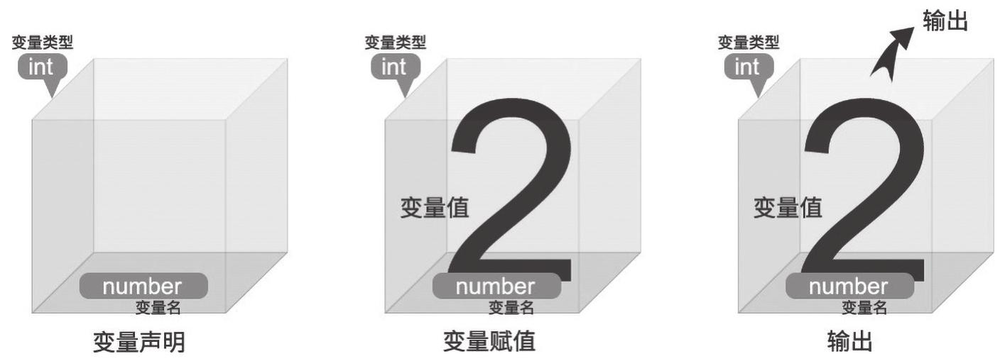
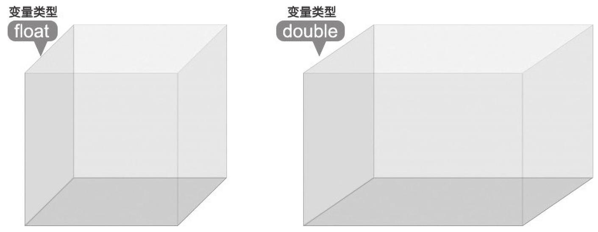

> 在上节课当中我们学习了如何声明常量与变量，但是并未学习变量的赋值，只见识到了常量的声明赋值，那么常量又是如何赋值的呢？  
> 这节课我们将系统学习赋值语句。

C++中的赋值语句用于将一个表达式的值赋给一个变量。赋值运算符`=`（等号）用于执行赋值操作。以下是关于 C++赋值语句的一些重要信息：

**一般形式：**

```
变量 = 表达式;
```

在这里，`变量`是要接收值的变量，而`表达式`是计算出一个值的表达式。这个值可以是一个常量、另一个变量的值，或者一个复杂的表达式。

**示例：**

```cpp
int a = 5;
```

在这个示例中，整数变量`a`接收了值 5。

也可以在声明时使用一个声明变量声明多个变量

```cpp
int a = 1, b = 2, c;
```

在这个示例中，整数变量`a`接收了值 1，整数变量`b`接收了值 2，整数变量`c`未接收值。

- 「赋值运算符」（`= `），它的作用是将它右侧的一个值赋值给左侧的一个变量，让变量这个「盒子」里面装上右侧的值。例如：

- 示例代码

```cpp{4,5,6}
#include <iostream>
using namespace std;
int main() {
    int number;
    number = 2;
    cout << number << endl;
    return 0;
}
```

通过刚才的几行代码，就完成了如图所示的一个过程。

<div class="my-img text-center">
    
</div>

**赋值语句的注意事项：**

1. 赋值运算符右边的表达式可以包括其他赋值表达式，因此可以形成链式的赋值。

   ```cpp
   a = b = c = 5; // 将5赋给a、b和c
   ```

2. 当进行赋值运算时，如果赋值运算符两边的数据类型不同，系统将会自动进行类型转换。例如，如果左边是整数而右边是浮点数，浮点数将被截取成整数。

   ```cpp
   int x = 5;
   double y = 3.7;
   x = y; // x将成为3，小数部分被截取
   ```

> 小练习 输入两个正整数 a 和 b,试交换 a、b 的值（使 a 的值等于 b,b 的值等于 a）

> 小提示 交换两个变量的值方法很多，一般我们采用引入第三个变量的算法，两个变量 交换，可以想像成一瓶酱油和一瓶醋进行交换，这时容易想到拿一个空瓶子过来：  
> 将酱油倒到空瓶中 => 将醋倒到酱油瓶中 => 将原空瓶中的酱油倒到醋瓶中。

:::details 答案

<br />

```cpp
#include <iostream>
using namespace std;
int main() {
    int a = 1, b = 2, c;
    c = a;
    a = b;
    b = c;
    cout << "a=" << a << ", b=" << b << endl;
    return 0;
}

```

这个程序首先从用户那里获取两个整数 a 和 b 的值，然后使用一个额外的变量 c 来实现 a 和 b 的值交换。交换后，程序输出了 a 和 b 的新值。

:::

> C++ 中只能对整数类型进行运算吗？ 当然不是了，如果需要用变量存储非整数的数值，如 3.5 这样的小数，可以采用浮点数类型。

C++ 中有两种主要的浮点类型，分别是：

1. **float 类型（单精度浮点数类型）**：它用于表示单精度浮点数，通常占用 4 个字节。这意味着它可以表示较小范围的小数，但精度相对较低。

2. **double 类型（双精度浮点数类型）**：它用于表示双精度浮点数，通常占用 8 个字节。相比于 float，double 类型具有更大的数据范围，可以表示更广范围的小数，并提供更高的精度。

在进行除法运算或需要高精度的小数计算时，通常建议使用 **double 类型** 来存储小数，因为它具有更高的精度和更大的数据范围。例如，可以使用 `double` 来表示小数如 1.5，以确保计算结果的准确性。

<div class="my-img text-center">
    
</div>

> 小练习 设计一个程序来计算正方形的周长和面积。用 double 类型定义一个变量 length，用来存储正方形的边长，然后输出当边长为 2.5 时，这个正方形的周长和面积。

首先写出 C++ 的基本代码框架：

```cpp{4}
#include <iostream>
using namespace std;
int main() {

    return 0;
}
```

在第四行声明一个 double 类型的变量 length 并将 2.5 赋值给 length，然后通过正方形的周长公式和面积公式，输出这两个表达式的值就可以了。聪明的你，思考一下如何输出正方形的周长和面积。

正方形的周长公式：4×length。

正方形的面积公式：length×length。

:::details 答案

<br />

```cpp{4,5,6}
#include <iostream>
using namespace std;
int main() {
    double length = 2.5;
    cout << "周长：" << 4 * length << endl;
    cout << "面积：" << length * length << endl;
    return 0;
}
```

:::

## 重点小结

- **「赋值运算符」（`= `）**，它的作用是将它右侧的一个值赋值给左侧的一个变量
