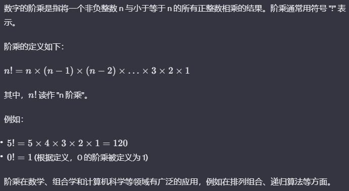

:::tip
当我们提到 C++程序的控制结构时，通常包括**条件语句（if、switch 语句）**、**循环语句（for、while、do-while 循环）**和**跳转语句（break、continue、return 语句）**
:::

## **if 语句**

> 当你写程序时，有时候你希望根据一些条件来决定程序的执行路径。这时就需要使用条件语句。在 C++中，主要的条件语句是 `if` 语句。

:::details 示例

### 1. **if 语句的基本结构：**

```cpp
if (条件) {
    // 如果条件为真，执行这里的代码块
} else {
    // 如果条件为假，执行这里的代码块
}
```

- **示例：**

  ```cpp
  #include <iostream>
  using namespace std;
  int main() {
      int age = 10;

      if (age >= 13) {
          cout << "你可以加入青少年群组！" << endl;
      } else {
          cout << "你还年轻，等到13岁再来吧。" << endl;
      }

      return 0;
  }
  ```

### 2. **嵌套 if 语句：**

你可以在一个 `if` 语句内部再嵌套一个 `if` 语句，以处理更复杂的条件。

```cpp
if (条件1) {
    // 如果条件1为真，执行这里的代码块
    if (条件2) {
        // 如果条件2也为真，执行这里的代码块
    } else {
        // 如果条件2为假，执行这里的代码块
    }
} else {
    // 如果条件1为假，执行这里的代码块
}
```

### 3. **多条件判断：**

你可以使用逻辑运算符（`&&`、`||`）组合多个条件。

- `&&` 表示逻辑与，只有所有条件都为真时，整个条件才为真。
- `||` 表示逻辑或，只要有一个条件为真，整个条件就为真。

```cpp
if (条件1 && 条件2) {
    // 如果条件1和条件2都为真，执行这里的代码块
}

if (条件1 || 条件2) {
    // 如果条件1或条件2为真，执行这里的代码块
}
```

### 4. **if-else if-else 链：**

当有多个条件需要判断时，可以使用 `else if` 链。

```cpp
if (条件1) {
    // 如果条件1为真，执行这里的代码块
} else if (条件2) {
    // 如果条件1为假，且条件2为真，执行这里的代码块
} else {
    // 如果前面的条件都为假，执行这里的代码块
}
```

### 5. **三元运算符（Conditional Operator）：**

`三元运算符` 是一种紧凑的写法，可以用来替代简单的 `if-else` 结构。

```cpp
(条件) ? 表达式1 : 表达式2;
```

- 如果条件为真，则返回表达式 1 的值，否则返回表达式 2 的值。
- 示例:

  ```cpp
  #include <iostream>
  using namespace std;
  int main() {
    int age = 15;
    const char* status = (age >= 18) ? "成年人" : "未成年人";
    cout << "你是一个" << status << "。" << endl;
    return 0;
  }
  ```

:::

:::details 小练习

1. 输入三个整数，按从大到小的顺序输出(空格隔开)

2. 乘坐飞机时，当乘客行李小于等于`20`公斤时，按每公斤`1. 68`元收费，大于`20`公斤时，按每公斤`1.98`元收费，编程计算收费(保留`2`位小数)

3. 给定一个整数，判断该数是奇数还是偶数。如果`n`是奇数.输出`odd`;如果`n`是偶数，输出`even`

:::

:::details 答案

1. 输入三个整数，按从大到小的顺序输出

```cpp
#include <iostream>
using namespace std;
int main() {
    int a, b, c;
    cout << "请输入三个整数，用空格隔开：";
    // cin 空格 or enter 完成连续输入
    cin >> a >> b >> c;
    if (a >= b && a >= c) {
        if (b >= c) {
            cout << a << " " << b << " " << c << endl;
        } else {
            cout << a << " " << c << " " << b << endl;
        }
    } else if (b >= a && b >= c) {
        if (a >= c) {
            cout << b << " " << a << " " << c << endl;
        } else {
            cout << b << " " << c << " " << a << endl;
        }
    } else {
        if (a >= b) {
            cout << c << " " << a << " " << b << endl;
        } else {
            cout << c << " " << b << " " << a << endl;
        }
    }
    return 0;
}
```

2. 计算飞机行李费用

```cpp
#include <iostream>
#include <cstdio>
using namespace std;
int main() {
    double weight, fee;
    cout << "请输入行李重量（公斤）：";
    cin >> weight;
    if (weight <= 20) {
        fee = weight * 1.68;
    } else {
        fee = weight * 1.98;
    }
    // `%.2f` 表示要输出的浮点数保留两位小数
    printf("行李费用为：%.2f元\n", fee);
    return 0;
}
```

3. 判断奇偶数

```cpp
#include <iostream>
using namespace std;
int main() {
    int n;
    cout << "请输入一个整数：";
    cin >> n;
    if (n % 2 == 0) {
        cout << "even" << endl;
    } else {
        cout << "odd" << endl;
    }
    return 0;
}
```

:::

## **switch 语句**

> `switch` 语句用于根据表达式的值选择性地执行一组语句中的一部分。它提供了一种比多个嵌套的 `if-else` 语句更清晰的方式来处理多个可能的情况。

:::details 示例

### 1. **基本结构：**

```cpp
switch (表达式) {
    case 值1:
        // 如果表达式的值等于值1，执行这里的代码块
        break; // 可选，用于跳出 switch 语句
    case 值2:
        // 如果表达式的值等于值2，执行这里的代码块
        break;
    // 可以有更多的 case 语句
    default:
        // 如果表达式的值与任何一个 case 不匹配，执行这里的代码块
}
```

- `switch` 语句中的 `case` 标签包含常量值，当表达式的值匹配某个 `case` 的值时，将执行该 `case` 下的代码块。
- `break` 语句用于终止 `switch` 语句，防止继续执行下一个 `case`。
- `default` 标签是可选的，用于指定当表达式的值与所有 `case` 不匹配时要执行的代码块。

### 2. **示例：**

```cpp
#include <iostream>
using namespace std;

int main() {
    int day = 3;

    switch (day) {
        case 1:
            cout << "星期一" << endl;
            break;
        case 2:
            cout << "星期二" << endl;
            break;
        case 3:
            cout << "星期三" << endl;
            break;
        case 4:
            cout << "星期四" << endl;
            break;
        case 5:
            cout << "星期五" << endl;
            break;
        default:
            cout << "周末" << endl;
    }

    return 0;
}
```

上述代码将输出：

```
星期三
```

### 3. **注意事项：**

- 每个 `case` 后面都需要有一个 `break` 语句，以防止继续执行下一个 `case`。
- `default` 标签可以放在 `switch` 语句的任意位置，但通常放在最后。
- 表达式的类型可以是整数、字符或枚举类型。

### 4. **多个 `case` 共用代码：**

如果多个 `case` 需要执行相同的代码块，可以使用 `case` 标签的穿透性，不写 `break`。

```cpp
#include <iostream>
using namespace std;

int main() {
    int day = 3;

    switch (day) {
        case 1:
        case 2:
        case 3:
        case 4:
        case 5:
            cout << "工作日" << endl;
            break;
        case 6:
        case 7:
            cout << "周末" << endl;
            break;
        default:
            cout << "无效的日期" << endl;
    }

    return 0;
}
```

上述代码将输出：

```
工作日
```

:::

:::details 小练习

1. 一个最简单的计算器支持四种运算。输入只有一行：两个参加运 算的数和一个操作符`(+, —,\*,/)`。输出运算表达式的结果。考虑下面两种情况：

   - 如果出现除数为 `0` 的情况，则输出:Divided by zero!
   - 如果出现无效的操作符(即不为,+,-, \* ,/之一)，则输出：Invalid operator!

2. 判断某年是否是闰年。如果公元 `x` 年是闰年输出 `Y`,否则输岀 `N`
   > 什么是闰年？  
   > 闰年是指一个年份能够被 `4` 整除，但不能被 `100` 整除，除非它同时能够被 `400` 整除。通常，闰年有 `366` 天，而平年有 `365` 天。  
   > 具体判断方法如下：
   >
   > 1. 如果年份能够被 `4` 整除，但不能被 `100` 整除，那么这一年是闰年。
   > 2. 如果年份能够被 `100` 整除，但同时能够被 `400` 整除，那么这一年也是闰年。
   > 3. 其他情况下，年份不是闰年。  
   >    例如：
   >
   > - `2000` 年是闰年，因为它能够被 `4` 整除，且能够被 `100` 整除，同时也能够被 `400` 整除。
   > - `1900` 年不是闰年，因为它能够被 `4` 整除，但同时也能够被 `100` 整除，但不能被 `400` 整除。
   > - `2020` 年是闰年，因为它能够被 `4` 整除，且不能被 `100` 整除。
   > - `2022` 年不是闰年，因为它不能被 `4` 整除。

:::

:::details 答案

1. 计算器程序

```cpp
#include <iostream>
using namespace std;
int main() {
    double num1, num2, result;
    char op;
    cout << "请输入表达式（第一个数，操作符，第二个数。用空格隔开）：";
    cin >> num1 >> op >> num2;
    switch (op) {
        case '+':
            result = num1 + num2;
            cout << "结果：" << result << endl;
            break;
        case '-':
            result = num1 - num2;
            cout << "结果：" << result << endl;
            break;
        case '*':
            result = num1 * num2;
            cout << "结果：" << result << endl;
            break;
        case '/':
            if (num2 != 0) {
                result = num1 / num2;
                cout << "结果：" << result << endl;
            } else {
                cout << "Divided by zero!" << endl;
            }
            break;
        default:
            cout << "Invalid operator!" << endl;
    }
    return 0;
}
```

2. 判断闰年程序

```cpp
#include <iostream>
using namespace std;
int main() {
    int year;
    cout << "请输入年份：";
    cin >> year;
    switch ((year % 4 == 0 && year % 100 != 0) || (year % 400 == 0)) {
        case true:
            cout << "Y" << endl;
            break;
        case false:
            cout << "N" << endl;
            break;
    }
    return 0;
}
```

:::

## **for 循环**

> 在编程中，经常需要重复执行一段代码块，这时候就需要使用循环语句。`for` 循环是 C++ 中常用的一种循环结构，用于按照指定次数重复执行一组语句。

:::details 示例

### 1. **基本结构：**

```cpp
for (初始化; 条件; 更新) {
    // 循环体，当条件为真时执行
}
```

- **初始化：** 在循环开始前执行，一般用于初始化计数器或设置循环变量的初始值。
- **条件：** 在每次循环迭代前检查，如果条件为真，则执行循环体；如果为假，则跳出循环。
- **更新：** 在每次循环迭代结束后执行，一般用于更新计数器或循环变量的值。

### 2. **示例：**

```cpp
#include <iostream>
using namespace std;

int main() {
    // 打印数字 1 到 5
    for (int i = 1; i <= 5; ++i) {
        cout << i << " ";
    }

    return 0;
}
```

### 3. **循环控制语句：**

在循环中，有时候需要提前结束循环或跳过本次循环的剩余部分。这时可以使用循环控制语句：

- **`break`：** 提前结束循环，跳出循环体。

  ```cpp
  for (int i = 1; i <= 10; ++i) {
      if (i == 5) {
          break; // 当 i 等于 5 时，跳出循环
      }
      cout << i << " ";
  }
  ```

- **`continue`：** 跳过本次循环的剩余部分，进入下一次循环。

  ```cpp
  for (int i = 1; i <= 5; ++i) {
      if (i == 3) {
          continue; // 当 i 等于 3 时，跳过本次循环的剩余部分
      }
      cout << i << " ";
  }
  ```

### 4. **嵌套循环：**

在一个循环内部可以再嵌套其他循环，形成嵌套循环结构。

```cpp
for (int i = 1; i <= 3; ++i) {
    for (int j = 1; j <= 3; ++j) {
        cout << i << "," << j << " ";
    }
    cout << endl;
}
```

上述嵌套循环将输出：

```
1,1 1,2 1,3
2,1 2,2 2,3
3,1 3,2 3,3
```

### 5. **Range-based for 循环（C++11 引入）：**

用于遍历容器（如数组、向量）中的元素，语法更为简洁。

```cpp
#include <iostream>
#include <vector>
using namespace std;

int main() {
    vector<int> numbers = {1, 2, 3, 4, 5};

    // 使用 range-based for 循环遍历向量中的元素
    for (int num : numbers) {
        cout << num << " ";
    }

    return 0;
}
```

:::

:::details 小练习

1. 输出`1〜100`之间所有偶数

2. 利用`for`循环，分别计算`1〜100`中奇数的和、偶数的和

3. 输入希望生成的菲波那契数列的项数 `n`，然后使用 `for` 循环生成并输出前 `n` 项的菲波那契数列

   > 菲波那契数列（Fibonacci sequence）是一个数学上非常有趣的序列，其定义如下：
   >
   > 1. 第一个和第二个数是 1：F(1) = F(2) = 1。
   > 2. 从第三个数开始，每个数都是前两个数的和：F(n) = F(n-1) + F(n-2)（其中 n > 2）。

   > 因此，菲波那契数列的前几项是：1, 1, 2, 3, 5, 8, 13, 21, 34, ... 以此类推。  
   > 这个数列以意大利数学家列昂纳多·斐波那契（Leonardo Fibonacci）的名字命名。他在 1202 年的《计算之书》中首次引入这个数列，用于描述兔子繁殖的情况。这个数列在数学、计算机科学和自然界的建模等领域中都有重要的应用。

:::

:::details 答案

1. 输出 `1〜100` 之间所有偶数

```cpp
#include <iostream>
using namespace std;
int main() {
    cout << "1〜100之间的所有偶数为：";
    for (int i = 2; i <= 100; i += 2) {
        cout << i << " ";
    }
    cout << endl;
    return 0;
}
```

2. 计算 `1〜100` 中奇数的和、偶数的和

```cpp
#include <iostream>
using namespace std;
int main() {
    int oddSum = 0, evenSum = 0;
    for (int i = 1; i <= 100; ++i) {
        if (i % 2 == 0) {
            evenSum += i;
        } else {
            oddSum += i;
        }
    }
    cout << "1〜100中奇数的和为：" << oddSum << endl;
    cout << "1〜100中偶数的和为：" << evenSum << endl;
    return 0;
}
```

3. 使用 `for` 循环处理的 `C++` 菲波那契数列

```cpp
#include <iostream>
using namespace std;
int main() {
    int n;
    cout << "请输入菲波那契数列的项数：";
    cin >> n;
    int a = 0, b = 1;
    cout << "菲波那契数列前 " << n << " 项为：";
    for (int i = 1; i <= n; ++i) {
        cout << b << " ";
        int nextTerm = a + b;
        a = b;
        b = nextTerm;
    }
    cout << endl;
    return 0;
}
```

:::

## **while 循环**

> `while` 循环是 C++ 中另一种常用的循环结构，用于在指定条件为真时重复执行一组语句。

:::details 示例

### 1. **基本结构：**

```cpp
while (条件) {
    // 循环体，当条件为真时执行
}
```

- **条件：** 在每次循环迭代前检查，如果条件为真，则执行循环体；如果为假，则跳出循环。

### 2. **示例：**

```cpp
#include <iostream>
using namespace std;

int main() {
    int count = 1;

    // 打印数字 1 到 5
    while (count <= 5) {
        cout << count << " ";
        ++count;
    }

    return 0;
}
```

### 3. **do-while 循环：**

`do-while` 循环是一种与 `while` 循环相似的结构，不同之处在于它先执行一次循环体，然后再检查条件是否为真。

```cpp
#include <iostream>
using namespace std;

int main() {
    int count = 1;

    // 打印数字 1 到 5
    do {
        cout << count << " ";
        ++count;
    } while (count <= 5);

    return 0;
}
```

### 4. **循环控制语句：**

与 `for` 循环类似，`while` 循环也可以使用 `break` 和 `continue` 来提前结束循环或跳过本次循环的剩余部分。

- **`break`：** 提前结束循环，跳出循环体。

  ```cpp
  int count = 1;
  while (count <= 10) {
      if (count == 5) {
          break; // 当 count 等于 5 时，跳出循环
      }
      cout << count << " ";
      ++count;
  }
  ```

- **`continue`：** 跳过本次循环的剩余部分，进入下一次循环。

  ```cpp
  int count = 1;
  while (count <= 5) {
      if (count == 3) {
          continue; // 当 count 等于 3 时，跳过本次循环的剩余部分
      }
      cout << count << " ";
      ++count;
  }
  ```

### 5. **无限循环：**

有时候需要创建一个无限循环，可以使用 `while(true)` 或 `for(;;)`。

```cpp
while (true) {
    // 无限循环体
}
```

### 6. **嵌套循环：**

与 `for` 循环一样，`while` 循环也可以嵌套使用。

```cpp
int outer = 1;
while (outer <= 3) {
    int inner = 1;
    while (inner <= 3) {
        cout << outer << "," << inner << " ";
        ++inner;
    }
    ++outer;
    cout << endl;
}
```

上述嵌套循环将输出：

```
1,1 1,2 1,3
2,1 2,2 2,3
3,1 3,2 3,3
```

:::

:::details 小练习

1. 编一程序求满足不等式`1 + 1/2 + 1/3 + ··· + 1/n > = 5`的最小`n`值

2. 一球从某一高度`h`落下(单位米)，每次落地后反跳回原来高度的一半，再落下。编程计 算气球在第`10`次落地时，共经过多少米？第`10`次反弹多高？输岀包含两行，第`1`行：到球第`10`次落地时，一共经过的米数。第`2`行：第`10`次弹跳的高度

3. 求两个正整数`m`、`n`的最大公约数

   > 什么是最大公约数？
   > 最大公约数（Greatest Common Divisor，简称 GCD），也被称为最大公因数或最大公因子，是指两个或多个整数共有的最大的正整数约数。  
   > 以两个整数 m 和 n 为例，它们的最大公约数记为 GCD(m, n)。GCD 的计算方式通常采用欧几里德算法。这个算法的基本思想是：
   >
   > 1. 如果 m 能被 n 整除，那么 GCD(m, n) = n；
   > 2. 否则，GCD(m, n) = GCD(n, m % n)。

   > 重复这个过程，直到 n 变为 0，此时的 m 就是最大公约数。  
   > 例如，计算 GCD(48, 18)：
   >
   > 1. 48 不能被 18 整除，于是计算 GCD(18, 48 % 18) = GCD(18, 12)；
   > 2. 18 不能被 12 整除，于是计算 GCD(12, 18 % 12) = GCD(12, 6)；
   > 3. 12 不能被 6 整除，于是计算 GCD(6, 12 % 6) = GCD(6, 0)。

   > 当 n 变为 0 时，最大公约数是 6。  
   > 最大公约数在数学和计算机科学等领域有着广泛的应用，例如简化分数、求解线性同余方程等。

:::

:::details 答案

1. 求满足不等式 `1 + 1/2 + 1/3 + ··· + 1/n >= 5` 的最小 `n` 值

```cpp
#include <iostream>
using namespace std;
int main() {
    double sum = 0.0;
    int n = 0;
    while (sum < 5.0) {
        ++n;
        sum += 1.0 / n;
    }
    cout << "满足不等式的最小 n 值为：" << n << endl;
    return 0;
}
```

2. 计算球的反弹问题

```cpp
#include <iostream>
using namespace std;
int main() {
    double h, total_distance = 0, current_height;
    int n = 10;  // 落地次数
    cout << "请输入初始高度 h (米): ";
    cin >> h;
    current_height = h;
    for (int i = 1; i <= n; i++) {
        total_distance += current_height; // 下落距离
        current_height /= 2;             // 反弹高度
        if (i < n) {
            total_distance += current_height; // 上升距离（最后一次不加）
        }
    }
    cout << "到球第10次落地时，一共经过的米数: " << total_distance << " 米" << endl;
    cout << "第10次弹跳的高度: " << current_height << " 米" << endl;
    return 0;
}
```

3. 求两个正整数 `m`、`n` 的最大公约数

```cpp
#include <iostream>
using namespace std;
int main() {
    int m, n;
    cout << "请输入两个正整数 m 和 n：";
    cin >> m >> n;
    while (n != 0) {
        int temp = n;
        n = m % n;
        m = temp;
    }
    cout << "最大公约数是：" << m << endl;
    return 0;
}
```

:::

## **do-while 循环**

> `do-while` 循环是 C++ 中一种具有特殊结构的循环，它先执行一次循环体，然后在检查条件是否为真。这确保循环体至少执行一次。

:::details 示例

### 1. **基本结构：**

```cpp
do {
    // 循环体，至少执行一次
} while (条件);
```

- **条件：** 在每次循环迭代前检查，如果条件为真，则继续执行循环体；如果为假，则跳出循环。

### 2. **示例：**

```cpp
#include <iostream>
using namespace std;

int main() {
    int count = 1;

    // 打印数字 1 到 5
    do {
        cout << count << " ";
        ++count;
    } while (count <= 5);

    return 0;
}
```

### 3. **循环控制语句：**

与 `while` 循环一样，`do-while` 循环也可以使用 `break` 和 `continue` 来提前结束循环或跳过本次循环的剩余部分。

- **`break`：** 提前结束循环，跳出循环体。

  ```cpp
  int count = 1;
  do {
      if (count == 5) {
          break; // 当 count 等于 5 时，跳出循环
      }
      cout << count << " ";
      ++count;
  } while (count <= 10);
  ```

- **`continue`：** 跳过本次循环的剩余部分，进入下一次循环。

  ```cpp
  int count = 1;
  do {
      if (count == 3) {
          continue; // 当 count 等于 3 时，跳过本次循环的剩余部分
      }
      cout << count << " ";
      ++count;
  } while (count <= 5);
  ```

### 4. **无限循环：**

有时候需要创建一个无限循环，可以使用 `do-while(true)`。

```cpp
do {
    // 无限循环体
} while (true);
```

### 5. **嵌套循环：**

与 `for` 循环和 `while` 循环一样，`do-while` 循环也可以嵌套使用。

```cpp
int outer = 1;
do {
    int inner = 1;
    do {
        cout << outer << "," << inner << " ";
        ++inner;
    } while (inner <= 3);
    ++outer;
    cout << endl;
} while (outer <= 3);
```

上述嵌套循环将输出：

```
1,1 1,2 1,3
2,1 2,2 2,3
3,1 3,2 3,3
```

:::

:::details 小练习

1. 角谷猜想，是指对于任意一个正整数，如果是奇数，则乘`3`加`1`,如果是偶数，则除以`2`,得到的结果再按照上述规则重复处理.最终总能够得到`1`。如假定初始整数为`5`,计算过程分别为`16、8、4、2、1`。程序要求输入一个整数，将经过处理得到`1`的过程输出来。最后一行输出`“End”`,如果输入为`1`,直接输出`“End”`

2. 给定一个整数`n(1 <= n <= 100000000)`,要求从个位开始分离出它的每一位数字。从个位开始按照从低位到高位的顺序依次输出每一位数字。

:::

:::details 答案

1. 角谷猜想

```cpp
#include <iostream>
using namespace std;
int main() {
    int num;
    cout << "请输入一个正整数：";
    cin >> num;
    do {
        if (num % 2 == 0) {
            num /= 2;
        } else {
            num = num * 3 + 1;
        }
        cout << num << " ";
    } while (num != 1);
    cout << "End" << endl;
    return 0;
}
```

2. 分离数字

```cpp
#include <iostream>
using namespace std;
int main() {
    int n;
    cout << "请输入一个整数：";
    cin >> n;
    cout << "分离出的每一位数字为：";
    do {
        int digit = n % 10;
        cout << digit << " ";
        n /= 10;
    } while (n != 0);
    cout << endl;
    return 0;
}
```

:::

## **break 语句**

> `break` 语句用于在`循环`或 `switch` 语句中提前结束代码块的执行。它通常用于在满足某个条件时立即终止循环，跳出循环体。

:::details 示例

### 1. **在循环中使用 `break`：**

```cpp
#include <iostream>
using namespace std;

int main() {
    for (int i = 1; i <= 10; ++i) {
        if (i == 5) {
            cout << "遇到 i 等于 5，跳出循环。" << endl;
            break;
        }
        cout << i << " ";
    }

    return 0;
}
```

上述代码将输出：

```
1 2 3 4 遇到 i 等于 5，跳出循环。
```

### 2. **在 `switch` 语句中使用 `break`：**

`break` 语句还可以用于 `switch` 语句中，用于跳出 `switch` 代码块，防止进入下一个 `case`。

```cpp
#include <iostream>
using namespace std;

int main() {
    int choice = 2;

    switch (choice) {
        case 1:
            cout << "选择了 1。" << endl;
            break;
        case 2:
            cout << "选择了 2。" << endl;
            break;
        case 3:
            cout << "选择了 3。" << endl;
            break;
        default:
            cout << "未知选择。" << endl;
            break;
    }

    return 0;
}
```

上述代码将输出：

```
选择了 2。
```

### 3. **在嵌套循环中使用 `break`：**

`break` 语句也可以在嵌套循环中使用，用于跳出最内层的循环。

```cpp
#include <iostream>
using namespace std;

int main() {
    for (int i = 1; i <= 3; ++i) {
        for (int j = 1; j <= 3; ++j) {
            cout << i << "," << j << " ";
            if (j == 2) {
                cout << "遇到 j 等于 2，跳出内层循环。" << endl;
                break;
            }
        }
    }

    return 0;
}
```

上述代码将输出：

```
1,1 1,2 遇到 j 等于 2，跳出内层循环。
2,1 2,2 遇到 j 等于 2，跳出内层循环。
3,1 3,2 遇到 j 等于 2，跳出内层循环。
```

### 4. **在 `while` 循环和 `do-while` 循环中使用 `break`：**

`break` 语句同样适用于 `while` 循环和 `do-while` 循环。

```cpp
#include <iostream>
using namespace std;

int main() {
    int count = 1;
    while (count <= 10) {
        if (count == 5) {
            cout << "遇到 count 等于 5，跳出循环。" << endl;
            break;
        }
        cout << count << " ";
        ++count;
    }

    return 0;
}
```

上述代码将输出：

```
1 2 3 4 遇到 count 等于 5，跳出循环。
```

:::

:::details 小练习

1. 找出第一个能被`3`整除的正整数

2. 计算输入数字的阶乘，当结果大于`100`时停止计算
   <div class="my-img text-center">
   
   </div>

:::

:::details 答案

1. 找出第一个能被 `3` 整除的正整数

```cpp
#include <iostream>
using namespace std;
int main() {
    int num = 1;
    while (true) {
        if (num % 3 == 0) {
            cout << "第一个能被3整除的正整数是：" << num << endl;
            break;
        }
        ++num;
    }
    return 0;
}
```

2. 计算输入数字的阶乘，当结果大于 `100` 时停止计算

```cpp
#include <iostream>
using namespace std;
int main() {
    int num;
    cout << "请输入一个整数：";
    cin >> num;
    int factorial = 1;
    int i = 1;
    while (true) {
        factorial *= i;
        if (factorial > 100) {
            break;
        }
        ++i;
    }
    cout << num << " 的阶乘大于100的最小整数是：" << i << endl;
    return 0;
}
```

:::

## **continue 语句**

> `continue` 语句用于跳过循环体中余下的代码，直接进入下一次循环的迭代。它通常与条件语句一起使用，用于在满足特定条件时跳过本次循环的剩余部分。

:::details 示例

### 1. **在 `for` 循环中使用 `continue`：**

```cpp
#include <iostream>
using namespace std;

int main() {
    for (int i = 1; i <= 5; ++i) {
        if (i == 3) {
            cout << "遇到 i 等于 3，跳过本次循环。" << endl;
            continue;
        }
        cout << i << " ";
    }

    return 0;
}
```

上述代码将输出：

```
1 2 遇到 i 等于 3，跳过本次循环。
4 5
```

### 2. **在 `while` 循环和 `do-while` 循环中使用 `continue`：**

`continue` 语句同样适用于 `while` 循环和 `do-while` 循环。

```cpp
#include <iostream>
using namespace std;

int main() {
    int count = 1;
    while (count <= 5) {
        if (count == 3) {
            cout << "遇到 count 等于 3，跳过本次循环。" << endl;
            ++count;
            continue;
        }
        cout << count << " ";
        ++count;
    }

    return 0;
}
```

上述代码将输出：

```
1 2 遇到 count 等于 3，跳过本次循环。
4 5
```

### 3. **在嵌套循环中使用 `continue`：**

`continue` 语句也可以在嵌套循环中使用，用于跳过内层循环的剩余部分。

```cpp
#include <iostream>
using namespace std;

int main() {
    for (int i = 1; i <= 3; ++i) {
        for (int j = 1; j <= 3; ++j) {
            if (j == 2) {
                cout << "遇到 j 等于 2，跳过本次内层循环。" << endl;
                continue;
            }
            cout << i << "," << j << " ";
        }
    }

    return 0;
}
```

上述代码将输出：

```
1,1 遇到 j 等于 2，跳过本次内层循环。
1,3
2,1 遇到 j 等于 2，跳过本次内层循环。
2,3
3,1 遇到 j 等于 2，跳过本次内层循环。
3,3
```

:::

:::details 小练习

1. 输出 `1` 到 `10` 之间的奇数

2. 计算 `1` 到 `100` 之间的所有整数的和，但跳过能被 `5` 整除的数

:::

:::details 答案

1. 输出 `1` 到 `10` 之间的奇数

```cpp
#include <iostream>
using namespace std;
int main() {
    cout << "1 到 10 之间的奇数为：";
    for (int i = 1; i <= 10; ++i) {
        if (i % 2 == 0) {
            // 跳过偶数
            continue;
        }
        cout << i << " ";
    }
    cout << endl;
    return 0;
}
```

2. 计算 `1` 到 `100` 之间的所有整数的和，但跳过能被 `5` 整除的数

```cpp
#include <iostream>
using namespace std;
int main() {
    int sum = 0;
    for (int i = 1; i <= 100; ++i) {
        if (i % 5 == 0) {
            // 跳过能被 5 整除的数
            continue;
        }
        sum += i;
    }
    cout << "1 到 100 之间不能被 5 整除的整数的和是：" << sum << endl;
    return 0;
}
```

:::

## **return 语句**

> `return` 语句用于从函数中返回值，并终止函数的执行。在 C++ 中，函数可以返回各种类型的值，包括整数、浮点数、字符、指针等。

:::details 示例

### 1. **在函数中使用 `return`：**

```cpp
#include <iostream>
using namespace std;

// 函数声明
int add(int a, int b);

int main() {
    int result = add(5, 3);
    cout << "结果是: " << result << endl;

    return 0;
}

// 函数定义
int add(int a, int b) {
    int sum = a + b;
    return sum; // 返回 sum 的值并终止函数
}
```

上述代码将输出：

```
结果是: 8
```

### 2. **返回其他类型的值：**

```cpp
#include <iostream>
using namespace std;

// 函数声明
double divide(double a, double b);

int main() {
    double result = divide(10.0, 2.0);
    cout << "结果是: " << result << endl;

    return 0;
}

// 函数定义
double divide(double a, double b) {
    if (b == 0.0) {
        cout << "除数不能为零。" << endl;
        return 0.0; // 返回零并终止函数
    }

    double quotient = a / b;
    return quotient; // 返回商的值并终止函数
}
```

上述代码将输出：

```
结果是: 5
```

### 3. **在主函数中使用 `return`：**

在主函数 `main` 中使用 `return` 语句可以提前结束程序的执行。

```cpp
#include <iostream>
using namespace std;

int main() {
    cout << "开始执行主函数。" << endl;

    // 在主函数中使用 return 提前结束程序
    return 0;

    // 以下代码不会执行
    cout << "这段代码不会被执行。" << endl;
}
```

### 4. **在 void 函数中使用 `return`：**

在返回类型为 `void` 的函数中，可以使用 `return` 不带表达式，用于提前终止函数的执行。

```cpp
#include <iostream>
using namespace std;

void showMessage(int age) {
    if (age < 0) {
        cout << "年龄不能为负数。" << endl;
        return; // 提前结束函数
    }

    cout << "你的年龄是: " << age << " 岁。" << endl;
}

int main() {
    showMessage(25);
    showMessage(-5);

    return 0;
}
```

上述代码将输出：

```
你的年龄是: 25 岁。
年龄不能为负数。
```

:::

:::details 小练习

1. 编写函数计算两个整数的平方和，如果和大于 `100`，则返回 `0`

2. 编写函数判断一个数字是否为偶数，如果是偶数则返回 `true`，否则返回 `false`

:::

:::details 答案

1. 编写函数计算两个整数的平方和，如果和大于 `100`，则返回 `0`

```cpp
#include <iostream>
using namespace std;
int main() {
    int num1, num2;
    cout << "请输入两个整数：";
    cin >> num1 >> num2;
    int squareSum = num1 * num1 + num2 * num2;
    if (squareSum > 100) {
        cout << "平方和大于100，返回0" << endl;
        return 0;
    }
    cout << "平方和小于等于100的结果是：" << squareSum << endl;
    return 0;
}
```

2. 编写函数判断一个数字是否为偶数，如果是偶数则返回 `true`，否则返回 `false`

```cpp
#include <iostream>
using namespace std;
int main() {
    int number;
    cout << "请输入一个整数：";
    cin >> number;
    if (number % 2 == 0) {
        cout << number << " 是偶数" << endl;
        return 0;
    }
    cout << number << " 不是偶数" << endl;
    return 0;
}
```

:::

## 重点小结

- [if 语句](/introduction/controlStructure/#if-语句)
- [switch 语句](/introduction/controlStructure/#switch-语句)
- [for 语句](/introduction/controlStructure/#for-语句)
- [while 语句](/introduction/controlStructure/#while-语句)
- [do-while 语句](/introduction/controlStructure/#do-while-语句)
- [break 语句](/introduction/controlStructure/#break-语句)
- [continue 语句](/introduction/controlStructure/#continue-语句)
- [return 语句](/introduction/controlStructure/#return-语句)
