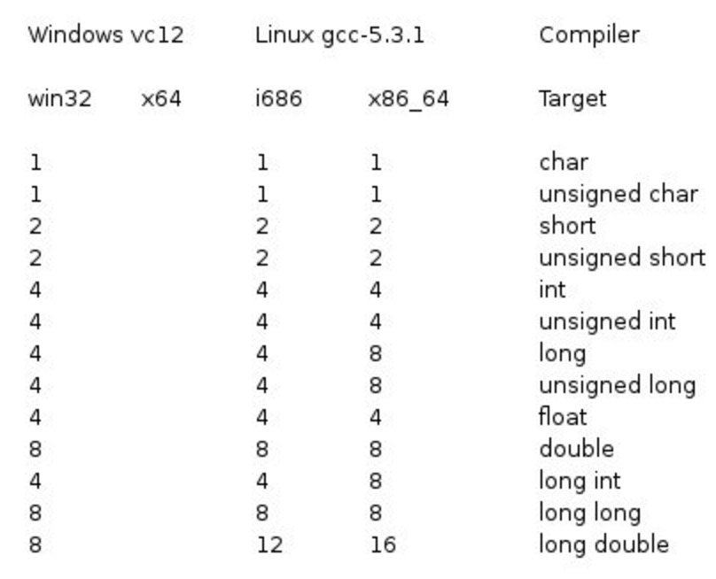

> 在学习常量与变量之前先让我们来了解一下 C++的数据类型，C++作为一种**强类型语言（strongly typed language）**。在强类型语言中，数据类型的严格检查是强制性的，这意味着变量在使用时必须具有明确定义的数据类型，而且不同数据类型之间的转换通常需要显式的类型转换或强制转换。  
> 在 C++中，必须在声明变量时指定其数据类型，例如 `int`, `double`, `char`, 等等。一旦变量被赋予了特定的数据类型，它将受到严格的数据类型规则的约束。这意味着不能直接将不同数据类型的值进行混合操作，而是需要进行类型转换，以确保操作的正确性。  
> 例如，如果有一个 `int` 类型的变量和一个 `double` 类型的变量，不能直接将它们相加，而需要使用类型转换操作来将它们转换为相同的数据类型，然后执行加法操作。  
> 强类型语言的优势在于它可以在编译时捕获很多类型相关的错误，从而提高程序的稳定性和可维护性。这有助于防止一些常见的类型错误，如数据类型不匹配，从而减少潜在的程序错误。

---

## C++ 数据类型

在 C++编程中，需要使用不同的数据类型来存储各种信息。变量是用来保留数据值的内存位置。当创建一个变量时，实际上是在内存中分配了一些存储空间。

C++提供了多种内置数据类型以及用户自定义数据类型的支持。以下是七种基本的 C++数据类型：

1. **布尔型（bool）**: 用于存储布尔值，可以是`true`或`false`。

2. **字符型（char）**: 用于存储单个字符，例如字母、数字或符号。

3. **整型（int）**: 用于存储整数值，包括正整数、负整数和零。

4. **浮点型（float）**: 用于存储单精度浮点数，表示带小数点的数值。

5. **双浮点型（double）**: 用于存储双精度浮点数，提供更高的精度。

6. **无类型（void）**: 通常用于函数返回类型，表示不返回任何值。

7. **宽字符型（wchar_t）**: 用于存储宽字符，可以用于国际化和多语言支持。

::: details 字节大小

<br />

<h2>字节大小</h2>

以下是一些常见的整数数据类型和它们在内存中占用的字节数以及可存储的最大值和最小值（注意，这些值可能会根据不同的编译器和系统有所变化）：

- **char**: 1 字节，范围通常是-128 到 127 或 0 到 255（取决于是否带符号）。
- **short int**: 2 字节，范围通常是-32,768 到 32,767 或 0 到 65,535（取决于是否带符号）。
- **int**: 4 字节，范围通常是-2,147,483,648 到 2,147,483,647 或 0 到 4,294,967,295（取决于是否带符号）。
- **long int**: 4 字节或 8 字节，范围通常与`int`相同或更大。
- **long long int**: 8 字节，范围通常是-9,223,372,036,854,775,808 到 9,223,372,036,854,775,807。

请注意，C++标准兼容早期 C 编译器的一些数据类型大小设定，但具体实现可能因不同系统而异。

这些是 C++的基本数据类型，可以使用它们来创建变量以存储各种不同类型的数据。

| 类型               | 位          | 范围                                                                |
| ------------------ | ----------- | ------------------------------------------------------------------- |
| char               | 1 字节      | -128 到 127 或 0 到 255                                             |
| unsigned char      | 1 字节      | 0 到 255                                                            |
| signed char        | 1 字节      | -128 到 127                                                         |
| int                | 4 字节      | -2,147,483,648 到 2,147,483,647                                     |
| unsigned int       | 4 字节      | 0 到 4,294,967,295                                                  |
| signed int         | 4 字节      | -2,147,483,648 到 2,147,483,647                                     |
| short int          | 2 字节      | -32,768 到 32,767                                                   |
| unsigned short int | 2 字节      | 0 到 65,535                                                         |
| signed short int   | 2 字节      | -32,768 到 32,767                                                   |
| long int           | 8 字节      | -9,223,372,036,854,775,808 到 9,223,372,036,854,775,807             |
| signed long int    | 8 字节      | -9,223,372,036,854,775,808 到 9,223,372,036,854,775,807             |
| unsigned long int  | 8 字节      | 0 到 18,446,744,073,709,551,615                                     |
| float              | 4 字节      | 精度型占 4 个字节（32 位）内存空间，+/- 3.4e +/- 38 (~7 个数字)     |
| double             | 8 字节      | 双精度型占 8 个字节（64 位）内存空间，+/- 1.7e +/- 308 (~15 个数字) |
| long double        | 16 字节     | 长双精度型 16 个字节（128 位）内存空间，可提供 18-19 位有效数字     |
| wchar_t            | 2 或 4 字节 | 1 个宽字符                                                          |

请注意，上述大小和范围信息可能会受到系统架构的影响，通常以 64 位系统为主。
以下列出了 32 位系统与 64 位系统的存储大小的差别（windows 相同）：

<div class="my-img text-center">
    
</div>

从上表可得知，变量的大小会根据编译器和所使用的电脑而有所不同。

> 那么我们如何查看自己电脑的各种数据类型大小呢？  
> **我们可以通过[sizeof](/introduction/operator/#杂项运算符) 操作符来获取变量类型所占空间的大小**
>
> ```cpp
> // 语法 （以 bool 类型示例）
> sizeof(bool)
> ```
>
> **我们还可以通过[numeric_limits](https://en.cppreference.com/w/cpp/types/numeric_limits)类模板来获取类型的最大最小值**
>
> ```cpp
> // 语法（以 bool 类型示例）
> // 需要在头文件引入
> <limits>
> // 最大值
> (numeric_limits<bool>::max)()
> // 最小值
> (numeric_limits<bool>::min)()
> ```

> 小练习 根据提供方法尝试写出字符型类型的大小以及最大最小值

::: details 答案

<br />

```cpp
#include<iostream>
#include <limits>

using namespace std;

int main()
{
    cout << "type: \t\t" << "************size**************"<< endl;
    cout << "bool: \t\t" << "所占字节数：" << sizeof(bool);
    cout << "\t最大值：" << (numeric_limits<bool>::max)();
    cout << "\t\t最小值：" << (numeric_limits<bool>::min)() << endl;
    cout << "char: \t\t" << "所占字节数：" << sizeof(char);
    cout << "\t最大值：" << (numeric_limits<char>::max)();
    cout << "\t\t最小值：" << (numeric_limits<char>::min)() << endl;
    cout << "signed char: \t" << "所占字节数：" << sizeof(signed char);
    cout << "\t最大值：" << (numeric_limits<signed char>::max)();
    cout << "\t\t最小值：" << (numeric_limits<signed char>::min)() << endl;
    cout << "unsigned char: \t" << "所占字节数：" << sizeof(unsigned char);
    cout << "\t最大值：" << (numeric_limits<unsigned char>::max)();
    cout << "\t\t最小值：" << (numeric_limits<unsigned char>::min)() << endl;
    cout << "wchar_t: \t" << "所占字节数：" << sizeof(wchar_t);
    cout << "\t最大值：" << (numeric_limits<wchar_t>::max)();
    cout << "\t\t最小值：" << (numeric_limits<wchar_t>::min)() << endl;
    cout << "short: \t\t" << "所占字节数：" << sizeof(short);
    cout << "\t最大值：" << (numeric_limits<short>::max)();
    cout << "\t\t最小值：" << (numeric_limits<short>::min)() << endl;
    cout << "int: \t\t" << "所占字节数：" << sizeof(int);
    cout << "\t最大值：" << (numeric_limits<int>::max)();
    cout << "\t最小值：" << (numeric_limits<int>::min)() << endl;
    cout << "unsigned: \t" << "所占字节数：" << sizeof(unsigned);
    cout << "\t最大值：" << (numeric_limits<unsigned>::max)();
    cout << "\t最小值：" << (numeric_limits<unsigned>::min)() << endl;
    cout << "long: \t\t" << "所占字节数：" << sizeof(long);
    cout << "\t最大值：" << (numeric_limits<long>::max)();
    cout << "\t最小值：" << (numeric_limits<long>::min)() << endl;
    cout << "unsigned long: \t" << "所占字节数：" << sizeof(unsigned long);
    cout << "\t最大值：" << (numeric_limits<unsigned long>::max)();
    cout << "\t最小值：" << (numeric_limits<unsigned long>::min)() << endl;
    cout << "double: \t" << "所占字节数：" << sizeof(double);
    cout << "\t最大值：" << (numeric_limits<double>::max)();
    cout << "\t最小值：" << (numeric_limits<double>::min)() << endl;
    cout << "long double: \t" << "所占字节数：" << sizeof(long double);
    cout << "\t最大值：" << (numeric_limits<long double>::max)();
    cout << "\t最小值：" << (numeric_limits<long double>::min)() << endl;
    cout << "float: \t\t" << "所占字节数：" << sizeof(float);
    cout << "\t最大值：" << (numeric_limits<float>::max)();
    cout << "\t最小值：" << (numeric_limits<float>::min)() << endl;
    cout << "size_t: \t" << "所占字节数：" << sizeof(size_t);
    cout << "\t最大值：" << (numeric_limits<size_t>::max)();
    cout << "\t最小值：" << (numeric_limits<size_t>::min)() << endl;
    cout << "string: \t" << "所占字节数：" << sizeof(string) << endl;
    // << "\t最大值：" << (numeric_limits<string>::max)() << "\t最小值：" << (numeric_limits<string>::min)() << endl;
    cout << "type: \t\t" << "************size**************"<< endl;
    return 0;
}
```

当上面的代码被编译和执行时，它会产生以下的结果，结果会根据所使用的计算机而有所不同：
| 类型 | 所占字节数 | 最大值 | 最小值 |
|------------------|------------|---------------------------|---------------------------|
| bool | 1 | 1 | 0 |
| char | 1 | 127 | -128 |
| signed char | 1 | 127 | -128 |
| unsigned char | 1 | 255 | 0 |
| wchar_t | 4 | 2,147,483,647 | -2,147,483,648 |
| short | 2 | 32,767 | -32,768 |
| int | 4 | 2,147,483,647 | -2,147,483,648 |
| unsigned | 4 | 4,294,967,295 | 0 |
| long | 8 | 9,223,372,036,854,775,807 | -9,223,372,036,854,775,808 |
| unsigned long | 8 | 18,446,744,073,709,551,615 | 0 |
| double | 8 | 1.79769e+308 | 2.22507e-308 |
| long double | 16 | 1.18973e+4932 | 3.3621e-4932 |
| float | 4 | 3.40282e+38 | 1.17549e-38 |
| size_t | 8 | 18,446,744,073,709,551,615 | 0 |
| string | 24 | | |
请注意，`string` 不是基本的 C++数据类型，而是标准库提供的数据类型，因此它没有明确定义的字节数、最大值和最小值。

:::

:::details typedef 声明

<br />

<h2>typedef 声明</h2>

在 C++中，可以使用 `typedef` 为一个已有的数据类型取一个新的名字。这可以使的代码更加可读和易于维护。以下是使用 `typedef` 定义一个新类型的语法示例：

```cpp
typedef type newname;
```

例如，下面的语句告诉编译器，`feet` 是 `int` 的另一个名称：

```cpp
typedef int feet;
```

现在，可以创建一个整型变量 `distance`，如下：

```cpp
feet distance;
```

这种方式使得代码更具可读性和可维护性。

> 小练习 给整型类型创建一个别名，并打印别名的所占空间的大小与最大最小值

:::details 答案

<br />

```cpp
#include <iostream>
#include <limits>
using namespace std;

int main()
{

    typedef int feet;
    cout << "type: \t\t" << "************size**************"<< endl;
    cout << "int: \t\t" << "所占字节数：" << sizeof(int);
    cout << "\t最大值：" << (numeric_limits<int>::max)();
    cout << "\t最小值：" << (numeric_limits<int>::min)() << endl;
    cout << "feet: \t\t" << "所占字节数：" << sizeof(feet);
    cout << "\t最大值：" << (numeric_limits<feet>::max)();
    cout << "\t最小值：" << (numeric_limits<feet>::min)() << endl;
    cout << "type: \t\t" << "************size**************"<< endl;
    return 0;
}
```

:::

:::details 枚举类型

<br />

<h2>枚举类型</h2>

C++ 中的枚举类型（enumeration，通常简称为枚举）是一种用户定义的数据类型，用于列举一组命名的整数值。枚举允许程序员为每个整数值分配一个可读性更好的名称，从而使代码更加清晰和易于理解。以下是关于 C++枚举类型的重要信息：

1. **定义枚举类型**：枚举类型的定义通常如下所示：

   ```cpp
   enum EnumName {
       Enumerator1,
       Enumerator2,
       // 更多枚举值
   };
   ```

   `EnumName` 是枚举类型的名称，而 `Enumerator1`、`Enumerator2` 等是枚举值（枚举成员）的名称。每个枚举值都关联一个整数值，默认情况下从 0 开始，逐个递增。

2. **指定枚举值的整数值**：可以显式地为枚举值分配整数值。例如：

   ```cpp
   enum Color {
       Red = 1,
       Green = 2,
       Blue = 4
   };
   ```

   在上面的例子中，Red 的整数值为 1，Green 的整数值为 2，Blue 的整数值为 4。

3. **访问枚举值**：通过枚举类型和枚举值的名称，可以访问相应的整数值。例如：

   ```cpp
   Color myColor = Red;
   int colorValue = myColor; // colorValue 现在等于1
   ```

4. **枚举的作用域**：枚举值的名称在枚举类型的作用域内是唯一的，但不会污染外部作用域。这意味着您可以在不同的枚举类型中使用相同的枚举值名称。

5. **枚举的默认底层类型**：C++中枚举的底层类型（underlying type）默认为整数类型（通常是 `int`）。您也可以显式指定底层类型，如：

   ```cpp
   enum class Day : char {
       Sunday,
       Monday,
       // ...
   };
   ```

   在上面的例子中，`Day` 是一个枚举类，其底层类型为 `char`。

6. **枚举类**：C++11 引入了枚举类（enum class），它提供了更强的类型安全性，枚举值的作用域被限制在枚举类型内，不会与其他作用域中的名称冲突。例如：

   ```cpp
   enum class Status {
       OK,
       Error
   };

   Status currentStatus = Status::OK; // 使用枚举类和作用域
   ```

7. **前置声明**：枚举可以进行前置声明，以允许在枚举定义之前使用枚举类型。

枚举类型在代码中通常用于提高代码的可读性，使得某些值在程序中具有更明确的语义。例如，可以使用枚举来表示颜色、星期几、状态等等。

:::

:::details 类型转换

<br />
<h2>类型转换</h2>

在 C++中，类型转换是将一个数据类型的值转换为另一个数据类型的值的过程。  
类型转换可以帮助您将数据在不同数据类型之间进行适当的转换，以满足表达式、函数调用或变量赋值的需求。C++提供了不同类型的类型转换方式，包括隐式类型转换和显式类型转换。以下是 C++中常见的类型转换方式：

1. **隐式类型转换**：

   - 隐式类型转换（又称为自动类型转换）是 C++编译器在不需要明确请求的情况下自动执行的转换。这些转换通常涉及到数据类型的提升（如从`int`到`double`）和窄化（如从`double`到`int`）。
   - 例如，将一个`int`赋值给一个`double`，C++编译器会自动执行从`int`到`double`的隐式类型转换。

2. **显式类型转换**：
   - 显式类型转换（或强制类型转换）是由程序员明确请求的类型转换，以确保精确的控制和避免不必要的数据损失。
   - C++提供了以下几种显式类型转换方式：
     - **C 风格类型转换**：使用 C 风格的类型转换操作符，如`(int)`，`(double)`，`(char*)`等。
     - **`static_cast`**：用于执行通常合法的转换，例如数字类型之间的转换，指针类型之间的转换，以及其他允许的转换。
     - **`dynamic_cast`**：主要用于执行安全的向下转换（通常在面向对象编程中使用）。
     - **`const_cast`**：用于从常量中删除`const`修饰符，或将`const`添加到非`const`变量。
     - **`reinterpret_cast`**：用于执行底层类型的转换，通常不推荐使用，因为它可能导致未定义的行为。

示例：

```cpp
double pi = 3.14159265;
int intValue = static_cast<int>(pi); // 显式将 double 转换为 int
const char* text = "Hello, World!";
char* nonConstText = const_cast<char*>(text); // 去除 const 修饰符
```

3. **用户自定义类型转换**：
   - C++还允许您为自定义类创建用户自定义的类型转换运算符。这些运算符可以根据需要执行对象之间的转换。最常见的是构造函数和转换运算符（`operator`关键字）。

这些类型转换允许在不同数据类型之间进行转换，但需要谨慎使用，以避免潜在的错误和问题。

> 小练习 请使用显示转换转换整型与布尔型，不需要输出
> 小提示 请使用声明语句 int intValue = 42; bool boolValue; 声明时可以直接对变量进行赋值

:::details 答案

<br />

```cpp
int intValue = 42;
bool boolValue = static_cast<bool>(intValue);
```

上述代码将整数`intValue`转换为布尔值`boolValue`。根据 C++的规则，任何非零的整数值在转换为布尔类型时将变为`true`，而整数 0 将变为`false`。

请注意，对于整数到布尔的转换，通常不需要显式地使用`static_cast`，因为这种转换是一种常见的隐式类型转换。上述代码只是为了演示显式转换的语法。
:::

:::details ASCII
<br />

<h2>ASCII表</h2>

在 C++中，字符数据类型（`char`）和 ASCII 码之间存在密切的关系，因为`char`数据类型用于表示单个字符，并且通常使用 ASCII 码来表示字符。以下是关于 C++字符数据类型和 ASCII 码之间的关系：

1. **`char`数据类型**：在 C++中，`char`是一种字符数据类型，用于存储单个字符。`char`类型通常占用 1 字节（8 位）的内存空间。

2. **ASCII 码**：ASCII（American Standard Code for Information Interchange）是一种用于表示字符的字符编码标准。它将每个字符映射到一个唯一的整数值，通常在 0 到 127 之间。ASCII 码包括基本的英文字母、数字、标点符号和一些特殊字符。**ASCII 码的数值代表了字符在计算机内部以二进制形式表示的值**。

3. **`char`和 ASCII 码的关系**：在 C++中，`char`类型的变量可以用来存储一个字符，例如：

   ```cpp
   char myChar = 'A';
   ```

   这里，`myChar`存储了字符'A'。在内部，`char`类型的变量被存储为对应的 ASCII 码值。例如，字符'A'的 ASCII 码值是 65，因此`myChar`变量实际上包含 ASCII 码值 65。

4. **类型转换**：`char`到整数类型之间的相互转换是常见的。您可以将`char`类型的变量转换为整数，以获取其 ASCII 码值：

   ```cpp
   char myChar = 'A';
   int asciiValue = static_cast<int>(myChar); // 获取字符'A'的ASCII码值，asciiValue 现在等于65
   ```

   另外，您也可以将整数值转换为`char`类型，以将 ASCII 码值转回字符：

   ```cpp
   int asciiValue = 65;
   char myChar = static_cast<char>(asciiValue); // 将ASCII码值65转换为字符'A'，myChar 现在包含字符'A'
   ```

5. **字符字面值**：C++还允许您使用字符字面值来表示字符。字符字面值通常使用单引号，如`'A'`。这使得在代码中直接表示字符更加方便。

`char`数据类型在 C++中用于存储字符，而 ASCII 码是用于表示字符的整数编码标准。`char`类型的变量存储字符时实际上存储了对应的 ASCII 码值。字符字面值和类型转换操作允许您在`char`和整数之间进行转换。这种关系使得在处理文本数据时，C++中的字符处理变得相当方便。后面我们将详细展开介绍

> 小练习 请根据[ASCII 表](https://www.asciim.cn/)以及`static_cast`打印 L 的 ASCII 码

:::details 答案
<br />

```cpp
#include <iostream>
using namespace std
int main() {
    cout << "ASCII码: " << static_cast<int>('L') << endl;
    return 0;
}
```

:::

---

## C++ 变量类型

C++ 数据类型和 C++ 变量类型之间有密切的关系，因为变量的类型决定了它可以存储的数据的种类和范围。以下是关于它们之间关系的要

- C++ 变量类型定义了变量的特性，包括可变性和是否为常量。
- 变量可以是常量，一旦被初始化后，其值不能被修改。
- 变量可以是可变的，其值可以在程序执行过程中改变。

**变量类型允许存储和操作不同类型的数据，具有不同的大小和范围。变量的名称可以由字母、数字和下划线组成，必须以字母或下划线开头。此外，C++是大小写敏感的，因此大写字母和小写字母被视为不同的字符。**

C++ 也允许定义各种其他类型的变量，比如**枚举**、**指针**、**数组**、**引用**、**数据结构**、**类**等等，这将会在后续的章节中进行讲解。

## 重点小结

### C++ 数据类型

1. **整型 (int)**: 用于存储整数值。可以声明整数常量，如 `const int myConstant = 42;`。

2. **字符型 (char)**: 用于存储单个字符。可以声明字符常量，如 `const char myChar = 'A';`。

3. **布尔型 (bool)**: 用于存储布尔值，即 `true` 或 `false`。可以声明布尔常量，如 `const bool isReady = true;`。

4. **浮点型 (float)**: 用于存储单精度浮点数。可以声明浮点常量，如 `const float pi = 3.14159;`。

5. **双精度浮点型 (double)**: 用于存储双精度浮点数。可以声明双精度常量，如 `const double gravity = 9.8;`。

6. **宽字符型 (wchar_t)**: 用于存储宽字符，通常用于国际化和多语言支持。可以声明宽字符常量，如 `const wchar_t currencySymbol = L'₹';`。

### C++ 变量类型

1. **常量变量**: 常量变量是一种不能被修改的变量，一旦被赋值，其值将在整个程序执行过程中保持不变。常量声明使用 `const` 关键字。例如：`const int myConstant = 42;`。

2. **可变变量**: 可变变量是普通的变量，其值可以在程序执行过程中改变。可变变量通常没有 `const` 关键字。

### 关系

- **变量的类型必须与存储的数据类型匹配**。变量的数据类型决定了它可以存储哪种类型的数据。
- 常量变量通常使用 `const` 关键字声明，这意味着它们是不可修改的，并且通常用于存储程序中的常数值。
- 变量的可变性（可修改性）是通过数据类型和是否带有 `const` 修饰符来确定的。

总之，C++ 数据类型定义了数据的种类和范围，而 C++ 变量类型定义了变量的特性，包括可变性和是否为常量。在 C++中，变量的数据类型必须与所存储的数据类型匹配，这是编写正确且高效的程序的关键。变量类型的选择也影响代码的可读性和可维护性。不同的数据类型和变量类型在不同情况下都有其用途。
