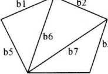
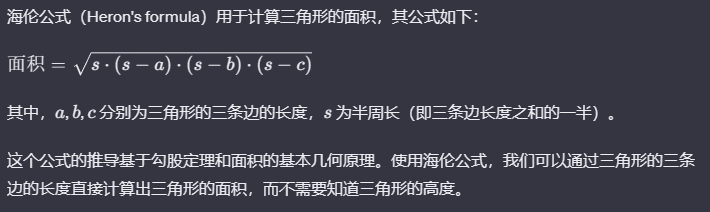

## 函数的定义

### 1. 函数定义的语法形式

```cpp
数据类型 函数名(形式参数表)
{
    // 函数体，包含执行语句
}
```

**说明**：

- **返回值类型**：函数的数据类型指定了函数的返回值类型。若数据类型为 `void`，则表示该函数无返回值。
- **函数名**：函数名是一个标识符。除了主函数名必须为 `main`，其他函数名可以自由选择，但应遵循标识符的命名规则，且最好取易于理解和记忆的名字。
- **形式参数**：形参表可以为空，表示无参函数，或包含多个形参，用逗号隔开。无论参数的有无，函数名后的圆括号都是必须的。形参必须有类型说明，可以是变量名、数组名或指针名。形参用于实现主调函数与被调函数之间的数据传递。
- **函数体**：由最外层的一对花括号 `{}` 包围的语句构成函数体，它决定了函数的功能。函数体可以包含说明语句和执行语句，也可以为空。
- **嵌套使用**：函数不允许嵌套定义，即在一个函数内部不能定义另一个函数。但函数可以嵌套调用。

**函数的激活**：函数在被调用时激活，此时实参的值会赋给形参。例如数学中的函数 `f(x) = x^2 + x + 1`，只有当 `x` 被赋值后，函数值才能计算出来。

### 2. 函数定义的例子

```cpp
int max(int x, int y)
{
    return x > y ? x : y;
}
```

这个函数返回两个整数中的较大者。它有两个整型形参，用于接收实参传递的数据，函数体包含计算并返回较大数的语句。

### 3. 函数的形式

函数从结构上分为三种：无参函数、有参函数和空函数。它们的定义形式相同。

- **无参函数**：无参，通常不返回值，类型为 `void`。
- **有参函数**：如 `int max(int x, int y)`，有参数，通常返回值。
- **空函数**：仅有一对花括号，无任何执行语句。用于占位或后续扩展功能。

### 4. 阶乘函数示例

```cpp
#include <iostream>
using namespace std;

int js(int); // 函数声明

int main()
{
    int sum = 0;
    for (int i = 1; i <= 10; ++i)
        sum += js(i); // 函数调用
    cout << "sum = " << sum << endl;
    return 0;
}

int js(int n) // 函数定义
{
    int s = 1;
    for (int i = 1; i <= n; ++i)
        s *= i;
    return s; // 返回阶乘值
}
```

在这个例子中，`js` 函数计算给定数字的阶乘。它接收一个整数参数 `n`，并返回 `n` 的阶乘。在 `main` 函数中，通过调用 `js` 函数计算并累加 1 到 10 的阶乘。

## 函数的声明和调用

### 1. 函数的声明

在调用函数之前，必须先声明函数原型。函数原型可以在主调函数中或所有函数定义之前声明，格式如下：

```
类型说明符 函数名(带类型说明的形参列表);
```

- **全局声明**：如果函数原型在所有函数定义之前声明，则该函数原型在本程序文件中任何地方都有效，即在文件中任何地方都可以根据该原型调用相应的函数。
- **局部声明**：如果在某个主调函数内部声明了函数原型，则该原型只在这个函数内部有效。

例如，对于函数`js()`，合法的原型声明可以是：

```cpp
int js(int n);
```

或者更简略地：

```cpp
int js(int);
```

函数原型声明与函数定义的第一行非常类似，区别在于声明以分号结束，表示这是一个声明语句。

> C++中函数可以不声明直接定义后使用嘛？

在 C++中，函数可以不提前声明直接定义，但有一些限制和注意事项。这种情况通常被称为“**隐式函数声明**”或“**隐式函数原型**”。

如果在**使用函数之前定义了该函数**，那么编译器可以隐式地为该函数生成一个函数原型（prototype）。这使得你可以在定义之前调用该函数。例如：

```cpp
#include <iostream>

void myFunction() {
    std::cout << "Hello, world!" << std::endl;
}

int main() {
    myFunction(); // 可以在函数定义之前调用
    return 0;
}
```

然而，这种方式并不总是可行，特别是在使用多个源文件的项目中。在这种情况下，为了确保在调用函数之前提供了正确的函数原型，最好在调用函数之前进行显式声明。显式声明可以在函数调用之前或在调用函数的源文件中进行。

```cpp
// 在调用函数之前进行显式声明
void myFunction();

int main() {
    myFunction(); // 现在有了显式声明，可以在定义之前调用
    return 0;
}

// 函数定义
void myFunction() {
    std::cout << "Hello, world!" << std::endl;
}
```

### 2. 函数的调用

声明了函数原型后，可以按以下形式调用函数：

```
函数名(实参列表);
```

例如，在某个语句中调用`js(i)`：

```cpp
sum += js(i);
```

实参列表应与函数原型中的形参个数相同且类型相符。在主调函数中的参数被称为实参，实参通常应具有确定的值。实参可以是常量、表达式，也可以是已赋值的变量、数组或指针。

- **作为语句**：函数调用可以作为独立的语句，这种情况下，函数可以没有返回值。
- **在表达式中**：函数调用也可以作为表达式的一部分，此时函数必须有一个明确的返回值。

### 3. 函数的返回值

在组成函数体的语句中，`return` 语句非常重要。其一般形式为：

```cpp
return 表达式;
```

例如：

```cpp
return s;
```

`return` 语句的作用是将程序流程从被调函数转回主调函数，并将表达式的值返回给主调函数，实现函数的返回。圆括号中的表达式值即为函数的返回值。返回值的类型应与函数声明时指定的类型相符。

- **无返回值函数**：如果函数不返回任何值（例如，返回类型为 `void`），则函数中可以没有 `return` 语句，而是直接使用函数体的右花括号 `}` 作为结束。也可以包含不带表达式的 `return` 语句：

  ```cpp
  return;
  ```

  这种情况下，`return` 只是用来提前退出函数，并不返回任何值。

## 函数的传值调用

函数传值调用的特点是将调用函数的实参表中的实参值依次对应地传递给被调用函数的形参表中的形参。这要求函数的实参与形参个数相等，并且类型相同。函数的调用过程实际上是对栈空间的操作过程，因为调用函数是使用栈空间来保存信息的。函数在返回时，如果有返回值，则将它保存在临时变量中。然后恢复主调函数的运行状态，释放被调用函数的栈空间，并按其返回地址返回到调用函数。

在 C++语言中，函数调用方式主要分为传值调用和传址调用。

### 1. 传值调用

传值调用是将实参的数据值传递给形参，即将实参值拷贝一个副本存放在被调用函数的栈区中。在被调用函数中，形参值可以改变，但不影响主调函数的实参值。参数传递方向只是从实参到形参，即单向值传递。例如：

```cpp
#include <iostream>
using namespace std;

void swap(int a, int b) {
    int tmp = a;
    a = b;
    b = tmp;
}

int main() {
    int c = 1, d = 2;
    swap(c, d);
    cout << c << " " << d << endl;
    return 0;
}   // 程序输出为：1 2
```

在此例中，虽然在 swap 函数中交换了 a, b 两数的值，但在 main 函数中 c, d 的值没有交换。因为 swap 函数只是交换了 c, d 两变量副本的值，实参值没有改变。

### 2. 传址调用

传址调用是将实参变量的地址值传递给形参，此时形参是指针。即让形参的指针指向实参地址。在这里，不是将实参拷贝一个副本给形参，而是让形参直接指向实参，这就提供了一种可以改变实参变量值的方法。用传址调用来实现 swap 函数的例子如下：

```cpp
#include <iostream>
using namespace std;

void swap(int &a, int &b) {   // 定义swap()函数，形参是传址调用
    int tmp = a;
    a = b;
    b = tmp;
}

int main() {
    int c = 1, d = 2;
    swap(c, d);   // 交换变量
    cout << c << " " << d << endl;
    return 0;
}   // 程序输出为：2 1
```

在此例中，因为 swap 函数的参数为传址调用，&a 和&b 是实参变量的地址值传递给形参，所以，在函数 swap 中修改 a, b 的值相当于在主函数 main 中修改 c, d 的值。

## 函数的应用举例

### 计算组合数 C(m, n) 的值

组合数 C(m, n) 表示从 m 个不同元素中任取 n 个元素的组合数目。其计算公式为：C(m, n) = m! / [(m - n)! * n!]。

```cpp
#include <cstdio>
using namespace std;

int fac(int x);  // 阶乘函数的声明

int main() {
    int m, n;
    scanf("%d%d", &m, &n);
    printf("%d", fac(m) / (fac(m - n) * fac(n)));  // 阶乘函数的调用
    return 0;
}

int fac(int x) {  // 定义阶乘函数
    int s = 1;
    for (int i = 1; i <= x; i++) {
        s *= i;
    }
    return s;  // 返回阶乘函数的值
}
```

### 计算多边形的面积

五边形的面积可以通过计算三个三角形的面积之和来得到。使用海伦公式计算每个三角形的面积。

<div class="my-img text-center">
    
</div>

:::details 海伦公式（Heron's formula）
<br />

<div class="my-img text-center">
    
</div>
:::

```cpp
#include <iostream>
#include <cstdio>
#include <cmath>
using namespace std;

double area(double, double, double);

int main() {
    double bl, b2, b3, b4, b5, b6, b7, s;
    cout << "Please input bl, b2, b3, b4, b5, b6, b7: " << endl;
    cin >> bl >> b2 >> b3 >> b4 >> b5 >> b6 >> b7;
    s = area(bl, b5, b6) + area(b2, b6, b7) + area(b3, b4, b7);  // 调用函数 area
    printf("s = %10.3lf\n", s);
    return 0;
}

double area(double a, double b, double c) {  // 海伦公式
    double p = (a + b + c) / 2;
    return sqrt(p * (p - a) * (p - b) * (p - c));
}
```

### 定义函数 check(n, d)

该函数检查数字 `d` 是否在正整数 `n` 的某位中出现。如果出现则返回 `true`，否则返回 `false`。

```cpp
#include <iostream>
using namespace std;

bool check(int, int);

int main() {
    int a, b;
    cout << "Input n, d: " << endl;
    cin >> a >> b;
    if (check(a, b)) cout << "true" << endl;
    else cout << "false" << endl;
    return 0;
}

bool check(int n, int d) {
    while (n) {  // C++ 中非 0 为真
        int e = n % 10;
        n /= 10;
        if (e == d) return true;
    }
    return false;
}
```

### 使用冒泡法对数组排序

冒泡排序是一种简单的排序算法，通过重复遍历要排序的数列，一次比较两个元素，如果它们的顺序错误就把它们交换过来。

```cpp
#include <iostream>
using namespace std;

void bubble(int[], int);  // 声明冒泡排序函数

int main() {
    int array[10] = {11, 4, 55, 6, 77, 8, 9, 0, 7, 1};
    cout << "排序前: ";
    for (int i = 0; i < 10; i++)
        cout << array[i] << " ";
    cout << endl;

    bubble(array, 10);  // 调用冒泡排序函数

    cout << "排序后: ";
    for (int i = 0; i < 10; i++)
        cout << array[i] << " ";
    cout << endl;
    return 0;
}

void bubble(int a[], int n) {
    for (int i = 1; i < n; i++) {
        for (int j = 0; j < n - i; j++) {
            if (a[j] > a[j + 1]) {  // 判断并交换变量
                int temp = a[j];
                a[j] = a[j + 1];
                a[j + 1] = temp;
            }
        }
    }
}
```

**附加说明**：在 C++ 中，当数组作为参数传递给函数时，实际传递的是数组的首地址。因此，在函数中对数组的修改会影响原数组。

## 全局变量、局部变量及它们的作用域

在编程中，根据变量定义的位置和作用范围，可以将变量分为全局变量和局部变量。

### **全局变量**

- 定义：定义在函数外部，且不在任何花括号内的变量称为全局变量。
- 作用域：全局变量的作用域从变量定义的位置开始，直到文件结束。
- 特点：
  - 对所有函数而言都是外部的，可以在文件中位于全局变量定义后面的任何函数中使用。
  - 有助于不同函数间传递信息，便于多个函数共享数据。
  - 缺点包括增加程序的调试难度，降低程序的通用性，可能引发命名冲突。
  - 全局变量在程序执行全过程中占用内存。
  - 若未初始化，默认值为 0。
- 使用示例：（在此示例中，`x`和`y`是全局变量）

  ```cpp
  #include <iostream>
  using namespace std;

  int x, y;  // 全局变量

  int gcd(int a, int b) {
      // 函数实现省略
  }

  int lcm() {
      // 函数实现省略
  }

  int main() {
      cin >> x >> y;
      cout << lcm() << endl;
      return 0;
  }
  ```

### **局部变量**

- 定义：在函数内部定义的变量称为局部变量。函数的形参也是局部变量。
- 作用域：局部变量的作用域限定在定义它的函数内部。
- 特点：
  - 存储空间是临时分配的，函数执行完毕后，局部变量的空间被释放，其值无法保留。
  - 在不同函数中可以有相同名称的局部变量，它们互不影响。
  - 局部变量可以与全局变量重名。在同一作用域内，局部变量会屏蔽全局变量。
  - 在代码块（如 for 循环内）定义的变量，其作用域限制在该代码块中。
  - 主函数`main`中定义的变量也是局部变量。
  - 局部变量数组未初始化时，其值是不确定的，而全局变量数组默认初始化为 0。局部变量的数组大小受栈空间限制，不能过大。

**注意事项**：

- 在实际编程中，过度依赖全局变量可能导致代码难以维护和调试，应适当使用局部变量和参数传递来提高代码的可读性和可维护性。

## 函数的综合应用

### 判断素数的函数

**任务**: 输入一个数，判断它是否是素数。如果是输出"yes"，不是则输出"no"。

```cpp
#include <cstdio>
#include <cmath>

int prime(int x);  // 对于函数的声明

int main() {
    int n;
    scanf("%d", &n);
    if (prime(n))
        printf("yes\n");
    else
        printf("no\n");
    return 0;
}

int prime(int x) {  // 判断x是否素数的函数
    if (x < 2) return 0;
    if (x == 2) return 1;
    for (int j = 2; j <= sqrt(x); j++) {
        if (x % j == 0)
            return 0;
    }
    return 1;
}
```

**分析**: 此程序首先检查输入是否小于 2（非素数），然后检查是否为 2（素数）。接着，对从 2 到`sqrt(x)`的每个数检查是否能整除 x。如果找到这样的数，x 不是素数。

### 进制转换程序

**任务**: 输入一个十进制整数 N(N：-32767 到 32767)，输出其对应的二进制、八进制、十六进制数。

```cpp
#include <cstdlib>
#include <iostream>
#include <vector>
using namespace std;

void TurnData(int n, int a);

char ch[16] = {'0', '1', '2', '3', '4', '5', '6', '7', '8', '9', 'A', 'B', 'C', 'D', 'E', 'F'};

int main() {
    int n;
    cin >> n;
    TurnData(n, 2);  // n转成2进制数
    TurnData(n, 8);  // n转成8进制数
    TurnData(n, 16); // n转成16进制数
    return 0;
}

void TurnData(int n, int a) {
    vector<int> x;
    int j = n;
    cout << n << " turn into " << a << ": ";
    if (n < 0) {
        cout << '-';
        j = -j;
    }

    do {
        x.push_back(j % a);
        j /= a;
    } while (j != 0);

    for (int h = x.size() - 1; h >= 0; h--) {
        cout << ch[x[h]];
    }
    cout << endl;
}
```

**分析**: 这个程序通过除以 R 取余的方式将十进制数转换成 R 进制数。对于负数，首先输出负号然后再进行转换。

:::details 进制转换

1. **十进制转二进制、八进制、十六进制**

当将一个十进制数转换为二进制、八进制或十六进制时，通常采用的方法是**除基取余法**，也称为**除留取余法**或**短除法**。这种方法是从右向左逐步地除以目标进制的基数，然后将得到的余数作为目标进制数的位，直到商为`0`为止

下面是详细的转换过程：

- **十进制转二进制：**

  步骤：

  1.  用十进制数除以 2，得到商和余数。
  2.  将余数作为二进制数的一位，从下往上排列。
  3.  用商继续除以 2，重复步骤 1 和 2，直到商为 0 为止。

  例如，将十进制数 25 转换为二进制的过程如下：

  ```
  25 ÷ 2 = 12 ... 1 （余数为1，第一位为1）
  12 ÷ 2 = 6 ... 0
  6 ÷ 2 = 3 ... 0
  3 ÷ 2 = 1 ... 1
  1 ÷ 2 = 0 ... 1

  所以，25的二进制表示为11001。
  ```

- **十进制转八进制：**

  步骤：

  1.  用十进制数除以 8，得到商和余数。
  2.  将余数作为八进制数的一位，从下往上排列。
  3.  用商继续除以 8，重复步骤 1 和 2，直到商为 0 为止。

  例如，将十进制数 91 转换为八进制的过程如下：

  ```
  91 ÷ 8 = 11 ... 3 （余数为3，第一位为3）
  11 ÷ 8 = 1 ... 3
  1 ÷ 8 = 0 ... 1

  所以，91的八进制表示为133。
  ```

- **十进制转十六进制：**

  步骤：

  1.  用十进制数除以 16，得到商和余数。
  2.  将余数作为十六进制数的一位，从下往上排列。若余数大于 9，则用 A 到 F 表示。
  3.  用商继续除以 16，重复步骤 1 和 2，直到商为 0 为止。

  例如，将十进制数 285 转换为十六进制的过程如下：

  ```
  285 ÷ 16 = 17 ... D （余数为13，对应十六进制中的D，第一位为D）
  17 ÷ 16 = 1 ... 1
  1 ÷ 16 = 0 ... 1

  所以，285的十六进制表示为11D。
  ```

---

2. **二进制、八进制、十六进制转十进制**

二进制、八进制和十六进制转换为十进制的过程相对简单，因为十进制是我们最常见的数制，其基数为`10`，转换过程主要是**按权展开**进行计算。

- **二进制转十进制：**

二进制数的每一位表示一个 2 的幂次方，从右向左依次是 2<sup>0</sup>、2<sup>1</sup>、2<sup>2</sup>、...，因此，二进制数可以看作是对应位上的数字与其对应的 2 的幂次方相乘的和。

例如，二进制数 1011 转换为十进制的计算过程如下：

<div style="background-color: #282c34;color: white;padding: 18px;border-radius: 6px;">
(1 x 2<sup>3</sup>) + (0 x 2<sup>2</sup>) + (1 x 2<sup>1</sup>) + (1 x 2<sup>0</sup>) = 8 + 0 + 2 + 1 = 11
</div>

- **八进制转十进制：**

八进制数的每一位表示一个 8 的幂次方，从右向左依次是 8<sup>0</sup>、8<sup>1</sup>、8<sup>2</sup>、...，因此，八进制数可以看作是对应位上的数字与其对应的 8 的幂次方相乘的和。

例如，八进制数 527 转换为十进制的计算过程如下：

<div style="background-color: #282c34;color: white;padding: 18px;border-radius: 6px;">
(5 x 8<sup>2</sup>) + (2 x 8<sup>1</sup>) + (7 x 8<sup>0</sup>) = 320 + 16 + 7 = 343
</div>

- **十六进制转十进制：**

十六进制数的每一位表示一个 16 的幂次方，从右向左依次是 16<sup>0</sup>、16<sup>1</sup>、16<sup>2</sup>、...，因此，十六进制数可以看作是对应位上的数字与其对应的 16 的幂次方相乘的和。

需要注意的是，十六进制中的 A 到 F 对应的十进制数字是 10 到 15。

例如，十六进制数 2F4 转换为十进制的计算过程如下：

<div style="background-color: #282c34;color: white;padding: 18px;border-radius: 6px;">
(2 x 16<sup>2</sup>) + (15 x 16<sup>1</sup>) + (4 x 16<sup>0</sup>) = 512 + 240 + 4 = 756
</div>

3. **二进制、八进制、十六进制之间的相互转换**

- **二进制、八进制、十六进制之间的相互转换可以通过先将原数转换为十进制，再由十进制转换为目标进制来实现**

:::

### 约分分数程序

**任务**: 编写一个程序对分数进行约分。

```cpp
#include <iostream>
#include <iomanip>
using namespace std;

void common(int &x, int &y);  // 使用引用传递

int main() {
    int a, b;
    cin >> a >> b;
    common(a, b);
    cout << setw(5) << a << setw(5) << b << endl;
    return 0;
}

void common(int &x, int &y) {
    int m = x, n = y, r;
    while (n != 0) {  // 使用辗转相除法求最大公约数
        r = m % n;
        m = n;
        n = r;
    }
    x /= m;  // 约分
    y /= m;
}
```

**分析**: 该程序通过辗转相除法找到分子和分母的最大公约数，然后通过除以最大公约数来约分分数。

:::details 分数

**分数的基本概念**

1. **分数的定义：** 分数是由一个整数（称为分子）除以另一个整数（称为分母）得到的表达式，通常表示为 a/b，其中 a 是分子，b 是分母，且 b ≠ 0。

   - 示例：2/3、5/8、-4/7

2. **分数的形式：** 分数可以是正分数、负分数或零分数。正分数的分子与分母都是正数，负分数的分子与分母一个为正一个为负，零分数的分子为零。

   - 示例：正分数：3/4、负分数：-2/5、零分数：0/6

**分数的表示与运算**

1. **分数的表示：** 分数可以用分数线表示，也可以转化为小数表示。分数线将分子与分母分开，如 3/4。

   - 示例：分数线表示：2/3，小数表示：0.75

2. **分数的比较：** 可以通过分数的大小比较来比较大小。通常，分子相同的分数，分母越大，分数越小。

   - 示例：比较大小：2/5 < 3/5 < 4/5

3. **分数的加减：** 加减分数时，首先确保分母相同，然后将分子相加或相减，并保持分母不变。

   - 示例： 1/3 + 2/3 == (1+2)/3 == 3/3 == 1

4. **分数的乘除：** 乘除分数时，将分子与分子相乘、分母与分母相乘或者分子与分母互换后相乘。对于除法，将除数取倒数后，转化为乘法。

   - 示例：2/3 x 3/4 == 2x3 / 3x4 == 6/12 == 1/2

**分数的简化**

1. 分数可以简化为最简分数，即分子与分母没有共同的因数。通过求分子与分母的最大公约数，可以将分数化简,
   将分数化简为最简形式，可以更清晰地表示分数的大小关系。

- 示例：6/8 可以简化为 3/4

- 示例：12/18 可以化简为 2/3

:::

## 递归概念

**定义：** 当一个函数在其定义中直接或间接地调用自身时，这种程序结构称为递归。递归可将复杂问题分解为更小、更易于管理的子问题，这些子问题与原始问题在性质上是相似的。

**特点：**

- 递归策略可以用较少的代码解决复杂问题，显著减少程序代码量。
- 递归能用有限的语句定义无限的对象集合。
- 递归程序通常更简洁、易于理解。

**递归例子：** 定义所有偶数的集合

1. 0 是一个偶数。
2. 如果某数是偶数，那么该数加 2 也是偶数。

这两条规则就足以定义一个无限的偶数集合。

**实现方式：**

- 直接递归：函数直接调用自身。
- 间接递归：函数通过其他函数间接调用自身。

## 递归应用

**例：求 x<sup>n</sup> （递归算法）**

**分析：** 将 x<sup>n</sup> 分解为：

- x<sup>0</sup> = 1 （n = 0）
- x<sup>n</sup> = x \* x<sup>n-1</sup> （n > 0）

**递归过程：**

1. 定义函数 `xn(int n)` 来计算 x<sup>n</sup>。
   - 如果 n ≥ 1，递归调用 `xn(n-1)`。
   - 达到 n = 0 时，递归终止。
2. 每个递归层次完成后，返回到上一层，并继续执行后续语句，直至返回到主程序。

**递归程序实例：**

```cpp
#include<iostream>
using namespace std;

int xn(int n);
int x;

int main() {
    int n;
    cin >> x >> n;
    cout << x << "^" << n << " = " << xn(n) << endl;
    return 0;
}

int xn(int n) {
    if (n == 0) return 1;  // 递归边界
    else return x * xn(n - 1);  // 递归调用
}
```

**递归求最大公约数：**

**方法 1：辗转相除法（欧几里得算法）**

1. 求 m 除以 n 的余数。
2. 若余数不为 0，则令 m = n, n = 余数，重复步骤 1。
3. 若余数为 0，则 n 即为最大公约数。

> 概念

> 什么是欧几里得算法？
> 最大公约数（Greatest Common Divisor，简称 GCD），也被称为最大公因数或最大公因子，是指两个或多个整数共有的最大的正整数约数。  
> 以两个整数 m 和 n 为例，它们的最大公约数记为 GCD(m, n)。GCD 的计算方式通常采用欧几里德算法。这个算法的基本思想是：
>
> 1.  如果 m 能被 n 整除，那么 GCD(m, n) = n；
> 2.  否则，GCD(m, n) = GCD(n, m % n)。

> 重复这个过程，直到GCD(m, n)中的 n 变为 0，此时的 m 就是最大公约数。  
> 例如，计算 GCD(48, 18)：
>
> 1.  48 不能被 18 整除，于是计算 GCD(18, 48 % 18) = GCD(18, 12)；
> 2.  18 不能被 12 整除，于是计算 GCD(12, 18 % 12) = GCD(12, 6)；
> 3.  12 不能被 6 整除，于是计算 GCD(6, 12 % 6) = GCD(6, 0)。

> 当 n 变为 0 时，最大公约数是 6。

**程序实例：**

```cpp
#include<iostream>
using namespace std;

int gcd(int m, int n) {
    return n == 0 ? m : gcd(n, m % n);
}

int main() {
    int m, n;
    cin >> m >> n;
    cout << "gcd = " << gcd(m, n) << endl;
    return 0;
}
```

**方法 2：二进制最大公约数算法**

- 递归终止条件：gcd(m, m) = m。(注意这是二进制)
- 递归关系式根据 m 和 n 的奇偶性进行调整。

**程序实例：**

```cpp
#include<iostream>
using namespace std;

int gcd(int m, int n) {
    if (m == n) return m;
    if (m < n) return gcd(n, m);
    if (m % 2 == 0) {
        if (n % 2 == 0) return 2 * gcd(m / 2, n / 2);
        else return gcd(m / 2, n);
    } else {
        if (n % 2 == 0) return gcd(m, n / 2);
        else return gcd(n, m - n);
    }
}

int main() {
    int m, n;
    cin >> m >> n;
    cout << "gcd(" << m << ", " << n << ") = " << gcd(m, n) << endl;
    return 0;
}
```

## 递归的执行模式和要求

**执行模式：**

1. 调用程序将返回地址和相关变量保存在系统堆栈中。
2. 执行被调用的递归函数。
3. 如果满足递归结束条件，从堆栈中取回保存的变量值和返回地址，继续执行。
4. 否则，继续递归调用，参数发生变化，直至递归结束。

**递归要求：**

- 问题可以分解为更小的相似子问题。
- 递归调用次数有限，存在明确的递归边界。

**总结：** 递归算法的本质是函数自调用，以此简化问题的解决过程，但需要注意递归的终止条件和效率问题。
