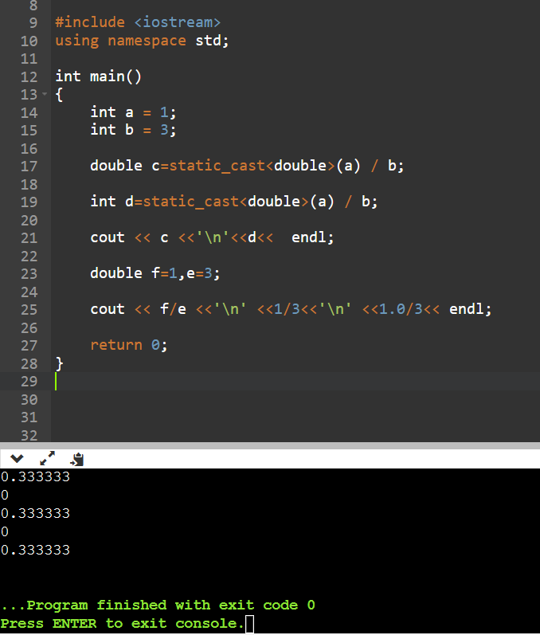

## C++ 运算符

运算符是一种告诉编译器执行特定的数学或逻辑操作的符号。C++ 内置了丰富的运算符，并提供了以下类型的运算符：

- 算术运算符
- 关系运算符
- 逻辑运算符
- 位运算符
- 赋值运算符
- 杂项运算符

本课将逐一介绍算术运算符、关系运算符、逻辑运算符、位运算符、赋值运算符和其他运算符。

## 算术运算符

下表显示了 C++ 支持的算术运算符。  
假设变量 A 的值为 10，变量 B 的值为 20，则：

| 运算符 | 描述                             | 示例                                     |
| ------ | -------------------------------- | ---------------------------------------- |
| +      | 把两个操作数相加                 | A + B 将得到 30                          |
| -      | 从第一个操作数中减去第二个操作数 | A - B 将得到 -10                         |
| \*     | 把两个操作数相乘                 | A \* B 将得到 200                        |
| /      | 分子除以分母                     | B / A 将得到 2                           |
| %      | 取模运算符，整除后的余数         | B % A 将得到 0                           |
| ++     | 自增运算符，整数值增加 1         | A++ 将**在运行后**得到 11，++A 将得到 11 |
| --     | 自减运算符，整数值减少 1         | A-- 将**在运行后**得到 9，--A 将得到 9   |

:::details 示例

<br />

```cpp
#include <iostream>
using namespace std;

int main()
{
   int a = 21;
   int b = 10;
   int c;

   c = a + b;
   cout << "Line 1 - c 的值是 " << c << endl ;
   c = a - b;
   cout << "Line 2 - c 的值是 " << c << endl ;
   c = a * b;
   cout << "Line 3 - c 的值是 " << c << endl ;
   c = a / b;
   cout << "Line 4 - c 的值是 " << c << endl ;
   c = a % b;
   cout << "Line 5 - c 的值是 " << c << endl ;

   int d = 10;   //  测试自增、自减
   c = d++;
   cout << "Line 6 - c 的值是 " << c << endl ;

   d = 10;    // 重新赋值
   c = d--;
   cout << "Line 7 - c 的值是 " << c << endl ;
   return 0;
}
```

- 结果

```cpp
Line 1 - c 的值是 31
Line 2 - c 的值是 11
Line 3 - c 的值是 210
Line 4 - c 的值是 2
Line 5 - c 的值是 1
Line 6 - c 的值是 10
Line 7 - c 的值是 10
```

:::

:::details 关于自增运算符在表达式中的执行

<br />

```cpp

#include <iostream>
using namespace std;

int main()
{
    // 自增：对自己本身的操作。
    // ++在前时，在表达式中，就相当于先完成对自身的操作，++在后时，在表达式中，就相当于后再完成对自身的操作。

    // 定义a=10 定义b=a++;  此时打印输出b我们会发现b=10,此时输出a我们会发现a=11
    // 这是因为++在后面，b=a++;相当于b=a;a=a+1;所以此时我们打印，就会发现b=10（原来的值），a=11（打印时已经完成了对自身的操作）
   int a = 10;

   int b=a++;

   cout << "b是 " <<b<<endl<<"a是 "<<a<< endl ;


   cout << endl;

   // 定义c=10 定义d=++c;  此时打印输出d我们会发现d=11,此时输出c我们会发现c=11
   // 这是因为++在前面，d=++c;相当于c=c+1;d=c;所以此时我们打印，就会发现d=11（新的值），c=11（在赋值给d之前就已经完成了对自身的操作）

   int c = 10;

   int d=++c;

   cout << "d是 " <<d<<endl<<"c是 "<<c<< endl ;

   cout << endl;

   // 自增自减只有在表达式中，才会凸显出符号在前后导致的运算结果不一致
   // 表达式定义：返回值的运算式，在输出语句中，输出时输出的部分也是一块表达式。

    // 定义e,独立运行e++;打印输出，输出e=11，这是因为没有在表达式中，是独立的，相当于单独写了一个e=e+1;所以后面输出时输出的11

   int e=10;

   e++;

   cout << "e是 "<<  e << endl;

   // 定义f,输出语句中运行f++;打印输出，输出f=10，这是因为在表达式中，不是独立的，相当于先打印后计算，所以后面输出时输出的10

   int f=10;

   cout << "f++此时是" << f++ <<endl;
   cout << "f运算后是" << f <<endl;

   // 定义g,输出语句中运行++g;打印输出，输出g=11，这是因为虽然在表达式中，不是独立的，但是++在前，所以先运算后打印输出时输出的11

   int g=10;

   cout << "++g此时是" << ++g <<endl;
   cout << "g运算后是" << g <<endl;
   return 0;
}
```

:::

:::details 关于 / 运算符

<br />

`/`操作符在 C++中并不是单纯的整除运算符，它可以执行整数除法也可以执行浮点除法，具体取决于操作数的类型。如果操作数中至少有一个是浮点数类型（如`double`、`float`等），`/`操作符将执行浮点除法，保留小数部分。如果操作数都是整数类型，`/`操作符将执行整数除法，将结果截断为整数部分。

因此，`/`操作符在 C++中是多态的，它的行为取决于操作数的类型，而不是固定为整除运算符。这种多态性使它非常灵活，可以用于执行不同类型的除法运算。

- 示例

当你使用`/`操作符来除以两个小数时，结果将是一个小数，而不会被截断为整数。例如：

```cpp
double a = 5.0;
double b = 2.0;
double result = a / b;
```

在这种情况下，`result` 的值将是 2.5，因为小数除法会保留小数部分。

在 C++中，当你使用除法操作符`/`时，结果取决于操作数的类型。如果操作数都是整数类型（如`int`、`long`等），则使用`/`操作符会执行整数除法，这意味着结果将是整数，并且任何小数部分都将被截断。

例如，如果你执行以下操作：

```cpp
int a = 5;
int b = 2;
int result = a / b;
```

`result` 的值将是 2，因为在整数除法中，小数部分会被截断。

当然如果你希望在此时也获得浮点数的结果，你可以将其中一个操作数转换为浮点数，如下所示：

```cpp
int a = 5;
int b = 2;
double result = static_cast<double>(a) / b;
```

这将执行浮点除法，`result` 的值将是 2.5。

所以，`/` 操作符不是百分之百地返回整数，它的行为取决于操作数的类型。如果你想要浮点结果，需要进行适当的类型转换或者使用浮点数作为操作数。

> 练习

<div class="my-img text-center">
    
</div>

:::

## 关系运算符

下表显示了 C++ 支持的关系运算符。
假设变量 A 的值为 10，变量 B 的值为 20，则：

| 运算符 | 描述                                                           | 示例              |
| ------ | -------------------------------------------------------------- | ----------------- |
| ==     | 检查两个操作数的值是否相等，如果相等则条件为真。               | (A == B) 不为真。 |
| !=     | 检查两个操作数的值是否相等，如果不相等则条件为真。             | (A != B) 为真。   |
| >      | 检查左操作数的值是否大于右操作数的值，如果是则条件为真。       | (A > B) 不为真。  |
| <      | 检查左操作数的值是否小于右操作数的值，如果是则条件为真。       | (A < B) 为真。    |
| >=     | 检查左操作数的值是否大于或等于右操作数的值，如果是则条件为真。 | (A >= B) 不为真。 |
| <=     | 检查左操作数的值是否小于或等于右操作数的值，如果是则条件为真。 | (A <= B) 为真。   |

- 示例

```cpp
#include <iostream>
using namespace std;

int main()
{
   int a = 21;
   int b = 10;
   int c ;

   if( a == b )
   {
      cout << "Line 1 - a 等于 b" << endl ;
   }
   else
   {
      cout << "Line 1 - a 不等于 b" << endl ;
   }
   if ( a < b )
   {
      cout << "Line 2 - a 小于 b" << endl ;
   }
   else
   {
      cout << "Line 2 - a 不小于 b" << endl ;
   }
   if ( a > b )
   {
      cout << "Line 3 - a 大于 b" << endl ;
   }
   else
   {
      cout << "Line 3 - a 不大于 b" << endl ;
   }
   /* 改变 a 和 b 的值 */
   a = 5;
   b = 20;
   if ( a <= b )
   {
      cout << "Line 4 - a 小于或等于 b" << endl ;
   }
   if ( b >= a )
   {
      cout << "Line 5 - b 大于或等于 a" << endl ;
   }
   return 0;
}
```

- 结果

```cpp
Line 1 - a 不等于 b
Line 2 - a 不小于 b
Line 3 - a 大于 b
Line 4 - a 小于或等于 b
Line 5 - b 大于或等于 a

```

## 逻辑运算符

下表显示了 C++ 支持的关系逻辑运算符。
假设变量 A 的值为 1，变量 B 的值为 0，则：

| 运算符 | 描述                                                                                       | 示例                 |
| ------ | ------------------------------------------------------------------------------------------ | -------------------- |
| &&     | 称为逻辑与运算符。如果两个操作数都 true，则条件为 true。                                   | (A && B) 为 false。  |
| \|\|   | 称为逻辑或运算符。如果两个操作数中有任意一个 true，则条件为 true。                         | (A \|\| B) 为 true。 |
| !      | 称为逻辑非运算符。用来逆转操作数的逻辑状态，如果条件为 true 则逻辑非运算符将使其为 false。 | !(A && B) 为 true。  |

- 示例

```cpp
#include <iostream>
using namespace std;

int main()
{
   int a = 5;
   int b = 20;
   int c ;

   if ( a && b )
   {
      cout << "Line 1 - 条件为真"<< endl ;
   }
   if ( a || b )
   {
      cout << "Line 2 - 条件为真"<< endl ;
   }
   /* 改变 a 和 b 的值 */
   a = 0;
   b = 10;
   if ( a && b )
   {
      cout << "Line 3 - 条件为真"<< endl ;
   }
   else
   {
      cout << "Line 4 - 条件不为真"<< endl ;
   }
   if ( !(a && b) )
   {
      cout << "Line 5 - 条件为真"<< endl ;
   }
   return 0;
}
```

- 结果

```cpp
Line 1 - 条件为真
Line 2 - 条件为真
Line 4 - 条件不为真
Line 5 - 条件为真

```

## 位运算符

位运算符（Bitwise Operators）是用于在**二进制位级别**执行操作的运算符。它们直接操作数据的二进制表示形式，通常用于处理底层数据存储和处理位掩码。
C++中的位运算符用于对整数类型的数据执行位级操作。以下是 C++中的主要位运算符，以及它们的功能和示例：

| 运算符 | 描述                                                                                               | 示例                                          |
| ------ | -------------------------------------------------------------------------------------------------- | --------------------------------------------- |
| &      | 位与（AND）：对两个操作数的每一位执行 AND 操作，如果两个位都为 1，则结果位为 1，否则为 0。         | 5 & 3 结果为 1 (二进制：0101 & 0011 = 0001)   |
| \|     | 位或（OR）：对两个操作数的每一位执行 OR 操作，如果两个位中至少有一个为 1，则结果位为 1，否则为 0。 | 5 \| 3 结果为 7 (二进制：0101 \| 0011 = 0111) |
| ^      | 位异或（XOR）：对两个操作数的每一位执行 XOR 操作，如果两个位相异，结果位为 1，否则为 0。           | 5 ^ 3 结果为 6 (二进制：0101 ^ 0011 = 0110)   |
| ~      | 位非（NOT）：对操作数的每一位执行 NOT 操作，将 1 变为 0，0 变为 1。                                | ~5 结果为 -6 (二进制：~0101 = 1010)           |
| <<     | 位左移：将操作数的二进制表示向左移动指定数量的位数。                                               | 5 << 2 结果为 20 (二进制：0101 << 2 = 10100)  |
| >>     | 位右移：将操作数的二进制表示向右移动指定数量的位数，根据数据类型使用符号位扩展或零扩展。           | 12 >> 2 结果为 3 (二进制：1100 >> 2 = 0011)   |

这些位运算符通常用于需要对二进制数据进行操作，例如位掩码、位标志和比特操作。它们在底层编程、嵌入式系统和网络协议中非常有用。

假设如果 A = 60，且 B = 13，现在请以二进制格式表示：

**分析**

- A = 60 的二进制表示是：0011 1100
- B = 13 的二进制表示是：0000 1101

现在，让我们进行位运算：

- A & B (位与)：将 A 和 B 的每个对应位进行 AND 操作。
  结果应该是：0000 1100

- A | B (位或)：将 A 和 B 的每个对应位进行 OR 操作。
  结果应该是：0011 1101

- A ^ B (位异或)：将 A 和 B 的每个对应位进行 XOR 操作。
  结果应该是：0011 0001

- ~A (位非)：对 A 的每个位执行 NOT 操作。
  结果应该是：1100 0011

综上，如下所示

```cpp
A = 0011 1100

B = 0000 1101

-----------------

A&B = 0000 1100

A|B = 0011 1101

A^B = 0011 0001

~A  = 1100 0011
```

- 示例

```cpp
#include <iostream>
using namespace std;

int main()
{
   unsigned int a = 60;      // 60 = 0011 1100
   unsigned int b = 13;      // 13 = 0000 1101
   int c = 0;

   c = a & b;             // 12 = 0000 1100
   cout << "Line 1 - c 的值是 " << c << endl ;

   c = a | b;             // 61 = 0011 1101
   cout << "Line 2 - c 的值是 " << c << endl ;

   c = a ^ b;             // 49 = 0011 0001
   cout << "Line 3 - c 的值是 " << c << endl ;

   c = ~a;                // -61 = 1100 0011
   cout << "Line 4 - c 的值是 " << c << endl ;

   c = a << 2;            // 240 = 1111 0000
   cout << "Line 5 - c 的值是 " << c << endl ;

   c = a >> 2;            // 15 = 0000 1111
   cout << "Line 6 - c 的值是 " << c << endl ;

   return 0;
}
```

- 结果

```cpp
Line 1 - c 的值是 12
Line 2 - c 的值是 61
Line 3 - c 的值是 49
Line 4 - c 的值是 -61
Line 5 - c 的值是 240
Line 6 - c 的值是 15

```

## 赋值运算符

下表列出了 C++ 支持的赋值运算符：

| 运算符 | 描述                                                               | 示例                            |
| ------ | ------------------------------------------------------------------ | ------------------------------- |
| =      | 简单的赋值运算符，把右边操作数的值赋给左边操作数。                 | C = A + B 将把 A + B 的值赋给 C |
| +=     | 加且赋值运算符，把右边操作数加上左边操作数的结果赋值给左边操作数。 | C += A 相当于 C = C + A         |
| -=     | 减且赋值运算符，把左边操作数减去右边操作数的结果赋值给左边操作数。 | C -= A 相当于 C = C - A         |
| \*=    | 乘且赋值运算符，把右边操作数乘以左边操作数的结果赋值给左边操作数。 | C \*= A 相当于 C = C \* A       |
| /=     | 除且赋值运算符，把左边操作数除以右边操作数的结果赋值给左边操作数。 | C /= A 相当于 C = C / A         |
| %=     | 求模且赋值运算符，求两个操作数的模赋值给左边操作数。               | C %= A 相当于 C = C % A         |
| <<=    | 左移且赋值运算符。                                                 | C <<= 2 等同于 C = C << 2       |
| >>=    | 右移且赋值运算符。                                                 | C >>= 2 等同于 C = C >> 2       |
| &=     | 按位与且赋值运算符。                                               | C &= 2 等同于 C = C & 2         |
| ^=     | 按位异或且赋值运算符。                                             | C ^= 2 等同于 C = C ^ 2         |
| \|=    | 按位或且赋值运算符。                                               | C \|= 2 等同于 C = C \| 2       |

- 示例

```cpp
#include <iostream>
using namespace std;

int main()
{
   int a = 21;
   int c ;

   c =  a;
   cout << "Line 1 - =  运算符实例，c 的值 = : " <<c<< endl ;

   c +=  a;
   cout << "Line 2 - += 运算符实例，c 的值 = : " <<c<< endl ;

   c -=  a;
   cout << "Line 3 - -= 运算符实例，c 的值 = : " <<c<< endl ;

   c *=  a;
   cout << "Line 4 - *= 运算符实例，c 的值 = : " <<c<< endl ;

   c /=  a;
   cout << "Line 5 - /= 运算符实例，c 的值 = : " <<c<< endl ;

   c  = 200;
   c %=  a;
   cout << "Line 6 - %= 运算符实例，c 的值 = : " <<c<< endl ;

   c <<=  2;
   cout << "Line 7 - <<= 运算符实例，c 的值 = : " <<c<< endl ;

   c >>=  2;
   cout << "Line 8 - >>= 运算符实例，c 的值 = : " <<c<< endl ;

   c &=  2;
   cout << "Line 9 - &= 运算符实例，c 的值 = : " <<c<< endl ;

   c ^=  2;
   cout << "Line 10 - ^= 运算符实例，c 的值 = : " <<c<< endl ;

   c |=  2;
   cout << "Line 11 - |= 运算符实例，c 的值 = : " <<c<< endl ;

   return 0;
}
```

- 结果

```cpp
Line 1 - =  运算符实例，c 的值 = 21
Line 2 - += 运算符实例，c 的值 = 42
Line 3 - -= 运算符实例，c 的值 = 21
Line 4 - *= 运算符实例，c 的值 = 441
Line 5 - /= 运算符实例，c 的值 = 21
Line 6 - %= 运算符实例，c 的值 = 11
Line 7 - <<= 运算符实例，c 的值 = 44
Line 8 - >>= 运算符实例，c 的值 = 11
Line 9 - &= 运算符实例，c 的值 = 2
Line 10 - ^= 运算符实例，c 的值 = 0
Line 11 - |= 运算符实例，c 的值 = 2

```

## 杂项运算符

以下是一些重要的杂项运算符以及它们的用法示例：

| 运算符   | 描述                                                                 | 示例                                                |
| -------- | -------------------------------------------------------------------- | --------------------------------------------------- |
| `? :`    | 条件运算符：根据条件的真假选择不同的值。                             | `int a = 5; int b = 10; int max = (a > b) ? a : b;` |
| `sizeof` | sizeof 运算符：获取数据类型或对象的字节大小。                        | `int size = sizeof(int);`                           |
| `,`      | 逗号运算符：在表达式中使用多个子表达式，并返回最后一个子表达式的值。 | `int a = 5, b = 10, c; c = (a++, b++);`             |
| `.`      | 成员选择运算符：用于访问类的成员。                                   | `struct Point { int x; int y; }; Point p; p.x = 3;` |
| `->`     | 成员选择运算符：用于访问指向类或结构体的指针的成员。                 | `Point* ptr = &p; ptr->y = 4;`                      |

1. **条件运算符 `? :`**：用于创建三元条件表达式，根据条件的真假选择不同的值。示例：

   ```cpp
   int a = 5;
   int b = 10;
   int max = (a > b) ? a : b; // 如果a > b，max取a的值，否则取b的值
   ```

2. **sizeof 运算符 `sizeof`**：用于获取数据类型或对象的字节大小。示例：

   ```cpp
   int size = sizeof(int); // 获取int类型的字节大小
   ```

3. **逗号运算符 `,`**：用于在表达式中使用多个子表达式，并返回最后一个子表达式的值。示例：

   ```cpp
   int a = 5, b = 10, c;
   c = (a++, b++); // a和b都会递增，c的值为10
   ```

4. **成员选择运算符 `.` 和 `->`**：用于访问类的成员或结构体的成员。`.` 用于访问类的成员，`->` 用于访问指向类或结构体的指针的成员。示例：

   ```cpp
   struct Point {
       int x;
       int y;
   };

   Point p;
   p.x = 3; // 使用`.`访问结构体成员
   Point* ptr = &p;
   ptr->y = 4; // 使用`->`访问指针指向的结构体成员
   ```

5. **sizeof 类型运算符 `sizeof`**：用于获取数据类型的字节大小。示例：

   ```cpp
   int size = sizeof(int); // 获取int类型的字节大小
   ```

6. **逗号运算符 `,`**：用于在表达式中使用多个子表达式，并返回最后一个子表达式的值。示例：

   ```cpp
   int a = 5, b = 10, c;
   c = (a++, b++); // a和b都会递增，c的值为10
   ```

这些杂项运算符用于处理不同的情况和操作，它们在编程中具有各自的用途。

## C++中的运算符优先级

运算符的优先级确定表达式中项的组合。这会影响到一个表达式如何计算。某些运算符比其他运算符有更高的优先级，例如，乘除运算符具有比加减运算符更高的优先级。

例如 x = 7 + 3 \* 2，在这里，x 被赋值为 13，而不是 20，因为运算符 \* 具有比 + 更高的优先级，所以首先计算乘法 3\*2，然后再加上 7。

下面的表格列出了 C++运算符的优先级和结合性。运算符从上到下列出，按降序优先级排列（**对应此表，越向下优先级越低**）。

| 优先级 | 运算符                                                                                                              | 描述                                                                                                                                                    | 结合性                                                                                                                                                                        |
| ------ | ------------------------------------------------------------------------------------------------------------------- | ------------------------------------------------------------------------------------------------------------------------------------------------------- | ----------------------------------------------------------------------------------------------------------------------------------------------------------------------------- | ---------- |
| 1      | ::                                                                                                                  | 作用域解析                                                                                                                                              | 从左到右 →                                                                                                                                                                    |
| 2      | a++<br>a--<br>type()<br>type{}<br>a()<br>a[]<br>.<br>->                                                             | 后缀递增和递减<br>类型转换<br>函数调用<br>下标<br>成员访问                                                                                              | 从左到右 →                                                                                                                                                                    |
| 3      | ++a<br>--a<br>+a<br>-a<br>!<br>~<br>(type)<br>\*a<br>&a<br>sizeof<br>co_await<br>new<br>new[]<br>delete<br>delete[] | 前缀递增和递减<br>一元加和减<br>逻辑非和按位非<br>类型转换<br>间接引用（解引用）<br>取地址<br>大小<br>协程等待（C++20）<br>动态内存分配<br>动态内存释放 | 从右到左 ←                                                                                                                                                                    |
| 4      | ._<br>->_                                                                                                           | 指向成员的指针                                                                                                                                          | 从左到右 →                                                                                                                                                                    |
| 5      | a\*b<br>a/b<br>a%b                                                                                                  | 乘法、除法和取余                                                                                                                                        | 从左到右 →                                                                                                                                                                    |
| 6      | a+b<br>a-b                                                                                                          | 加法和减法                                                                                                                                              | 从左到右 →                                                                                                                                                                    |
| 7      | <<br>>                                                                                                              | 位左移和位右移                                                                                                                                          | 从左到右 →                                                                                                                                                                    |
| 8      | <=>                                                                                                                 | 三路比较运算符（自 C++20 起）                                                                                                                           | -                                                                                                                                                                             |
| 9      | <br><= <br>> <br>>=                                                                                                 | 关系运算符 <、≤、>、≥                                                                                                                                   | -                                                                                                                                                                             |
| 10     | ==<br>!=                                                                                                            | 相等性运算符 = 和 ≠                                                                                                                                     | -                                                                                                                                                                             |
| 11     | a&b                                                                                                                 | 按位与                                                                                                                                                  | -                                                                                                                                                                             |
| 12     | ^                                                                                                                   | 按位异或（异或）                                                                                                                                        | -                                                                                                                                                                             |
| 13     | \|                                                                                                                  | 按位或（包含或）                                                                                                                                        | -                                                                                                                                                                             |
| 14     | &&                                                                                                                  | 逻辑与                                                                                                                                                  | -                                                                                                                                                                             |
| 15     | \|\|                                                                                                                | 逻辑或                                                                                                                                                  | -                                                                                                                                                                             |
| 16     | a?b:c<br>throw<br>co_yield<br>=<br>+=<br>-=<br>\*=<br>/=<br>%=<br><<=<br>>=<br>&=<br>^=<br>                         | =                                                                                                                                                       | 三元条件<br>抛出异常<br>协程产出（C++20）<br>直接赋值<br>复合赋值（和、差）<br>复合赋值（积、商、余数）<br>复合赋值（位左移、位右移）<br>复合赋值（按位与、按位异或、按位或） | 从右到左 ← |
| 17     | ,                                                                                                                   | 逗号                                                                                                                                                    | 从左到右 →                                                                                                                                                                    |

- 什么叫做结合性？

> 在数学和编程中，"结合性"指的是运算符在表达式中出现多次时，确定它们之间的操作顺序。结合性决定了运算符是从左到右计算（左结合性）还是从右到左计算（右结合性）。  
> 例如，考虑加法运算符"+"。如果加法运算符是左结合性，那么在表达式"1 + 2 + 3"中，首先会计算左边的"1 + 2"，然后再将结果与右边的"3"相加，结果为 6。  
> 如果加法运算符是右结合性，那么在相同的表达式中，首先会计算右边的"2 + 3"，然后再将结果与左边的"1"相加，结果同样为 6。  
> 运算符的结合性对于确定表达式的计算顺序非常重要，因为它可以影响表达式的最终结果。不同的运算符具有不同的结合性，例如，加法和减法通常是左结合的，而赋值运算符通常是右结合的。这有助于确保表达式按照预期的方式计算。

- 示例 对比有括号和没有括号时的区别，这将产生不同的结果。因为 ()、 /、 \* 和 + 有不同的优先级，高优先级的操作符将优先计算。

```cpp
#include <iostream>
using namespace std;

int main()
{
   int a = 20;
   int b = 10;
   int c = 15;
   int d = 5;
   int e;

   e = (a + b) * c / d;      // ( 30 * 15 ) / 5
   cout << "(a + b) * c / d 的值是 " << e << endl ;

   e = ((a + b) * c) / d;    // (30 * 15 ) / 5
   cout << "((a + b) * c) / d 的值是 " << e << endl ;

   e = (a + b) * (c / d);   // (30) * (15/5)
   cout << "(a + b) * (c / d) 的值是 " << e << endl ;

   e = a + (b * c) / d;     //  20 + (150/5)
   cout << "a + (b * c) / d 的值是 " << e << endl ;

   return 0;
}
```

- 结果

```cpp
(a + b) * c / d 的值是 90
((a + b) * c) / d 的值是 90
(a + b) * (c / d) 的值是 90
a + (b * c) / d 的值是 50

```

## 常用库函数

以下列举了常用的库函数  
相关库
[cstdlib](https://en.cppreference.com/w/cpp/header/cstdlib)
[cmath](https://en.cppreference.com/w/cpp/header/cmath)

| 函数名         | 格式      | 功能说明                           | 例子              |
| -------------- | --------- | ---------------------------------- | ----------------- |
| 绝对值函数     | abs(x)    | 求一个数 x 的绝对值                | abs(-5) = 5       |
| 自然数指数函数 | exp(x)    | 求实数 x 的自然指数 e-             | exp(1) = 2.718282 |
| 向下取整       | floor(x)  | 求不大于实数 x 的最大整数          | floor(3.14) = 3   |
| 向上取整       | ceil(x)   | 求不小于实数 x 的最小整数          | ceil(3.14) = 4    |
| 自然对数函数   | log(x)    | 求实数 x 的自然数对数              | log(1) = 0        |
| 指数函数       | pow(x, y) | 计算 x 的 y 次方，结果为双精度实数 | pow(2, 3) = 8     |
| 随机函数       | rand()    | 产生 0 到 RAND_MAX 之间的随机整数  |                   |
| 平方根值函数   | sqrt(x)   | 求实数 x 的平方根                  | sqrt(25) = 5      |

## 表达式

在 C++中，表达式是由操作数（operands）和运算符（operators）组成的组合，用于执行各种计算和操作。操作数可以是常量、变量、函数调用等，而运算符用于定义如何操作这些操作数。表达式通常产生一个值，它可以用于赋值、条件判断、函数调用等各种上下文中。

举例来说，以下是一些 C++表达式的简单定义：

1. 整数加法表达式：`2 + 3`。这个表达式使用加法运算符 `+` 将整数 2 和 3 相加，结果为 5。

2. 变量赋值表达式：`int x = 10;`。这个表达式将整数值 10 赋给变量 `x`。

3. 函数调用表达式：`double result = sqrt(25.0);`。这个表达式调用 `sqrt` 函数来计算 25.0 的平方根，并将结果赋给 `result` 变量。

4. 逻辑表达式：`if (x > 5 && y < 10)`。这个表达式结合了逻辑运算符 `&&`，用于检查变量 `x` 是否大于 5 并且变量 `y` 是否小于 10。

5. 三元条件表达式：`int max = (a > b) ? a : b;`。这个表达式使用三元条件运算符 `? :` 根据条件选择变量 `a` 或 `b` 的值，并将结果赋给 `max`。

表达式是构建程序逻辑和执行计算的基本元素，它们可以包含各种数据类型和运算符。

## 重点小结

- [算术运算符](/introduction/operator/#算术运算符)
- [关系运算符](/introduction/operator/#关系运算符)
- [逻辑运算符](/introduction/operator/#逻辑运算符)
- [位运算符](/introduction/operator/#位运算符)
- [赋值运算符](/introduction/operator/#赋值运算符)
- [杂项运算符](/introduction/operator/#杂项运算符)
- [c++中的运算符优先级](/introduction/operator/#c-中的运算符优先级)
- [常用库函数](/introduction/operator/#常用库函数)
- [表达式](/introduction/operator/#表达式)
