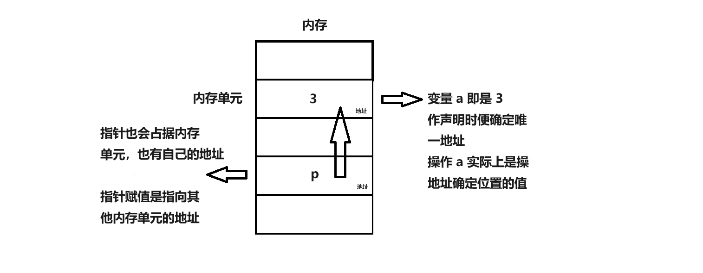
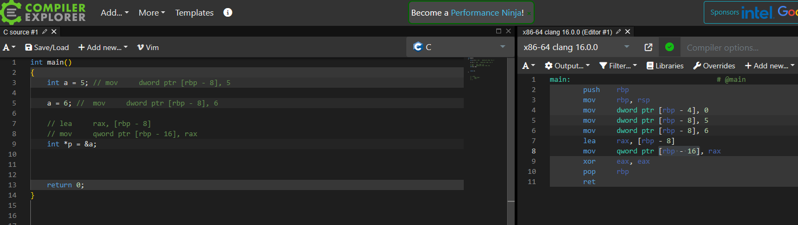
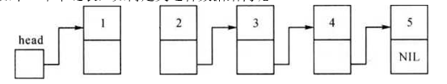
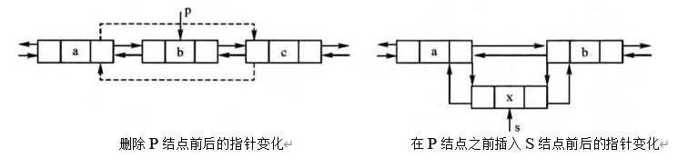
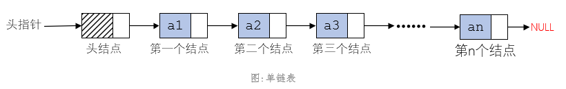
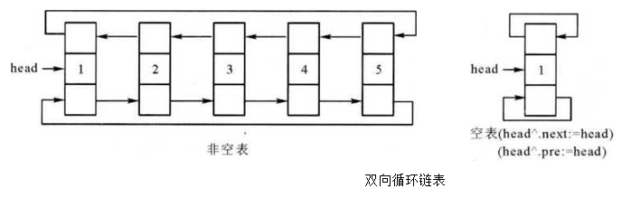

:::tip
指针是 C++ 语言中广泛使用的一种数据类型。利用指针变量可以表示各种数据结构，便捷地操作数组和字符串，以及进行类似汇编语言的内存地址处理，从而编写出简洁高效的程序。指针极大地丰富了 C++ 语言的功能。学习指针是学习 C++ 语言中最重要的一环，能否正确理解和使用指针是我们是否掌握 C++ 语言的一个标志。同时，指针也是 C++ 语言中最具挑战性的一部分。在学习过程中，除了正确理解基本概念外，还需要进行大量编程实践和调试。只要付出努力，掌握指针并不难。
:::

## 指针变量

### 1. 指针变量的定义与赋值

指针变量的定义格式为：

```cpp
类型说明符 *变量名;
```

其中，`*`表示指针变量，变量名为指针变量名，类型说明符表示指针变量所指向的数据类型。

#### 1.1. 普通变量与指针变量定义比较

普通变量定义：

普通变量是直接存储数据值的**内存单元**，可以通过变量名直接访问

```cpp
int a = 3;
```

这里定义了一个整型变量 `a`，初始值为 `3`。内存中有一块内存空间放置 `a` 的值，对 `a` 的存取操作就是**直接到这个内存空间存取**。**内存空间的位置叫地址**，变量 `a` 存储在内存中的位置可以通过取地址操作符 `&` 获取：`&a`。

指针变量定义：

指针变量存储的是**内存地址**，可以通过指针访问所指向的内存单元

```cpp
int *p = NULL;
```

这里定义了一个指针变量 `p`，`p` **指向**一个内存空间，里面存放的是一个内存地址。现在赋值为`NULL`（其实就是`0`，表示特殊的空地址）。

#### 1.2. 给指针变量赋值

```cpp
int a = 3;
int *p = &a;
```

这里将变量 `a` 的内存地址（比如：`XXX`）赋给 `p`。直接操作 `p`，实际上操作的是地址，通过这个地址间接操作才是操作整数 `3`。如图所示：

<div class="my-img text-center">
    
</div>

<div class="my-img text-center">
    
</div>

指针 `p` 的间接操作需要使用指针操作符 `*`，即 `*p` 的值才是 `3`。

有指向整型变量的指针变量`p`，如要把整型变量`a`的地址赋予`p`可以有以下两种方式：

- 指针变量初始化的方法：

```cpp
int a;
int *p = &a;
```

- 赋值语句的方法：

```cpp
int a;
int *p;
p = &a;
```

注意：不允许将一个数直接赋给指针变量，因此以下赋值是错误的：`int *p; p = 1000;`。在被赋值的指针变量前不应再加上解引用操作符 `*`，因此以下赋值也是错误的：`*p = &a;`

### 2. 指针的相关操作

指针操作包括直接存取地址和间接存取值两种方式。

| 说明             | 示例          |
| ---------------- | ------------- |
| 指针定义         | `int *p;`     |
| 取地址运算符     | `p = &a;`     |
| 间接运算符       | `*p = 2;`     |
| 指针变量直接存取 | `cout << p;`  |
| 间接存取         | `cout << *p;` |

指针变量同普通变量一样，使用之前必须定义说明，并赋予具体的值。

注意：`int *p;`时，当前指针的值是不确定的，因为他自身是有地址的，如果当前地址存在值，那么就是当前地址值，否则为空，等待指针

### 3. 指针使用示例

如定义了 `int a`, `int *p=&a`则 `*p` 表示 `p` 指向的整型变量， 而 `p` 中存放的是变量 `a` 占用单元的起始地址，所以 `*p` 实际上访问了变量 `a` ,也就是说 `*p` 与 `a` 等价。下面举一个简单的指针使用的例子：

```cpp
#include <cstdio>
#include <iostream>
using namespace std;

int main() {
    int a, b, s, t, *pa, *pb;
    pa = &a; pb = &b;
    a = 10; b = 20;
    s = *pa + *pb;
    t = *pa * *pb;
    printf("a = %d, b = %d\n", *pa, *pb);
    printf("s = %d, t = %d\n", s, t);
    return 0;
}
```

输出：

```cpp
a = 10, b = 20
s = 30, t = 200
```

## 指针的引用与运算

一般地，指针与普通变量的对应关系如下：

- `p` 对应 `&a`
- `*p` 对应 `a`
- `*p = 3` 对应 `a = 3`

### 1. 指针变量的初始化

指针变量的初始化包括几种方法：

| 方法                 | 说明                                   |
| -------------------- | -------------------------------------- |
| int \* p = NULL;     | NULL 是特殊的地址 0，叫做零指针        |
| int a; int \*p = &a; | 将指针 p 初始化为变量 a 的地址         |
| int \* p = new(int); | 申请一个空间给指针 p，\*p 的内容不确定 |

对于局部指针变量，必须先初始化或赋值后再使用。

### 2. 指针变量的加减运算

指针变量的内容是内存地址，常用的运算有加和减，通常与数组操作配合使用。

- 示例: 输入 N 个整数，使用指针变量访问输出

```cpp
#include <cstdio>
using namespace std;

int a[101], n;

int main() {
    scanf("%d", &n);
    for (int i = 1; i <= n; i++) {
        scanf("%d", &a[i]);
    }

    int *p = &a[1]; // 定义指针变量 p，初始化为数组开始元素的地址，即 a[1]
    for (int i = 1; i <= n; i++) {
        printf("%d ", *p);
        p++; // p 指向下一个数
    }

    return 0;
}
```

- 输入：

```cpp
4
2 1 6 0
```

- 输出：

```cpp
2 1 6 0
```

- 说明：在循环中，`p++` 的意思是**广义的加 1**，并**不是将 `p` 的值（地址）加 `1`**，而是根据指针类型的大小增加 `sizeof`(`int`)（整型的大小），即刚好**跳过**一个整数的空间，从而达到指向下一个整数的目的。类似地：
  1. `p--` 就是向前“跳过”一个整数的空间，指向前一个整数。
  2. `(p + 3)` 就是指向后面第 `3` 个整数的地址。

### 3. 无类型指针

有时候，一个指针根据不同情况，指向不同类型的值，可以先定义一个无类型的指针，根据需要再进行强制类型转换。

- 示例: 无类型指针运用举例

```cpp
#include <iostream>
using namespace std;

int a = 10;
double b = 3.5;
void *p;

int main() {
    p = &a; // 将 p 的地址赋值为 a 的地址
    cout << *(int*)p << endl; // 必须明确 p 指向的空间的数据类型

    p = &b;
    cout << *(double*)p << endl;

    return 0;
}
```

- 结果：

  ```
  10
  3.5
  ```

- 说明：在输出时必须明确 `p` 指向的空间的数据类型。因为不同类型的数据，其空间大小和存储格式都不同。如果将 `cout << *(double*)p << endl;` 中的 `(double*)` 改为 `(long long*)`，输出的结果将是一个奇怪的数字，因为解析的数据类型不正确。

### 4. 多重指针

既然指针是指向其他类型的，指针本身也是一种类型。  
C++允许递归地指针指向指针的指针——多重指针。

- 示例： 双重指针运用举例

```cpp
#include <cstdio>
using namespace std;

int a = 10;
int *p;
int **pp; // 定义双重指针

int main() {
    p = &a;  // 将 p 指向 a
    pp = &p; // 将 pp 指向 p

    printf("%d = %d = %d\n", a, *p, **pp); // **pp 通过两次间接访问了 a 的变量值
    return 0;
}
```

- 输出：

  ```
  10 = 10 = 10
  ```

- 说明：多重指针除了可以多次“间接”访问数据之外，主要的应用之一是动态的多维数组。这个强大的功能将在后面专门介绍。

## 指针与数组

### 1. 指针与数组的关系

指向数组的指针变量称为数组指针变量。数组是一块连续的内存单元组成的，数组名就是这块连续内存单元的首地址。一个数组元素的首地址就是它所占有的几个内存单元的首地址。指针变量可以指向一个数组或一个数组元素，可以将数组名或第一个元素的地址赋予它。若要使指针变量指向第`i`号元素，可以将`i`元素的首地址赋予它，或将数组名加`i`赋予它。

例如，设有数组 `a`，指向 `a` 的指针变量为 `pa`，则有以下关系：`pa`、`a`、`&a[0]` 均指向同一单元，即数组 `a` 的首地址，也是`0`号元素 `a[0]` 的首地址。`pa + 1`、`a + 1`、`&a[1]` 均指向`1`号元素 `a[1]`。类似可得 `pa + i`、`a + i`、`&a[i]` 指向第 `i` 号元素 `a[i]`。

### 2. 指向数组的指针

数组指针变量的一般形式为：

```cpp
类型说明符 *指针变量名;
```

其中，类型说明符表示所指数组的类型，从一般形式可以看出，指向数组的指针变量和指向普通变量的指针变量的说明是相同的

引入指针变量后，就可以用两种方法访问数组元素了。例如，定义了 `int a[5]; int *pa = a;`，可以采用下标法 `pa[i]` 或指针法 `*(pa + i)` 来访问`a`的数组元素。

- 示例：使用数组名或指针访问数组

```cpp
#include <cstdio>
using namespace std;

int main() {
    int a[5], i, *pa = a; // 定义整型数组和指针，*pa = a 可以写成 pa = a
    for (i = 0; i < 5; i++)
        scanf("%d", a + i); // 可写成 pa + i 和 &a[i]

    for (i = 0; i < 5; i++)
        printf("a[%d] = %d\n", i, *(a + i)); // 指针访问数组，可写成 *(pa + i) 或 pa[i] 或 a[i]

    return 0;
}
```

- 输入：

```cpp
1 2 3 4 5
```

- 输出：

```cpp
a[0] = 1
a[1] = 2
a[2] = 3
a[3] = 4
a[4] = 5
```

- 说明：

1. 直接使用数组名 `a` 作为指针，`a` 指向数组的开始元素，`a + i` 是指向数组的第 `i` 个元素的指针。
2. 指针变量 `pa` 是可变的，但数组 `a` 是静态的变量名，不可变，只能当做常量指针使用。例如，`pa = pa + 2;` 是合法的，但 `a = a + 2;` 是非法的。
3. 在使用标准输入 `scanf` 时，就使用了指针技术，读入一个变量时要加取地址运算符 `&` 传递给 `scanf` 一个指针。对于数组，可以直接用数组名当指针。

### 3. 指针也可以看成数组名

指针可以动态申请空间，若一次申请多个变量空间，系统给的地址是连续的，就可以当成数组使用，这就是动态数组的一种。

- 示例：动态数组，计算前缀和数组
  > `b` 是数组 `a` 的前缀和数组的定义：`b[i] = a[1] + a[2] + ... + a[i]`，即 `b` 的第 `i` 个元素是 `a` 的前 `i` 个元素的和

```cpp
#include <cstdio>
using namespace std;

int n;
int *a; // 定义指针变量 a，后面直接当数组名使用

int main() {
    scanf("%d", &n);
    a = new int[n + 1]; // 向操作系统申请了连续的 n+1 个 int 型的空间

    for (int i = 1; i <= n; i++)
        scanf("%d", &a[i]);

    for (int i = 2; i <= n; i++)
        a[i] += a[i - 1];

    for (int i = 1; i <= n; i++)
        printf("%d ", a[i]);

    delete[] a; // 释放动态数组的内存空间
    return 0;
}
```

- 输入：

```cpp
5
1 2 3 4 5
```

- 输出：

```cpp
1 3 6 10 15
```

- 说明：

1. 动态数组的优点在于，在处理大数据时避免了空间超限的问题。使用小数组只能满足部分需求，而大数组可能会超出空间限制。使用动态数组，在确保小数据没问题的前提下，尽量满足大数据的需求。
2. 在结束程序时，需要释放动态数组所占用的内存空间，使用 `delete[] a;` 可以完成内存的释放。

## 指针与字符串

### 1. 字符串的表示形式

在 C++中，我们可以用两种方式访问字符串。

1. 用字符数组存放一个字符串，然后输出该字符串。

```cpp
int main() {
    char str[] = "I love China!";
    printf("%s\n", str);
    return 0;
}
```

2. 用字符指针指向一个字符串。可以不定义字符数组，而定义一个字符指针。用字符指针指向字符串中的字符。

```cpp
int main() {
    char *str = "I love China!";
    printf("%s\n", str);
    return 0;
}
```

在这里，我们没有定义字符数组，而是在程序中定义了一个字符指针变量 `str`，用字符串常量 "I love China!" 对它进行初始化。C++对字符串常量是按字符数组处理的，在内存中开辟了一个字符数组用来存放该字符串常量。对字符指针变量初始化，实际上是把字符串第 1 个元素的地址(即存放字符串的字符数组的首元素地址)赋给 `str`。有人认为 `str` 是一个字符串变量，以为在定义时把 "I love China!" 这几个字符赋给该字符串变量是不对的。

实际上，`char * str = "I love China!";` 等价于 `char * str; str = "I love China!";`。可以看到，`str` 被定义为一个指针变量，指向字符型数据。请注意它只是指向了一个字符变量或其他字符类型数据，不能同时指向多个字符数据，更不是把 "I love China!" 这些字符存放到 `str` 中(指针变量只能存放地址)。只是把 "I love China!" 的第一个字符的地址赋给指针变量 `str`。

在输出时，要用 `printf("%s\n", str);`，其中 `%s` 是输出字符串时所用的格式符。在输出项中给出字符指针变量名，则系统先输出它所指向的一个字符数据，然后自动使 `str` 加 1，使之指向下一个字符，然后再输出一个字符，如此直到遇到字符串结束标志 `\0` 为止。

注意：可以通过字符数组名或者字符指针变量输出一个字符串。而对一个数值型数组，是不能企图用数组名输出它的全部元素的。例如：

```cpp
int i[10];
printf("%d\n", i);
```

这样是不行的，只能逐个输出。显然 `%s` 可以对一个字符串进行整体的输入和输出。

### 2. 字符串指针作函数参数

将一个字符串从一个函数传递到另外一个函数，可以用地址传递的方法，即用字符数组名作参数或用指向字符的指针变量做参数。在被调用的函数中可以改变字符串内容，在主调函数中可以得到改变了的字符串。

- 示例：输入一个字符串，倒序储存并输出
  > 输入一个长度最大为 100 的字符串，以字符数组的方式储存，再将字符串倒序储存.输出倒序储存后的字符串。(这里以字符指针为函数参数)

```cpp
#include <cstdio>
#include <cstring>

using namespace std;

void mySwap(char &a, char &b) {
    char t;
    t = a;
    a = b;
    b = t;
}

void work(char *str) {
    // strlen(str) 这个函数返回的是 str 的长度，需包含头文件 cstring
    // 这个函数的原型是 "size_t strlen(const char* str)"
    int len = strlen(str);
    for (int i = 0; i < len / 2; ++i) {
        mySwap(str[i], str[len - i - 1]);
    }
}

int main() {
    char s[100]; // 定义字符数组 s，长度最大为 100
    char *str = s; // 定义字符指针变量 str，指向字符数组 s

    // gets(s); 注意：使用 fgets 代替 gets，因为 gets 已经废弃
    fgets(s, 100, stdin); // // 输入字符串并存储到字符数组 s 中

    work(str); // 调用函数将字符串倒序储存

    printf("%s ", s); // 输出倒序储存后的字符串
    return 0;
}
```

- 输入：

```cpp
!anihC evol I
```

- 输出：

```cpp
I love China!
```

- 说明:

1. 可以通过字符数组名或字符指针变量输出一个字符串。
2. 对于一个数值型数组，是不能企图用数组名输出其全部元素的，只能逐个输出。而对字符串，可以用 `%s` 格式符进行整体的输入和输出。

## 指针与函数

### 1. 指针作为函数参数

指针可以作为函数的参数。在函数章节中，我们把数字作为参数传入函数中，实际上就是利用了传递指针(即传递数组的首地址)的方法。通过首地址，我们可以访问数组中的任何一个元素。对于指向其他类型变量的指针，我们可以用同样的方式处理。例如，我们编写如下一个函数，用于将两个整型变量的值交换。

```cpp
void swap(int *x, int *y) {
    int t = *x;
    *x = *y;
    *y = t;
}
```

这时，我们在其他函数中可以使用这个函数：

```cpp
int a = 5, b = 3;
swap(&a, &b);
printf("a=%d, b=%d", a, b);
```

输出：

```cpp
a=3, b=5
```

在这个过程中，我们先将`a`和`b`的地址传给函数，然后在函数中通过地址得到变量`a`和`b`的值，并且对它们进行修改。当退出函数时，`a`和`b`的值就已经交换了。

这里有一点值得我们注意。看如下这个过程：

```cpp
void swap(int x, int y) {
    int t = x;
    x = y;
    y = t;
}
```

我们调用了 `swap(a, b)`；然而这个函数没有起作用，没有将`a`和`b`的值互换。为什么呢？因为这里在传入变量`a`和`b`的时候，是将`a`的值赋值给函数中的形参`x`，将`b`赋值给形参`y`。这里接下来的操作就完全与`a`和`b`无关了，函数将变量`x`和`y`的值互换，然后退出函数。这里没有像上面例子那样传入指针，所以无法对传进来的变量进行修改。

将指针传入函数与将变量传入函数的区别在于：前者是通过指针来使用或修改传入的变量；而后者是将传入的变量的值赋给新的变量，函数对新的变量进行操作。

同理，对`scanf()`函数而言，读取变量的时候我们要在变量之前加`&`运算符，即将指针传入函数。这是由于`scanf()`函数通过指针将读取的值返回给引用的变量，没有`&`，就无法进行正常的读取操作。

- 示例：编写一个函数，将三个整型变量排序，并将三者中的最小值赋给第一个变量，次小值赋给第二个变量，最大值赋给第三个变量

```cpp
#include <cstdio>

void swap(int *x, int *y) {
    int t = *x;
    *x = *y;
    *y = t;
}

void sort(int *x, int *y, int *z) {
    if (*x > *y) swap(x, y);
    if (*x > *z) swap(x, z);
    if (*y > *z) swap(y, z);
}

int main() {
    int a, b, c;
    scanf("%d %d %d", &a, &b, &c);
    sort(&a, &b, &c);
    printf("%d %d %d", a, b, c);
    return 0;
}
```

- 输入：

```cpp
2 3 1
```

- 输出：

```cpp
1 2 3
```

### 2. 函数返回指针

一个函数可以返回整数值、字符值、实型值等，也可以返回指针联系的数据(即地址)。

返回指针值的函数的一般定义形式为：

```
类型名* 函数名(参数列表);
```

例如：

```
int* a(int x, int y)
```

在这个例子中，`a` 是函数名，调用它后得到一个指向整型数据的指针(地址)。`x` 和 `y` 是函数 `a` 的形参，为整型。

注意：在 `int* a` 的两侧没有括号；在 `a` 的两侧分别为 `*` 运算符和 `()` 运算符，由于 `()` 的优先级 高于 `*`，因此 `a` 先于 `()` 结合。在函数前面有一个 `*`，表示此函数是返回指针类型的函数。最前面的 `int` 表示返回的指针指向整型变量。对初学 C++语言的人来说，这种定义形式可能不太习惯，容易弄错，用时要十分小心。

- 示例 编写一个函数，用于在一个包含 N 个整数的数组中找到第一个质数，若有则返回函数的地址；否则返回 `NULL`（空指针）。

```cpp
#include <cmath> // 引入数学函数库
#include <cstdio> // 引入标准输入输出库
using namespace std;

int n, a[10001]; // 定义全局变量n和数组a

bool isprime(int n) { // 定义判断素数的函数
    if (n < 2) return false; // 如果n小于2，则不是素数
    if (n == 2) return true; // 如果n等于2，则是素数
    for (int i = 2; i <= sqrt(n); ++i) // 循环遍历2到sqrt(n)之间的数
        if (n % i == 0) return false; // 如果n可以被i整除，则不是素数
    return true; // 否则是素数
}

int* find() { // 定义查找素数的函数
    for (int i = 1; i <= n; ++i) // 循环遍历数组a中的每一个元素
        if (isprime(a[i])) // 如果当前元素是素数
            return a + i; // 返回当前素数的地址
    return NULL; // 否则返回空指针
}

int main() { // 主函数
    scanf("%d", &n); // 读取n的值
    for (int i = 1; i <= n; ++i) // 循环遍历数组a，读取输入的数据
        scanf("%d", &a[i]); // 读取数组a的元素值
    int* p = find(); // 调用查找素数的函数，并将返回值保存在指针p中
    if (p != NULL) // 如果p不为空
        printf("%p\n%d\n", (void*)p, *p); // 打印找到的素数的地址和值，注意%p用于打印指针，需强制类型转换为void*
    else
        printf("Can't find\n"); // 否则输出无法找到
    return 0; // 返回0表示程序执行成功
}
```

- 输入：

```
7
1 6 9 2 3 4 5
```

- 输出：

```
(可能是) 4214864 或者 0x5642ac95e070
2
```

### 3. 函数指针和函数指针数组

一个指针变量可以通过指向不同整数变量的地址来对其他变量进行操作。程序中不仅数据存放在内存空间中，代码也同样存放在内存空间里。具体来说，C++ 的函数也保存在内存中，函数的入口地址也可以通过指针访问。另一方面，有些函数在编写时对要调用的辅助函数尚未确定，只有在执行时才能根据情况传递辅助函数的地址。例如，sort 函数的调用：“sort(a, a + n, cmp)；” 其中的比较函数 cmp 是根据需要传递给 sort 的（也可能是 cmpl、cmp2 等），实际上就是传递了函数指针。

- 示例：

```cpp
#include <iostream>
using namespace std;

int t(int a) {
    return a;
}

int main() {
    // 显示函数地址
    cout << "函数 t 的地址：" << &t << endl;

    // 定义函数指针变量 p
    int (*p)(int);

    // 将函数 t 的地址赋给函数指针 p
    p = &t;

    // 输出 p(5) 是 C++ 的写法，(*p)(10) 是兼容 C，这是使用 p 来调用函数的两种方法
    cout << p(5) << ',' << (*p)(10) << endl;

    return 0;
}
```

- 输出：

```
函数 t 的地址：1
5,10
```

函数指针的基本操作有 3 个：

(1) 声明函数指针：

声明函数指针时，需要指定函数的返回类型以及函数的参数列表，与函数原型相似。例如，如果函数的原型是 `int test(int)`，相应的指针声明就是 `int (*fp)(int)`。需要注意的是，不能写成 `int *fp(int)`，因为这样会被计算机编译程序处理成声明一个 `fp(int)` 的函数，其返回类型是 `int *`。

(2) 获取函数的地址：

获取函数的地址很简单，只需要使用函数名即可，例如 `fp = test;`。这表明函数名和数组名一样，可以看做是指针。

(3) 使用函数指针调用函数：

类似普通变量指针，可以使用 `(*fp)` 来间接调用指向的函数。但在 C++ 中也允许像使用函数名一样使用 `fp`，虽然这点存在争议，但 C++ 确实支持了这种用法。

除了以上方式，函数指针还可以通过结合 `typedef` 进行声明，示例如下

- 示例：使用 typedef 定义函数指针示例。

```cpp
#include <iostream>
using namespace std;

// 定义函数sum，计算两个整数的和
int sum(int a, int b) {
    return a + b;
}

// 使用typedef定义函数指针类型LP
typedef int (*LP)(int, int);

int main() {
    // 定义LP类型的函数指针LP，并赋值为sum函数的地址
    LP p = sum;

    // 使用p来调用函数，实参为2和5，调用sum函数，输出返回值7
    cout << p(2, 5) << endl;

    return 0;
}
```

- 输出：

```cpp
7
```

在软件开发编程中，函数指针的一个广泛应用是菜单功能函数的调用。通常选择菜单的某个选项都会调用相应的功能函数，并且有些软件的菜单会根据情况发生变化（上下文敏感）。如果使用 switch/case 或 if 语句处理起来会比较复杂、冗长，不利于代码的维护，可以考虑使用函数指针数组方便灵活地实现。

- 示例：使用函数指针数组来模拟菜单功能，根据用户的输入调用相应的函数

```cpp
#include<iostream>
using namespace std;

void tl() { cout << "test1 "; }
void t2() { cout << "test2 "; }
void t3() { cout << "test3 "; }
void t4() { cout << "test4 "; }
void t5() { cout << "test5 "; }

typedef void(*LP)(); // 定义了一个函数指针变量类型 LP

int main() {
    LP a[] = {tl, t2, t3, t4, t5}; // 定义了一个 LP 类型的函数指针数组 a，并初始化
    int x;
    cin >> x;
    a[x](); // 使用 a[x]() 来调用选择的函数
    return 0;
}
```

- 输入：

```cpp
2
```

- 输出：

```cpp
test3
```

## 结构体指针

### 1. 结构体指针的定义与使用

当一个指针变量用来指向一个结构体变量时，称之为结构体指针变量。  
结构体指针变量的值是所指向的结构体变量的起始地址。通过结构体指针即可访问该结构体变量，这与数组指针和函数指针的情况是相同的。

结构体指针变量定义的一般形式：

```cpp
struct 结构体名 *结构体指针变量名;
```

当然也可以在定义结构体的同时定义这个结构体指针变量。

- 示例：定义一个结构体（类型为自己定义的`student`）指针变量`p`

```cpp
struct student
{
    char name[20];
    char sex;
    float score;
} *p;

// 也可写成
struct student
{
    char name[20];
    char sex;
    float score;
};

student *p;
```

与前面讨论的各类指针变量相同，结构体指针变量也必须要赋值后才能使用。赋值是把结构体变量的首地址赋予该指针变量，不能把结构名赋予该指针变量。  
例如：如果`p`是被定义为`student`类型的结构体指针变量，`boy`是被定义为`student`类型的结构体变量，则：`p=&boy`是正确的，而`p=&student`是错误的。

引用结构体指针变量指向的结构体变量的成员的方法如下：

1. `指针名->成员名`
2. `(*指针名).成员名`

例如：

```c
(*p).score 与 p->score 是等价的。
```

- 示例：结构体指针运用

```cpp
#include <cstdio>
using namespace std;

struct student {
    char name[20];
    char sex;
    int score;
} s[3] = {
    {"xiaoming",'f',356},
    {"xiaoliang",'f',350},
    {"xiaohong",'m',0}
  };

int main() {
    student *p;
    printf("Name Sex Score\n");
    for (p = s; p < s + 3; p++)
        printf("%-9s%3c%7d\n", p->name, p->sex, p->score);
    return 0;
}
```

- 输出：

```cpp
Name Sex Score
xiaoming   f    356
xiaoliang  f    350
xiaohong   m      0
```

- 说明：这里 `p++` 的作用是移动指针，随着 `p` 的变化，输出数组不同元素的内容。

### 2. 自引用结构

在一个结构体内部包含一个类型为该结构体本身的成员是否合法呢？下面我们来讨论这个问题。

1. 非法的自引用结构

```c
struct stu {
    char name[20];
    int age, score;
    stu p;
};
```

上述结构体的声明是非法的。因为在结构体 `stu` 中，成员 `p` 的类型是另一个完整的结构体 `stu`，而在这个结构体内部，又包含了成员 `p`，这种自引用会导致无限嵌套，类似于递归调用中的无限循环，是不合法的。

2. 合法的自引用结构

```c
struct stu {
    char name[20];
    int age, score;
    struct stu *p;
};
```

相比之下，这个声明是合法的。在这个版本中，成员 `p` 现在是一个指向 `struct stu` 类型的指针，而不是一个直接包含结构体本身的成员。编译器在结构体的长度确定之前就已经知道指针的长度，所以这种类型的自引用是合法的。

当一个结构体中有一个或多个成员是指针，它们指向的类型是本结构体类型时，通常称这种结构体为“引用自身的结构体”，即“自引用结构”。自引用结构在实现其他一些数据结构时起着重要作用。

自引用结构在动态数据结构中扮演关键角色，可以说，C/C++ 语言实现动态数据结构的基石。包括动态链表、堆、栈、树等数据结构，都可以通过自引用结构来具体实现。

例如，下面的定义就可以在实际操作中建立起一个链表。

```cpp
struct node {
    int x, y;
    node *next;
} point;
```

在下一节将对链表结构进行深入的研究。

## 链表结构

链表是一种常见的数据结构，用于存储一系列的元素。与数组不同，链表的元素在内存中不是连续存储的，而是通过指针连接起来的。

**为什么使用链表**

链表具有一些优点：

- 灵活性：可以动态地添加或删除元素，而不需要移动其他元素。
- 内存利用率高：链表只占用所需的内存空间，不会像数组一样预留固定大小的空间。

**存储方式的分类**
链表结构可以根据存储方式的不同分为**顺序存储结构**和**链式存储结构**。

**顺序存储结构**
顺序存储结构需要在程序的执行过程中分配固定大小的存储单元，直到程序结束才释放空间。因此，顺序存储结构也称为静态存储。相应地，定义的变量称为静态变量。它的优缺点如下：

- **优点：** 能够通过简单的公式随机访问表中的任一元素，逻辑上相邻的两个元素在物理位置上也是相邻的，且前趋与后继元素易于找到。
- **缺点：** 在线性表长度不确定时，必须分配最大存储空间，导致存储资源浪费，难以充分利用；线性表的容量难以扩充；在插入和删除线性表元素时，需要移动大量元素，耗费时间。

**链式存储结构**
链式存储结构允许程序在执行过程中随时申请或释放存储空间，以实现动态管理和充分利用存储资源。这种存储方式称为动态存储，定义的变量称为动态变量。它的优点如下：

- **优点：** 能够利用一组任意的存储单元（可以是连续的或不连续的）存储线性表的数据元素，充分利用存储器的零碎空间。

**概念**
为了表示任意存储单元之间的逻辑关系，每个数据元素除了存储本身的信息（数据域.data）外，还需存储直接后继元素的存储位置（指针域 Link 或 next）。将这两部分信息合并称为一个“结点 node”。

- 将 N 个结点链接在一起构成链表。当 N = 0 时，称为空链表。
- 为了按逻辑顺序对链表中的元素进行各种操作，需要定义一个变量来存储整个链表的第一个结点的物理位置，称为“头指针、H 或 head”。也可将头指针定义成一个结点，称为“头结点”。头结点的数据域可以不存储任何信息，也可存储线性表的长度等附加信息，头结点的指针域（头指针）存储指向第一个结点的指针。若线性表为空表，则头结点的指针域为空（NIL）。由于最后一个元素没有后继，所以线性表中最后一个结点的指针域为空（NIL）。
- 由于链表中的每个结点只包含一个指针域，故称为“线性链表或单链表”。

### 1. 单链表的定义

1. **类型和变量的说明**

```cpp
struct Node {
    int data;
    Node *next;
};

Node *p;
```

2. **申请存储单元**

```cpp
p = new Node; // 动态申请，空间大小由指针变量的基类型决定
```

3. **指针变量的赋值**

指针变量的赋值和操作需要特别注意。指针变量的赋值和操作方式不同于简单变量，C++规定使用“指针变量名->”的形式引用指针变量。

```cpp
// 初始化，暂时不指向任何存储单元
p = nullptr;

// 如何表示和操作指针变量？不同于简单变量（如A = 0；）,C++规定用“指针变量名->”的形式引用指针变量（如p->data = 0；）。
```

这样，当需要引用指针变量所指向的结点中的数据域时，可以使用 `p->data` 表示。

### 2. 单链表的结构、建立、输出

由于单链表的每个结点都有一个数据域和一个指针域，因此每个结点都可以定义成一个记录。下面给出一个单链表的定义及建立并输出单链表的程序。

<div class="my-img text-center">
    
</div>

```cpp
#include <iostream> // 包含输入输出流的标准库头文件
using namespace std; // 使用标准命名空间

struct Node { // 定义节点结构体
    int data; // 数据成员，存储整数值
    Node *next; // 指针成员，指向下一个节点
};

Node *head, *p, *r; // 定义指向节点的指针变量，head为头指针，p为当前节点指针，r为尾指针
int x; // 整型变量x，用于存储输入的整数值

int main() { // 主函数

    cin >> x; // 从标准输入流中读取一个整数值并存储到变量x中
    head = new Node; // 申请内存空间创建头节点
    r = head; // 将尾指针r指向头节点，初始时链表中只有一个节点

    while (x != -1) { // 当读入的数不等于 -1 时，执行循环
        p = new Node; // 申请内存空间创建新节点
        p->data = x; // 将读入的整数值存储到当前节点的data成员中
        p->next = NULL; // 将当前节点的next指针置为空，因为它是链表中的最后一个节点
        r->next = p; // 将新节点连接到链表中，即将尾指针r的下一个节点指向新节点p
        r = p; // 尾指针后移一个节点，指向新添加的节点p
        cin >> x; // 从标准输入流中读取下一个整数值并存储到变量x中，以便下一次循环判断
    }

    p = head->next; // 将当前节点指针p指向链表的第一个有效节点，即跳过头节点
    while (p->next != NULL) { // 当p的下一个节点不为空时，执行循环
        cout << p->data << " "; // 输出当前节点的数据值
        p = p->next; // 将p指针后移一个节点，指向下一个节点
    }
    cout << p->data << endl; // 输出链表中最后一个节点的数据值，换行
    return 0; // 返回0，表示程序正常结束
}
```

在 C++中，`->` 符号被称为成员访问运算符，它是用来访问指针所指向的对象或结构体的成员。它通常用于指针指向的对象是类的实例或结构体的情况下。

具体来说，如果 `p` 是一个指向对象或结构体的指针，那么 `p->member` 将会访问该对象或结构体的成员 `member`。这等价于 `(*p).member`，但使用 `->` 更加简洁方便。

在上面的代码中，`p->data` 和 `p->next` 是用来访问链表节点 `p` 中的数据成员 `data` 和指针成员 `next`。

### 3. 单链表的操作

1. **查找数据域满足一定条件的结点**

- 只找到满足条件的第一个节点，然后结束查找

```cpp
p = head->next;
while ((p->data != x) && (p->next != NULL))
    p = p->next;
// 找到第一个就结束
if (p->data == x)
    // 找到了处理
else
    // 输出不存在
```

1. `p = head->next;`：将指针 `p` 指向链表的第一个有效节点，跳过了头节点。
2. `while ((p->data != x) && (p->next != NULL))`：循环条件是当当前节点的数据不等于目标值 `x`，且当前节点的下一个节点不为空时执行循环。
3. `p = p->next;`：如果当前节点的数据不等于目标值 `x`，则将指针 `p` 移动到下一个节点。
4. `if (p->data == x)`：如果循环结束后当前节点的数据等于目标值 `x`，则执行相应的处理。
5. `else`：如果循环结束后未找到数据等于目标值 `x` 的节点，则输出相应的提示信息。

- 继续查找，直到链表末尾，找到所有满足条件的节点并处理

```cpp
p = head->next;
while (p->next != NULL) { // 一个一个判断
    if (p->data == x) // 找到一个处理一个
        p = p->next;
}
```

1. `p = head->next;`：同样将指针 `p` 指向链表的第一个有效节点，跳过了头节点。
2. `while (p->next != NULL)`：循环条件是当前节点的下一个节点不为空时执行循环。
3. `if (p->data == x)`：在循环中判断当前节点的数据是否等于目标值 `x`，如果等于则执行相应的处理。
4. `p = p->next;`：无论是否找到目标值 `x`，都将指针 `p` 移动到下一个节点。

- 示例

在链表中查找数据域满足一定条件的节点，并提供了两种不同的方法：
一种是找到第一个满足条件的节点后结束搜索，另一种是找到所有满足条件的节点

```cpp
#include <iostream>
using namespace std;

// 定义链表节点结构
struct Node {
    int data;       // 数据域
    Node *next;     // 指向下一个节点的指针
};

// 获取单链表的第i个节点的数据域
void getCNode(Node *head, int i) {
    Node *p;        // 定义指针变量p
    int j = 1;      // 计数器，用于记录当前节点位置

    p = head->next; // 将p指向链表的第一个节点
    // 遍历链表，直到找到第i个节点或者到达链表末尾
    while ((p != NULL) && (j < i)) {
        p = p->next; // 将p指向下一个节点
        j = j + 1;   // 计数器加1
    }
    // 如果找到第i个节点，则输出其数据域；否则输出提示信息
    if ((p != NULL) && (j == i))
        cout << "The data at position " << i << " is: " << p->data << endl; // 输出第i个节点的数据域
    else
        cout << "Node at position " << i << " does not exist!" << endl; // 输出提示信息，表示第i个节点不存在
}

int main() {
    // 创建链表节点
    Node *head = new Node; // 创建头节点
    head->next = NULL;      // 头节点的next指针置空

    // 插入一些节点数据
    for (int i = 1; i <= 5; ++i) {
        Node *newNode = new Node; // 创建新节点
        newNode->data = i * 10;   // 赋值数据域
        newNode->next = head->next; // 将新节点插入链表头部
        head->next = newNode;
    }

    // 测试获取第i个节点的数据域
    for (int i = 1; i <= 6; ++i) {
        getCNode(head, i);
    }

    // 释放链表内存
    Node *temp;
    while (head != NULL) {
        temp = head;
        head = head->next;
        delete temp;
    }

    return 0;
}
```

2. **取出单链表的第 i 个结点的数据域**

```cpp
// 定义链表节点结构
struct Node {
    int data;       // 数据域
    Node *next;     // 指向下一个节点的指针
};

// 获取单链表的第i个节点的数据域
void getCNode(Node *head, int i) {
    Node *p;        // 定义指针变量p
    int j = 1;      // 计数器，用于记录当前节点位置

    p = head->next; // 将p指向链表的第一个节点
    // 遍历链表，直到找到第i个节点或者到达链表末尾
    while ((p != NULL) && (j < i)) {
        p = p->next; // 将p指向下一个节点
        j = j + 1;   // 计数器加1
    }
    // 如果找到第i个节点，则输出其数据域；否则输出提示信息
    if ((p != NULL) && (j == i))
        cout << p->data; // 输出第i个节点的数据域
    else
        cout << "i not exist!"; // 输出提示信息，表示第i个节点不存在
}
```

- 示例

```cpp
#include <iostream>
using namespace std;

// 定义链表节点结构
struct Node {
    int data;       // 数据域
    Node *next;     // 指向下一个节点的指针
};

// 获取单链表的第i个节点的数据域
void getCNode(Node *head, int i) {
    Node *p;        // 定义指针变量p
    int j = 1;      // 计数器，用于记录当前节点位置

    p = head->next; // 将p指向链表的第一个节点
    // 遍历链表，直到找到第i个节点或者到达链表末尾
    while ((p != NULL) && (j < i)) {
        p = p->next; // 将p指向下一个节点
        j = j + 1;   // 计数器加1
    }
    // 如果找到第i个节点，则输出其数据域；否则输出提示信息
    if ((p != NULL) && (j == i))
        cout << "The data at position " << i << " is: " << p->data << endl; // 输出第i个节点的数据域
    else
        cout << "Node at position " << i << " does not exist!" << endl; // 输出提示信息，表示第i个节点不存在
}

int main() {
    // 创建链表节点
    Node *head = new Node; // 创建头节点
    head->next = NULL;      // 头节点的next指针置空

    // 插入一些节点数据
    for (int i = 1; i <= 5; ++i) {
        Node *newNode = new Node; // 创建新节点
        newNode->data = i * 10;   // 赋值数据域
        newNode->next = head->next; // 将新节点插入链表头部
        head->next = newNode;
    }

    // 测试获取第i个节点的数据域
    for (int i = 1; i <= 6; ++i) {
        getCNode(head, i);
    }

    // 释放链表内存
    Node *temp;
    while (head != NULL) {
        temp = head;
        head = head->next;
        delete temp;
    }

    return 0;
}
```

3. **插入一个结点在单链表中**

```cpp
void insert(Node *head, int i, int x) { // 在第i个位置插入值为x的结点
    Node *p, *s;
    int j = 0;
    p = head;
    while ((p->next != NULL) && (j < i - 1)) {
        p = p->next;
        j = j + 1;
    } // P指向第i-1个结点
    if (p->next == NULL)
        cout << "no this position!";
    else {
        s = new Node; // 新建一个结点
        s->data = x;
        s->next = p->next; // 插入操作
        p->next = s;
    }
}
```

- 示例

```cpp
#include <iostream>

using namespace std;

// 定义单链表结点
struct Node {
    int data; // 数据域
    Node *next; // 指针域，指向下一个结点
};

// 在单链表中插入一个结点
void insert(Node *head, int i, int x) {
    Node *p, *s;
    int j = 0;
    p = head;
    // 寻找第i-1个结点，或者链表末尾
    while (p->next != NULL && j < i - 1) {
        p = p->next;
        j++;
    }
    // 创建新结点
    s = new Node;
    // 设置新结点数据为x
    s->data = x;
    // 将新结点插入到第i个位置
    s->next = p->next;
    p->next = s;
}

// 打印链表
void printList(Node *head) {
    Node *p = head->next;
    while (p != NULL) {
        cout << p->data << " ";
        p = p->next;
    }
    cout << endl;
}

int main() {
    // 创建头结点
    Node *head = new Node;
    // 初始化头结点
    head->next = NULL;

    // 在第3个位置插入值为10的结点
    insert(head, 3, 10);
    // 在第1个位置插入值为5的结点
    insert(head, 1, 5);
    // 在第5个位置插入值为20的结点（此时超出了链表长度，应插入到末尾）
    insert(head, 5, 20);

    // 打印链表
    cout << "Linked List: ";
    printList(head);

    return 0;
}
```

```cpp
#include <iostream>

using namespace std;

// 定义单链表结点
struct Node {
    int data; // 数据域
    Node *next; // 指针域，指向下一个结点
};

// 在单链表中插入一个结点
void insert(Node *head, int i, int x) {
    Node *p, *s;
    int j = 0;
    p = head;
    // 寻找第i-1个结点，或者链表末尾
    while (p->next != NULL && j < i - 1) {
        p = p->next;
        j++;
    }
    // 创建新结点
    s = new Node;
    // 设置新结点数据为x
    s->data = x;
    // 将新结点插入到第i个位置
    s->next = p->next;
    p->next = s;
}

// 打印链表
void printList(Node *head) {
    Node *p = head->next;
    while (p != NULL) {
        cout << p->data << " ";
        p = p->next;
    }
    cout << endl;
}

int main() {
    // 创建头结点
    Node *head = new Node;
    // 初始化头结点
    head->next = NULL;

    // 在头结点后插入结点
    head->next = new Node;
    head->next->data = 1;
    head->next->next = NULL;

    // 插入更多结点，以确保链表有多个结点
    Node *current = head->next;
    for (int i = 2; i <= 5; ++i) {
        current->next = new Node;
        current->next->data = i;
        current->next->next = NULL;
        current = current->next;
    }

    // 打印原始链表
    cout << "Original Linked List: ";
    printList(head);

    // 在第3个位置插入值为10的结点
    insert(head, 3, 10);

    // 打印插入后的链表
    cout << "Linked List after insertion: ";
    printList(head);

    return 0;
}
```

4. **删除单链表中的第 i 个结点**

```cpp
void delete(Node *head, int i) { // 删除第i个元素
    Node *p, *s;
    int j = 0;
    p = head;
    while ((p->next != NULL) && (j < i - 1)) {
        p = p->next;
        j = j + 1;
    } // P指向第i-1个结点
    if (p->next == NULL)
        cout << "no this position!";
    else {
        s = p->next; // 删除P的后继结点，假设为s
        p->next = p->next->next; // 或 p->next = s->next; free(s);
        delete s;
    }
}
```

- 示例

```cpp
#include <iostream>

using namespace std;

// 定义单链表结点
struct Node {
    int data; // 数据域
    Node *next; // 指针域，指向下一个结点
};

// 删除单链表中的第i个结点
void deleteNode(Node *head, int i) {
    Node *p, *s;
    int j = 0;
    p = head;
    // 寻找第i-1个结点
    while ((p->next != NULL) && (j < i - 1)) {
        p = p->next;
        j = j + 1;
    }
    // 如果未找到第i-1个结点，输出提示信息
    if (p->next == NULL)
        cout << "No such position!";
    else {
        // 删除第i个结点
        s = p->next;
        p->next = p->next->next;
        delete s;
    }
}

// 打印链表
void printList(Node *head) {
    Node *p = head->next;
    while (p != NULL) {
        cout << p->data << " ";
        p = p->next;
    }
    cout << endl;
}

int main() {
    // 创建头结点
    Node *head = new Node;
    // 初始化头结点
    head->next = NULL;

    // 在头结点后插入结点
    head->next = new Node;
    head->next->data = 1;
    head->next->next = NULL;

    // 插入更多结点，以确保链表有多个结点
    Node *current = head->next;
    for (int i = 2; i <= 5; ++i) {
        current->next = new Node;
        current->next->data = i;
        current->next->next = NULL;
        current = current->next;
    }

    // 打印原始链表
    cout << "Original Linked List: ";
    printList(head);

    // 删除第2个结点
    deleteNode(head, 2);

    // 打印删除后的链表
    cout << "Linked List after deletion: ";
    printList(head);

    return 0;
}

```

5. **求单链表的实际长度**

```cpp
int len(Node *head) {
    int n = 0;
    Node *p = head;
    while (p != NULL) {
        n = n + 1;
        p = p->next;
    }
    return n;
}
```

- 示例

```cpp
#include <iostream>

using namespace std;

// 定义单链表结点
struct Node {
    int data; // 数据域
    Node *next; // 指针域，指向下一个结点
};

// 求单链表的实际长度
int len(Node *head) {
    int n = 0;
    Node *p = head;
    while (p != NULL) {
        n = n + 1;
        p = p->next;
    }
    return n;
}

int main() {
    // 创建头结点
    Node *head = new Node;
    // 初始化头结点
    head->next = NULL;

    // 插入一些结点以确保链表有值
    Node *current = head;
    for (int i = 0; i < 5; ++i) {
        current->next = new Node;
        current->next->data = i;
        current->next->next = NULL;
        current = current->next;
    }

    // 求链表的实际长度
    int length = len(head);
    cout << "Length of the linked list: " << length << endl;

    return 0;
}
```

### 4. 双向链表

双向链表是一种链表结构，每个结点有两个指针域和若干数据域，其中一个指针域指向它的前趋结点，另一个指针域指向它的后继结点。它的优点在于访问、插入、删除操作更为方便，速度也更快，但这是以更多的空间消耗为代价。

**数据结构的定义**

```cpp
struct node {
    int data;
    node *pre, *next;  // pre 指向前趋，next 指向后继
};

node *head, *p, *q, *r;
```

**双向链表的插入和删除过程**

<div class="my-img text-center">
    
</div>

```cpp
int j;
node *p;
p = head;
j = 0;

while ((p->next != NULL) && (j < i)) {
    p = p->next;
    j = j + 1;
}  // p 指向第 i 个结点

if (p == NULL)
    cout << "No such position!";
else {
    // 将结点 P 删除
    p->pre->next = p->next;  // P 的前趋结点的后继赋值为 P 的后继
    p->next->pre = p->pre;   // P 的后继结点的前趋赋值为 P 的前趋
}
```

- 示例

```cpp
#include <iostream>
using namespace std;

struct node {
    int data;
    node *pre, *next;
};

// 删除双向链表中的第 i 个节点
void deleteNodeAtPosition(node *head, int i) {
    int j = 1;
    node *p = head;
    while (p != nullptr && j < i) {
        p = p->next;
        j = j + 1;
    }

    if (p == nullptr)
        cout << "无此位置！" << endl;
    else {
        // 将节点 p 删除
        p->pre->next = p->next;  // p 的前趋节点的后继指向 p 的后继节点
        if (p->next != nullptr)
            p->next->pre = p->pre;  // p 的后继节点的前趋指向 p 的前趋节点
        delete p;
    }
}

// 打印双向链表的所有节点
void printLinkedList(node *head) {
    node *current = head;
    while (current != nullptr) {
        cout << current->data << " ";
        current = current->next;
    }
    cout << endl;
}

node* createLinkedList(int n) {
    node *head = nullptr;
    node *prev = nullptr;
    for (int i = 0; i < n; ++i) {
        // 创建新节点
        node *newNode = new node();
        newNode->data = i * 10;  // 初始化节点的 data 值为 i*10
        newNode->pre = prev;     // 当前节点的前驱指向前一个节点
        newNode->next = nullptr; // 当前节点的后继指向空（最后一个节点）

        // 将新节点链接到链表中
        if (prev != nullptr)
            prev->next = newNode; // 前一个节点的后继指向当前节点
        else
            head = newNode;       // 如果前一个节点为空，则当前节点是链表头节点
        prev = newNode;           // 更新前一个节点为当前节点，为下一次循环做准备
    }
    return head; // 返回链表的头节点指针
}

int main() {
    node *head = createLinkedList(5);

    cout << "原始链表：";
    printLinkedList(head);

    // 删除第3个节点
    deleteNodeAtPosition(head, 3);
    cout << "删除第3个节点后的链表：";
    printLinkedList(head);

    // 释放链表内存
    node *current = head;
    while (current != nullptr) {
        node *temp = current;
        current = current->next;
        delete temp;
    }

    return 0;
}
```

### 5. 循环链表

循环链表是一种链表数据结构，它与普通链表的不同之处在于，循环链表中最后一个节点指向第一个节点，形成一个循环。这意味着在循环链表中，没有像普通链表那样存在“尾节点”，而每个节点都有一个指向下一个节点的指针。循环链表的优点之一是可以轻松地实现循环访问。

C++ 中的循环链表可以分为单向循环链表和双向循环链表两种

循环链表是一种链式数据结构，其中最后一个节点指向第一个节点，形成一个循环。C++ 中的循环链表可以分为单向循环链表和双向循环链表两种。下面是对这两种链表的定义和结构的介绍，以及一份对应的讲义：

1. 单向循环链表

- 定义：
  单向循环链表是一种链表数据结构，其中每个节点包含一个指向下一个节点的指针，并且最后一个节点指向第一个节点，形成一个循环。

- 结构：

```cpp
struct Node {
    int data;
    Node* next;
};
```

<div class="my-img text-center">
    
</div>

<div class="my-img text-center">
    
</div>

- 单向循环链表操作

1. 插入结点操作示例：

```cpp
void insertNode(Node*& head, int value) {
    Node* newNode = new Node;
    newNode->data = value;

    if (head == nullptr) {
        newNode->next = newNode; // 空链表时，新结点指向自身
        head = newNode; // 头指针指向新结点
    } else {
        newNode->next = head->next; // 新结点指向头结点的下一个结点
        head->next = newNode; // 头结点指向新结点
    }
}
```

2. 查找结点操作示例：

```cpp
Node* findNode(Node* head, int value) {
    if (head == nullptr)
        return nullptr;

    Node* current = head;
    do {
        if (current->data == value)
            return current; // 找到目标结点
        current = current->next;
    } while (current != head); // 循环直到回到头结点

    return nullptr; // 未找到目标结点
}
```

3. 删除结点操作示例：

```cpp
void deleteNode(Node*& head, int value) {
    if (head == nullptr)
        return;

    Node* current = head;
    Node* prev = nullptr;

    do {
        if (current->data == value) {
            if (prev == nullptr) { // 要删除的结点为头结点
                Node* lastNode = head;
                while (lastNode->next != head) // 找到尾结点
                    lastNode = lastNode->next;
                lastNode->next = head->next; // 尾结点指向头结点的下一个结点
                head = head->next; // 更新头指针
            } else {
                prev->next = current->next; // 直接跳过当前结点
            }
            delete current; // 释放内存
            return;
        }
        prev = current;
        current = current->next;
    } while (current != head); // 循环直到回到头结点
}
```

4. 反转链表操作示例：

```cpp
void reverseList(Node*& head) {
    if (head == nullptr)
        return;

    Node* prev = nullptr;
    Node* current = head;
    Node* nextNode = nullptr;

    do {
        nextNode = current->next; // 保存下一个结点
        current->next = prev; // 当前结点指向前一个结点
        prev = current; // 更新前一个结点为当前结点
        current = nextNode; // 更新当前结点为下一个结点
    } while (current != head); // 循环直到回到头结点

    head->next = prev; // 头结点指向原链表的尾结点
    head = prev; // 更新头指针为原链表的尾结点
}
```

2. 双向循环链表

- 定义：
  双向循环链表是一种链表数据结构，其中每个节点包含一个指向前一个节点和一个指向后一个节点的指针，同时最后一个节点的后向指针指向第一个节点，第一个节点的前向指针指向最后一个节点，形成一个循环。

- 结构：

```cpp
struct Node {
    int data;
    Node* prev;
    Node* next;
};
```

<div class="my-img text-center">
    
</div>

- 双向循环链表操作示例

1. 插入结点操作示例：

```cpp
void insertNode(Node*& head, int value) {
    Node* newNode = new Node;
    newNode->data = value;

    if (head == nullptr) {
        newNode->next = newNode->prev = newNode; // 空链表时，新结点指向自身
        head = newNode; // 头指针指向新结点
    } else {
        newNode->next = head; // 新结点的下一个结点指向头结点
        newNode->prev = head->prev; // 新结点的前一个结点指向原尾结点
        head->prev->next = newNode; // 原尾结点的下一个结点指向新结点
        head->prev = newNode; // 头结点的前一个结点指向新结点
    }
}
```

2. 查找结点操作示例：

```cpp
Node* findNode(Node* head, int value) {
    if (head == nullptr)
        return nullptr;

    Node* current = head;
    do {
        if (current->data == value)
            return current; // 找到目标结点
        current = current->next;
    } while (current != head); // 循环直到回到头结点

    return nullptr; // 未找到目标结点
}
```

3. 删除结点操作示例：

```cpp
void deleteNode(Node*& head, int value) {
    if (head == nullptr)
        return;

    Node* current = head;
    do {
        if (current->data == value) {
            if (head->next == head) { // 只有一个结点时
                delete head;
                head = nullptr;
                return;
            } else {
                current->prev->next = current->next; // 直接跳过当前结点
                current->next->prev = current->prev;
                if (current == head) // 删除头结点时更新头指针
                    head = head->next;
                delete current; // 释放内存
                return;
            }
        }
        current = current->next;
    } while (current != head); // 循环直到回到头结点
}
```

4. 反转链表操作示例：

```cpp
void reverseList(Node*& head) {
    if (head == nullptr)
        return;

    Node* current = head;
    Node* temp = nullptr;

    do {
        temp = current->prev; // 交换前向和后向指针
        current->prev = current->next;
        current->next = temp;
        current = current->prev; // 移动到下一个结点
    } while (current != head); // 循环直到回到头结点

    head = temp->prev; // 更新头指针为原链表的尾结点
}
```

### 6. 循环链表的应用举例

**约瑟夫环问题**

**问题描述：**
有 M 个人，其编号分别为 1-M。这 M 个人按顺序排成一个圈。现在给定一个数 N，从第一个人开始依次报数，数到 N 的人出列，然后又从下一个人开始又从 1 开始依次报数，数到 N 的人又出列……如此循环，直到最后一个人出列为止。

**输入格式：**
输入只有一行，包括 2 个整数 M,N，之间用一个空格分开。(0 < n <= m <= 100)

**输出格式：**
输出只有一行，包括 M 个整数。

**样例输入：**

```
8 5
```

**样例输出：**

```
5 2 8 7 1 4 6 3
```

**参考程序：**

```cpp
#include <iostream>
using namespace std;

struct node {
    long d; // 存储编号
    node *next; // 指向下一个结点的指针
};

long n, m; // 输入的M和N
node *head, *p, *r; // 头指针，当前结点指针，尾结点指针

int main() {
    long i, j, k, l;

    // 输入M和N
    cin >> n >> m;

    // 创建头结点
    head = new node;
    head->d = 1; // 头结点编号为1
    head->next = NULL;
    r = head; // r指向头结点

    // 构建循环链表，编号从2到N
    for (i = 2; i <= n; i++) {
        p = new node;
        p->d = i; // 结点编号为i
        p->next = NULL;
        r->next = p; // 尾结点的next指向新结点
        r = p; // 尾结点指向新结点
    }

    r->next = head; // 尾结点的next指向头结点，形成循环

    r = head; // r重新指向头结点

    // 依次输出出列的编号
    for (i = 1; i <= n; i++) {
        for (j = 1; j <= m - 2; j++)
            r = r->next; // 移动指针，找到当前报数的前一个结点
        cout << r->next->d << " "; // 输出出列的编号
        r->next = r->next->next; // 跳过出列的结点
        r = r->next; // 指向下一个结点
    }

    return 0;
}

```
